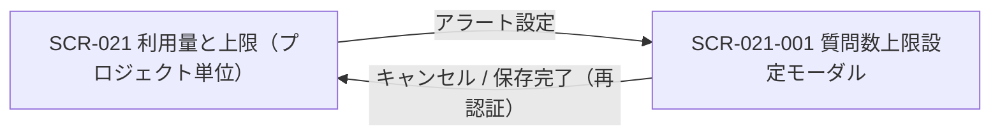

<!-- portal-top -->
[設計ポータル](../README.md) ／ [基本設計](index.md) ／ [画面設計](01_screen-design.md) ／ **SCR-021-001 質問数上限設定モーダル**
<!-- /portal-top -->

# SCR-021-001 質問数上限設定モーダル

> **このページは、SCR-021 から開く当該プロジェクトの質問数上限とアラート閾値を設定するモーダル SCR-021-001 を定義します。** 画面概要 / 画面遷移図 / 画面レイアウト / 画面項目定義 / 入出力一覧 / 画面イベント一覧 の 6 セクションで記述します。

*版数 v1.0 ・ 更新 2026-06-17 ・ 承認済*

## 1. 画面概要

SCR-021 の「アラート設定」から開く、当該プロジェクトの質問数の月次上限件数とアラート閾値を全画面割込みモーダルで設定する画面です。保存時に L3(再認証)を要求します。

| 画面 ID | 画面名 | 機能概要 |
|----|----|----|
| `SCR-021-001` | 質問数上限設定モーダル | 当該プロジェクトの質問数の月次上限件数・アラート閾値を全画面割込みモーダルで設定する |

| 関連     | 内容                                                             |
|----------|------------------------------------------------------------------|
| FR / BR  | FR-121, FR-122, FR-125, FR-127, FR-005(再認証) / BR-088, BR-089  |
| 関連画面 | [`SCR-021` 利用量と上限(プロジェクト単位)](SCR-021.md)(呼出元) |

| ステークホルダ              | 対象 |
|-----------------------------|------|
| オーナー                    | ◯    |
| プロジェクト管理者(`admin`) | ◯    |
| メンバー(`member`)          | —    |

> [!IMPORTANT]
> **重要** 必要権限はオーナー / 当該プロジェクト管理者(`admin`。オーナーは暗黙 `admin`)です。`member` は呼出元 SCR-021 でボタンが非表示のため到達しません。保存は **L3 = 再認証(パスワード再入力。FR-005)** を要求します(プロジェクト削除のような対象名タイプ確認は課しません)。質問数の無料利用枠は本モーダルに独立項目として表示せず、計算式内のみで表示します。

## 2. 画面遷移図

本モーダルの呼出元・遷移先を、画面 ID・画面名とイベント(操作)で示します。

## 3. 画面レイアウト

上限 ON 状態 — 件数入力が活性・課金額をリアルタイム併記

  

    
質問数上限設定モーダル

    
利用者: オーナー / プロジェクト管理者(利用量と上限の「アラート設定」から起動)

  

  

    

      <h3 id="scr-021-001-modal-title">質問数の上限設定</h3>
      
質問数の今月の利用上限とアラートを設定します。

      
<label>上限設定</label>
<label><input type="radio" name="limitEnabled" checked=""> ON</label><label><input type="radio" name="limitEnabled"> OFF</label>

      

        <label>今月の利用上限</label>
        

<strong>5,000</strong> 件
5,000件 - 1,000件(無料枠) = 4,000件 (¥2,000 / 月)

      

      

      

        <label>アラート設定</label>
        

          <label><input type="checkbox"> 25%</label>
          <label><input type="checkbox"> 50%</label>
          <label><input type="checkbox" checked=""> 80%</label>
          <label><input type="checkbox"> 90%</label>
          <label><input type="checkbox" checked=""> 100%</label>
        

      

      
複数選択できます。選択した割合に到達すると、オーナーとプロジェクト管理者へメールでお知らせします。

      
<button class="btn">キャンセル</button><button class="btn primary">保存</button>

    

  

 

上限 OFF 状態 — 件数入力・アラート設定を非活性化(IT-01 OFF / EV-02)

  

    
質問数上限設定モーダル(上限 OFF)

    
利用者: オーナー / プロジェクト管理者

  

  

    

      <h3 id="scr-021-001-off-modal-title">質問数の上限設定</h3>
      
質問数の今月の利用上限とアラートを設定します。

      
<label>上限設定</label>
<label><input type="radio" name="limitEnabledOff"> ON</label><label><input type="radio" name="limitEnabledOff" checked=""> OFF</label>

      

        <label>今月の利用上限</label>
        

— 件
上限 OFF のため無制限(<code>limit=null</code>。課金額の併記なし)

      

      

      

        <label>アラート設定</label>
        

          <label><input type="checkbox" disabled=""> 25%</label>
          <label><input type="checkbox" disabled=""> 50%</label>
          <label><input type="checkbox" disabled=""> 80%</label>
          <label><input type="checkbox" disabled=""> 90%</label>
          <label><input type="checkbox" disabled=""> 100%</label>
        

      

      
上限 OFF 時はアラート閾値を全未選択・非活性とし、保存時 <code>alertThresholds=[]</code> となります。

      
<button class="btn">キャンセル</button><button class="btn primary">保存</button>

    

  

 

バリデーションエラー状態 — 件数が最小〜最大の範囲外(範囲外エラー / EV-03)

  

    
質問数上限設定モーダル(範囲外エラー)

    
利用者: オーナー / プロジェクト管理者

  

  

    

      <h3 id="scr-021-001-err-modal-title">質問数の上限設定</h3>
      
質問数の今月の利用上限とアラートを設定します。

      
<label>上限設定</label>
<label><input type="radio" name="limitEnabledErr" checked=""> ON</label><label><input type="radio" name="limitEnabledErr"> OFF</label>

      

        <label>今月の利用上限</label>
        

<strong>99,999,999</strong> 件
最大件数を超えています

        
<i class="bi bi-exclamation-triangle"></i> 上限件数は許容範囲(最小〜最大件数)内で入力してください。

      

      

      

        <label>アラート設定</label>
        

          <label><input type="checkbox"> 25%</label>
          <label><input type="checkbox"> 50%</label>
          <label><input type="checkbox" checked=""> 80%</label>
          <label><input type="checkbox"> 90%</label>
          <label><input type="checkbox" checked=""> 100%</label>
        

      

      
範囲外の入力時は保存ボタンを無効化し、エラー解消後に再認証(L3)へ進めます。

      
<button class="btn">キャンセル</button><button class="btn primary" disabled="">保存</button>

    

  

## 4. 画面項目定義

本モーダルの上限設定・アラート設定・操作項目と各バリデーションを定義します。項目の正本は本表です。上限 OFF 時に無効化される項目は備考に明記します。

| 項目 ID | 項目 | 説明 | 種類 | 表示条件 | 表示 |
|----|----|----|----|----|----|
| `IT-01` | 上限設定 | 質問数の月次上限を ON / OFF で切り替える。OFF 時は IT-02 / IT-04 を無効化する | トグル | — | ON / OFF |
| `IT-02` | 今月の利用上限 | 月次上限件数を入力し、課金計算式をリアルタイム併記する。1 件刻み、上限 ON 時必須、最小〜最大件数の範囲内 | テキストボックス | 上限 ON 時のみ表示・活性 | 件数(件)、併記式「{上限件数}件 - {無料枠件数}件(無料枠) = {課金対象件数}件 (¥{金額} / 月)」 |
| `IT-03` | 設定適用の説明 | 未設定時にデフォルト推奨値が適用される旨を説明する。無料利用枠は本モーダルに表示せず更新対象にも含めない | ラベル | — | 未設定時はデフォルト推奨値が適用される旨の説明文 |
| `IT-04` | アラート設定 | 通知するアラート閾値(複数選択可)を選択する。当月初回到達時にメール送信、全未選択は通知なし | チェックボックス | 上限 OFF 時は全未選択・非活性 | 25% / 50% / 80% / 90% / 100% |
| `IT-05` | アラートメール送信(動作) | 選択閾値到達時にオーナーと当該 PJ の有効な管理者へアラートメールを送信する。同一アドレスは重複排除。送信先の表示・編集項目は設けない | ラベル | — | — |
| `IT-06` | キャンセル | 変更を破棄してモーダルを閉じる | ボタン | — | キャンセル |
| `IT-07` | 保存 | 再認証(パスワード再入力)後に上限・アラート設定を保存する | ボタン | — | 保存 |

> [!WARNING]
> **注意** バリデーション: 上限件数は上限 ON 時のみ必須・1 件刻み・最小〜最大件数の範囲内(範囲外は `E-INPUT-*`、MSG-SCR-021-001-ERR-001)、OFF 時は `limit=null`。アラート閾値は `25` / `50` / `80` / `90` / `100` の配列として保存し、重複値・許可値以外は受け付けない(上限 OFF 時は `alertThresholds=[]`)。課金対象件数 = `max(0, 今月の利用上限 - 無料利用枠)`、最大課金額 = `課金対象件数 × 質問単価` をサーバ側で算出します。保存は再認証成功が前提(失敗時は `E-AUTH-REAUTH-FAILED` で保存中断)。

## 5. 入出力一覧

本モーダルが読み書きするテーブルと、呼び出す API の一覧です。テーブルの正本は [03_テーブル設計](03_database-design.md)、API の正本は [02_API設計 §5.7.6](02_api-design.md#API-BIL-007) です。

<table>
<thead>
<tr>
<th rowspan="2">入出力名</th>
<th rowspan="2">説明</th>
<th rowspan="2">種別</th>
<th rowspan="2">I/O</th>
<th colspan="4">アクセス種別(CRUD)</th>
<th rowspan="2">備考</th>
</tr>
<tr>
<th>C</th>
<th>R</th>
<th>U</th>
<th>D</th>
</tr>
</thead>
<tbody>
<tr>
<td>プロジェクト上限</td>
<td>現値をロードし、月次上限件数 / アラート閾値を更新する</td>
<td>テーブル</td>
<td>入力 / 出力</td>
<td>—</td>
<td>◯</td>
<td>◯</td>
<td>—</td>
<td><code>M_PRJ_QUOTA_LIMITS</code>(<a href="03_database-design.md#TBL-M-009">テーブル設計 3.24</a>)</td>
</tr>
<tr>
<td>上限取得</td>
<td>モーダル起動時に現在の上限設定を取得する</td>
<td>API</td>
<td>入力</td>
<td>—</td>
<td>—</td>
<td>—</td>
<td>—</td>
<td><code>GET /projects/{id}/quota-limits</code>(<a href="02_api-design.md#API-BIL-006">API 設計 5.7.5</a>)</td>
</tr>
<tr>
<td>上限更新</td>
<td>上限件数・アラート閾値を保存する(再認証必須)</td>
<td>API</td>
<td>入力 / 出力</td>
<td>—</td>
<td>—</td>
<td>—</td>
<td>—</td>
<td><code>PATCH /projects/{id}/quota-limits/questions</code>(<a href="02_api-design.md#API-BIL-007">API 設計 5.7.6</a>)</td>
</tr>
</tbody>
</table>

## 6. 画面イベント一覧

本モーダルで発生するイベントと発生タイミング・概要の一覧です。

<table>
<colgroup>
<col style="width: 20%" />
<col style="width: 20%" />
<col style="width: 20%" />
<col style="width: 20%" />
<col style="width: 20%" />
</colgroup>
<thead>
<tr>
<th>イベント ID</th>
<th>イベント</th>
<th>トリガー</th>
<th>処理</th>
<th>関連項目</th>
</tr>
</thead>
<tbody>
<tr>
<td><code>EV-01</code></td>
<td>現値ロード</td>
<td>モーダル起動時</td>
<td><code>GET /projects/{id}/quota-limits</code> で現在の上限 ON/OFF・件数・アラート閾値を取得し初期表示</td>
<td><a href="#IT-01">IT-01</a>, <a href="#IT-02">IT-02</a>, <a href="#IT-04">IT-04</a></td>
</tr>
<tr>
<td><code>EV-02</code></td>
<td>上限トグル切替</td>
<td>「上限設定」トグル操作時</td>
<td><ul>
<li>OFF で件数入力・アラート設定を非活性化</li>
<li>ON で活性化し計算式を再描画</li>
</ul></td>
<td><a href="#IT-01">IT-01</a>, <a href="#IT-02">IT-02</a>, <a href="#IT-04">IT-04</a></td>
</tr>
<tr>
<td><code>EV-03</code></td>
<td>件数入力・計算式更新</td>
<td>「今月の利用上限」入力時</td>
<td><ul>
<li>入力に応じて課金対象件数・最大課金額をリアルタイム併記</li>
<li>範囲外はエラー表示</li>
</ul></td>
<td><a href="#IT-02">IT-02</a></td>
</tr>
<tr>
<td><code>EV-04</code></td>
<td>保存</td>
<td>「保存」押下時(L3)</td>
<td><ul>
<li>バリデーション通過後に再認証 → <code>PATCH /projects/{id}/quota-limits/questions</code></li>
<li>成功で TOAST 表示し閉じる</li>
</ul></td>
<td><a href="#IT-02">IT-02</a>, <a href="#IT-04">IT-04</a>, <a href="#IT-07">IT-07</a></td>
</tr>
<tr>
<td><code>EV-05</code></td>
<td>キャンセル</td>
<td>「キャンセル」押下時</td>
<td><ul>
<li>変更を破棄して閉じる</li>
<li>未保存変更があれば UnsavedChangesGuard で警告</li>
</ul></td>
<td><a href="#IT-06">IT-06</a></td>
</tr>
</tbody>
</table>

---

---

<!-- portal-bottom -->
[← 画面設計](01_screen-design.md) ・ [基本設計](index.md) ・ [↑ 設計ポータル](../README.md)
<!-- /portal-bottom -->
