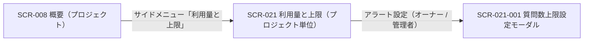

<!-- portal-top -->
[設計ポータル](../README.md) ／ [基本設計](index.md) ／ [画面設計](01_screen-design.md) ／ **SCR-021 利用量と上限(プロジェクト単位)**
<!-- /portal-top -->

# SCR-021 利用量と上限(プロジェクト単位)

> **このページは、当該プロジェクトの質問数について当月利用・月次上限・消化率を確認し、上限設定モーダルへの導線を提供する画面 SCR-021 を定義します。** 画面概要 / 画面遷移図 / 画面レイアウト / 画面項目定義 / 入出力一覧 / 画面イベント一覧 の 6 セクションで記述します。

*版数 v1.0 ・ 更新 2026-06-17 ・ 承認済*

## 1. 画面概要

当該プロジェクトの質問数について、当月利用・今月の利用上限・消化率を簡潔に確認し、上限・アラート設定モーダル(SCR-021-001)へ着地する画面です。無料利用枠・アラート状態・設定元・FAQ 件数は表示しません。

| 画面 ID | 画面名 | 機能概要 |
|----|----|----|
| `SCR-021` | 利用量と上限(プロジェクト単位) | 当該プロジェクトの質問数の当月利用・月次上限・消化率を表示し、上限設定モーダルへの導線を提供する |

| 関連 | 内容 |
|----|----|
| FR / BR | FR-121, FR-122, FR-125, FR-126, FR-127 / BR-088, BR-089 |
| 関連画面 | [`SCR-021-001` 質問数上限設定モーダル](SCR-021-001.md) / [`SCR-008` 概要(プロジェクト)](SCR-008.md) |

| ステークホルダ              | 対象 |
|-----------------------------|------|
| オーナー                    | ◯    |
| プロジェクト管理者(`admin`) | ◯    |
| メンバー(`member`)          | ◯    |

> [!NOTE]
> **補足** 閲覧は全ロール可です(`member` も閲覧可)。ただし**変更はオーナー / 当該プロジェクト管理者のみ**で、`member` には「アラート設定」ボタンを表示しません。表示ルール(数値・期間・最終更新・色語彙・状態表現)は §1.5 ダッシュボード / KPI 共通表示ルール に従います。当該 PJ に割当のないユーザーの URL 直アクセスは 403 → ダッシュボードへリダイレクトします。

## 2. 画面遷移図

本画面からの画面遷移を、画面 ID・画面名とイベント(操作)で示します。

## 3. 画面レイアウト

  

  <section>
    

      状態 1
      通常時 — 質問数が上限到達
    

    

      

        

          oopen-faq
          
          <button style="display:inline-flex;align-items:center;gap:7px;padding:6px 11px;border:1px solid #e6e8eb;border-radius:8px;background:#fff;font-size:13px;color:#3a3f46;cursor:pointer;font-family:inherit"><svg width="15" height="15" viewBox="0 0 24 24" fill="none" stroke="#71767e" stroke-width="1.8" stroke-linecap="round" stroke-linejoin="round"><path d="M4 5h5l2 2.5h9A1.5 1.5 0 0 1 21.5 9v9A1.5 1.5 0 0 1 20 19.5H4A1.5 1.5 0 0 1 2.5 18V6.5A1.5 1.5 0 0 1 4 5z"></path></svg>サポートサイト<svg width="14" height="14" viewBox="0 0 24 24" fill="none" stroke="#9aa0a8" stroke-width="1.9" stroke-linecap="round" stroke-linejoin="round"><path d="m6 9 6 6 6-6"></path></svg></button>
        

        

          <button style="position:relative;width:34px;height:34px;border-radius:8px;border:none;background:transparent;display:inline-flex;align-items:center;justify-content:center;color:#5b616a;cursor:pointer"><svg width="18" height="18" viewBox="0 0 24 24" fill="none" stroke="currentColor" stroke-width="1.8" stroke-linecap="round" stroke-linejoin="round"><path d="M6 8a6 6 0 0 1 12 0c0 7 3 9 3 9H3s3-2 3-9z"></path><path d="M10.3 21a1.94 1.94 0 0 0 3.4 0"></path></svg>3</button>
          <button style="display:inline-flex;align-items:center;gap:8px;padding:4px 10px 4px 4px;border:1px solid #e6e8eb;border-radius:999px;background:#fff;cursor:pointer;font-family:inherit">Aadmin@example.com<svg width="14" height="14" viewBox="0 0 24 24" fill="none" stroke="#9aa0a8" stroke-width="1.9" stroke-linecap="round" stroke-linejoin="round"><path d="m6 9 6 6 6-6"></path></svg></button>
        

      

      
      

        <svg width="13" height="13" viewBox="0 0 24 24" fill="none" stroke="currentColor" stroke-width="1.9" stroke-linecap="round" stroke-linejoin="round"><path d="M4 5h5l2 2.5h9A1.5 1.5 0 0 1 21.5 9v9A1.5 1.5 0 0 1 20 19.5H4A1.5 1.5 0 0 1 2.5 18V6.5A1.5 1.5 0 0 1 4 5z"></path></svg>プロジェクト
        サポートサイト
        契約ワークスペースへ →
      

      
      

        <aside style="width:240px;flex:none;background:#fbfbfc;border-right:1px solid #eef0f2;padding:12px 12px 16px;display:flex;flex-direction:column">
          <a style="display:flex;align-items:center;gap:10px;padding:9px 10px;border-radius:8px;color:#3a3f46;font-size:13.5px;text-decoration:none"><svg width="17" height="17" viewBox="0 0 24 24" fill="none" stroke="#71767e" stroke-width="1.7" stroke-linecap="round" stroke-linejoin="round"><path d="M3 10.5 12 3l9 7.5"></path><path d="M5 9.5V20a1 1 0 0 0 1 1h12a1 1 0 0 0 1-1V9.5"></path><path d="M9.5 21v-6h5v6"></path></svg>概要</a>
          
対応

          <a style="display:flex;align-items:center;gap:10px;padding:9px 10px;border-radius:8px;color:#3a3f46;font-size:13.5px;text-decoration:none"><svg width="17" height="17" viewBox="0 0 24 24" fill="none" stroke="#71767e" stroke-width="1.7" stroke-linecap="round" stroke-linejoin="round"><path d="M22 12h-6l-2 3h-4l-2-3H2"></path><path d="M5.5 5.1 2 12v6a2 2 0 0 0 2 2h16a2 2 0 0 0 2-2v-6l-3.5-6.9A2 2 0 0 0 16.8 4H7.2a2 2 0 0 0-1.7 1.1z"></path></svg>要対応の質問12</a>
          
通知

          <a style="display:flex;align-items:center;gap:10px;padding:9px 10px;border-radius:8px;color:#3a3f46;font-size:13.5px;text-decoration:none"><svg width="17" height="17" viewBox="0 0 24 24" fill="none" stroke="#71767e" stroke-width="1.7" stroke-linecap="round" stroke-linejoin="round"><path d="M6 8a6 6 0 0 1 12 0c0 7 3 9 3 9H3s3-2 3-9z"></path><path d="M10.3 21a1.94 1.94 0 0 0 3.4 0"></path></svg>お知らせ3</a>
          
コンテンツ

          <a style="display:flex;align-items:center;gap:10px;padding:9px 10px;border-radius:8px;color:#3a3f46;font-size:13.5px;text-decoration:none"><svg width="17" height="17" viewBox="0 0 24 24" fill="none" stroke="#71767e" stroke-width="1.7" stroke-linecap="round" stroke-linejoin="round"><path d="M12 7v13"></path><path d="M3 18a1 1 0 0 1-1-1V5a1 1 0 0 1 1-1h5a4 4 0 0 1 4 4 4 4 0 0 1 4-4h5a1 1 0 0 1 1 1v12a1 1 0 0 1-1 1h-6a3 3 0 0 0-3 3 3 3 0 0 0-3-3z"></path></svg>FAQ</a>
          <a style="display:flex;align-items:center;gap:10px;padding:9px 10px;border-radius:8px;color:#3a3f46;font-size:13.5px;text-decoration:none"><svg width="17" height="17" viewBox="0 0 24 24" fill="none" stroke="#71767e" stroke-width="1.7" stroke-linecap="round" stroke-linejoin="round"><rect x="3" y="3" width="7" height="7" rx="1.5"></rect><rect x="14" y="3" width="7" height="7" rx="1.5"></rect><rect x="14" y="14" width="7" height="7" rx="1.5"></rect><rect x="3" y="14" width="7" height="7" rx="1.5"></rect></svg>ウィジェット</a>
          
プロジェクト

          <a style="display:flex;align-items:center;gap:10px;padding:9px 10px;border-radius:8px;color:#3a3f46;font-size:13.5px;text-decoration:none"><svg width="17" height="17" viewBox="0 0 24 24" fill="none" stroke="#71767e" stroke-width="1.7" stroke-linecap="round" stroke-linejoin="round"><path d="M16 21v-2a4 4 0 0 0-4-4H6a4 4 0 0 0-4 4v2"></path><circle cx="9" cy="7" r="4"></circle><path d="M22 21v-2a4 4 0 0 0-3-3.87"></path><path d="M16 3.1a4 4 0 0 1 0 7.75"></path></svg>メンバー</a>
          <a style="display:flex;align-items:center;gap:10px;padding:9px 10px;border-radius:8px;background:color-mix(in srgb,var(--accent,#5e6ad2) 12%,#fff);color:var(--accent,#5e6ad2);font-weight:600;font-size:13.5px;text-decoration:none"><svg width="17" height="17" viewBox="0 0 24 24" fill="none" stroke="currentColor" stroke-width="1.8" stroke-linecap="round" stroke-linejoin="round"><path d="m12 14 4-4"></path><path d="M3.34 19a10 10 0 1 1 17.32 0"></path></svg>利用量と上限</a>
        </aside>
        <main style="flex:1;min-width:0;background:#fff;padding:18px 22px 24px;display:flex;flex-direction:column;gap:16px">
          <nav style="display:flex;align-items:center;gap:7px;font-size:12px;color:#9aa0a8">ホーム/利用量と上限</nav>
          

            

              <h1 style="margin:0 0 4px;font-size:20px;font-weight:700;color:#16191d;letter-spacing:-.01em">利用量と上限</h1>
              
当月の利用量と月次上限を確認できます

            

            <button style="display:inline-flex;align-items:center;gap:7px;padding:8px 13px;border:1px solid #e6e8eb;border-radius:8px;background:#fff;font-size:13px;font-weight:600;color:#3a3f46;cursor:pointer;white-space:nowrap;font-family:inherit"><svg width="16" height="16" viewBox="0 0 24 24" fill="none" stroke="#71767e" stroke-width="1.8" stroke-linecap="round" stroke-linejoin="round"><path d="M6 8a6 6 0 0 1 12 0c0 7 3 9 3 9H3s3-2 3-9z"></path><path d="M10.3 21a1.94 1.94 0 0 0 3.4 0"></path></svg>アラート設定</button>
          

          
<svg width="17" height="17" viewBox="0 0 24 24" fill="none" stroke="currentColor" stroke-width="1.9" stroke-linecap="round" stroke-linejoin="round" style="flex:none"><path d="M10.3 4 2.5 18a1.7 1.7 0 0 0 1.5 2.6h16a1.7 1.7 0 0 0 1.5-2.6L13.7 4a1.7 1.7 0 0 0-3 0z"></path><path d="M12 9v4"></path><path d="M12 17h.01"></path></svg><b style="font-weight:700">質問数が月次上限に達しました</b> — ウィジェットの自動応答は現在制限中です。上限の引き上げは契約プランの変更が必要です。

          

            

              
質問数上限到達

              
2,000/ 2,000 件100%

              

              
月次リセット: 2026-07-01

            

            

              
AI 推論コスト要監視

              
¥9,640/ ¥12,00080%

              

              
80% アラートを送信済み

            

          

          

            
設定中のアラートしきい値

            

              質問数 80% で通知
              質問数 100% で通知
              AI コスト 80% で通知
            

          

        </main><aside class="rightbar">
このページ
<nav class="toc"><a class="back" href="01_screen-design.md" style="font-weight:600;color:var(--accent)">← 画面一覧へ戻る</a><a href="#1-画面概要">1. 画面概要</a><a href="#2-画面遷移図">2. 画面遷移図</a><a href="#3-画面レイアウト">3. 画面レイアウト</a><a href="#4-画面項目定義">4. 画面項目定義</a><a href="#5-入出力一覧">5. 入出力一覧</a><a href="#6-画面イベント一覧">6. 画面イベント一覧</a></nav></aside>
      

    

  </section>

## 4. 画面項目定義

本画面の表示・操作項目を定義します。項目の正本は本表です。上限 ON / OFF で表示が変わる項目は備考に明記します。

| 項目 ID | 項目 | 説明 | 種類 | 表示条件 | 表示 |
|----|----|----|----|----|----|
| `IT-01` | PageHeader | 画面見出しを表示する。プロジェクト名・サイト名は付加しない | 見出し | — | 利用量と上限 |
| `IT-02` | 集計対象期間 | 集計対象期間(当月固定)と最終更新タイムスタンプを表示する。準リアルタイム(5 分以内) | ラベル | — | 当月の集計対象期間、最終更新日時 |
| `IT-03` | 質問数サマリー | 当月利用・今月の利用上限の 2 値と、上限 ON 時は課金計算式を表示する | カード | 計算式併記は上限 ON 時のみ | 当月利用 / 今月の利用上限。上限 ON 時は「{上限件数}件 - {無料枠件数}件(無料枠) = {課金対象件数}件 (¥{金額} / 月)」を併記、OFF 時は値を「OFF」とし計算式を表示しない |
| `IT-04` | 利用量 | 当月利用 ÷ 今月の利用上限の消化率を表示する。アラート状態・設定元は表示しない | プログレスバー | 割合・ProgressBar・状態バッジは上限 ON 時のみ | 消化率(80% 未満通常 / 80% 以上黄 / 100% 以上赤)、「N / M 件」。OFF 時は OFF 説明文のみ |
| `IT-05` | アラート設定 | 上限・アラート設定モーダル(SCR-021-001)を開く | ボタン | **オーナー / 当該プロジェクト管理者の場合のみ表示**。メンバーには表示しない | アラート設定 |
| `IT-06` | 空状態 | 集計前・取得失敗時の空状態を表示する | 空状態表示 | 集計前 / 取得失敗時 | 集計前は「集計中です」、取得失敗は §1.5.3 のフォールバック表示 |
| `IT-07` | 権限不足ガード | 閲覧のみのロールに対し変更ボタンを非表示にする。当該 PJ に割当のないユーザーは閲覧不可 | ツールチップ | ロールがメンバーの場合は閲覧のみ(変更ボタン非表示) | — |

## 5. 入出力一覧

本画面が読み書きするテーブルと、呼び出す API の一覧です。テーブルの正本は [03_テーブル設計](03_database-design.md)、API の正本は [02_API設計 §5.7.1](02_api-design.md#API-BIL-001) / [§5.7.5](02_api-design.md#API-BIL-006) です。

<table>
<thead>
<tr>
<th rowspan="2">入出力名</th>
<th rowspan="2">説明</th>
<th rowspan="2">種別</th>
<th rowspan="2">I/O</th>
<th colspan="4">アクセス種別(CRUD)</th>
<th rowspan="2">備考</th>
</tr>
<tr>
<th>C</th>
<th>R</th>
<th>U</th>
<th>D</th>
</tr>
</thead>
<tbody>
<tr>
<td>利用量計測</td>
<td>当月の質問数(当月利用)を取得する</td>
<td>テーブル</td>
<td>入力</td>
<td>—</td>
<td>◯</td>
<td>—</td>
<td>—</td>
<td><code>T_USAGE_METER</code>(<a href="03_database-design.md#TBL-T-008">テーブル設計 3.22</a>)</td>
</tr>
<tr>
<td>プロジェクト上限</td>
<td>月次上限件数・無料枠を取得する</td>
<td>テーブル</td>
<td>入力</td>
<td>—</td>
<td>◯</td>
<td>—</td>
<td>—</td>
<td><code>M_PRJ_QUOTA_LIMITS</code>(<a href="03_database-design.md#TBL-M-009">テーブル設計 3.24</a>)</td>
</tr>
<tr>
<td>利用量取得</td>
<td>当該プロジェクトの当月利用量を取得する</td>
<td>API</td>
<td>入力</td>
<td>—</td>
<td>—</td>
<td>—</td>
<td>—</td>
<td><code>GET /usage?period=current_month&amp;viewMode=project&amp;projectId={id}</code>(<a href="02_api-design.md#API-BIL-001">API 設計 5.7.1</a>)</td>
</tr>
<tr>
<td>上限取得</td>
<td>当該プロジェクトの上限設定を取得する</td>
<td>API</td>
<td>入力</td>
<td>—</td>
<td>—</td>
<td>—</td>
<td>—</td>
<td><code>GET /projects/{id}/quota-limits</code>(<a href="02_api-design.md#API-BIL-006">API 設計 5.7.5</a>)</td>
</tr>
</tbody>
</table>

## 6. 画面イベント一覧

本画面で発生するイベントと発生タイミング・概要の一覧です。

<table>
<colgroup>
<col style="width: 20%" />
<col style="width: 20%" />
<col style="width: 20%" />
<col style="width: 20%" />
<col style="width: 20%" />
</colgroup>
<thead>
<tr>
<th>イベント ID</th>
<th>イベント</th>
<th>トリガー</th>
<th>処理</th>
<th>関連項目</th>
</tr>
</thead>
<tbody>
<tr>
<td><code>EV-01</code></td>
<td>利用量初期表示</td>
<td>画面遷移・リロード時</td>
<td><ul>
<li>利用量取得・上限取得 API で当月利用と上限を取得し表示</li>
<li>集計前 / 取得失敗は EmptyState</li>
</ul></td>
<td><a href="#IT-02">IT-02</a>, <a href="#IT-03">IT-03</a>, <a href="#IT-04">IT-04</a>, <a href="#IT-06">IT-06</a></td>
</tr>
<tr>
<td><code>EV-02</code></td>
<td>上限設定モーダル起動</td>
<td>「アラート設定」押下時(オーナー / 管理者)</td>
<td><ul>
<li>SCR-021-001 質問数上限設定モーダルを開く</li>
<li><code>member</code> はボタン非表示のため発生しない</li>
</ul></td>
<td><a href="#IT-05">IT-05</a></td>
</tr>
<tr>
<td><code>EV-03</code></td>
<td>権限ガードによるリダイレクト</td>
<td>当該 PJ に割当のないユーザーの URL 直アクセス時</td>
<td>403 を返しダッシュボードへリダイレクトする</td>
<td><a href="#IT-07">IT-07</a></td>
</tr>
</tbody>
</table>

---

---

<!-- portal-bottom -->
[← 画面設計](01_screen-design.md) ・ [基本設計](index.md) ・ [↑ 設計ポータル](../README.md)
<!-- /portal-bottom -->
