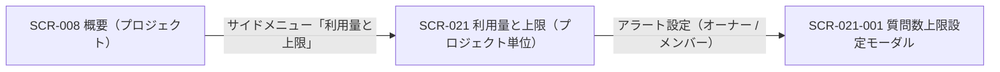
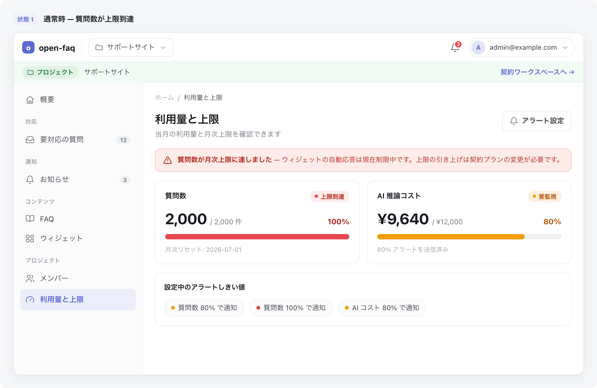

<!-- portal-top -->
[設計ポータル](../README.md) ／ [基本設計](index.md) ／ [画面設計](01_screen-design.md) ／ **SCR-021 利用量と上限(プロジェクト単位)**
<!-- /portal-top -->

# SCR-021 利用量と上限(プロジェクト単位)

> **このページは、当該プロジェクトの質問数について当月利用・月次上限・消化率を確認し、上限設定モーダルへの導線を提供する画面 SCR-021 を定義します。** 画面概要 / 画面遷移図 / 画面レイアウト / 画面項目定義 / 入出力一覧 / 画面イベント一覧 の 6 セクションで記述します。

*版数 v1.0 ・ 更新 2026-06-17 ・ 承認済*

## 1. 画面概要

当該プロジェクトの質問数について、当月利用・今月の利用上限・消化率を簡潔に確認し、上限・アラート設定モーダル(SCR-021-001)へ着地する画面です。無料利用枠・アラート状態・設定元・FAQ 件数は表示しません。

| 画面 ID | 画面名 | 機能概要 |
|----|----|----|
| `SCR-021` | 利用量と上限(プロジェクト単位) | 当該プロジェクトの質問数の当月利用・月次上限・消化率を表示し、上限設定モーダルへの導線を提供する |

| 関連 | 内容 |
|----|----|
| FR / BR | FR-121, FR-122, FR-125, FR-126, FR-127 / BR-088, BR-089 |
| 関連画面 | [`SCR-021-001` 質問数上限設定モーダル](SCR-021-001.md) / [`SCR-008` 概要(プロジェクト)](SCR-008.md) |

| ステークホルダ | 対象 |
|----------------|------|
| オーナー       | ◯    |
| メンバー       | ◯    |

> [!NOTE]
> **補足** 閲覧・変更とも、オーナー / 当該プロジェクトのメンバーが操作できます(「アラート設定」ボタンも表示します)。表示ルール(数値・期間・最終更新・色語彙・状態表現)は §1.5 ダッシュボード / KPI 共通表示ルール に従います。当該 PJ に割当のないユーザーの URL 直アクセスは 403 → ダッシュボードへリダイレクトします。

## 2. 画面遷移図

本画面からの画面遷移を、画面 ID・画面名とイベント(操作)で示します。

## 3. 画面レイアウト

## 4. 画面項目定義

本画面の表示・操作項目を定義します。項目の正本は本表です。上限 ON / OFF で表示が変わる項目は備考に明記します。

| 項目 ID | 項目 | 説明 | 種類 | 表示条件 | 表示 |
|----|----|----|----|----|----|
| `IT-01` | PageHeader | 画面見出しを表示する。プロジェクト名・サイト名は付加しない | 見出し | — | 利用量と上限 |
| `IT-02` | 集計対象期間 | 集計対象期間(当月固定)と最終更新タイムスタンプを表示する。準リアルタイム(5 分以内) | ラベル | — | 当月の集計対象期間、最終更新日時 |
| `IT-03` | 質問数サマリー | 当月利用・今月の利用上限の 2 値と、上限 ON 時は課金計算式を表示する | カード | 計算式併記は上限 ON 時のみ | 当月利用 / 今月の利用上限。上限 ON 時は「{上限件数}件 - {無料枠件数}件(無料枠) = {課金対象件数}件 (¥{金額} / 月)」を併記、OFF 時は値を「OFF」とし計算式を表示しない |
| `IT-04` | 利用量 | 当月利用 ÷ 今月の利用上限の消化率を表示する。アラート状態・設定元は表示しない | プログレスバー | 割合・ProgressBar・状態バッジは上限 ON 時のみ | 消化率(80% 未満通常 / 80% 以上黄 / 100% 以上赤)、「N / M 件」。OFF 時は OFF 説明文のみ |
| `IT-05` | アラート設定 | 上限・アラート設定モーダル(SCR-021-001)を開く | ボタン | **オーナー / 当該プロジェクトのメンバーに表示する** | アラート設定 |
| `IT-06` | 空状態 | 集計前・取得失敗時の空状態を表示する | 空状態表示 | 集計前 / 取得失敗時 | 集計前は「集計中です」、取得失敗は §1.5.3 のフォールバック表示 |
| `IT-07` | 権限不足ガード | 当該 PJ に割当のないユーザーは閲覧不可とし、URL 直アクセス時に権限不足を表示する | ツールチップ | 当該 PJ に割当のないユーザーが URL に直接アクセスした場合 | — |

## 5. 入出力一覧

本画面が読み書きするテーブルと、呼び出す API の一覧です。テーブルの正本は [03_テーブル設計](03_database-design.md)、API の正本は [02_API設計 §5.7.1](02_api-design.md#API-BIL-001) / [§5.7.5](02_api-design.md#API-BIL-006) です。

<table>
<thead>
<tr>
<th rowspan="2">入出力名</th>
<th rowspan="2">説明</th>
<th rowspan="2">種別</th>
<th rowspan="2">I/O</th>
<th colspan="4">アクセス種別(CRUD)</th>
<th rowspan="2">備考</th>
</tr>
<tr>
<th>C</th>
<th>R</th>
<th>U</th>
<th>D</th>
</tr>
</thead>
<tbody>
<tr>
<td>利用量計測</td>
<td>当月の質問数(当月利用)を取得する</td>
<td>テーブル</td>
<td>入力</td>
<td>—</td>
<td>◯</td>
<td>—</td>
<td>—</td>
<td><code>T_USAGE_METER</code>(<a href="03_database-design.md#TBL-T-008">テーブル設計 3.22</a>)</td>
</tr>
<tr>
<td>プロジェクト上限</td>
<td>月次上限件数・無料枠を取得する</td>
<td>テーブル</td>
<td>入力</td>
<td>—</td>
<td>◯</td>
<td>—</td>
<td>—</td>
<td><code>M_PRJ_QUOTA_LIMITS</code>(<a href="03_database-design.md#TBL-M-009">テーブル設計 3.24</a>)</td>
</tr>
<tr>
<td>利用量取得</td>
<td>当該プロジェクトの当月利用量を取得する</td>
<td>API</td>
<td>入力</td>
<td>—</td>
<td>—</td>
<td>—</td>
<td>—</td>
<td><code>GET /usage?period=current_month&amp;viewMode=project&amp;projectId={id}</code>(<a href="02_api-design.md#API-BIL-001">API 設計 5.7.1</a>)</td>
</tr>
<tr>
<td>上限取得</td>
<td>当該プロジェクトの上限設定を取得する</td>
<td>API</td>
<td>入力</td>
<td>—</td>
<td>—</td>
<td>—</td>
<td>—</td>
<td><code>GET /projects/{id}/quota-limits</code>(<a href="02_api-design.md#API-BIL-006">API 設計 5.7.5</a>)</td>
</tr>
</tbody>
</table>

## 6. 画面イベント一覧

本画面のイベント(初期表示・各操作)ごとに、対象の項目 ID と処理内容を定義します。

<table>
<colgroup>
<col style="width: 12%" />
<col style="width: 12%" />
<col style="width: 30%" />
<col style="width: 46%" />
</colgroup>
<thead>
<tr>
<th>イベント ID</th>
<th>項目 ID</th>
<th>イベント</th>
<th>処理</th>
</tr>
</thead>
<tbody>
<tr>
<td><code>EV-01</code></td>
<td>—</td>
<td>初期表示</td>
<td><ul>
<li>利用量取得・上限取得 API で当月利用と上限を取得し表示</li>
<li>集計前 / 取得失敗: EmptyState</li>
</ul></td>
</tr>
<tr>
<td><code>EV-02</code></td>
<td><a href="#IT-05">IT-05</a></td>
<td>「アラート設定」を押下(オーナー / メンバー)</td>
<td>SCR-021-001 質問数上限設定モーダルを開く</td>
</tr>
<tr>
<td><code>EV-03</code></td>
<td><a href="#IT-07">IT-07</a></td>
<td>割当なしで URL 直アクセス</td>
<td>403 を返しダッシュボードへリダイレクトする</td>
</tr>
</tbody>
</table>

---

<!-- portal-bottom -->
[← 画面設計](01_screen-design.md) ・ [基本設計](index.md) ・ [↑ 設計ポータル](../README.md)
<!-- /portal-bottom -->
