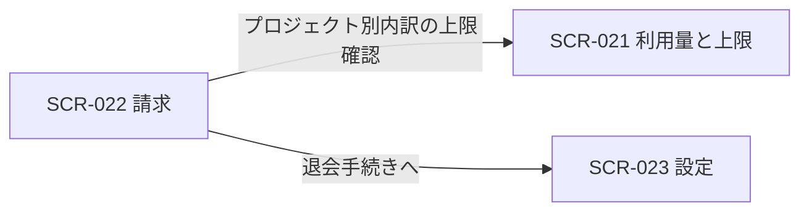
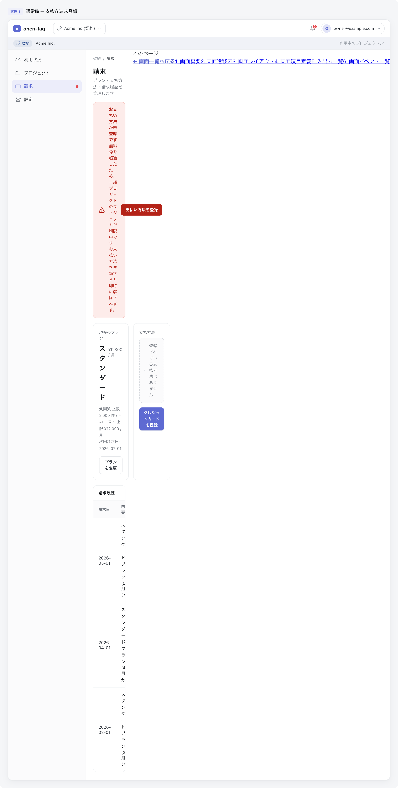

<!-- portal-top -->
[設計ポータル](../README.md) ／ [基本設計](index.md) ／ [画面設計](01_screen-design.md) ／ **SCR-022 請求**
<!-- /portal-top -->

# SCR-022 請求

> **このページは、オーナーが契約全体と各プロジェクトの課金状況・支払方法・請求履歴を確認する画面 SCR-022 を定義します(オーナー専有)。** 画面概要 / 画面遷移図 / 画面レイアウト / 画面項目定義 / 入出力一覧 / 画面イベント一覧 の 6 セクションで記述します。

*版数 v1.0 ・ 更新 2026-06-17 ・ 承認済*

## 1. 画面概要

オーナーが契約全体の当月請求見込み・次回請求日・請求状態と、プロジェクト別の課金内訳・支払方法・請求履歴を確認する画面です(オーナー専有)。

| 画面 ID | 画面名 | 機能概要 |
|----|----|----|
| `SCR-022` | 請求 | 契約全体と各プロジェクトの課金状況・支払方法・請求履歴を確認する |

| 関連 | 内容 |
|----|----|
| FR / BR | FR-066, FR-067, FR-073 / BR-066 |
| 関連画面 | [`SCR-008` 概要(プロジェクト)](SCR-008.md) / [`SCR-016` 利用状況](SCR-016.md) / [`SCR-021` 利用量と上限](SCR-021.md) / [`SCR-023` 設定](SCR-023.md) |

| ステークホルダ | 対象 |
|----------------|------|
| オーナー       | ◯    |
| メンバー       | —    |

> [!NOTE]
> **補足** 本画面はオーナー専有です。メンバーは利用できず、URL 直アクセスは権限不足表示となります。支払い失敗・支払方法未登録時は、原因・影響・復旧手順・復旧 CTA を同一バナーに表示します。利用契約の解約(退会)は本画面ではなく SCR-023 設定に配置します。

## 2. 画面遷移図

本画面からの画面遷移を、画面 ID・画面名とイベント(操作)で示します。

## 3. 画面レイアウト

## 4. 画面項目定義

本画面の入出力項目(請求サマリ・プロジェクト別内訳・支払方法・請求履歴)を定義します。項目の正本は本表です。

| 項目 ID | 項目 | 説明 | 種類 | 表示条件 | 表示 |
|----|----|----|----|----|----|
| `IT-01` | 当月の請求見込み | 契約全体の当月請求見込み合計を表示する | カード | — | 当月の請求見込み額 |
| `IT-02` | 次回請求日 | 次回の請求確定日を表示する | カード | — | 次回請求日 |
| `IT-03` | 請求状態 | 請求状態を表示する | カード | — | 正常 / 支払い失敗 / 支払方法未登録 等 |
| `IT-04` | プロジェクト別の請求内訳 | プロジェクト別の課金内訳と全体合計を表示する。AI 利用コストは顧客請求額に計上しない | テーブル | — | プロジェクト名 / 質問課金 / FAQ 課金 / 小計。最下行に全体合計 |
| `IT-05` | 支払方法 | 登録済みカードのブランド・末尾 4 桁・有効期限を表示する | ラベル | — | カードブランド / 末尾 4 桁 / 有効期限 |
| `IT-06` | 支払方法を変更 | 支払方法の登録・更新を行う。課金情報変更につき再認証(現パスワード再入力)を要する | ボタン | — | 支払方法を変更 |
| `IT-07` | 請求履歴 | 過去の請求を一覧表示する | テーブル | — | 請求月 / 金額 / 状態 / PDF |
| `IT-08` | 請求書 PDF | 各請求行の明細 PDF を開く / ダウンロードする | リンク | — | PDF |
| `IT-09` | 支払い失敗・未登録バナー | 支払い失敗・支払方法未登録時に原因・影響・復旧手順・復旧 CTA を同一バナーに表示する | アラート | 支払い失敗時 / 支払方法未登録時 | 原因 / 影響 / 復旧手順 / 復旧 CTA |
| `IT-10` | 支払い方法を登録(バナー CTA) | 支払い失敗・未登録バナー内の復旧 CTA ボタン。押下すると支払方法登録フローを開始する | ボタン | 支払い失敗時 / 支払方法未登録時 | 支払い方法を登録 |
| `IT-11` | プランを変更 | 現在のプランカード右下に表示されるボタン。プラン変更画面またはモーダルへ遷移する | ボタン | — | プランを変更 |

## 5. 入出力一覧

本画面が読み書きするテーブルと、呼び出す API の一覧です。テーブルの正本は [データベース設計](03_database-design.md)、API の正本は [API設計](02_api-design.md#API-BIL-003) です。

<table>
<thead>
<tr>
<th rowspan="2">入出力名</th>
<th rowspan="2">説明</th>
<th rowspan="2">種別</th>
<th rowspan="2">I/O</th>
<th colspan="4">アクセス種別(CRUD)</th>
<th rowspan="2">備考</th>
</tr>
<tr>
<th>C</th>
<th>R</th>
<th>U</th>
<th>D</th>
</tr>
</thead>
<tbody>
<tr>
<td>契約サブスクリプション</td>
<td>請求見込み・請求状態・支払方法を取得し、支払方法を更新する</td>
<td>テーブル</td>
<td>入力</td>
<td>—</td>
<td>◯</td>
<td>◯</td>
<td>—</td>
<td><code>T_BILL_SUBS</code>(<a href="03_database-design.md#TBL-T-006">テーブル設計 3.20</a>)</td>
</tr>
<tr>
<td>請求書</td>
<td>請求履歴・請求書 PDF を取得する</td>
<td>テーブル</td>
<td>入力</td>
<td>—</td>
<td>◯</td>
<td>—</td>
<td>—</td>
<td><code>T_BILL_INVOICES</code>(<a href="03_database-design.md#TBL-T-007">テーブル設計 3.21</a>)</td>
</tr>
<tr>
<td>利用量計測</td>
<td>プロジェクト別の課金内訳を集計する</td>
<td>テーブル</td>
<td>入力</td>
<td>—</td>
<td>◯</td>
<td>—</td>
<td>—</td>
<td><code>T_USAGE_METER</code>(<a href="03_database-design.md#TBL-T-008">テーブル設計 3.22</a>)</td>
</tr>
<tr>
<td>請求サマリ取得</td>
<td>請求見込み・次回請求日・請求状態・内訳を取得する</td>
<td>API</td>
<td>入力</td>
<td>—</td>
<td>—</td>
<td>—</td>
<td>—</td>
<td><code>GET /billing/summary</code>(<code>period</code>)(<a href="02_api-design.md#API-BIL-003">API 設計 5.7.3</a>)</td>
</tr>
<tr>
<td>請求履歴取得</td>
<td>過去の請求履歴を取得する</td>
<td>API</td>
<td>入力</td>
<td>—</td>
<td>—</td>
<td>—</td>
<td>—</td>
<td><code>GET /billing/invoices</code>(<code>limit</code>)(<a href="02_api-design.md#API-BIL-004">API 設計 5.7.4</a>)</td>
</tr>
<tr>
<td>支払方法取得・更新</td>
<td>支払方法を取得し、登録・更新する</td>
<td>API</td>
<td>入出力</td>
<td>—</td>
<td>—</td>
<td>—</td>
<td>—</td>
<td><code>GET / PUT /billing/payment-method</code>(<a href="02_api-design.md#API-BIL-005">API 設計 5.7.5</a>)</td>
</tr>
<tr>
<td>請求書 PDF</td>
<td>請求行の明細 PDF をダウンロード / 表示する</td>
<td>ファイル</td>
<td>出力</td>
<td>—</td>
<td>—</td>
<td>—</td>
<td>—</td>
<td>—</td>
</tr>
</tbody>
</table>

## 6. 画面イベント一覧

本画面のイベント(初期表示・各操作)ごとに、対象の項目 ID と処理内容を定義します。

<table>
<colgroup>
<col style="width: 12%" />
<col style="width: 12%" />
<col style="width: 30%" />
<col style="width: 46%" />
</colgroup>
<thead>
<tr>
<th>イベント ID</th>
<th>項目 ID</th>
<th>イベント</th>
<th>処理</th>
</tr>
</thead>
<tbody>
<tr>
<td><code>EV-01</code></td>
<td>—</td>
<td>初期表示</td>
<td><ul>
<li><a href="API-billing.md#API-BIL-003">請求サマリ取得</a> API で請求見込み・次回請求日・請求状態・プロジェクト別内訳を取得し <a href="#IT-01">IT-01</a>〜<a href="#IT-05">IT-05</a> へ表示する</li>
<li><a href="API-billing.md#API-BIL-004">請求履歴取得</a> API で請求月・金額・状態・PDF リンクを取得し <a href="#IT-07">IT-07</a> へ表示する</li>
<li>請求状態が支払い失敗または支払方法未登録の場合: <a href="#IT-09">IT-09</a> バナーを表示し、原因・影響・復旧手順・復旧 CTA を示す</li>
</ul></td>
</tr>
<tr>
<td><code>EV-02</code></td>
<td><a href="#IT-06">IT-06</a></td>
<td>「支払方法を変更」を押下</td>
<td><ul>
<li>課金情報変更につき再認証(現パスワード再入力)を求める</li>
<li>再認証成功時: <a href="API-billing.md#API-BIL-005">支払方法取得・更新</a> API で支払方法を登録・更新し、<a href="#IT-05">IT-05</a> を最新の情報へ更新する</li>
<li>再認証失敗時: エラーを表示し操作を中断する</li>
</ul></td>
</tr>
<tr>
<td><code>EV-03</code></td>
<td><a href="#IT-08">IT-08</a></td>
<td>「領収書」リンクを押下</td>
<td><ul>
<li>該当請求行の明細 PDF を別タブで表示またはダウンロードする</li>
<li>取得失敗時: エラーを表示する</li>
</ul></td>
</tr>
<tr>
<td><code>EV-04</code></td>
<td>—</td>
<td>「利用量と上限を確認」リンクを押下</td>
<td>SCR-021 利用量と上限 へ遷移する</td>
</tr>
<tr>
<td><code>EV-05</code></td>
<td>—</td>
<td>「退会手続きへ」リンクを押下</td>
<td>SCR-023 設定 へ遷移し退会手続きを開始する</td>
</tr>
<tr>
<td><code>EV-06</code></td>
<td><a href="#IT-10">IT-10</a></td>
<td>「支払い方法を登録」を押下(バナー CTA)</td>
<td><ul>
<li>課金情報変更につき再認証(現パスワード再入力)を求める</li>
<li>再認証成功時: <a href="API-billing.md#API-BIL-005">支払方法取得・更新</a> API で支払方法を登録し、<a href="#IT-05">IT-05</a> を最新の情報へ更新し、<a href="#IT-09">IT-09</a> バナーを非表示にする</li>
<li>再認証失敗時: エラーを表示し操作を中断する</li>
</ul></td>
</tr>
<tr>
<td><code>EV-07</code></td>
<td><a href="#IT-11">IT-11</a></td>
<td>「プランを変更」を押下</td>
<td><ul>
<li>プラン変更モーダルまたは画面を表示する(対応 API は現設計に未定義のため、遷移後の画面でプラン選択・確定を行う)</li>
</ul></td>
</tr>
</tbody>
</table>

---

<!-- portal-bottom -->
[← 画面設計](01_screen-design.md) ・ [基本設計](index.md) ・ [↑ 設計ポータル](../README.md)
<!-- /portal-bottom -->
