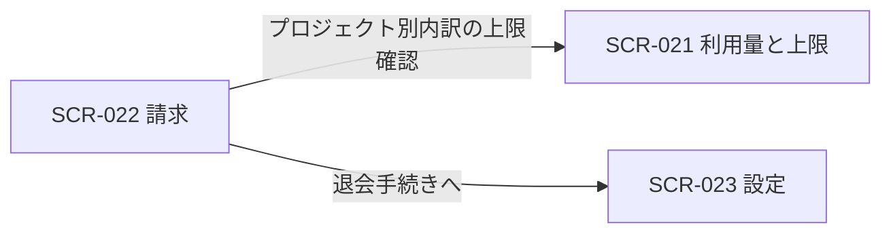

<!-- portal-top -->
[設計ポータル](../README.md) ／ [基本設計](index.md) ／ [画面設計](01_screen-design.md) ／ **SCR-022 請求**
<!-- /portal-top -->

# SCR-022 請求

> **このページは、オーナーが契約全体と各プロジェクトの課金状況・支払方法・請求履歴を確認する画面 SCR-022 を定義します(オーナー専有)。** 画面概要 / 画面遷移図 / 画面レイアウト / 画面項目定義 / 入出力一覧 / 画面イベント一覧 の 6 セクションで記述します。

*版数 v1.0 ・ 更新 2026-06-17 ・ 承認済*

## <span id="1-画面概要"></span>1. 画面概要

オーナーが契約全体の当月請求見込み・次回請求日・請求状態と、プロジェクト別の課金内訳・支払方法・請求履歴を確認する画面です(オーナー専有)。

| 画面 ID | 画面名 | 機能概要 |
|----|----|----|
| <span id="SCR-022"></span>`SCR-022` | 請求 | 契約全体と各プロジェクトの課金状況・支払方法・請求履歴を確認する |

| 関連 | 内容 |
|----|----|
| FR / BR | FR-122, FR-123, FR-136 / BR-093 |
| 関連画面 | [`SCR-008` 概要(プロジェクト)](SCR-008.md) / [`SCR-016` 利用状況](SCR-016.md) / [`SCR-021` 利用量と上限](SCR-021.md) / [`SCR-023` 設定](SCR-023.md) |

| ステークホルダ              | 対象 |
|-----------------------------|------|
| オーナー                    | ◯    |
| プロジェクト管理者(`admin`) | —    |
| メンバー(`member`)          | —    |

> [!NOTE]
> **補足** 本画面はオーナー専有です。プロジェクト管理者・メンバーは利用できず、URL 直アクセスは権限不足表示となります。支払い失敗・支払方法未登録時は、原因・影響・復旧手順・復旧 CTA を同一バナーに表示します。利用契約の解約(退会)は本画面ではなく SCR-023 設定に配置します。

## <span id="2-画面遷移図"></span>2. 画面遷移図

本画面からの画面遷移を、画面 ID・画面名とイベント(操作)で示します。



## <span id="3-画面レイアウト"></span>3. 画面レイアウト


<details>
<summary>画面モック HTML（ソース）</summary>

```html
<div style="background:#f5f6f8;padding:24px;border-radius:12px;font-family:'Noto Sans JP',-apple-system,BlinkMacSystemFont,'Hiragino Kaku Gothic ProN',Meiryo,sans-serif;color:#3a3f46;-webkit-font-smoothing:antialiased;--accent:#5e6ad2">
<div style="max-width:1180px;margin:0 auto;display:flex;flex-direction:column;gap:40px">
  <section>
    <div style="display:flex;align-items:center;gap:10px;margin-bottom:13px">
      <span style="font-size:11px;font-weight:700;color:var(--accent,#5e6ad2);background:color-mix(in srgb,var(--accent,#5e6ad2) 10%,#fff);border-radius:6px;padding:3px 8px">状態 1</span>
      <span style="font-size:13.5px;font-weight:600;color:#16191d">通常時 — 支払方法 未登録</span>
    </div>
    <div style="background:#fff;border:1px solid #e6e8eb;border-radius:14px;box-shadow:0 1px 2px rgba(16,24,40,.04),0 6px 20px rgba(16,24,40,.05);overflow:hidden">
      <div style="display:flex;align-items:center;justify-content:space-between;height:54px;padding:0 16px;border-bottom:1px solid #eef0f2;background:#fff">
        <div style="display:flex;align-items:center;gap:12px">
          <span style="display:inline-flex;align-items:center;gap:8px;font-weight:700;font-size:15px;color:#16191d"><span style="width:23px;height:23px;border-radius:7px;background:var(--accent,#5e6ad2);display:inline-flex;align-items:center;justify-content:center;color:#fff;font-size:13px;font-weight:800">o</span>open-faq</span>
          <span style="width:1px;height:22px;background:#eef0f2"></span>
          <button style="display:inline-flex;align-items:center;gap:7px;padding:6px 11px;border:1px solid #e6e8eb;border-radius:8px;background:#fff;font-size:13px;color:#3a3f46;cursor:pointer;font-family:inherit"><svg width="15" height="15" viewBox="0 0 24 24" fill="none" stroke="#71767e" stroke-width="1.8" stroke-linecap="round" stroke-linejoin="round"><path d="M10 13a5 5 0 0 0 7.5.5l3-3a5 5 0 0 0-7-7l-1.5 1.5"></path><path d="M14 11a5 5 0 0 0-7.5-.5l-3 3a5 5 0 0 0 7 7l1.5-1.5"></path></svg>Acme Inc.(契約)<svg width="14" height="14" viewBox="0 0 24 24" fill="none" stroke="#9aa0a8" stroke-width="1.9" stroke-linecap="round" stroke-linejoin="round"><path d="m6 9 6 6 6-6"></path></svg></button>
        </div>
        <div style="display:flex;align-items:center;gap:8px">
          <button style="position:relative;width:34px;height:34px;border-radius:8px;border:none;background:transparent;display:inline-flex;align-items:center;justify-content:center;color:#5b616a;cursor:pointer"><svg width="18" height="18" viewBox="0 0 24 24" fill="none" stroke="currentColor" stroke-width="1.8" stroke-linecap="round" stroke-linejoin="round"><path d="M6 8a6 6 0 0 1 12 0c0 7 3 9 3 9H3s3-2 3-9z"></path><path d="M10.3 21a1.94 1.94 0 0 0 3.4 0"></path></svg><span style="position:absolute;top:3px;right:3px;min-width:16px;height:16px;padding:0 3px;border-radius:999px;background:#e5484d;color:#fff;font-size:10px;font-weight:700;display:flex;align-items:center;justify-content:center;border:2px solid #fff">3</span></button>
          <button style="display:inline-flex;align-items:center;gap:8px;padding:4px 10px 4px 4px;border:1px solid #e6e8eb;border-radius:999px;background:#fff;cursor:pointer;font-family:inherit"><span style="width:26px;height:26px;border-radius:999px;background:color-mix(in srgb,var(--accent,#5e6ad2) 18%,#fff);color:var(--accent,#5e6ad2);font-weight:700;font-size:12px;display:flex;align-items:center;justify-content:center">O</span><span style="font-size:12.5px;color:#3a3f46">owner@example.com</span><svg width="14" height="14" viewBox="0 0 24 24" fill="none" stroke="#9aa0a8" stroke-width="1.9" stroke-linecap="round" stroke-linejoin="round"><path d="m6 9 6 6 6-6"></path></svg></button>
        </div>
      </div>
      <div style="display:flex;align-items:center;gap:10px;height:38px;padding:0 16px;background:color-mix(in srgb,#294b8f 7%,#fff);border-bottom:1px solid #eef0f2;font-size:12.5px;color:#71767e">
        <span style="display:inline-flex;align-items:center;gap:5px;padding:3px 9px;border-radius:999px;background:color-mix(in srgb,#294b8f 14%,#fff);color:#294b8f;font-weight:600;font-size:11.5px"><svg width="13" height="13" viewBox="0 0 24 24" fill="none" stroke="currentColor" stroke-width="1.9" stroke-linecap="round" stroke-linejoin="round"><path d="M10 13a5 5 0 0 0 7.5.5l3-3a5 5 0 0 0-7-7l-1.5 1.5"></path><path d="M14 11a5 5 0 0 0-7.5-.5l-3 3a5 5 0 0 0 7 7l1.5-1.5"></path></svg>契約</span>
        <span style="color:#3a3f46;font-weight:500">Acme Inc.</span>
        <span style="margin-left:auto;color:#9aa0a8">利用中のプロジェクト: 4</span>
      </div>
      <div style="display:flex;min-height:540px">
        <aside style="width:240px;flex:none;background:#fbfbfc;border-right:1px solid #eef0f2;padding:12px 12px 16px;display:flex;flex-direction:column;gap:2px">
          <a style="display:flex;align-items:center;gap:10px;padding:9px 10px;border-radius:8px;color:#3a3f46;font-size:13.5px;text-decoration:none"><svg width="17" height="17" viewBox="0 0 24 24" fill="none" stroke="#71767e" stroke-width="1.7" stroke-linecap="round" stroke-linejoin="round"><path d="m12 14 4-4"></path><path d="M3.34 19a10 10 0 1 1 17.32 0"></path></svg>利用状況</a>
          <a style="display:flex;align-items:center;gap:10px;padding:9px 10px;border-radius:8px;color:#3a3f46;font-size:13.5px;text-decoration:none"><svg width="17" height="17" viewBox="0 0 24 24" fill="none" stroke="#71767e" stroke-width="1.7" stroke-linecap="round" stroke-linejoin="round"><path d="M4 5h5l2 2.5h9A1.5 1.5 0 0 1 21.5 9v9A1.5 1.5 0 0 1 20 19.5H4A1.5 1.5 0 0 1 2.5 18V6.5A1.5 1.5 0 0 1 4 5z"></path></svg>プロジェクト</a>
          <a style="display:flex;align-items:center;gap:10px;padding:9px 10px;border-radius:8px;background:color-mix(in srgb,var(--accent,#5e6ad2) 12%,#fff);color:var(--accent,#5e6ad2);font-weight:600;font-size:13.5px;text-decoration:none"><svg width="17" height="17" viewBox="0 0 24 24" fill="none" stroke="currentColor" stroke-width="1.8" stroke-linecap="round" stroke-linejoin="round"><rect x="2" y="5" width="20" height="14" rx="2"></rect><path d="M2 10h20"></path></svg>請求<span style="margin-left:auto;width:8px;height:8px;border-radius:999px;background:#e5484d"></span></a>
          <a style="display:flex;align-items:center;gap:10px;padding:9px 10px;border-radius:8px;color:#3a3f46;font-size:13.5px;text-decoration:none"><svg width="17" height="17" viewBox="0 0 24 24" fill="none" stroke="#71767e" stroke-width="1.7" stroke-linecap="round" stroke-linejoin="round"><circle cx="12" cy="12" r="3"></circle><path d="M19.4 15a1.65 1.65 0 0 0 .33 1.82l.06.06a2 2 0 1 1-2.83 2.83l-.06-.06a1.65 1.65 0 0 0-2.82 1.17V21a2 2 0 0 1-4 0v-.09A1.65 1.65 0 0 0 8 19.4a1.65 1.65 0 0 0-1.82.33l-.06.06a2 2 0 1 1-2.83-2.83l.06-.06A1.65 1.65 0 0 0 4.6 14H4.5a2 2 0 0 1 0-4h.09A1.65 1.65 0 0 0 6 8.6a1.65 1.65 0 0 0-.33-1.82l-.06-.06a2 2 0 1 1 2.83-2.83l.06.06A1.65 1.65 0 0 0 11 4.6h.09A1.65 1.65 0 0 0 12 3.09V3a2 2 0 0 1 4 0v.09A1.65 1.65 0 0 0 18 4.6a1.65 1.65 0 0 0 1.82-.33l.06-.06a2 2 0 1 1 2.83 2.83l-.06.06A1.65 1.65 0 0 0 19.4 9v.09"></path></svg>設定</a>
        </aside>
        <main style="flex:1;min-width:0;background:#fff;padding:18px 22px 24px;display:flex;flex-direction:column;gap:16px">
          <nav style="display:flex;align-items:center;gap:7px;font-size:12px;color:#9aa0a8"><span>契約</span><span>/</span><span style="color:#3a3f46">請求</span></nav>
          <div>
            <h1 style="margin:0 0 4px;font-size:20px;font-weight:700;color:#16191d;letter-spacing:-.01em">請求</h1>
            <p style="margin:0;font-size:13px;color:#71767e">プラン・支払方法・請求履歴を管理します</p>
          </div>
          <div style="display:flex;align-items:center;gap:12px;padding:13px 16px;border:1px solid #f5c2bd;background:#fdecea;border-radius:10px"><svg width="20" height="20" viewBox="0 0 24 24" fill="none" stroke="#b42318" stroke-width="1.9" stroke-linecap="round" stroke-linejoin="round" style="flex:none"><path d="M10.3 4 2.5 18a1.7 1.7 0 0 0 1.5 2.6h16a1.7 1.7 0 0 0 1.5-2.6L13.7 4a1.7 1.7 0 0 0-3 0z"></path><path d="M12 9v4"></path><path d="M12 17h.01"></path></svg><div style="font-size:12.5px;color:#b42318;line-height:1.5"><b style="font-weight:700">お支払い方法が未登録です</b><br>無料枠を超過したため、一部プロジェクトのウィジェットが制限中です。お支払い方法を登録すると即時に解除されます。</div><button style="margin-left:auto;padding:8px 14px;border:none;border-radius:8px;background:#b42318;color:#fff;font-size:12.5px;font-weight:600;cursor:pointer;white-space:nowrap;font-family:inherit">支払い方法を登録</button></div>
          <div style="display:grid;grid-template-columns:1fr 1fr;gap:14px">
            <div style="border:1px solid #eef0f2;border-radius:12px;padding:18px">
              <div style="font-size:12px;color:#71767e;margin-bottom:8px">現在のプラン</div>
              <div style="display:flex;align-items:baseline;gap:8px"><span style="font-size:20px;font-weight:700;color:#16191d">スタンダード</span><span style="font-size:13px;color:#71767e">¥9,800 / 月</span></div>
              <div style="margin-top:12px;font-size:12px;color:#71767e;line-height:1.7">質問数 上限 2,000 件 / 月<br>AI コスト 上限 ¥12,000 / 月<br>次回請求日: 2026-07-01</div>
              <button style="margin-top:14px;padding:7px 13px;border:1px solid #e6e8eb;border-radius:8px;background:#fff;font-size:12.5px;font-weight:600;color:#3a3f46;cursor:pointer;font-family:inherit">プランを変更</button>
            </div>
            <div style="border:1px solid #eef0f2;border-radius:12px;padding:18px">
              <div style="font-size:12px;color:#71767e;margin-bottom:8px">支払方法</div>
              <div style="display:flex;align-items:center;gap:12px;padding:14px;border:1px dashed #d8dbdf;border-radius:10px;background:#fbfbfc"><svg width="22" height="22" viewBox="0 0 24 24" fill="none" stroke="#9aa0a8" stroke-width="1.7" stroke-linecap="round" stroke-linejoin="round"><rect x="2" y="5" width="20" height="14" rx="2"></rect><path d="M2 10h20"></path></svg><div style="font-size:12.5px;color:#71767e">登録されている支払方法はありません</div></div>
              <button style="margin-top:14px;padding:7px 13px;border:none;border-radius:8px;background:var(--accent,#5e6ad2);color:#fff;font-size:12.5px;font-weight:600;cursor:pointer;box-shadow:0 1px 2px rgba(16,24,40,.12);font-family:inherit">クレジットカードを登録</button>
            </div>
          </div>
          <div style="border:1px solid #eef0f2;border-radius:12px;overflow:hidden">
            <div style="padding:13px 16px;border-bottom:1px solid #eef0f2;font-size:12.5px;font-weight:700;color:#16191d">請求履歴</div>
            <table style="width:100%;border-collapse:collapse;font-size:13px">
              <thead>
                <tr style="background:#fbfbfc">
                  <th style="text-align:left;padding:10px 16px;border-bottom:1px solid #eef0f2;color:#71767e;font-weight:600;font-size:11.5px">請求日</th>
                  <th style="text-align:left;padding:10px 16px;border-bottom:1px solid #eef0f2;color:#71767e;font-weight:600;font-size:11.5px">内容</th>
                  <th style="text-align:right;padding:10px 16px;border-bottom:1px solid #eef0f2;color:#71767e;font-weight:600;font-size:11.5px">金額</th>
                  <th style="text-align:left;padding:10px 16px;border-bottom:1px solid #eef0f2;color:#71767e;font-weight:600;font-size:11.5px">状態</th>
                  <th style="padding:10px 16px;border-bottom:1px solid #eef0f2"></th>
                </tr>
              </thead>
              <tbody>
                <tr>
                  <td style="padding:12px 16px;border-bottom:1px solid #f1f3f5;color:#3a3f46">2026-05-01</td>
                  <td style="padding:12px 16px;border-bottom:1px solid #f1f3f5;color:#16191d">スタンダードプラン(5 月分)</td>
                  <td style="padding:12px 16px;border-bottom:1px solid #f1f3f5;text-align:right;color:#16191d;font-weight:600">¥9,800</td>
                  <td style="padding:12px 16px;border-bottom:1px solid #f1f3f5"><span style="display:inline-flex;align-items:center;gap:5px;padding:2px 9px;border-radius:999px;background:#e7f6ec;color:#1a7f37;font-size:11.5px;font-weight:600"><span style="width:6px;height:6px;border-radius:999px;background:#2da44e"></span>支払済</span></td>
                  <td style="padding:12px 16px;border-bottom:1px solid #f1f3f5;text-align:right"><a style="color:var(--accent,#5e6ad2);font-size:12px;font-weight:600;text-decoration:none;cursor:pointer">領収書</a></td>
                </tr>
                <tr>
                  <td style="padding:12px 16px;border-bottom:1px solid #f1f3f5;color:#3a3f46">2026-04-01</td>
                  <td style="padding:12px 16px;border-bottom:1px solid #f1f3f5;color:#16191d">スタンダードプラン(4 月分)</td>
                  <td style="padding:12px 16px;border-bottom:1px solid #f1f3f5;text-align:right;color:#16191d;font-weight:600">¥9,800</td>
                  <td style="padding:12px 16px;border-bottom:1px solid #f1f3f5"><span style="display:inline-flex;align-items:center;gap:5px;padding:2px 9px;border-radius:999px;background:#e7f6ec;color:#1a7f37;font-size:11.5px;font-weight:600"><span style="width:6px;height:6px;border-radius:999px;background:#2da44e"></span>支払済</span></td>
                  <td style="padding:12px 16px;border-bottom:1px solid #f1f3f5;text-align:right"><a style="color:var(--accent,#5e6ad2);font-size:12px;font-weight:600;text-decoration:none;cursor:pointer">領収書</a></td>
                </tr>
                <tr>
                  <td style="padding:12px 16px;color:#3a3f46">2026-03-01</td>
                  <td style="padding:12px 16px;color:#16191d">スタンダードプラン(3 月分)</td>
                  <td style="padding:12px 16px;text-align:right;color:#16191d;font-weight:600">¥9,800</td>
                  <td style="padding:12px 16px"><span style="display:inline-flex;align-items:center;gap:5px;padding:2px 9px;border-radius:999px;background:#e7f6ec;color:#1a7f37;font-size:11.5px;font-weight:600"><span style="width:6px;height:6px;border-radius:999px;background:#2da44e"></span>支払済</span></td>
                  <td style="padding:12px 16px;text-align:right"><a style="color:var(--accent,#5e6ad2);font-size:12px;font-weight:600;text-decoration:none;cursor:pointer">領収書</a></td>
                </tr>
              </tbody>
            </table>
          </div>
        </main><aside class="rightbar"><div class="rb-title">このページ</div><nav class="toc"><a class="back" href="01_screen-design.md" style="font-weight:600;color:var(--accent)">← 画面一覧へ戻る</a><a href="#1-画面概要">1. 画面概要</a><a href="#2-画面遷移図">2. 画面遷移図</a><a href="#3-画面レイアウト">3. 画面レイアウト</a><a href="#4-画面項目定義">4. 画面項目定義</a><a href="#5-入出力一覧">5. 入出力一覧</a><a href="#6-画面イベント一覧">6. 画面イベント一覧</a></nav></aside>
      </div>
    </div>
  </section>
</div>
</div>
```

</details>

## <span id="4-画面項目定義"></span>4. 画面項目定義

本画面の入出力項目(請求サマリ・プロジェクト別内訳・支払方法・請求履歴)を定義します。項目の正本は本表です。

| 項目 ID | 項目 | 説明 | 種類 | 表示条件 | 表示 |
|----|----|----|----|----|----|
| <span id="IT-01"></span>`IT-01` | 当月の請求見込み | 契約全体の当月請求見込み合計を表示する | カード | — | 当月の請求見込み額 |
| <span id="IT-02"></span>`IT-02` | 次回請求日 | 次回の請求確定日を表示する | カード | — | 次回請求日 |
| <span id="IT-03"></span>`IT-03` | 請求状態 | 請求状態を表示する | カード | — | 正常 / 支払い失敗 / 支払方法未登録 等 |
| <span id="IT-04"></span>`IT-04` | プロジェクト別の請求内訳 | プロジェクト別の課金内訳と全体合計を表示する。AI 利用コストは顧客請求額に計上しない | テーブル | — | プロジェクト名 / 質問課金 / FAQ 課金 / 小計。最下行に全体合計 |
| <span id="IT-05"></span>`IT-05` | 支払方法 | 登録済みカードのブランド・末尾 4 桁・有効期限を表示する | ラベル | — | カードブランド / 末尾 4 桁 / 有効期限 |
| <span id="IT-06"></span>`IT-06` | 支払方法を変更 | 支払方法の登録・更新を行う。課金情報変更につき再認証(現パスワード再入力)を要する | ボタン | — | 支払方法を変更 |
| <span id="IT-07"></span>`IT-07` | 請求履歴 | 過去の請求を一覧表示する | テーブル | — | 請求月 / 金額 / 状態 / PDF |
| <span id="IT-08"></span>`IT-08` | 請求書 PDF | 各請求行の明細 PDF を開く / ダウンロードする | リンク | — | PDF |
| <span id="IT-09"></span>`IT-09` | 支払い失敗・未登録バナー | 支払い失敗・支払方法未登録時に原因・影響・復旧手順・復旧 CTA を同一バナーに表示する | アラート | 支払い失敗時 / 支払方法未登録時 | 原因 / 影響 / 復旧手順 / 復旧 CTA |

## <span id="5-入出力一覧"></span>5. 入出力一覧

本画面が読み書きするテーブルと、呼び出す API の一覧です。テーブルの正本は [03_テーブル設計](03_database-design.md)、API の正本は [02_API設計 §5.7.3](02_api-design.md#API-BIL-003) です。

<table>
<thead>
<tr>
<th rowspan="2">入出力名</th>
<th rowspan="2">説明</th>
<th rowspan="2">種別</th>
<th rowspan="2">I/O</th>
<th colspan="4">アクセス種別(CRUD)</th>
<th rowspan="2">備考</th>
</tr>
<tr>
<th>C</th>
<th>R</th>
<th>U</th>
<th>D</th>
</tr>
</thead>
<tbody>
<tr>
<td>契約サブスクリプション</td>
<td>請求見込み・請求状態・支払方法を取得し、支払方法を更新する</td>
<td>テーブル</td>
<td>入力</td>
<td>—</td>
<td>◯</td>
<td>◯</td>
<td>—</td>
<td><code>T_BILL_SUBS</code>(<a href="03_database-design.md#TBL-T-006">テーブル設計 3.20</a>)</td>
</tr>
<tr>
<td>請求書</td>
<td>請求履歴・請求書 PDF を取得する</td>
<td>テーブル</td>
<td>入力</td>
<td>—</td>
<td>◯</td>
<td>—</td>
<td>—</td>
<td><code>T_BILL_INVOICES</code>(<a href="03_database-design.md#TBL-T-007">テーブル設計 3.21</a>)</td>
</tr>
<tr>
<td>利用量計測</td>
<td>プロジェクト別の課金内訳を集計する</td>
<td>テーブル</td>
<td>入力</td>
<td>—</td>
<td>◯</td>
<td>—</td>
<td>—</td>
<td><code>T_USAGE_METER</code>(<a href="03_database-design.md#TBL-T-008">テーブル設計 3.22</a>)</td>
</tr>
<tr>
<td>請求サマリ取得</td>
<td>請求見込み・次回請求日・請求状態・内訳を取得する</td>
<td>API</td>
<td>入力</td>
<td>—</td>
<td>—</td>
<td>—</td>
<td>—</td>
<td><code>GET /billing/summary</code>(<code>period</code>)(<a href="02_api-design.md#API-BIL-003">API 設計 5.7.3</a>)</td>
</tr>
<tr>
<td>請求履歴取得</td>
<td>過去の請求履歴を取得する</td>
<td>API</td>
<td>入力</td>
<td>—</td>
<td>—</td>
<td>—</td>
<td>—</td>
<td><code>GET /billing/invoices</code>(<code>limit</code>)(<a href="02_api-design.md#API-BIL-004">API 設計 5.7.4</a>)</td>
</tr>
<tr>
<td>支払方法取得・更新</td>
<td>支払方法を取得し、登録・更新する</td>
<td>API</td>
<td>入出力</td>
<td>—</td>
<td>—</td>
<td>—</td>
<td>—</td>
<td><code>GET / PUT /billing/payment-method</code>(<a href="02_api-design.md">API 設計 5.7.4a</a>)</td>
</tr>
<tr>
<td>請求書 PDF</td>
<td>請求行の明細 PDF をダウンロード / 表示する</td>
<td>ファイル</td>
<td>出力</td>
<td>—</td>
<td>—</td>
<td>—</td>
<td>—</td>
<td>—</td>
</tr>
</tbody>
</table>

## <span id="6-画面イベント一覧"></span>6. 画面イベント一覧

本画面で発生するイベントと発生タイミング・概要の一覧です。

<table>
<colgroup>
<col style="width: 20%" />
<col style="width: 20%" />
<col style="width: 20%" />
<col style="width: 20%" />
<col style="width: 20%" />
</colgroup>
<thead>
<tr>
<th>イベント ID</th>
<th>イベント</th>
<th>トリガー</th>
<th>処理</th>
<th>関連項目</th>
</tr>
</thead>
<tbody>
<tr>
<td><code>EV-01</code></td>
<td>請求初期表示</td>
<td>画面遷移・リロード時</td>
<td><ul>
<li><code>GET /billing/summary</code> で請求見込み・次回請求日・請求状態・プロジェクト別内訳を取得し表示</li>
<li>支払い失敗・未登録時はバナー表示</li>
</ul></td>
<td><a href="#IT-01">IT-01</a>, <a href="#IT-02">IT-02</a>, <a href="#IT-03">IT-03</a>, <a href="#IT-04">IT-04</a>, <a href="#IT-09">IT-09</a></td>
</tr>
<tr>
<td><code>EV-02</code></td>
<td>請求履歴表示</td>
<td>画面遷移・リロード時</td>
<td><code>GET /billing/invoices</code> で請求月・金額・状態・請求書 PDF を取得し履歴へ表示</td>
<td><a href="#IT-07">IT-07</a>, <a href="#IT-08">IT-08</a></td>
</tr>
<tr>
<td><code>EV-03</code></td>
<td>支払方法変更</td>
<td>「支払方法を変更」押下時</td>
<td>課金情報変更につき再認証(現パスワード再入力)を経て <code>PUT /billing/payment-method</code> で支払方法を登録・更新する(08_認証・認可設計 §2)</td>
<td><a href="#IT-05">IT-05</a>, <a href="#IT-06">IT-06</a></td>
</tr>
<tr>
<td><code>EV-04</code></td>
<td>請求書 PDF 表示</td>
<td>請求履歴の「PDF」リンク押下時</td>
<td>該当請求の明細 PDF を表示・ダウンロードする</td>
<td><a href="#IT-08">IT-08</a></td>
</tr>
</tbody>
</table>

---

---

---

<!-- portal-bottom -->
[← 画面設計](01_screen-design.md) ・ [基本設計](index.md) ・ [↑ 設計ポータル](../README.md)
<!-- /portal-bottom -->
