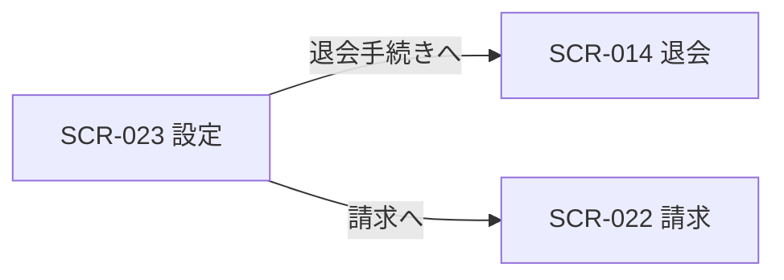
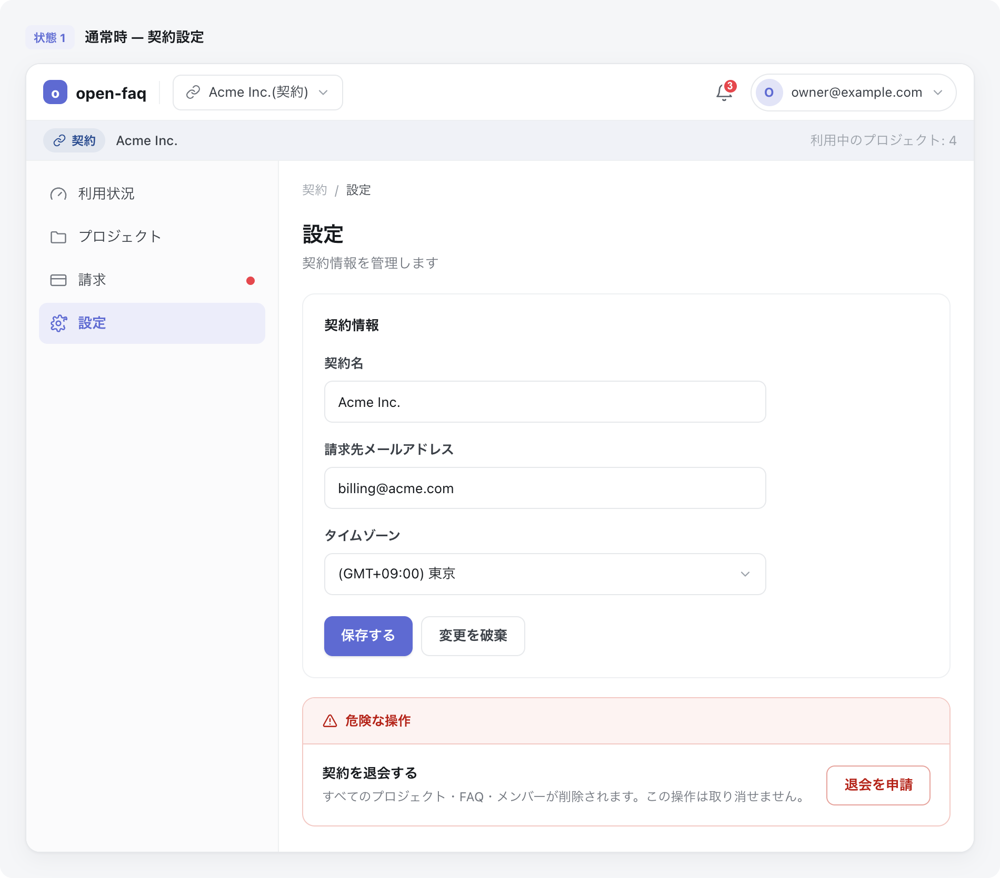

<!-- portal-top -->
[設計ポータル](../README.md) ／ [基本設計](index.md) ／ [画面設計](01_screen-design.md) ／ **SCR-023 設定**
<!-- /portal-top -->

# SCR-023 設定

> **このページは、オーナーが契約レベルの連絡先と退会を管理する画面 SCR-023 を定義します(オーナー専有)。** 画面概要 / 画面遷移図 / 画面レイアウト / 画面項目定義 / 入出力一覧 / 画面イベント一覧 の 6 セクションで記述します。

*版数 v1.0 ・ 更新 2026-06-17 ・ 承認済*

## 1. 画面概要

オーナーが契約の連絡先(請求・重要通知メール)を管理し、退会手続きへ進む画面です(オーナー専有)。退会は通常設定と視覚的に分離した DangerSection に配置します。

| 画面 ID | 画面名 | 機能概要 |
|----|----|----|
| `SCR-023` | 設定 | 契約の連絡先メールを管理し、退会手続きへ進む |

| 関連 | 内容 |
|----|----|
| FR / BR | FR-009 / BR(アカウントライフサイクル) |
| 関連画面 | [`SCR-022` 請求](SCR-022.md) / [`SCR-014` 退会](SCR-014.md) / [`SCR-017` 個人設定](SCR-017.md) |

| ステークホルダ | 対象 |
|----------------|------|
| オーナー       | ◯    |
| メンバー       | —    |

> [!NOTE]
> **補足** 本画面はオーナー専有です。メンバーは利用できず、URL 直アクセスは権限不足表示となります。退会操作は画面最下部の DangerSection(セクション見出し「退会」)に配置し、通常設定と視覚的に分離します。退会の入力・再認証・確定は SCR-014 退会に集約します。契約全データのエクスポートは MVP 対象外(05_future)。プロジェクトの編集・削除は SCR-004-001 に集約します(旧 SCR-024 プロジェクト設定は廃止)。

## 2. 画面遷移図

本画面からの画面遷移を、画面 ID・画面名とイベント(操作)で示します。

## 3. 画面レイアウト

## 4. 画面項目定義

本画面の入出力項目(連絡先メール・退会導線)を定義します。項目の正本は本表です。

| 項目 ID | 項目 | 説明 | 種類 | 表示条件 | 表示 |
|----|----|----|----|----|----|
| `IT-01` | 請求・重要通知メール | 契約の連絡先メールアドレスを入力・表示する | テキストボックス | — | 連絡先メールアドレス |
| `IT-02` | 変更を保存 | 連絡先メールの変更を保存する | ボタン | — | 変更を保存 |
| `IT-03` | 退会 | 退会の影響を説明し通常設定と分離したセクションを画面最下部に表示する | カード | — | 退会の影響の説明文 |
| `IT-04` | 退会手続きへ | 退会画面(SCR-014)へ遷移する | ボタン | — | 退会手続きへ |

## 5. 入出力一覧

本画面が読み書きするテーブルと、呼び出す API の一覧です。テーブルの正本は [03_テーブル設計](03_database-design.md)、退会 API の正本は [02_API設計 §5.9.3](02_api-design.md) です。退会の入力・確定処理は SCR-014 を正本とします。

<table>
<thead>
<tr>
<th rowspan="2">入出力名</th>
<th rowspan="2">説明</th>
<th rowspan="2">種別</th>
<th rowspan="2">I/O</th>
<th colspan="4">アクセス種別(CRUD)</th>
<th rowspan="2">備考</th>
</tr>
<tr>
<th>C</th>
<th>R</th>
<th>U</th>
<th>D</th>
</tr>
</thead>
<tbody>
<tr>
<td>オーナー</td>
<td>契約連絡先メールを取得・更新する</td>
<td>テーブル</td>
<td>入出力</td>
<td>—</td>
<td>◯</td>
<td>◯</td>
<td>—</td>
<td><code>M_CONTRACT</code>(<a href="03_database-design.md#TBL-M-001">テーブル設計 3.2</a>)</td>
</tr>
<tr>
<td>退会申請</td>
<td>退会申請を送信する(再認証必須・SCR-014 が正本)</td>
<td>API</td>
<td>出力</td>
<td>—</td>
<td>—</td>
<td>—</td>
<td>—</td>
<td><code>POST /withdrawal-requests</code>(<a href="02_api-design.md">API 設計 5.9.3</a>)</td>
</tr>
</tbody>
</table>

## 6. 画面イベント一覧

本画面のイベント(初期表示・各操作)ごとに、対象の項目 ID と処理内容を定義します。

| イベント ID | 項目 ID | イベント | 処理 |
|----|----|----|----|
| `EV-01` | — | 初期表示 | 契約の連絡先メールを取得し入力欄へ表示 |
| `EV-02` | [IT-02](#IT-02) | 「変更を保存」を押下 | 契約連絡先メールの変更を保存する |
| `EV-03` | [IT-04](#IT-04) | 「退会手続きへ」を押下 | 退会画面(SCR-014)へ遷移する |

---

<!-- portal-bottom -->
[← 画面設計](01_screen-design.md) ・ [基本設計](index.md) ・ [↑ 設計ポータル](../README.md)
<!-- /portal-bottom -->
