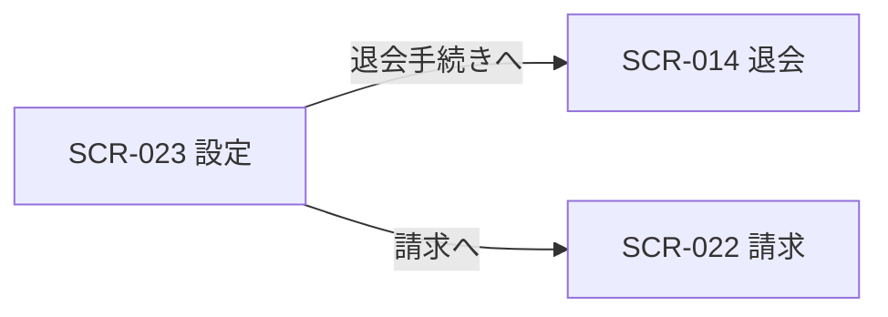

<!-- portal-top -->
[設計ポータル](../README.md) ／ [基本設計](index.md) ／ [画面設計](01_screen-design.md) ／ **SCR-023 設定**
<!-- /portal-top -->

# SCR-023 設定

> **このページは、オーナーが契約レベルの連絡先と退会を管理する画面 SCR-023 を定義します(オーナー専有)。** 画面概要 / 画面遷移図 / 画面レイアウト / 画面項目定義 / 入出力一覧 / 画面イベント一覧 の 6 セクションで記述します。

*版数 v1.0 ・ 更新 2026-06-17 ・ 承認済*

## 1. 画面概要

オーナーが契約の連絡先(請求・重要通知メール)を管理し、退会手続きへ進む画面です(オーナー専有)。退会は通常設定と視覚的に分離した DangerSection に配置します。

| 画面 ID | 画面名 | 機能概要 |
|----|----|----|
| `SCR-023` | 設定 | 契約の連絡先メールを管理し、退会手続きへ進む |

| 関連 | 内容 |
|----|----|
| FR / BR | FR-009 / BR(アカウントライフサイクル) |
| 関連画面 | [`SCR-022` 請求](SCR-022.md) / [`SCR-014` 退会](SCR-014.md) / [`SCR-017` 個人設定](SCR-017.md) |

| ステークホルダ              | 対象 |
|-----------------------------|------|
| オーナー                    | ◯    |
| プロジェクト管理者(`admin`) | —    |
| メンバー(`member`)          | —    |

> [!NOTE]
> **補足** 本画面はオーナー専有です。プロジェクト管理者・メンバーは利用できず、URL 直アクセスは権限不足表示となります。退会操作は画面最下部の DangerSection(セクション見出し「退会」)に配置し、通常設定と視覚的に分離します。退会の入力・再認証・確定は SCR-014 退会に集約します。契約全データのエクスポートは MVP 対象外(05_future)。プロジェクトの編集・削除は SCR-004-001 に集約します(旧 SCR-024 プロジェクト設定は廃止)。

## 2. 画面遷移図

本画面からの画面遷移を、画面 ID・画面名とイベント(操作)で示します。

## 3. 画面レイアウト

  

  <section>
    

      状態 1
      通常時 — 契約設定
    

    

      

        

          oopen-faq
          
          <button style="display:inline-flex;align-items:center;gap:7px;padding:6px 11px;border:1px solid #e6e8eb;border-radius:8px;background:#fff;font-size:13px;color:#3a3f46;cursor:pointer;font-family:inherit"><svg width="15" height="15" viewBox="0 0 24 24" fill="none" stroke="#71767e" stroke-width="1.8" stroke-linecap="round" stroke-linejoin="round"><path d="M10 13a5 5 0 0 0 7.5.5l3-3a5 5 0 0 0-7-7l-1.5 1.5"></path><path d="M14 11a5 5 0 0 0-7.5-.5l-3 3a5 5 0 0 0 7 7l1.5-1.5"></path></svg>Acme Inc.(契約)<svg width="14" height="14" viewBox="0 0 24 24" fill="none" stroke="#9aa0a8" stroke-width="1.9" stroke-linecap="round" stroke-linejoin="round"><path d="m6 9 6 6 6-6"></path></svg></button>
        

        

          <button style="position:relative;width:34px;height:34px;border-radius:8px;border:none;background:transparent;display:inline-flex;align-items:center;justify-content:center;color:#5b616a;cursor:pointer"><svg width="18" height="18" viewBox="0 0 24 24" fill="none" stroke="currentColor" stroke-width="1.8" stroke-linecap="round" stroke-linejoin="round"><path d="M6 8a6 6 0 0 1 12 0c0 7 3 9 3 9H3s3-2 3-9z"></path><path d="M10.3 21a1.94 1.94 0 0 0 3.4 0"></path></svg>3</button>
          <button style="display:inline-flex;align-items:center;gap:8px;padding:4px 10px 4px 4px;border:1px solid #e6e8eb;border-radius:999px;background:#fff;cursor:pointer;font-family:inherit">Oowner@example.com<svg width="14" height="14" viewBox="0 0 24 24" fill="none" stroke="#9aa0a8" stroke-width="1.9" stroke-linecap="round" stroke-linejoin="round"><path d="m6 9 6 6 6-6"></path></svg></button>
        

      

      
      

        <svg width="13" height="13" viewBox="0 0 24 24" fill="none" stroke="currentColor" stroke-width="1.9" stroke-linecap="round" stroke-linejoin="round"><path d="M10 13a5 5 0 0 0 7.5.5l3-3a5 5 0 0 0-7-7l-1.5 1.5"></path><path d="M14 11a5 5 0 0 0-7.5-.5l-3 3a5 5 0 0 0 7 7l1.5-1.5"></path></svg>契約
        Acme Inc.
        利用中のプロジェクト: 4
      

      
      

        <aside style="width:240px;flex:none;background:#fbfbfc;border-right:1px solid #eef0f2;padding:12px 12px 16px;display:flex;flex-direction:column;gap:2px">
          <a style="display:flex;align-items:center;gap:10px;padding:9px 10px;border-radius:8px;color:#3a3f46;font-size:13.5px;text-decoration:none"><svg width="17" height="17" viewBox="0 0 24 24" fill="none" stroke="#71767e" stroke-width="1.7" stroke-linecap="round" stroke-linejoin="round"><path d="m12 14 4-4"></path><path d="M3.34 19a10 10 0 1 1 17.32 0"></path></svg>利用状況</a>
          <a style="display:flex;align-items:center;gap:10px;padding:9px 10px;border-radius:8px;color:#3a3f46;font-size:13.5px;text-decoration:none"><svg width="17" height="17" viewBox="0 0 24 24" fill="none" stroke="#71767e" stroke-width="1.7" stroke-linecap="round" stroke-linejoin="round"><path d="M4 5h5l2 2.5h9A1.5 1.5 0 0 1 21.5 9v9A1.5 1.5 0 0 1 20 19.5H4A1.5 1.5 0 0 1 2.5 18V6.5A1.5 1.5 0 0 1 4 5z"></path></svg>プロジェクト</a>
          <a style="display:flex;align-items:center;gap:10px;padding:9px 10px;border-radius:8px;color:#3a3f46;font-size:13.5px;text-decoration:none"><svg width="17" height="17" viewBox="0 0 24 24" fill="none" stroke="#71767e" stroke-width="1.7" stroke-linecap="round" stroke-linejoin="round"><rect x="2" y="5" width="20" height="14" rx="2"></rect><path d="M2 10h20"></path></svg>請求</a>
          <a style="display:flex;align-items:center;gap:10px;padding:9px 10px;border-radius:8px;background:color-mix(in srgb,var(--accent,#5e6ad2) 12%,#fff);color:var(--accent,#5e6ad2);font-weight:600;font-size:13.5px;text-decoration:none"><svg width="17" height="17" viewBox="0 0 24 24" fill="none" stroke="currentColor" stroke-width="1.8" stroke-linecap="round" stroke-linejoin="round"><circle cx="12" cy="12" r="3"></circle><path d="M19.4 15a1.65 1.65 0 0 0 .33 1.82l.06.06a2 2 0 1 1-2.83 2.83l-.06-.06a1.65 1.65 0 0 0-2.82 1.17V21a2 2 0 0 1-4 0v-.09A1.65 1.65 0 0 0 8 19.4a1.65 1.65 0 0 0-1.82.33l-.06.06a2 2 0 1 1-2.83-2.83l.06-.06A1.65 1.65 0 0 0 4.6 14H4.5a2 2 0 0 1 0-4h.09A1.65 1.65 0 0 0 6 8.6a1.65 1.65 0 0 0-.33-1.82l-.06-.06a2 2 0 1 1 2.83-2.83l.06.06A1.65 1.65 0 0 0 11 4.6h.09A1.65 1.65 0 0 0 12 3.09V3a2 2 0 0 1 4 0v.09A1.65 1.65 0 0 0 18 4.6a1.65 1.65 0 0 0 1.82-.33l.06-.06a2 2 0 1 1 2.83 2.83l-.06.06A1.65 1.65 0 0 0 19.4 9v.09"></path></svg>設定</a>
        </aside>
        <main style="flex:1;min-width:0;background:#fff;padding:18px 22px 24px;display:flex;flex-direction:column;gap:18px;max-width:760px">
          <nav style="display:flex;align-items:center;gap:7px;font-size:12px;color:#9aa0a8">契約/設定</nav>
          

            <h1 style="margin:0 0 4px;font-size:20px;font-weight:700;color:#16191d;letter-spacing:-.01em">設定</h1>
            
契約情報を管理します

          

          

            
契約情報

            

              <label style="display:block;font-size:12.5px;font-weight:600;color:#3a3f46;margin-bottom:7px">契約名</label>
              
Acme Inc.

            

            

              <label style="display:block;font-size:12.5px;font-weight:600;color:#3a3f46;margin-bottom:7px">請求先メールアドレス</label>
              
billing@acme.com

            

            

              <label style="display:block;font-size:12.5px;font-weight:600;color:#3a3f46;margin-bottom:7px">タイムゾーン</label>
              
(GMT+09:00) 東京<svg width="14" height="14" viewBox="0 0 24 24" fill="none" stroke="#9aa0a8" stroke-width="1.9" stroke-linecap="round" stroke-linejoin="round"><path d="m6 9 6 6 6-6"></path></svg>

            

            

              <button style="padding:8px 16px;border:none;border-radius:8px;background:var(--accent,#5e6ad2);color:#fff;font-size:13px;font-weight:600;cursor:pointer;box-shadow:0 1px 2px rgba(16,24,40,.12);font-family:inherit">保存する</button>
              <button style="padding:8px 16px;border:1px solid #e6e8eb;border-radius:8px;background:#fff;font-size:13px;font-weight:600;color:#3a3f46;cursor:pointer;font-family:inherit">変更を破棄</button>
            

          

          

            
<svg width="15" height="15" viewBox="0 0 24 24" fill="none" stroke="currentColor" stroke-width="1.9" stroke-linecap="round" stroke-linejoin="round"><path d="M10.3 4 2.5 18a1.7 1.7 0 0 0 1.5 2.6h16a1.7 1.7 0 0 0 1.5-2.6L13.7 4a1.7 1.7 0 0 0-3 0z"></path><path d="M12 9v4"></path><path d="M12 17h.01"></path></svg>危険な操作

            

              

                
契約を退会する

                
すべてのプロジェクト・FAQ・メンバーが削除されます。この操作は取り消せません。

              

              <button style="padding:8px 16px;border:1px solid #e6a39c;border-radius:8px;background:#fff;color:#b42318;font-size:13px;font-weight:600;cursor:pointer;white-space:nowrap;font-family:inherit">退会を申請</button>
            

          

        </main><aside class="rightbar">
このページ
<nav class="toc"><a class="back" href="01_screen-design.md" style="font-weight:600;color:var(--accent)">← 画面一覧へ戻る</a><a href="#1-画面概要">1. 画面概要</a><a href="#2-画面遷移図">2. 画面遷移図</a><a href="#3-画面レイアウト">3. 画面レイアウト</a><a href="#4-画面項目定義">4. 画面項目定義</a><a href="#5-入出力一覧">5. 入出力一覧</a><a href="#6-画面イベント一覧">6. 画面イベント一覧</a></nav></aside>
      

    

  </section>

## 4. 画面項目定義

本画面の入出力項目(連絡先メール・退会導線)を定義します。項目の正本は本表です。

| 項目 ID | 項目 | 説明 | 種類 | 表示条件 | 表示 |
|----|----|----|----|----|----|
| `IT-01` | 請求・重要通知メール | 契約の連絡先メールアドレスを入力・表示する | テキストボックス | — | 連絡先メールアドレス |
| `IT-02` | 変更を保存 | 連絡先メールの変更を保存する | ボタン | — | 変更を保存 |
| `IT-03` | 退会 | 退会の影響を説明し通常設定と分離したセクションを画面最下部に表示する | カード | — | 退会の影響の説明文 |
| `IT-04` | 退会手続きへ | 退会画面(SCR-014)へ遷移する | ボタン | — | 退会手続きへ |

## 5. 入出力一覧

本画面が読み書きするテーブルと、呼び出す API の一覧です。テーブルの正本は [03_テーブル設計](03_database-design.md)、退会 API の正本は [02_API設計 §5.9.3](02_api-design.md) です。退会の入力・確定処理は SCR-014 を正本とします。

<table>
<thead>
<tr>
<th rowspan="2">入出力名</th>
<th rowspan="2">説明</th>
<th rowspan="2">種別</th>
<th rowspan="2">I/O</th>
<th colspan="4">アクセス種別(CRUD)</th>
<th rowspan="2">備考</th>
</tr>
<tr>
<th>C</th>
<th>R</th>
<th>U</th>
<th>D</th>
</tr>
</thead>
<tbody>
<tr>
<td>オーナー</td>
<td>契約連絡先メールを取得・更新する</td>
<td>テーブル</td>
<td>入出力</td>
<td>—</td>
<td>◯</td>
<td>◯</td>
<td>—</td>
<td><code>M_CONTRACT</code>(<a href="03_database-design.md#TBL-M-001">テーブル設計 3.2</a>)</td>
</tr>
<tr>
<td>退会申請</td>
<td>退会申請を送信する(再認証必須・SCR-014 が正本)</td>
<td>API</td>
<td>出力</td>
<td>—</td>
<td>—</td>
<td>—</td>
<td>—</td>
<td><code>POST /withdrawal-requests</code>(<a href="02_api-design.md">API 設計 5.9.3</a>)</td>
</tr>
</tbody>
</table>

## 6. 画面イベント一覧

本画面で発生するイベントと発生タイミング・概要の一覧です。

| イベント ID | イベント | トリガー | 処理 | 関連項目 |
|----|----|----|----|----|
| `EV-01` | 設定初期表示 | 画面遷移・リロード時 | 契約の連絡先メールを取得し入力欄へ表示 | [IT-01](#IT-01) |
| `EV-02` | 連絡先メール保存 | 「変更を保存」押下時 | 契約連絡先メールの変更を保存する | [IT-01](#IT-01), [IT-02](#IT-02) |
| `EV-03` | 退会手続きへ遷移 | DangerSection の「退会手続きへ」押下時 | 退会画面(SCR-014)へ遷移する | [IT-03](#IT-03), [IT-04](#IT-04) |

---

---

<!-- portal-bottom -->
[← 画面設計](01_screen-design.md) ・ [基本設計](index.md) ・ [↑ 設計ポータル](../README.md)
<!-- /portal-bottom -->
