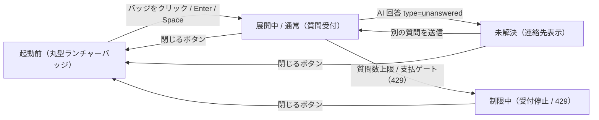
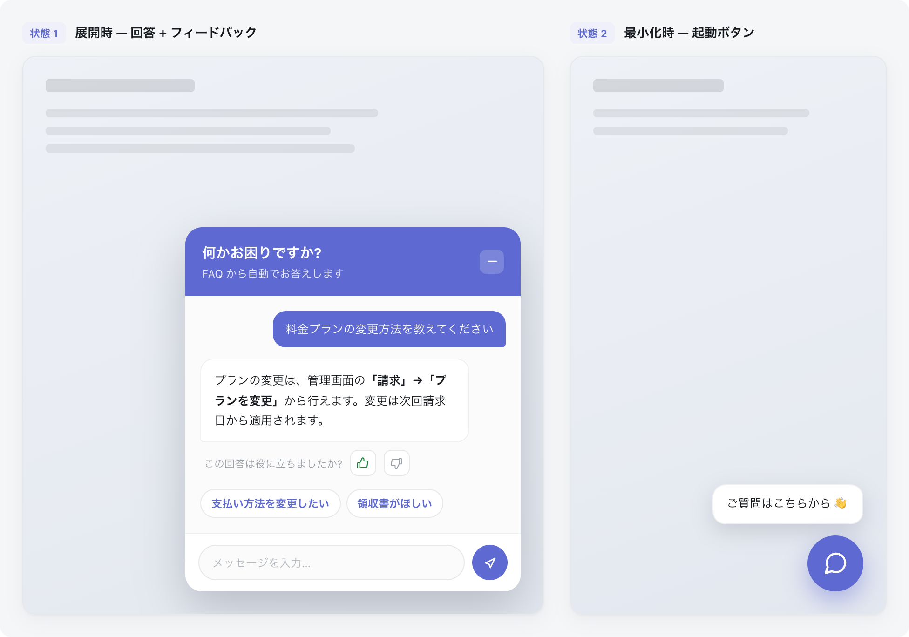

<!-- portal-top -->
[設計ポータル](../README.md) ／ [基本設計](index.md) ／ [画面設計](01_screen-design.md) ／ **WIDGET エンドユーザー向け FAQ ウィジェット**
<!-- /portal-top -->

# WIDGET エンドユーザー向け FAQ ウィジェット

> **このページは、ウィジェット利用者(エンドユーザー)が顧客サイト上で FAQ 検索・AI 回答・問い合わせを行う埋め込み UI を定義します(固有の SCR ID を持たない状態定義)。** 画面概要 / 画面遷移図 / 画面レイアウト / 画面項目定義 / 入出力一覧 / 画面イベント一覧 の 6 セクションで記述します。

*版数 v1.0 ・ 更新 2026-06-17 ・ 承認済*

## 1. 画面概要

ウィジェット利用者(エンドユーザー)が顧客サイトに埋め込まれたウィジェットから FAQ 検索・AI 回答の確認・未解決時の連絡先確認を、同じ会話欄で行う UI です。初期表示は右下固定の丸型ランチャーバッジで、操作でチャット UI を展開します。

| 画面 ID | 画面名 | 機能概要 |
|----|----|----|
| `WIDGET` | エンドユーザー向け FAQ ウィジェット | エンドユーザーが FAQ 検索・AI 回答・問い合わせを行うウィジェット |

| 関連 | 内容 |
|----|----|
| FR / BR | FR-034〜FR-041, FR-045〜FR-052, FR-066, FR-073, FR-092〜FR-098 / BR(ウィジェット) |
| 関連画面 | [`SCR-007` ウィジェット設定](SCR-007.md)(管理コンソール側でタイトル・連絡先メール等を設定) |

| ステークホルダ                     | 対象 |
|------------------------------------|------|
| ウィジェット利用者(エンドユーザー) | ◯    |

> [!NOTE]
> **補足** 本 UI は管理コンソールではなく顧客サイトへ埋め込まれるウィジェットです。固有の SCR ID は持たず、開閉状態と会話内容の状態を分けて管理する状態定義として扱います。管理用の問い合わせ ID はウィジェットに表示しません。配信・公開 API の詳細は DD12 を正本とします。

## 2. 画面遷移図

本ウィジェットの状態遷移を、状態名と契機(操作・結果)で示します。固有 SCR ID を持たないため、開閉状態と会話状態を遷移ノードとして表します。

## 3. 画面レイアウト

## 4. 画面項目定義

本ウィジェットの入出力項目(ランチャーバッジ・ヘッダー・会話履歴・入力・送信・連絡先表示)を定義します。項目の正本は本表です。管理用の問い合わせ ID は描画しません。

| 項目 ID | 項目 | 説明 | 種類 | 表示条件 | 表示 |
|----|----|----|----|----|----|
| `IT-01` | 丸型ランチャーバッジ | 右下固定・直径 56px のバッジでチャット UI を開く。`aria-label="FAQチャットを開く"` | ボタン | — | チャットアイコン |
| `IT-02` | ヘッダー | ウィジェットタイトル・現在状態・閉じるボタンを表示する。利用規約等の導線は表示しない | 見出し | — | タイトル、状態(オンライン / 質問受付中 / 新しい質問の受付を停止中 等) |
| `IT-03` | 閉じるボタン | チャット UI を閉じてバッジ表示へ戻る。`aria-label="FAQチャットを閉じる"` | アイコンボタン | — | 閉じるアイコン |
| `IT-04` | 会話履歴 | 質問・AI 回答・システム返信を時系列で表示する | タイムライン | — | 質問 / AI 回答 / システム返信の時系列 |
| `IT-05` | 質問入力 | FAQ 質問のテキストを入力する。通常状態・未解決表示後は入力可 | テキストエリア | 受付制限中(質問数上限到達または支払方法ゲート)の場合は無効化 | — |
| `IT-06` | 送信 | 入力した質問を送信する。通常状態・未解決表示後は活性 | ボタン | 受付制限中(質問数上限到達または支払方法ゲート)の場合は無効化 | 送信 |
| `IT-07` | AI 回答 | 登録 FAQ に基づく回答を同じ会話欄に追加表示する | ラベル | — | AI 回答文 |
| `IT-08` | 連絡先メール表示 | 未解決・制限中に確認済みプロジェクト連絡先メールを案内表示する | ラベル | 未解決・制限中、かつ連絡先設定済みの場合のみ表示 | 「必要に応じて、下記のお問い合わせ先までメールでご連絡ください。」+ 連絡先メールアドレス |
| `IT-09` | 受付停止メッセージ | 受付停止と問い合わせ先を表示する(連絡先未設定時は再試行案内に差し替え) | アラート | 受付制限中の場合に表示 | 「ただいま新しいご質問をお受けできません。お手数ですが、下記のお問い合わせ先までメールでご連絡ください。」+ 連絡先メールアドレス |

## 5. 入出力一覧

本ウィジェットが呼び出す公開 API の一覧です。公開 API のベースは `/widget/v1/...`、正本は [02_API設計 §5.5(ウィジェット API 群)](02_api-design.md)です(各 API の節は下表の行リンク先を正とします)。ウィジェットはサーバ経由でテーブルへアクセスし、直接の永続更新は行いません。

<table>
<thead>
<tr>
<th rowspan="2">入出力名</th>
<th rowspan="2">説明</th>
<th rowspan="2">種別</th>
<th rowspan="2">I/O</th>
<th colspan="4">アクセス種別(CRUD)</th>
<th rowspan="2">備考</th>
</tr>
<tr>
<th>C</th>
<th>R</th>
<th>U</th>
<th>D</th>
</tr>
</thead>
<tbody>
<tr>
<td>ウィジェット起動</td>
<td>セッションを確立しウィジェット設定を取得する</td>
<td>API</td>
<td>入力</td>
<td>—</td>
<td>—</td>
<td>—</td>
<td>—</td>
<td><code>POST /widget/v1/bootstrap</code>(<a href="02_api-design.md#API-WGT-001">API 設計 5.5.1</a>)</td>
</tr>
<tr>
<td>質問送信</td>
<td>質問を送信し AI 回答を取得する(<code>type=unanswered</code> で未解決遷移)</td>
<td>API</td>
<td>入出力</td>
<td>—</td>
<td>—</td>
<td>—</td>
<td>—</td>
<td><code>POST /widget/v1/ask</code>(<a href="02_api-design.md">API 設計 5.5.2</a>)</td>
</tr>
<tr>
<td>未解決質問登録</td>
<td>未解決時に質問ログ・未解決質問を登録する(問い合わせ ID は非表示)</td>
<td>API</td>
<td>出力</td>
<td>—</td>
<td>—</td>
<td>—</td>
<td>—</td>
<td><code>POST /widget/v1/inquiries</code>(<a href="02_api-design.md">API 設計 5.5.3</a>)</td>
</tr>
</tbody>
</table>

## 6. 画面イベント一覧

本画面のイベント(初期表示・各操作)ごとに、対象の項目 ID と処理内容を定義します。

<table>
<colgroup>
<col style="width: 12%" />
<col style="width: 12%" />
<col style="width: 30%" />
<col style="width: 46%" />
</colgroup>
<thead>
<tr>
<th>イベント ID</th>
<th>項目 ID</th>
<th>イベント</th>
<th>処理</th>
</tr>
</thead>
<tbody>
<tr>
<td><code>EV-01</code></td>
<td><a href="#IT-01">IT-01</a></td>
<td>ランチャーバッジを押下</td>
<td><ul>
<li>バッジを非表示にしチャット UI を展開</li>
<li><a href="API-widget.md#API-WGT-001">ウィジェット起動</a> API でセッション・設定を取得</li>
</ul></td>
</tr>
<tr>
<td><code>EV-02</code></td>
<td><a href="#IT-03">IT-03</a></td>
<td>ヘッダーの閉じるボタンを押下</td>
<td>チャット UI を閉じバッジへ戻る(会話履歴・入力内容・受付状態は保持)</td>
</tr>
<tr>
<td><code>EV-03</code></td>
<td><a href="#IT-06">IT-06</a></td>
<td>送信ボタンを押下</td>
<td><a href="API-widget.md#API-WGT-002">ウィジェット質問送信</a> API で質問送信し、AI 回答を同じ会話欄に追加</td>
</tr>
<tr>
<td><code>EV-04</code></td>
<td><a href="#IT-07">IT-07</a></td>
<td>未解決回答を受信</td>
<td>回答不可の旨と確認済み連絡先メールをシステム返信で表示(問い合わせ ID は非表示で別質問は継続可能)</td>
</tr>
<tr>
<td><code>EV-05</code></td>
<td><a href="#IT-09">IT-09</a></td>
<td>受付停止(上限到達・支払方法ゲート)</td>
<td><ul>
<li>受付停止と問い合わせ先をシステム返信で表示し、入力欄と送信ボタンを無効化</li>
<li>いずれの契機も契約は active のまま、ウィジェット新規質問受付のみを停止(429 系。質問数上限は E-QUOTA-QUESTIONS-LIMIT)</li>
<li>決済失敗等によるサスペンション(契約 suspended / 423)とは別状態</li>
</ul></td>
</tr>
</tbody>
</table>

---

<!-- portal-bottom -->
[← 画面設計](01_screen-design.md) ・ [基本設計](index.md) ・ [↑ 設計ポータル](../README.md)
<!-- /portal-bottom -->
