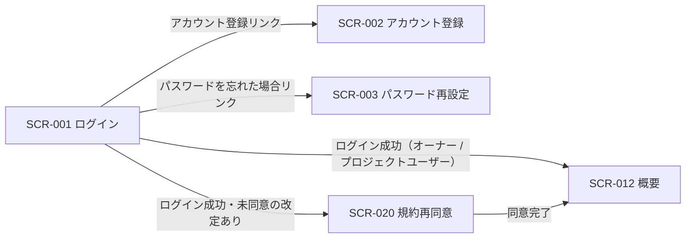
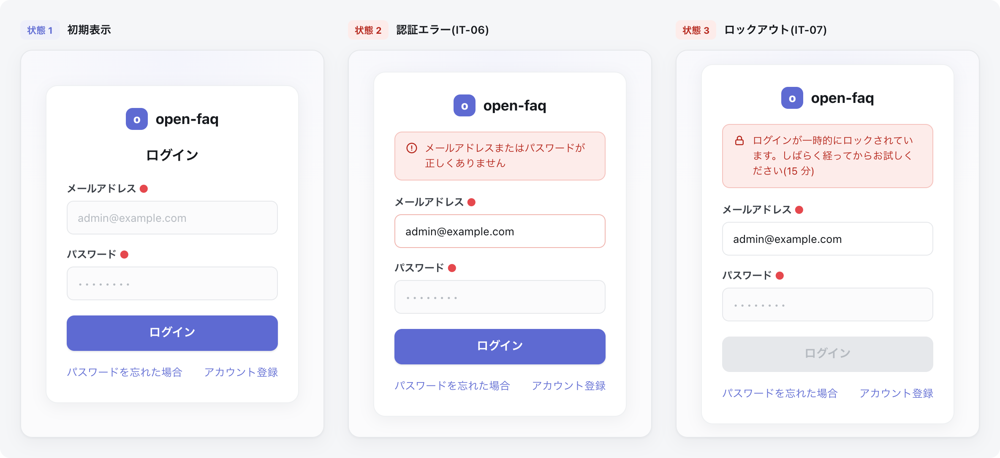

| 画面 ID | 画面名 | トレーサビリティID |
|----|----|----|
| SCR-001 | ログイン | [TR-001](../../00_traceability/index.md#TR-001) ・ [TR-002](../../00_traceability/index.md#TR-002) ・ [TR-004](../../00_traceability/index.md#TR-004) |

| ステークホルダ             | 対象 |
|----------------------------|------|
| 未認証ユーザー(ログイン前) | ◯    |

## 1. 画面概要

アカウント利用者がメールアドレスとパスワードを入力してセッションを確立する画面です。失敗回数制限・ロックアウトの警告表示と、アカウント登録・パスワード再設定への導線を持ちます。

> [!NOTE]
> **補足** 本画面は認証前に表示されるため権限は不要です(認証前)。認証エラーはメールアドレスの存在有無を区別しない共通文言で表示し、攻撃者にヒントを与えません。

## 2. 画面遷移図

本画面からの画面遷移を、画面 ID・画面名とイベント(操作)で示します。

## 3. 画面レイアウト

## 4. 画面項目

本画面の入出力項目(入力フォーム・操作ボタン・エラー表示)を定義します。

| # | 項目 | 種類 | 必須 | 最大長 | 初期値 | 表示条件 |
|----|----|----|----|----|----|----|
| 1 | メールアドレス | input(email) | ◯ | 254 | — | — |
| 2 | パスワード | input(password) | ◯ | 128 | — | — |
| 3 | ログインボタン | button | — | — | — | — |
| 4 | パスワードを忘れた場合 | link | — | — | — | — |
| 5 | アカウント登録 | link | — | — | — | — |
| 6 | メッセージ表示エリア | alert | — | — | — | 認証失敗時(エラー)・連続失敗 5 回以上(ロックアウト警告) |

## 5. バリデーション

本画面の入力項目に対する検証ルールを定義します。違反がある場合は送信を中止します。

| 画面項目 | タイミング | ルール | エラーコード |
|----|----|----|----|
| #1 | 入力時・送信時 | 未入力チェック | EM-01 |
| #1 | 入力時・送信時 | メールアドレス形式チェック | EM-02 |
| #2 | 入力時・送信時 | 未入力チェック | EM-03 |

## 6. イベント

本画面のイベント(初期表示・各操作)ごとに、対象の画面項目を定義します。各イベントの処理内容は [7. 画面イベント詳細](#7-画面イベント詳細) で定義します。

<table>
<colgroup>
<col style="width: 18%" />
<col style="width: 22%" />
<col style="width: 60%" />
</colgroup>
<thead>
<tr>
<th>EVT-ID</th>
<th>画面項目</th>
<th>イベント</th>
</tr>
</thead>
<tbody>
<tr>
<td>EVT-001</td>
<td>—</td>
<td>初期表示</td>
</tr>
<tr>
<td>EVT-002</td>
<td>#3</td>
<td>「ログイン」を押下</td>
</tr>
<tr>
<td>EVT-003</td>
<td>#4</td>
<td>「パスワードを忘れた場合」を押下</td>
</tr>
<tr>
<td>EVT-004</td>
<td>#5</td>
<td>「アカウント登録」を押下</td>
</tr>
</tbody>
</table>

## 7. 画面イベント詳細

各イベントの処理内容を定義します。

<table>
<colgroup>
<col style="width: 14%" />
<col style="width: 86%" />
</colgroup>
<thead>
<tr>
<th>EVT-ID</th>
<th>処理</th>
</tr>
</thead>
<tbody>
<tr>
<td>EVT-001</td>
<td>画面表示時にセッション状態で分岐する<pre>
 ┣ 既認証セッションが有効: 概要(SCR-012)へリダイレクトする
 ┗ 未認証: ログインフォームを表示する
</pre></td>
</tr>
<tr>
<td>EVT-002</td>
<td>「ログイン」押下時に次を行う:<pre>
1. <a href="../../02_backend/03_apis/API-002.md#API-002">ログイン</a> API(POST /auth/login)を呼び出す
2. API 結果で分岐する
   ┣ 成功
   ┃  ┣ 未同意の改定あり: SCR-020 規約再同意へ割込み遷移する
   ┃  ┗ オーナー / プロジェクトユーザーとも: SCR-012 概要へ遷移する
   ┗ 失敗
      ┣ 連続失敗 5 回未満: メッセージ表示エリア(#6)にエラー(EM-04)を表示する(メールアドレスの存在有無を区別しない文言)
      ┗ 連続失敗 5 回以上: メッセージ表示エリア(#6)にロックアウト警告(EM-05)を表示し、15 分間の試行を抑止する
</pre></td>
</tr>
<tr>
<td>EVT-003</td>
<td>「パスワードを忘れた場合」押下時に SCR-003 パスワード再設定へ遷移する</td>
</tr>
<tr>
<td>EVT-004</td>
<td>「アカウント登録」押下時に SCR-002 アカウント登録へ遷移する</td>
</tr>
</tbody>
</table>

## 8. エラーメッセージ

本画面が表示するエラー・警告メッセージを定義します。

| エラーコード | エラーメッセージ |
|----|----|
| EM-01 | メールアドレスを入力してください |
| EM-02 | メールアドレスの形式が正しくありません |
| EM-03 | パスワードを入力してください |
| EM-04 | 認証エラー: メールアドレスまたはパスワードが正しくありません |
| EM-05 | ログインが一時的にロックされています。しばらく経ってからお試しください(15 分) |
