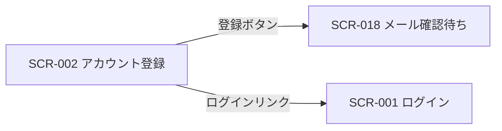

| 画面 ID | 画面名 | トレーサビリティID |
|----|----|----|
| SCR-002 | アカウント登録 | [TR-001](../../00_traceability/index.md#TR-001) ・ [TR-002](../../00_traceability/index.md#TR-002) |

| ステークホルダ             | 対象 |
|----------------------------|------|
| 未認証ユーザー(ログイン前) | ◯    |

## 1. 画面概要

新規オーナーが組織名・メールアドレス・パスワードを入力し、利用規約とプライバシーポリシーに同意してアカウントを登録し、確認メール送信フロー(SCR-018)へ進む画面です。

> [!NOTE]
> **補足** 本画面は認証前に表示されるため権限は不要です(認証前)。登録するユーザーは契約のオーナー(契約あたり 1 ユーザー)となります。

## 2. 画面遷移図

本画面からの画面遷移を、画面 ID・画面名とイベント(操作)で示します。

## 3. 画面レイアウト

## 4. 画面項目

本画面の入出力項目(入力フォーム・同意チェック・操作ボタン)を定義します。項目は画面レイアウト([3. 画面レイアウト](#3-画面レイアウト))と一致します。

| # | 項目 | 種類 | 必須 | 最大長 | 初期値 | 表示条件 |
|----|----|----|----|----|----|----|
| 1 | 組織名 | input(text) | ◯ | 100 | — | — |
| 2 | メールアドレス | input(email) | ◯ | 254 | — | — |
| 3 | パスワード | input(password) | ◯ | 128 | — | — |
| 4 | 利用規約・プライバシーポリシー同意 | checkbox | ◯ | — | 未チェック | — |
| 5 | 利用規約リンク | link | — | — | — | — |
| 6 | プライバシーポリシーリンク | link | — | — | — | — |
| 7 | 登録ボタン | button | — | — | — | — |
| 8 | ログインリンク | link | — | — | — | — |

## 5. バリデーション

本画面の入力項目に対する検証ルールを定義します。違反がある場合は送信を中止します。

| 画面項目 | タイミング | ルール | エラーコード |
|----|----|----|----|
| #1 | 入力時・送信時 | 未入力チェック | EM-01 |
| #2 | 入力時・送信時 | 未入力チェック | EM-02 |
| #2 | 入力時・送信時 | メールアドレス形式チェック | EM-03 |
| #3 | 入力時・送信時 | 未入力チェック | EM-04 |
| #3 | 入力時・送信時 | パスワード強度チェック | EM-05 |
| #4 | 送信時 | 同意チェック | EM-06 |

## 6. イベント

本画面のイベント(初期表示・各操作)ごとに、対象の画面項目を定義します。各イベントの処理内容は [7. 画面イベント詳細](#7-画面イベント詳細) で定義します。

<table>
<colgroup>
<col style="width: 18%" />
<col style="width: 22%" />
<col style="width: 60%" />
</colgroup>
<thead>
<tr>
<th>EVT-ID</th>
<th>画面項目</th>
<th>イベント</th>
</tr>
</thead>
<tbody>
<tr>
<td>EVT-005</td>
<td>—</td>
<td>初期表示</td>
</tr>
<tr>
<td>EVT-006</td>
<td>#4</td>
<td>「利用規約とプライバシーポリシーに同意します」をチェック</td>
</tr>
<tr>
<td>EVT-007</td>
<td>#5</td>
<td>「利用規約」を押下</td>
</tr>
<tr>
<td>EVT-008</td>
<td>#6</td>
<td>「プライバシーポリシー」を押下</td>
</tr>
<tr>
<td>EVT-009</td>
<td>#7</td>
<td>「登録する」を押下</td>
</tr>
<tr>
<td>EVT-010</td>
<td>#8</td>
<td>「ログイン」を押下</td>
</tr>
</tbody>
</table>

## 7. 画面イベント詳細

各イベントの処理内容を定義します。

<table>
<colgroup>
<col style="width: 14%" />
<col style="width: 86%" />
</colgroup>
<thead>
<tr>
<th>EVT-ID</th>
<th>処理</th>
</tr>
</thead>
<tbody>
<tr>
<td>EVT-005</td>
<td>画面表示時に登録フォームを空の状態で表示する</td>
</tr>
<tr>
<td>EVT-006</td>
<td>「利用規約とプライバシーポリシーに同意します」チェック時にチェック状態を保持する</td>
</tr>
<tr>
<td>EVT-007</td>
<td>「利用規約」押下時に利用規約の全文を別ウィンドウ(タブ)で表示する(現在のフォーム入力状態は保持する)</td>
</tr>
<tr>
<td>EVT-008</td>
<td>「プライバシーポリシー」押下時にプライバシーポリシーの全文を別ウィンドウ(タブ)で表示する(現在のフォーム入力状態は保持する)</td>
</tr>
<tr>
<td>EVT-009</td>
<td>「登録する」押下時に次を行う:<pre>
1. §5 のバリデーションを評価し、違反がある場合は登録を中止してエラーを表示する
2. <a href="../../02_backend/03_apis/API-001.md#API-001">新規登録</a> API(POST /auth/signup)を呼び出してアカウントと契約を作成し、確認メールを送信する
3. API 結果で分岐する
   ┣ 成功: SCR-018 メール確認待ちへ遷移する
   ┗ 失敗
      ┣ メール重複: 該当フィールドにエラー(EM-07)を表示する
      ┗ その他: フォーム上部にエラー(EM-08)を表示する
</pre></td>
</tr>
<tr>
<td>EVT-010</td>
<td>「ログイン」押下時に SCR-001 ログインへ遷移する</td>
</tr>
</tbody>
</table>

## 8. エラーメッセージ

本画面が表示するエラー・警告メッセージを定義します。

| エラーコード | エラーメッセージ |
|----|----|
| EM-01 | 組織名を入力してください |
| EM-02 | メールアドレスを入力してください |
| EM-03 | メールアドレスの形式が正しくありません |
| EM-04 | パスワードを入力してください |
| EM-05 | パスワードは 12 文字以上で、英大文字・小文字・数字・記号のうち 3 種類以上を含めてください |
| EM-06 | 利用規約とプライバシーポリシーに同意してください |
| EM-07 | このメールアドレスは既に登録されています |
| EM-08 | 登録に失敗しました。時間をおいて再度お試しください |
