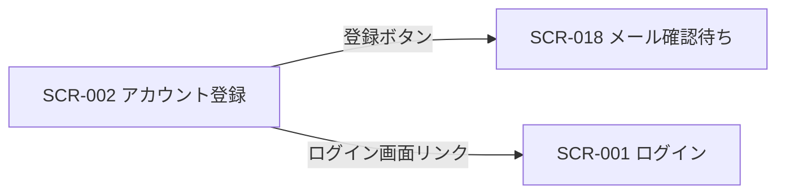

# SCR-002 アカウント登録

> **このページは、新規オーナーがメールアドレスとパスワードでアカウントを登録し、確認メール送信フローへ進む画面 SCR-002 を定義します。** 画面概要 / 画面遷移図 / 画面レイアウト / 画面項目定義 / 入出力一覧 / 画面イベント一覧 の 6 セクションで記述します。

## 1. 画面概要

新規オーナーがメールアドレス・パスワード・規約同意を入力してアカウントを登録し、確認メール送信フロー(SCR-018)へ進む画面です。

| 画面 ID | 画面名 | 機能概要 |
|----|----|----|
| `SCR-002` | アカウント登録 | 新規オーナーのアカウント登録と確認メール送信フローへの導線を提供する |

| 項目 | 内容 |
|----|----|
| トレーサビリティID | [TR-001](../../00_traceability/index.md#TR-001) ・ [TR-002](../../00_traceability/index.md#TR-002) |

| ステークホルダ             | 対象 |
|----------------------------|------|
| 未認証ユーザー(ログイン前) | ◯    |

> [!NOTE]
> **補足** 本画面は認証前に表示されるため権限は不要です(認証前)。登録するユーザーは契約のオーナー(契約あたり 1 ユーザー)となります。高規制業界(金融 / 医療等)を業種に選択した場合は標準提供範囲外である旨を表示し、サポート窓口を案内します。

## 2. 画面遷移図

本画面からの画面遷移を、画面 ID・画面名とイベント(操作)で示します。

## 3. 画面レイアウト

## 4. 画面項目定義

本画面の入出力項目(入力フォーム・同意チェック・操作ボタン)を定義します。項目の正本は本表です。

| 項目 ID | 項目 | 説明 | 種類 | 表示条件 | 表示 |
|----|----|----|----|----|----|
| `IT-01` | メールアドレス | オーナー本人のメールアドレスを入力する(必須・形式チェック) | テキストボックス(メールアドレス) | — | placeholder「admin@example.com」 |
| `IT-02` | パスワード | アカウントのパスワードを入力する(必須・強度要件: 12 文字以上・3 種類以上の文字種) | テキストボックス(パスワード) | — | マスク表示 |
| `IT-03` | パスワード(確認) | パスワードを再入力して一致を確認する(必須・一致確認) | テキストボックス(パスワード) | — | マスク表示 |
| `IT-04` | 業種選択 | 利用者の業種を選択する(任意) | ドロップダウン | — | 「選択してください」/ IT / 小売 / 教育 / 金融 … |
| `IT-05` | 利用規約同意 | 利用規約への同意を表明する(必須チェック) | チェックボックス | — | 「利用規約に同意する」 |
| `IT-06` | プライバシーポリシー同意 | プライバシーポリシーへの同意を表明する(必須チェック) | チェックボックス | — | 「プライバシーポリシーに同意する」 |
| `IT-07` | 利用規約リンク | 利用規約の全文を別ウィンドウで表示する | リンク | — | 「利用規約を別ウィンドウで表示」 |
| `IT-08` | プライバシーポリシーリンク | プライバシーポリシーの全文を別ウィンドウで表示する | リンク | — | 「プライバシーポリシーを別ウィンドウで表示」 |
| `IT-09` | 登録ボタン | 入力内容で登録し確認メール送信フローへ進む | ボタン(Primary) | — | 「登録して確認メールを送信する」 |
| `IT-10` | ログイン画面リンク | 既存ユーザー向けにログイン画面へ遷移する導線 | リンク | — | 「ログインする」 |
| `IT-11` | Turnstile ウィジェット | Cloudflare Turnstile によるボット検証ウィジェット(必須・登録前にトークンを取得する) | ウィジェット | 常時 | Cloudflare Turnstile 検証ウィジェット |

## 5. 入出力一覧

本画面が読み書きするテーブルと、呼び出す API の一覧です。テーブルの正本は [データベース設計](../../02_backend/04_database/index.md)、API の正本は [API設計](../../02_backend/03_apis/index.md) です。

<table>
<thead>
<tr>
<th rowspan="2">入出力名</th>
<th rowspan="2">説明</th>
<th rowspan="2">種別</th>
<th rowspan="2">I/O</th>
<th colspan="4">アクセス種別(CRUD)</th>
<th rowspan="2">備考</th>
</tr>
<tr>
<th>C</th>
<th>R</th>
<th>U</th>
<th>D</th>
</tr>
</thead>
<tbody>
<tr>
<td>利用者</td>
<td>メール重複を確認し新規オーナーの認証アカウントを作成する(メールは M_USER で一意)</td>
<td>テーブル</td>
<td>出力</td>
<td>◯</td>
<td>◯</td>
<td>—</td>
<td>—</td>
<td><code>M_USER</code>(<a href="../../02_backend/04_database/TBL-001.md">テーブル設計</a>)</td>
</tr>
<tr>
<td>契約</td>
<td>新規オーナーの契約を作成する(1 契約 = 1 オーナー)</td>
<td>テーブル</td>
<td>出力</td>
<td>◯</td>
<td>◯</td>
<td>—</td>
<td>—</td>
<td><code>M_CONTRACT</code>(<a href="../../02_backend/04_database/TBL-002.md">テーブル設計</a>)</td>
</tr>
<tr>
<td>新規登録</td>
<td>登録して確認メールを送信する</td>
<td>API</td>
<td>入力 / 出力</td>
<td>◯</td>
<td>◯</td>
<td>—</td>
<td>—</td>
<td><code>POST /auth/signup</code>(<a href="../../02_backend/03_apis/API-001.md#API-001">API-001 新規登録</a>)</td>
</tr>
</tbody>
</table>

## 6. 画面イベント一覧

本画面のイベント(初期表示・各操作)ごとに、対象の項目 ID と処理内容を定義します。

<table>
<colgroup>
<col style="width: 10%" />
<col style="width: 12%" />
<col style="width: 12%" />
<col style="width: 30%" />
<col style="width: 46%" />
</colgroup>
<thead>
<tr>
<th>EVT-ID</th>
<th>イベント ID</th>
<th>項目 ID</th>
<th>イベント</th>
<th>処理</th>
</tr>
</thead>
<tbody>
<tr>
<td>EVT-007</td>
<td><code>EV-01</code></td>
<td>—</td>
<td>初期表示</td>
<td>登録フォームを空の状態で表示する。業種ドロップダウンの選択肢を読み込む。Turnstile ウィジェット(IT-11)を初期化してトークン取得を開始する</td>
</tr>
<tr>
<td>EVT-008</td>
<td><code>EV-02</code></td>
<td><a href="#IT-01">IT-01</a></td>
<td>メールアドレスを入力</td>
<td>フォーカスアウト時にメール形式・必須を検証し、不正な場合はフィールド直下にエラーを表示する</td>
</tr>
<tr>
<td>EVT-009</td>
<td><code>EV-03</code></td>
<td><a href="#IT-02">IT-02</a></td>
<td>パスワードを入力</td>
<td>フォーカスアウト時にパスワード強度(12 文字以上・3 種類以上)・必須を検証し、不正な場合はフィールド直下にエラーを表示する</td>
</tr>
<tr>
<td>EVT-010</td>
<td><code>EV-04</code></td>
<td><a href="#IT-03">IT-03</a></td>
<td>パスワード(確認)を入力</td>
<td>フォーカスアウト時にパスワードとの一致・必須を検証し、不一致の場合はフィールド直下にエラーを表示する</td>
</tr>
<tr>
<td>EVT-011</td>
<td><code>EV-05</code></td>
<td><a href="#IT-04">IT-04</a></td>
<td>業種を選択</td>
<td>高規制業界(金融 / 医療等)を選択した場合、提供範囲外である旨の注意メッセージとサポート窓口の案内をフォーム上にインライン表示する。登録ボタンは非活性にせず、登録自体は許容する。それ以外の選択では追加表示なし</td>
</tr>
<tr>
<td>EVT-012</td>
<td><code>EV-06</code></td>
<td><a href="#IT-05">IT-05</a></td>
<td>「利用規約に同意する」をチェック</td>
<td>チェック状態を保持する。未チェックのまま登録ボタンを押下した場合は登録を拒否し、チェックを求めるエラーを表示する</td>
</tr>
<tr>
<td>EVT-013</td>
<td><code>EV-07</code></td>
<td><a href="#IT-06">IT-06</a></td>
<td>「プライバシーポリシーに同意する」をチェック</td>
<td>チェック状態を保持する。未チェックのまま登録ボタンを押下した場合は登録を拒否し、チェックを求めるエラーを表示する</td>
</tr>
<tr>
<td>EVT-014</td>
<td><code>EV-08</code></td>
<td><a href="#IT-07">IT-07</a></td>
<td>「利用規約を別ウィンドウで表示」を押下</td>
<td>利用規約の全文を別ウィンドウ(タブ)で表示する。現在のフォーム入力状態は保持する</td>
</tr>
<tr>
<td>EVT-015</td>
<td><code>EV-09</code></td>
<td><a href="#IT-08">IT-08</a></td>
<td>「プライバシーポリシーを別ウィンドウで表示」を押下</td>
<td>プライバシーポリシーの全文を別ウィンドウ(タブ)で表示する。現在のフォーム入力状態は保持する</td>
</tr>
<tr>
<td>EVT-016</td>
<td><code>EV-10</code></td>
<td><a href="#IT-09">IT-09</a></td>
<td>「登録して確認メールを送信する」を押下</td>
<td><ul>
<li>全項目のバリデーション(EV-02〜EV-07)を実行し、エラーがある場合は登録を中止してエラーを表示する</li>
<li>Turnstile トークン(IT-11)が未取得の場合は登録を中止してエラーを表示する</li>
<li>バリデーション通過後、<a href="../../02_backend/03_apis/API-001.md#API-001">新規登録 API</a>(<code>POST /auth/signup</code>)を呼び出してアカウントと契約を作成し、Turnstile トークンをリクエストボディに含めて送信する。確認メールを送信する</li>
<li>成功時: SCR-018(メール確認待ち)へ遷移する</li>
<li>失敗時(メール重複): 該当フィールドにエラーメッセージを表示する</li>
<li>失敗時(Turnstile 検証失敗): フォーム上部にエラーを表示し Turnstile ウィジェットをリセットする</li>
<li>失敗時(その他): フォーム上部にエラーメッセージを表示する</li>
</ul></td>
</tr>
<tr>
<td>EVT-017</td>
<td><code>EV-11</code></td>
<td><a href="#IT-10">IT-10</a></td>
<td>「ログインする」を押下</td>
<td>SCR-001(ログイン)へ遷移する</td>
</tr>
<tr>
<td>EVT-018</td>
<td><code>EV-12</code></td>
<td><a href="#IT-11">IT-11</a></td>
<td>Turnstile 検証を完了</td>
<td><ul>
<li>成功時: Turnstile の検証トークンを取得・保持する</li>
<li>失敗時: Turnstile ウィジェット上にエラーを表示し、登録ボタンを非活性にする</li>
</ul></td>
</tr>
</tbody>
</table>
