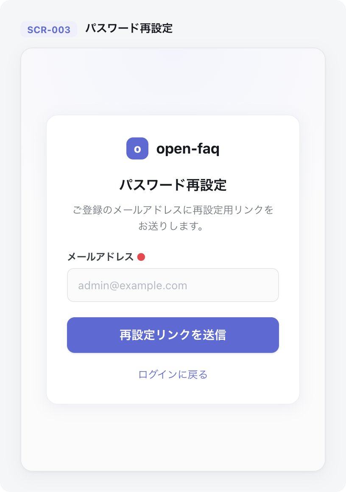

| 画面 ID | 画面名 | トレーサビリティID |
|----|----|----|
| <span id="SCR-003"></span>SCR-003 | パスワード再設定 | [TR-001](../../00_traceability/index.md#TR-001) ・ [TR-004](../../00_traceability/index.md#TR-004) ・ [TR-005](../../00_traceability/index.md#TR-005) |

| ステークホルダ             | 対象 |
|----------------------------|------|
| 未認証ユーザー(ログイン前) | ◯    |

## <span id="1-画面概要"></span>1. 画面概要

メールアドレス入力で再設定リンクを送信(段階 1)し、受信メールのリンクから新しいパスワードを設定する(段階 2)画面です。3 段階のステップタイムラインで進行を示します。

> [!NOTE]
> **補足** 本画面は認証前に表示されるため権限は不要です(認証前)。段階 1 の送信応答はメールアドレスの存在有無を区別しません(列挙攻撃対策)。段階 2 の完了時に当該ユーザーの全セッションを失効します。

## <span id="2-画面遷移図"></span>2. 画面遷移図

本画面からの画面遷移を、画面 ID・画面名とイベント(操作)で示します。

```mermaid
flowchart LR
  S3["SCR-003 パスワード再設定"]
  S1["SCR-001 ログイン"]
  S3 -->|新しいパスワードを設定(完了)| S1
  S3 -->|ログインする CTA| S1
```

## <span id="3-画面レイアウト"></span>3. 画面レイアウト

本画面の代表状態(段階 1)を示します。送信済み・段階 2・リンクエラー・完了の各状態は §4 の `表示条件` で定義します。



## <span id="4-画面項目"></span>4. 画面項目

本画面が各状態で表示する入出力項目を定義します。`表示条件` は項目が表示される段階・状態を示します。

| # | 項目 | 種類 | 必須 | 最大長 | 初期値 | 表示条件 |
|----|----|----|----|----|----|----|
| 1 | ステップタイムライン | div | — | — | — | 段階1・段階2 |
| 2 | メールアドレス | input(email) | ◯ | 254 | — | 段階1 |
| 3 | 再設定リンク送信ボタン | button | — | — | — | 段階1 |
| 4 | ログインに戻る | link | — | — | — | 段階1 |
| 5 | メール送信済み案内 | alert | — | — | — | 段階1 送信完了後 |
| 6 | メール再送信ボタン | button | — | — | — | 段階1 送信完了後 |
| 7 | 新しいパスワード | input(password) | ◯ | 128 | — | 段階2 |
| 8 | 新しいパスワード(確認) | input(password) | ◯ | 128 | — | 段階2 |
| 9 | パスワード設定ボタン | button | — | — | — | 段階2 |
| 10 | リンク無効 / 期限切れエラー | alert | — | — | — | 段階2 リンク不正時 |
| 11 | 再送ボタン(エラー時) | button | — | — | — | 段階2 リンク不正時 |
| 12 | 完了案内 | alert | — | — | — | 設定完了後 |
| 13 | ログインするボタン | button | — | — | — | 設定完了後 |

## <span id="5-バリデーション"></span>5. バリデーション

本画面の入力項目に対する検証ルールを定義します。違反がある場合は送信を中止します。

| 画面項目 | タイミング | ルール | エラーコード |
|----|----|----|----|
| #2 | 入力時・送信時 | 未入力チェック | EM-01 |
| #2 | 入力時・送信時 | メールアドレス形式チェック | EM-02 |
| #7 | 入力時・送信時 | 未入力チェック | EM-03 |
| #7 | 入力時・送信時 | パスワード強度チェック | EM-04 |
| #8 | 入力時・送信時 | 未入力チェック | EM-05 |
| #8 | 入力時・送信時 | パスワード一致チェック | EM-06 |

## <span id="6-イベント"></span>6. イベント

本画面のイベント(初期表示・各操作)ごとに、対象の画面項目を定義します。各イベントの処理内容は [7. 画面イベント詳細](#7-画面イベント詳細) で定義します。

<table>
<colgroup>
<col style="width: 18%" />
<col style="width: 22%" />
<col style="width: 60%" />
</colgroup>
<thead>
<tr>
<th>EVT-ID</th>
<th>画面項目</th>
<th>イベント</th>
</tr>
</thead>
<tbody>
<tr>
<td><span id="EVT-011"></span>EVT-011</td>
<td>—</td>
<td>初期表示(段階1)</td>
</tr>
<tr>
<td><span id="EVT-012"></span>EVT-012</td>
<td>#3</td>
<td>「再設定リンクを送信」を押下</td>
</tr>
<tr>
<td><span id="EVT-013"></span>EVT-013</td>
<td>#6</td>
<td>「メールを再送信する」を押下</td>
</tr>
<tr>
<td><span id="EVT-014"></span>EVT-014</td>
<td>—</td>
<td>初期表示(段階2)</td>
</tr>
<tr>
<td><span id="EVT-015"></span>EVT-015</td>
<td>#11</td>
<td>「再送する」を押下(段階2 リンクエラー時)</td>
</tr>
<tr>
<td><span id="EVT-016"></span>EVT-016</td>
<td>#9</td>
<td>「新しいパスワードを設定する」を押下</td>
</tr>
<tr>
<td><span id="EVT-017"></span>EVT-017</td>
<td>#13</td>
<td>「ログインする」を押下</td>
</tr>
<tr>
<td><span id="EVT-018"></span>EVT-018</td>
<td>#4</td>
<td>「ログインに戻る」を押下</td>
</tr>
</tbody>
</table>

## <span id="7-画面イベント詳細"></span>7. 画面イベント詳細

各イベントの処理内容を定義します。

<table>
<colgroup>
<col style="width: 14%" />
<col style="width: 86%" />
</colgroup>
<thead>
<tr>
<th>EVT-ID</th>
<th>処理</th>
</tr>
</thead>
<tbody>
<tr>
<td>EVT-011</td>
<td>段階1表示時にステップタイムライン(#1・①を強調)・メールアドレス(#2)・再設定リンク送信ボタン(#3)・ログインに戻る(#4)を表示する</td>
</tr>
<tr>
<td>EVT-012</td>
<td>「再設定リンクを送信」押下時に次を行う:<pre>
1. §5 のバリデーションを評価し、違反時は #2 直下にエラーを表示して中止する
2. <a href="../../02_backend/03_apis/API-004.md#API-004">パスワード再設定要求</a> API(POST /auth/password-reset-request)を発行する(存在有無を区別しない一律応答=列挙攻撃対策)
3. 応答後、メール送信済み案内(#5)と再送ボタン(#6・カウントダウン付き)を表示する
</pre></td>
</tr>
<tr>
<td>EVT-013</td>
<td>「メールを再送信する」押下時、カウントダウン完了後に <a href="../../02_backend/03_apis/API-004.md#API-004">パスワード再設定要求</a> API を再発行し、カウントダウンをリセットして #6 を再び非活性にする(カウントダウン中は非活性で操作不可)</td>
</tr>
<tr>
<td>EVT-014</td>
<td>段階2表示時にメールの再設定リンクから URL トークンを取得して検証する:<pre>
 ┣ トークン有効: ステップタイムライン(#1・③を強調)・新しいパスワード(#7)・確認(#8)・設定ボタン(#9)を表示する
 ┗ トークン無効 / 期限切れ: リンク無効エラー(#10)にエラー(EM-07)を表示し、再送ボタン(#11)を表示する
</pre></td>
</tr>
<tr>
<td>EVT-015</td>
<td>「再送する」押下時に <a href="../../02_backend/03_apis/API-004.md#API-004">パスワード再設定要求</a> API を発行し、段階1 送信済み状態(#5・#6 表示)へ遷移する</td>
</tr>
<tr>
<td>EVT-016</td>
<td>「新しいパスワードを設定する」押下時に次を行う:<pre>
1. §5 のバリデーション(強度・一致)を評価し、違反時はエラーを表示して中止する
2. <a href="../../02_backend/03_apis/API-010.md#API-010">パスワード再設定確定</a> API(POST /auth/password-reset)を発行する
3. 結果で分岐する
   ┣ 成功: パスワードハッシュを更新し当該ユーザーの全セッションを失効させ、完了案内(#12)とログインするボタン(#13)を表示する
   ┗ 失敗: エラーを表示する
</pre></td>
</tr>
<tr>
<td>EVT-017</td>
<td>「ログインする」押下時に SCR-001 ログインへ遷移する</td>
</tr>
<tr>
<td>EVT-018</td>
<td>「ログインに戻る」押下時に SCR-001 ログインへ遷移する</td>
</tr>
</tbody>
</table>

## <span id="8-エラーメッセージ"></span>8. エラーメッセージ

本画面が表示するエラー・警告メッセージを定義します。

| エラーコード | エラーメッセージ |
|----|----|
| EM-01 | メールアドレスを入力してください |
| EM-02 | メールアドレスの形式が正しくありません |
| EM-03 | 新しいパスワードを入力してください |
| EM-04 | パスワードは 12 文字以上で、英大文字・小文字・数字・記号のうち 3 種類以上を含めてください |
| EM-05 | 確認用パスワードを入力してください |
| EM-06 | パスワードが一致しません |
| EM-07 | 再設定リンクが期限切れ、または無効です。新しいリンクを再送してください(有効期限 1 時間) |
