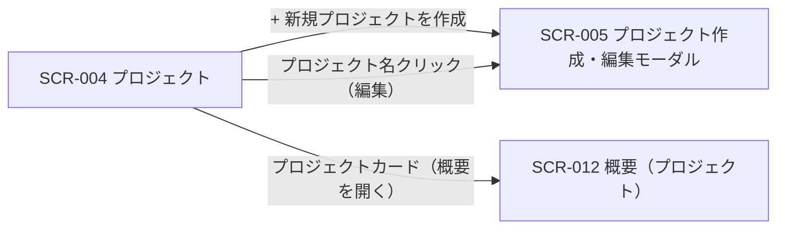

| 画面 ID | 画面名 | トレーサビリティID |
|----|----|----|
| SCR-004 | プロジェクト | [TR-001](../../00_traceability/index.md#TR-001) ・ [TR-014](../../00_traceability/index.md#TR-014) ・ [TR-079](../../00_traceability/index.md#TR-079) |

| ステークホルダ | 対象 |
|----------------|------|
| オーナー       | ◯    |
| メンバー       | —    |

## 1. 画面概要

ユーザーが自分で作成した(オーナーである)プロジェクト「My プロジェクト」を一覧(カード形式)で確認し、新規作成・編集・削除モーダルへの導線を提供する画面です(オーナー専有)。作成・編集・削除動線は SCR-005 モーダルに集約します。

> [!NOTE]
> **補足** 本画面はオーナー(プロジェクトの作成者)が、自分が作成したプロジェクトのみを一覧する画面です。新規作成・編集・削除はオーナー専有の操作です。他者が作成したプロジェクトに招待されて参加する「Join プロジェクト」はダッシュボード側で一覧・閲覧し、本画面には表示しません。各プロジェクトの SCR-012 概要へはプロジェクトカードから遷移します。

## 2. 画面遷移図

本画面からの画面遷移を、画面 ID・画面名とイベント(操作)で示します。

## 3. 画面レイアウト

本画面の通常状態(プロジェクト一覧)を示します。読み込み中・0 件(空状態)の各状態は §4 の `表示条件` で定義します。

## 4. 画面項目

本画面が各状態で表示する入出力項目(共通ヘッダー・一覧カードの構成要素・件数表示・空状態を含む)を定義します。一覧は自分が作成したプロジェクト(My プロジェクト)をカード形式で表示し、編集遷移はプロジェクト名(主リンク)に集約します(クリックで SCR-005 を編集モードで開く)。各カードからは概要(SCR-012)への遷移リンクを提供します。

| # | 項目 | 種類 | 必須 | 最大長 | 初期値 | 表示条件 |
|----|----|----|----|----|----|----|
| 1 | 概要を開く(カード内リンク) | link | — | — | — | 1 件以上ある時 |
| 2 | 通知ベル | button | — | — | — | ヘッダー共通(全状態) |
| 3 | ユーザーメニュー | button | — | — | — | ヘッダー共通(全状態) |
| 4 | サイドナビ | link | — | — | — | ヘッダー共通(全状態) |
| 5 | パンくず | link | — | — | — | 常時 |
| 6 | + 新規プロジェクトを作成(ヘッダー) | button | — | — | — | 常時 |
| 7 | 件数表示 | div | — | — | — | 1 件以上ある時 |
| 8 | プロジェクトカード | div | — | — | — | 1 件以上ある時 |
| 9 | プロジェクト名 | link | — | — | — | 1 件以上ある時 |
| 10 | 許可ドメイン | div | — | — | — | 1 件以上ある時 |
| 11 | 稼働ステータス | div | — | — | — | 1 件以上ある時 |
| 12 | 質問数 | div | — | — | — | 1 件以上ある時 |
| 13 | 未解決数 | div | — | — | — | 1 件以上ある時 |
| 14 | メンバー数 | div | — | — | — | 1 件以上ある時 |
| 15 | 新規作成カード | div | — | — | — | 1 件以上ある時 |
| 16 | 空状態 | div | — | — | — | 0 件時(空状態) |
| 17 | ローディング状態 | div | — | — | — | 読み込み中のみ |

- **#11 稼働ステータスの選択肢(コード値=表示名)**: active=稼働中(緑)/ limited=制限中(黄)。色のみ依存禁止(テキストラベル併記)。

## 5. バリデーション

本画面は一覧表示・導線提供のみで、入力フォームを持ちません。

(本画面に入力検証はありません)

## 6. イベント

本画面のイベント(初期表示・各操作)ごとに、対象の画面項目を定義します。各イベントの処理内容は [7. 画面イベント詳細](#7-画面イベント詳細) で定義します。

<table>
<colgroup>
<col style="width: 18%" />
<col style="width: 22%" />
<col style="width: 60%" />
</colgroup>
<thead>
<tr>
<th>EVT-ID</th>
<th>画面項目</th>
<th>イベント</th>
</tr>
</thead>
<tbody>
<tr>
<td>EVT-019</td>
<td>—</td>
<td>初期表示</td>
</tr>
<tr>
<td>EVT-020</td>
<td>#6</td>
<td>「+ 新規プロジェクトを作成」を押下</td>
</tr>
<tr>
<td>EVT-021</td>
<td>#9</td>
<td>プロジェクト名リンクを押下</td>
</tr>
<tr>
<td>EVT-022</td>
<td>#1</td>
<td>プロジェクトカードの「概要を開く」を押下</td>
</tr>
<tr>
<td>EVT-023</td>
<td>#16</td>
<td>空状態の「+ 新規プロジェクトを作成」を押下</td>
</tr>
</tbody>
</table>

## 7. 画面イベント詳細

各イベントの処理内容を定義します。

<table>
<colgroup>
<col style="width: 14%" />
<col style="width: 86%" />
</colgroup>
<thead>
<tr>
<th>EVT-ID</th>
<th>処理</th>
</tr>
</thead>
<tbody>
<tr>
<td>EVT-019</td>
<td>初期表示時に <a href="../../02_backend/03_apis/API-016.md#API-016">プロジェクト一覧</a> API(GET /projects)を呼び出し、取得結果で分岐する<pre>
 ┣ 取得中: ローディング状態(#17・スケルトン 3 行)を表示する
 ┣ 取得成功・1 件以上: 件数表示(#7)とプロジェクトカード(#8〜#14)・新規作成カード(#15)を表示する
 ┣ 取得成功・0 件: 空状態(#16)を表示する
 ┗ 取得失敗: エラーメッセージを表示する
</pre></td>
</tr>
<tr>
<td>EVT-020</td>
<td>「+ 新規プロジェクトを作成」(#6)押下時に SCR-005 を新規作成モードで開く</td>
</tr>
<tr>
<td>EVT-021</td>
<td>プロジェクト名リンク(#9)押下時に SCR-005 を編集モードで開き、対象プロジェクトの現在値をロードする</td>
</tr>
<tr>
<td>EVT-022</td>
<td>プロジェクトカードの「概要を開く」(#1)押下時に当該プロジェクトの SCR-012 概要(プロジェクト)へ遷移する</td>
</tr>
<tr>
<td>EVT-023</td>
<td>空状態(#16)の「+ 新規プロジェクトを作成」押下時に SCR-005 を新規作成モードで開く</td>
</tr>
</tbody>
</table>

## 8. エラーメッセージ

本画面はエラー・警告メッセージを表示しません。
