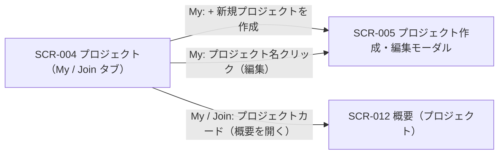
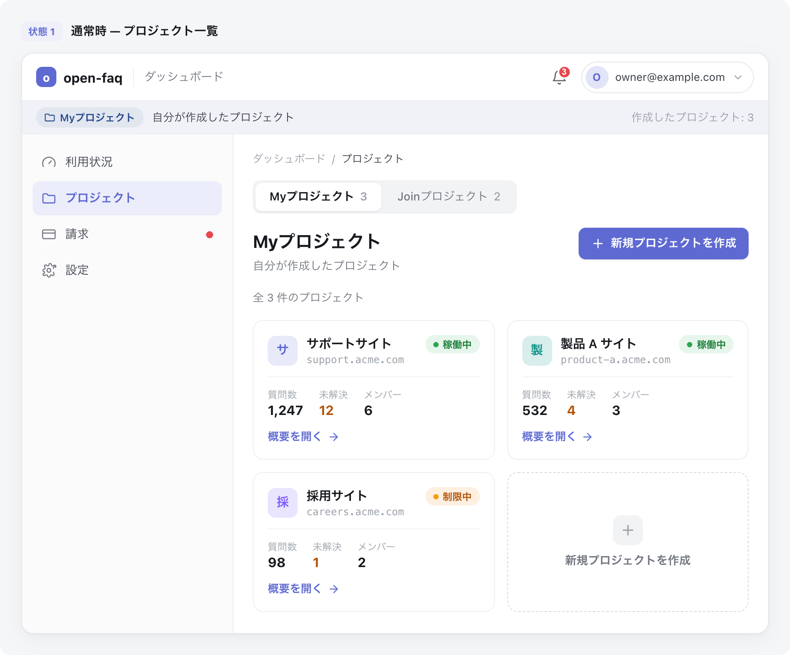

# SCR-004: プロジェクト

| ID | 画面名 |
|----|----|
| SCR-004 | プロジェクト |

| 関連項目 | 内容 |
|----|----| 
| 業務ユースケース | [UC-001](../../../01_requirements/04_business_usecases/UC-001.md#UC-001) / [UC-014](../../../01_requirements/04_business_usecases/UC-014.md#UC-014) / [UC-076](../../../01_requirements/04_business_usecases/UC-076.md#UC-076) / [UC-082](../../../01_requirements/04_business_usecases/UC-082.md#UC-082) |
| API | [API-002](../../02_backend/03_apis/API-002.md#API-002) / [API-016](../../02_backend/03_apis/API-016.md#API-016) / [API-066](../../02_backend/03_apis/API-066.md#API-066) |

| ステークホルダ | 対象 |
|----------------|------|
| オーナー       | ◯    |
| メンバー       | ◯    |

## 1. 画面概要

- ユーザーが関与するプロジェクトをカード形式で一覧する画面である。
- 「Myプロジェクト」(自分が作成した=オーナー)と「Joinプロジェクト」(招待されて参加している=メンバー)の 2 タブで切り替え、既定表示は My タブである。
- My タブでは新規作成・編集・削除モーダル(SCR-005)への導線を提供する(オーナー専有)。
- Join タブでは参加中のプロジェクトを閲覧・概要を開くのみで、新規作成・編集・削除は提供しない。

## 2. 画面遷移図

本画面からの画面遷移を、画面 ID・画面名とイベント(操作)で示します。

## 3. 画面レイアウト

本画面の通常状態(プロジェクト一覧)を示します。

## 4. 画面項目

本画面が各状態で表示する入出力項目を定義します。

| # | 項目 | 種類 | 必須 | 最大長 | 初期値 | 表示条件 |
|----|----|----|----|----|----|----|
| 1 | My / Join 表示切替タブ | button | — | — | My | 常時 |
| 2 | 概要を開く(カード内リンク) | link | — | — | — | 1 件以上ある時 |
| 3 | 通知ベル | button | — | — | — | ヘッダー共通(全状態) |
| 4 | ユーザーメニュー | button | — | — | — | ヘッダー共通(全状態) |
| 5 | サイドナビ | link | — | — | — | ヘッダー共通(全状態) |
| 6 | パンくず | link | — | — | — | 常時 |
| 7 | + 新規プロジェクトを作成(ヘッダー) | button | — | — | — | My タブ時 |
| 8 | 件数表示 | label | — | — | — | 1 件以上ある時 |
| 9 | プロジェクトカード | label | — | — | — | 1 件以上ある時 |
| 10 | プロジェクト名 | link | — | — | — | My タブ時(編集導線。Join タブでは非リンク表示) |
| 11 | 許可ドメイン | label | — | — | — | 1 件以上ある時 |
| 12 | 稼働ステータス | label | — | — | — | 1 件以上ある時 |
| 13 | 質問数 | label | — | — | — | 1 件以上ある時 |
| 14 | 未解決数 | label | — | — | — | 1 件以上ある時 |
| 15 | メンバー数 | label | — | — | — | 1 件以上ある時 |
| 16 | 新規作成カード | label | — | — | — | My タブ時・1 件以上 |
| 17 | 空状態 | label | — | — | — | 0 件時(空状態) |
| 18 | ローディング状態 | label | — | — | — | 読み込み中のみ |

データパターン(選択肢・状態値など値のパターンを持つ項目)を定義する。

| 画面項目 | 表示名 | 補足 |
|----|----|----|
| #12 | 稼働中 | 緑。色のみに依存せずテキストラベルを併記 |
| #12 | 制限中 | 黄。色のみに依存せずテキストラベルを併記 |

## 5. バリデーション

本画面は一覧表示・導線提供のみで、入力フォームを持たないため入力検証はありません。

## 6. イベント

本画面のイベント(初期表示・各操作)ごとに、対象の画面項目を定義します。各イベントの処理内容は [7. 画面イベント詳細](#7-画面イベント詳細) で定義します。

<table>
<colgroup>
<col style="width: 18%" />
<col style="width: 22%" />
<col style="width: 60%" />
</colgroup>
<thead>
<tr>
<th>EVT-ID</th>
<th>画面項目</th>
<th>イベント</th>
</tr>
</thead>
<tbody>
<tr>
<td>EVT-01</td>
<td>—</td>
<td>初期表示</td>
</tr>
<tr>
<td>EVT-02</td>
<td>#1</td>
<td>My / Join タブを切り替え</td>
</tr>
<tr>
<td>EVT-03</td>
<td>#7</td>
<td>「+ 新規プロジェクトを作成」を押下(My タブ)</td>
</tr>
<tr>
<td>EVT-04</td>
<td>#10</td>
<td>プロジェクト名リンクを押下(My タブ)</td>
</tr>
<tr>
<td>EVT-05</td>
<td>#2</td>
<td>プロジェクトカードの「概要を開く」を押下(My / Join 共通)</td>
</tr>
<tr>
<td>EVT-06</td>
<td>#17</td>
<td>空状態の「+ 新規プロジェクトを作成」を押下</td>
</tr>
</tbody>
</table>

## 7. 画面イベント詳細

各イベントの処理内容を定義します。

<table>
<colgroup>
<col style="width: 14%" />
<col style="width: 86%" />
</colgroup>
<thead>
<tr>
<th>EVT-ID</th>
<th>処理</th>
</tr>
</thead>
<tbody>
<tr>
<td>EVT-01</td>
<td>初期表示時に <a href="../../02_backend/03_apis/API-016.md#API-016">プロジェクト一覧(API-016)</a> API で選択中タブ(既定 My)のプロジェクトを取得し、結果で分岐する。My=自分が作成したプロジェクト、Join=招待されて参加しているプロジェクト<pre>
 ┣ 取得中: ローディング状態(#18)を表示する
 ┣ 取得成功・1 件以上: 件数表示(#8)とプロジェクトカード(#9〜#15)を表示する。My タブのみ新規作成カード(#16)を表示する
 ┣ 取得成功・0 件: 空状態(#17)を表示する
 ┗ 取得失敗: エラーメッセージを表示する
</pre>Join タブのカードは新規作成・編集・削除の導線を表示しない</td>
</tr>
<tr>
<td>EVT-02</td>
<td>My / Join タブ(#1)切替時に <a href="../../02_backend/03_apis/API-016.md#API-016">プロジェクト一覧(API-016)</a> API で選択タブのプロジェクトを表示する。Join 選択時は新規作成・編集・削除の導線を表示しない</td>
</tr>
<tr>
<td>EVT-03</td>
<td>「+ 新規プロジェクトを作成」(#7・My タブ)押下時に SCR-005 を新規作成モードで開く</td>
</tr>
<tr>
<td>EVT-04</td>
<td>プロジェクト名リンク(#10・My タブ)押下時に SCR-005 を編集モードで開く</td>
</tr>
<tr>
<td>EVT-05</td>
<td>プロジェクトカードの「概要を開く」(#2)押下時に当該プロジェクトの SCR-012 概要(プロジェクト)へ遷移する(My / Join 共通)</td>
</tr>
<tr>
<td>EVT-06</td>
<td>空状態(#17)の「+ 新規プロジェクトを作成」押下時に SCR-005 を新規作成モードで開く</td>
</tr>
</tbody>
</table>

## 8. エラーメッセージ

本画面はエラー・警告メッセージを表示しません。
