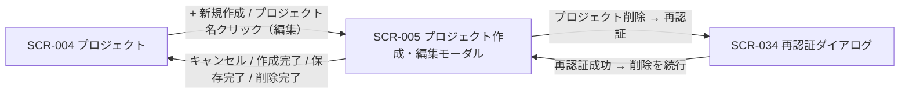
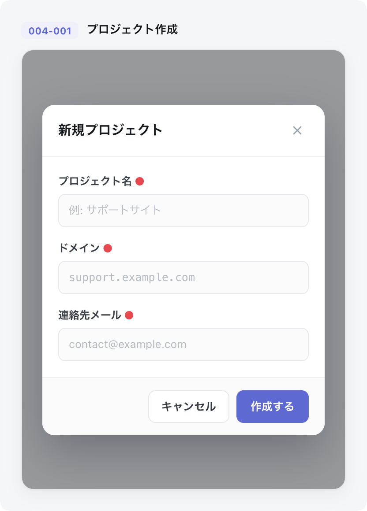

# SCR-005: プロジェクト作成・編集(モーダル)

| ID | 業務ユースケースID | API ID |
|----|----|----|
| SCR-005 | [UC-015](../../../01_requirements/04_business_usecases/UC-015.md#UC-015) ・ [UC-016](../../../01_requirements/04_business_usecases/UC-016.md#UC-016) ・ [UC-017](../../../01_requirements/04_business_usecases/UC-017.md#UC-017) ・ [UC-073](../../../01_requirements/04_business_usecases/UC-073.md#UC-073) | [API-017](../../02_backend/03_apis/API-017.md#API-017) ・ [API-011](../../02_backend/03_apis/API-011.md#API-011) ・ [API-018](../../02_backend/03_apis/API-018.md#API-018) ・ [API-005](../../02_backend/03_apis/API-005.md#API-005) ・ [API-023](../../02_backend/03_apis/API-023.md#API-023) ・ [API-066](../../02_backend/03_apis/API-066.md#API-066) |

| ステークホルダ | 対象 |
|----------------|------|
| オーナー       | ◯    |
| メンバー       | —    |

## 1. 画面概要

- プロジェクトの新規作成・編集・削除を全画面割込みモーダルで行う。
- 対象はオーナーのみで、メンバーは利用できない。
- 新規作成モードと編集モードの 2 状態を持つ。
- 他者の追加は本モーダルでは行わず、作成後に SCR-013 / SCR-014 から招待する。

## 2. 画面遷移図

本モーダルの呼出元・遷移先を、画面 ID・画面名とイベント(操作)で示します。

## 3. 画面レイアウト

本モーダルの代表状態(新規作成モード)を示します。

## 4. 画面項目

本モーダルが表示する入出力項目を定義します。

| # | 項目 | 種類 | 必須 | 最大長 | 初期値 | 表示条件 |
|----|----|----|----|----|----|----|
| 1 | 見出し | label | — | — | — | 常時(新規「新規プロジェクトを作成」/ 編集「プロジェクトを編集」) |
| 2 | 閉じる(× ボタン) | button | — | — | — | 常時 |
| 3 | プロジェクト ID | label | — | — | — | 編集モード |
| 4 | プロジェクト ID コピー | button | — | — | — | 編集モード |
| 5 | プロジェクト名 | input(text) | ◯ | 100 | — | 常時 |
| 6 | 許可ドメイン | input(text) | ◯ | — | — | 常時 |
| 7 | 許可ドメイン補足ヘルプ | label | — | — | — | 常時 |
| 8 | プロジェクト連絡先メール | input(email) | ◯ | 254 | — | 常時 |
| 9 | 信頼度しきい値 | input(number) | — | — | — | 新規モード(任意・未入力時はグローバル既定値(0.60 / 0.50)を適用) |
| 10 | 関連度しきい値 | input(number) | — | — | — | 新規モード(任意・未入力時はグローバル既定値(0.60 / 0.50)を適用) |
| 11 | 連絡先メール確認状態バッジ | label | — | — | — | 編集モード |
| 12 | 確認メールを再送 | button | — | — | — | 編集モード(連絡先メール確認待ち時) |
| 13 | 削除確認名称入力欄 | input(text) | — | 100 | — | 編集モード(DangerSection) |
| 14 | プロジェクトを削除 | button | — | — | — | 編集モード(DangerSection) |
| 15 | キャンセル | button | — | — | — | 常時 |
| 16 | プロジェクトを作成 | button | — | — | — | 新規モード |
| 17 | 保存 | button | — | — | — | 編集モード |

データパターン(選択肢・状態値など値のパターンを持つ項目)を定義する。

| 画面項目 | 表示名 | 補足 |
|----|----|----|
| #11 | 確認済み | — |
| #11 | 確認待ち | — |
| #11 | 未設定 | — |

## 5. バリデーション

入力検証を定義する。

| 画面項目 | タイミング | ルール | エラーコード |
|----|----|----|----|
| #5 | 入力時・送信時 | 未入力チェック | EM-01 |
| #5 | 入力時・送信時 | 文字数チェック(1〜100 文字) | EM-02 |
| #6 | 追加時・送信時 | 未入力チェック(1 件以上) | EM-03 |
| #6 | 追加時・送信時 | ドメイン形式チェック(完全一致または `*.example.com` 形式・IP / プロトコル指定不可) | EM-04 |
| #8 | 入力時・送信時 | 未入力チェック | EM-05 |
| #8 | 入力時・送信時 | メールアドレス形式チェック | EM-06 |
| #9 | 入力時・送信時 | 信頼度しきい値の数値範囲チェック(0.0〜1.0)。入力された場合のみ検証する | EM-08 |
| #10 | 入力時・送信時 | 関連度しきい値の数値範囲チェック(0.0〜1.0)。入力された場合のみ検証する | EM-08 |

## 6. イベント

本モーダルのイベント(初期表示・各操作)ごとに、対象の画面項目を定義します。

<table>
<colgroup>
<col style="width: 18%" />
<col style="width: 22%" />
<col style="width: 60%" />
</colgroup>
<thead>
<tr>
<th>EVT-ID</th>
<th>画面項目</th>
<th>イベント</th>
</tr>
</thead>
<tbody>
<tr>
<td>EVT-01</td>
<td>—</td>
<td>初期表示(新規モード)</td>
</tr>
<tr>
<td>EVT-02</td>
<td>—</td>
<td>初期表示(編集モード)</td>
</tr>
<tr>
<td>EVT-03</td>
<td>#6</td>
<td>許可ドメインを追加(Enter / カンマ)</td>
</tr>
<tr>
<td>EVT-04</td>
<td>#16</td>
<td>「プロジェクトを作成」を押下</td>
</tr>
<tr>
<td>EVT-05</td>
<td>#17</td>
<td>「保存」を押下</td>
</tr>
<tr>
<td>EVT-06</td>
<td>#12</td>
<td>「確認メールを再送」を押下</td>
</tr>
<tr>
<td>EVT-07</td>
<td>#13</td>
<td>削除確認名称を入力</td>
</tr>
<tr>
<td>EVT-08</td>
<td>#14</td>
<td>「プロジェクトを削除」を押下</td>
</tr>
<tr>
<td>EVT-09</td>
<td>#15</td>
<td>「キャンセル」を押下</td>
</tr>
<tr>
<td>EVT-10</td>
<td>#4</td>
<td>「コピー」を押下(プロジェクト ID)</td>
</tr>
<tr>
<td>EVT-11</td>
<td>#2</td>
<td>× を押下</td>
</tr>
</tbody>
</table>

## 7. 画面イベント詳細

各イベントの処理内容を定義します。

<table>
<colgroup>
<col style="width: 14%" />
<col style="width: 86%" />
</colgroup>
<thead>
<tr>
<th>EVT-ID</th>
<th>処理</th>
</tr>
</thead>
<tbody>
<tr>
<td>EVT-01</td>
<td>新規モードの初期表示で、空の入力フォーム(信頼度しきい値(#9)・関連度しきい値(#10)を含む)と「プロジェクトを作成」ボタン(#16)を表示する(見出し(#1)は「新規プロジェクトを作成」、編集モード専用項目は表示しない)</td>
</tr>
<tr>
<td>EVT-02</td>
<td>編集モードの初期表示で、対象プロジェクトの現在の登録内容を各入力欄に表示する(<a href="../../02_backend/03_apis/API-018.md#API-018">プロジェクト更新・削除(API-018)</a> API):<pre>
 ┣ 成功: 現在の登録内容を表示し、見出し(#1)を「プロジェクトを編集」とし、編集モード専用項目を表示する
 ┗ 失敗: エラーをトーストで表示しモーダルを閉じる
</pre></td>
</tr>
<tr>
<td>EVT-03</td>
<td>許可ドメイン(#6)で Enter またはカンマ入力時に、入力値を許可ドメインのタグとして追加する(形式不正の場合は #6 直下にエラー(EM-04)を表示し追加しない)</td>
</tr>
<tr>
<td>EVT-04</td>
<td>「プロジェクトを作成」押下時にプロジェクトを作成する(<a href="../../02_backend/03_apis/API-017.md#API-017">プロジェクト新規作成(API-017)</a> API)。信頼度しきい値(#9)・関連度しきい値(#10)は任意で、入力された場合のみ当該プロジェクトの設定値として送る:<pre>
 ┣ 成功: プロジェクトを作成する。しきい値が入力されていればプロジェクト設定値として保存し、未入力の場合はグローバル既定値を適用する(プロジェクト設定値は保存しない)。作成したユーザーを当該プロジェクトのオーナーとして登録したうえでメンバーとしても自動登録する。モーダルを閉じ SCR-004 の一覧へ戻る
 ┣ 失敗(重複名): プロジェクト名欄(#5)にエラー(EM-07)を表示する
 ┗ 失敗(その他): トーストでエラーを表示する
</pre></td>
</tr>
<tr>
<td>EVT-05</td>
<td>「保存」押下時にプロジェクトを更新する(<a href="../../02_backend/03_apis/API-018.md#API-018">プロジェクト更新・削除(API-018)</a> API):<pre>
 ┣ 成功: プロジェクトを更新する。連絡先メール(#8)を変更した場合は確認メールを自動送信し、確認状態バッジ(#11)を「確認待ち」に更新する。モーダルを閉じ SCR-004 の一覧へ戻る
 ┗ 失敗: トーストでエラーを表示する
</pre></td>
</tr>
<tr>
<td>EVT-06</td>
<td>「確認メールを再送」押下時に連絡先メールの確認メールを再送信する(<a href="../../02_backend/03_apis/API-011.md#API-011">連絡先確認メール再送(API-011)</a> API):<pre>
 ┣ 成功: 確認メールを再送信する
 ┣ 失敗(レート制限): 「再送は X 分後に再試行できます」をトーストで表示する
 ┗ 失敗(その他): トーストでエラーを表示する
</pre></td>
</tr>
<tr>
<td>EVT-07</td>
<td>削除確認名称(#13)が現プロジェクト名と完全一致したときのみ「プロジェクトを削除」ボタン(#14)を有効化する</td>
</tr>
<tr>
<td>EVT-08</td>
<td>「プロジェクトを削除」押下時に、<a href="SCR-034.md#SCR-034">SCR-034 再認証ダイアログ</a>で再認証し、その再認証のうえでプロジェクトを削除する(<a href="../../02_backend/03_apis/API-018.md#API-018">プロジェクト更新・削除(API-018)</a> API):<pre>
 ┣ 成功: プロジェクトを論理削除する。当該プロジェクトのメンバー割当を解除し、他に有効な参加プロジェクトを持たずいずれのプロジェクトのオーナーでもないメンバーのアカウントのみを無効化する(他オーナーのプロジェクトに参加中のメンバーは無効化しない)。モーダルを閉じ SCR-004 の一覧へ戻る
 ┣ 失敗(再認証キャンセル): 削除を中断し、編集モーダルに戻る
 ┗ 失敗(その他): トーストでエラーを表示する
</pre></td>
</tr>
<tr>
<td>EVT-09</td>
<td>「キャンセル」押下時にモーダルを閉じ SCR-004 へ戻る(未保存の変更があるときは離脱確認を表示し、破棄を選んだ場合のみ閉じる)</td>
</tr>
<tr>
<td>EVT-10</td>
<td>「コピー」押下時にプロジェクト ID をクリップボードにコピーし、コピー完了を通知する</td>
</tr>
<tr>
<td>EVT-11</td>
<td>× 押下時にモーダルを閉じ SCR-004 へ戻る(未保存の変更があるときは離脱確認を表示し、破棄を選んだ場合のみ閉じる)</td>
</tr>
</tbody>
</table>

## 8. エラーメッセージ

本モーダルが表示するエラー・警告メッセージを定義します。

| エラーコード | エラーメッセージ |
|----|----|
| EM-01 | プロジェクト名を入力してください |
| EM-02 | プロジェクト名は 1〜100 文字で入力してください |
| EM-03 | 許可ドメインを 1 件以上入力してください |
| EM-04 | ドメインの形式が正しくありません(完全一致または `*.example.com` 形式で入力してください。IP アドレス・プロトコル指定は使用できません) |
| EM-05 | 連絡先メールアドレスを入力してください |
| EM-06 | メールアドレスの形式が正しくありません |
| EM-07 | このプロジェクト名は既に使用されています |
| EM-08 | しきい値は 0.0〜1.0 の範囲で入力してください |
