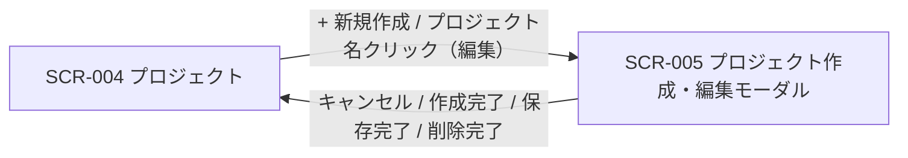

| 画面 ID | 画面名 | トレーサビリティID |
|----|----|----|
| SCR-005 | プロジェクト作成・編集モーダル | [TR-015](../../00_traceability/index.md#TR-015) ・ [TR-016](../../00_traceability/index.md#TR-016) ・ [TR-017](../../00_traceability/index.md#TR-017) ・ [TR-079](../../00_traceability/index.md#TR-079) |

| ステークホルダ | 対象 |
|----------------|------|
| オーナー       | ◯    |
| メンバー       | —    |

## 1. 画面概要

SCR-004 から開く、プロジェクトの新規作成・編集・削除を全画面割込みモーダルで行う画面です(オーナー専有)。呼出元で新規作成 / 編集モードを切り替えます。

> [!NOTE]
> **呼出インターフェース(設計値)** 呼出元(SCR-004)は開く際に `{ mode: "create" | "edit", projectId?: string }` を渡す(設計値)。`mode = "create"` 時は `projectId` を渡さず、空フォームを初期表示する(EVT-024)。`mode = "edit"` 時は `projectId`(必須)を渡し、初期表示で <a href="../../02_backend/03_apis/API-018.md#API-018">プロジェクト更新・削除</a> API(GET)を呼んで現値をロードする(EVT-025)。`mode = "edit"` で `projectId` が欠落している場合はモーダルを開かずエラーとする。閉じる際は呼出元へ結果(作成 / 保存 / 削除完了 / キャンセル)を返し、SCR-004 は一覧を更新する。

> [!IMPORTANT]
> **重要** プロジェクト作成時、作成者であるオーナーを当該プロジェクトの member として `M_PRJ_USERS` に自動登録します(オーナーの認可権威は引き続き `M_CONTRACT` の `isOwner`。メンバー行は一覧表示・担当割当・通知宛先の網羅用です)。他者を追加する場合はプロジェクト作成後に SCR-013 / SCR-014 から招待します。

## 2. 画面遷移図

本モーダルの呼出元・遷移先を、画面 ID・画面名とイベント(操作)で示します。

## 3. 画面レイアウト

本モーダルの代表状態(新規作成モード)を示します。編集モード専用の項目(プロジェクト ID・連絡先メール確認状態・保存・削除 DangerSection)は §4 の `表示条件` で定義します。

## 4. 画面項目

本モーダルが各状態で表示する入出力項目を定義します。`表示条件` は項目が表示されるモード・状態を示します。

| # | 項目 | 種類 | 必須 | 最大長 | 初期値 | 表示条件 |
|----|----|----|----|----|----|----|
| 1 | 見出し | div | — | — | — | 常時(新規「新規プロジェクトを作成」/ 編集「プロジェクトを編集」) |
| 2 | 閉じる(× ボタン) | button | — | — | — | 常時 |
| 3 | プロジェクト ID | div | — | — | — | 編集モード |
| 4 | プロジェクト ID コピー | button | — | — | — | 編集モード |
| 5 | プロジェクト名 | input(text) | ◯ | 100 | — | 常時 |
| 6 | 許可ドメイン | input(text) | ◯ | — | — | 常時 |
| 7 | 許可ドメイン補足ヘルプ | div | — | — | — | 常時 |
| 8 | プロジェクト連絡先メール | input(email) | ◯ | 254 | — | 常時 |
| 9 | 連絡先メール確認状態バッジ | div | — | — | — | 編集モード |
| 10 | 確認メールを再送 | button | — | — | — | 編集モード(連絡先メール確認待ち時) |
| 11 | 削除確認名称入力欄 | input(text) | — | 100 | — | 編集モード(DangerSection) |
| 12 | プロジェクトを削除 | button | — | — | — | 編集モード(DangerSection) |
| 13 | キャンセル | button | — | — | — | 常時 |
| 14 | プロジェクトを作成 | button | — | — | — | 新規モード |
| 15 | 保存 | button | — | — | — | 編集モード |

- **#9 連絡先メール確認状態バッジの状態(値=表示名)**: confirmed=確認済み / pending=確認待ち / unset=未設定

## 5. バリデーション

本モーダルの入力項目に対する検証ルールを定義します。違反がある場合は送信を中止します。

| 画面項目 | タイミング | ルール | エラーコード |
|----|----|----|----|
| #5 | 入力時・送信時 | 未入力チェック | EM-01 |
| #5 | 入力時・送信時 | 文字数チェック(1〜100 文字) | EM-02 |
| #6 | 追加時・送信時 | 未入力チェック(1 件以上) | EM-03 |
| #6 | 追加時・送信時 | ドメイン形式チェック(完全一致または `*.example.com` 形式・IP / プロトコル指定不可) | EM-04 |
| #8 | 入力時・送信時 | 未入力チェック | EM-05 |
| #8 | 入力時・送信時 | メールアドレス形式チェック | EM-06 |

## 6. イベント

本モーダルのイベント(初期表示・各操作)ごとに、対象の画面項目を定義します。各イベントの処理内容は [7. 画面イベント詳細](#7-画面イベント詳細) で定義します。

<table>
<colgroup>
<col style="width: 18%" />
<col style="width: 22%" />
<col style="width: 60%" />
</colgroup>
<thead>
<tr>
<th>EVT-ID</th>
<th>画面項目</th>
<th>イベント</th>
</tr>
</thead>
<tbody>
<tr>
<td>EVT-024</td>
<td>—</td>
<td>初期表示(新規モード)</td>
</tr>
<tr>
<td>EVT-025</td>
<td>—</td>
<td>初期表示(編集モード)</td>
</tr>
<tr>
<td>EVT-026</td>
<td>#6</td>
<td>許可ドメインを追加(Enter / カンマ)</td>
</tr>
<tr>
<td>EVT-027</td>
<td>#14</td>
<td>「プロジェクトを作成」を押下</td>
</tr>
<tr>
<td>EVT-028</td>
<td>#15</td>
<td>「保存」を押下</td>
</tr>
<tr>
<td>EVT-029</td>
<td>#10</td>
<td>「確認メールを再送」を押下</td>
</tr>
<tr>
<td>EVT-030</td>
<td>#11</td>
<td>削除確認名称を入力</td>
</tr>
<tr>
<td>EVT-031</td>
<td>#12</td>
<td>「プロジェクトを削除」を押下</td>
</tr>
<tr>
<td>EVT-032</td>
<td>#13</td>
<td>「キャンセル」を押下</td>
</tr>
<tr>
<td>EVT-033</td>
<td>#4</td>
<td>「コピー」を押下(プロジェクト ID)</td>
</tr>
<tr>
<td>EVT-034</td>
<td>#2</td>
<td>× を押下</td>
</tr>
</tbody>
</table>

## 7. 画面イベント詳細

各イベントの処理内容を定義します。

<table>
<colgroup>
<col style="width: 14%" />
<col style="width: 86%" />
</colgroup>
<thead>
<tr>
<th>EVT-ID</th>
<th>処理</th>
</tr>
</thead>
<tbody>
<tr>
<td>EVT-024</td>
<td>新規モードの初期表示で次を行う:<pre>
1. 空の入力フォームを表示する
2. 見出し(#1)を「新規プロジェクトを作成」に設定する
3. 「プロジェクトを作成」ボタン(#14)のみ表示する
4. 編集モード専用項目(#3・#4・#9・#10・#11・#12・#15)は非表示とする
</pre></td>
</tr>
<tr>
<td>EVT-025</td>
<td>編集モードの初期表示で <a href="../../02_backend/03_apis/API-018.md#API-018">プロジェクト更新・削除</a> API(GET)を呼び現値をロードする:<pre>
 ┣ 成功: 取得した現値を各入力欄に設定し、見出し(#1)を「プロジェクトを編集」に設定し、編集モード専用項目(#3・#4・#9・#10・#11・#12・#15)を表示する
 ┗ 失敗: 取得エラーをトーストで表示しモーダルを閉じる
</pre></td>
</tr>
<tr>
<td>EVT-026</td>
<td>許可ドメイン(#6)で Enter またはカンマ入力時に次を行う:<pre>
1. §5 のドメイン形式チェックを評価する
   ┣ 妥当: タグとして追加する
   ┗ 不正: #6 直下にエラー(EM-04)を表示しタグを追加しない
</pre></td>
</tr>
<tr>
<td>EVT-027</td>
<td>「プロジェクトを作成」押下時に次を行う:<pre>
1. §5 の全バリデーションを評価し、違反時は対象欄にインラインエラーを表示して送信を中止する
2. <a href="../../02_backend/03_apis/API-017.md#API-017">プロジェクト新規作成</a> API を呼び出す
3. 結果で分岐する
   ┣ 成功: プロジェクトを作成し、オーナーを当該プロジェクトのメンバーとして自動登録し、ウィジェット公開キーを発行する。モーダルを閉じ SCR-004 の一覧を更新する
   ┣ 失敗(重複名): プロジェクト名欄(#5)にインラインエラー(EM-07)を表示する
   ┗ 失敗(その他): トーストでエラーを表示する
</pre></td>
</tr>
<tr>
<td>EVT-028</td>
<td>「保存」押下時に次を行う:<pre>
1. §5 の全バリデーションを評価し、違反時は対象欄にインラインエラーを表示して送信を中止する
2. <a href="../../02_backend/03_apis/API-018.md#API-018">プロジェクト更新・削除</a> API(PATCH)を呼び出す
3. 結果で分岐する
   ┣ 成功: プロジェクトを更新する。連絡先メール(#8)を変更した場合は確認メールを自動送信し、確認状態バッジ(#9)を「確認待ち」に更新する。モーダルを閉じ SCR-004 の一覧を更新する
   ┗ 失敗: トーストでエラーを表示する
</pre></td>
</tr>
<tr>
<td>EVT-029</td>
<td>「確認メールを再送」押下時に次を行う:<pre>
1. <a href="../../02_backend/03_apis/API-011.md#API-011">連絡先確認メール再送</a> API を呼び出す
2. 結果で分岐する
   ┣ 成功: 連絡先メール確認メールを再送信する
   ┣ 失敗(レート制限): 「再送は X 分後に再試行できます」をトーストで表示する
   ┗ 失敗(その他): トーストでエラーを表示する
</pre></td>
</tr>
<tr>
<td>EVT-030</td>
<td>削除確認名称(#11)の入力のたびに入力値と現プロジェクト名を照合し、完全一致する場合のみ「プロジェクトを削除」ボタン(#12)を有効化する。不一致の場合はボタンを無効化したままにする</td>
</tr>
<tr>
<td>EVT-031</td>
<td>「プロジェクトを削除」押下時に次を行う:<pre>
1. 削除確認名称(#11)が現プロジェクト名と完全一致していない場合は処理を中止する(ボタンは無効状態のため通常到達しない)
2. 再認証(L3 パスワード再認証)を要求する
3. 結果で分岐する
   ┣ 成功: <a href="../../02_backend/03_apis/API-018.md#API-018">プロジェクト更新・削除</a> API(DELETE)でプロジェクトを論理削除する。メンバー割当を解除し、他に有効割当を持たないメンバーのアカウントを無効化する。モーダルを閉じ SCR-004 の一覧を更新する
   ┣ 失敗(再認証エラー): 「パスワードが正しくありません」(EM-08)をインラインで表示する
   ┗ 失敗(その他): トーストでエラーを表示する
</pre></td>
</tr>
<tr>
<td>EVT-032</td>
<td>「キャンセル」押下時に未保存の変更で分岐する:<pre>
 ┣ 未保存の変更なし: 変更を破棄してモーダルを閉じる
 ┗ 未保存の変更あり: UnsavedChangesGuard で離脱確認を表示し、「破棄する」を選択した場合のみモーダルを閉じる
</pre></td>
</tr>
<tr>
<td>EVT-033</td>
<td>「コピー」押下時にプロジェクト ID をクリップボードにコピーする。コピー完了をアイコン変化またはトーストで通知する</td>
</tr>
<tr>
<td>EVT-034</td>
<td>× 押下時に未保存の変更で分岐する:<pre>
 ┣ 未保存の変更なし: 変更を破棄してモーダルを閉じる
 ┗ 未保存の変更あり: UnsavedChangesGuard で離脱確認を表示し、「破棄する」を選択した場合のみモーダルを閉じる
</pre></td>
</tr>
</tbody>
</table>

## 8. エラーメッセージ

本モーダルが表示するエラー・警告メッセージを定義します。

| エラーコード | エラーメッセージ |
|----|----|
| EM-01 | プロジェクト名を入力してください |
| EM-02 | プロジェクト名は 1〜100 文字で入力してください |
| EM-03 | 許可ドメインを 1 件以上入力してください |
| EM-04 | ドメインの形式が正しくありません(完全一致または `*.example.com` 形式で入力してください。IP アドレス・プロトコル指定は使用できません) |
| EM-05 | 連絡先メールアドレスを入力してください |
| EM-06 | メールアドレスの形式が正しくありません |
| EM-07 | このプロジェクト名は既に使用されています |
| EM-08 | パスワードが正しくありません |
