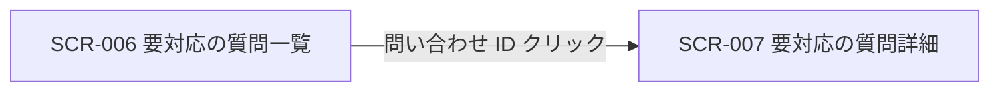

<!-- portal-top -->
[設計ポータル](../../../README.md) ／ [基本設計](../../index.md) ／ [フロントエンド設計](../index.md) ／ [画面設計](index.md) ／ **SCR-006 要対応の質問一覧**
<!-- /portal-top -->

# SCR-006 要対応の質問一覧

> **このページは、AI が回答できなかった未解決質問を一覧表示し、絞り込み・CSV エクスポートと詳細画面への導線を提供する画面 SCR-006 を定義します。** 画面概要 / 画面遷移図 / 画面レイアウト / 画面項目定義 / 入出力一覧 / 画面イベント一覧 の 6 セクションで記述します。

*版数 v1.0 ・ 更新 2026-06-17 ・ 承認済*

## 1. 画面概要

AI が回答できなかった未解決質問を一覧で確認し、絞り込み・CSV エクスポートと詳細画面への導線を提供する画面です。

| 画面 ID | 画面名 | 機能概要 |
|----|----|----|
| `SCR-006` | 要対応の質問一覧 | 未解決質問の一覧表示・絞り込み・CSV エクスポートを行う |

| 関連     | 内容                                               |
|----------|----------------------------------------------------|
| FR / BR  | FR-068〜FR-075 / BR-145, BR-146                    |
| 関連画面 | [`SCR-007` 要対応の質問詳細](SCR-007.md) |
| 対応業務UC | [UC-030](../../../01_requirements/04_business_usecases/UC-030.md#UC-030) ・ [UC-031](../../../01_requirements/04_business_usecases/UC-031.md#UC-031) ・ [UC-030](../../../01_requirements/04_business_usecases/UC-030.md#UC-030) ・ [UC-080](../../../01_requirements/04_business_usecases/UC-080.md#UC-080) |

| ステークホルダ | 対象 |
|----------------|------|
| オーナー       | ◯    |
| メンバー       | ◯    |

> [!NOTE]
> **補足** 各ステークホルダとも当該プロジェクトへの割当が前提です。割当のないプロジェクトの未解決質問は参照不可(URL 直アクセスは権限不足表示)。

## 2. 画面遷移図

本画面からの画面遷移を、画面 ID・画面名とイベント(操作)で示します。

## 3. 画面レイアウト

## 4. 画面項目定義

本画面の入出力項目(一覧の絞り込み・列・件数表示・空状態を含む)を定義します。項目の正本は本表です。一覧表に「操作」列は設けず、詳細遷移は問い合わせ ID 列のリンクに集約します(遷移リンクは ID 列に付与する全画面共通方針)。

| 項目 ID | 項目 | 説明 | 種類 | 表示条件 | 表示 |
|----|----|----|----|----|----|
| `IT-01` | 状況フィルタ | 状況で一覧を絞り込む | チェックボックス | — | 「対応中」/「対応済み」 |
| `IT-02` | 期間フィルタ | 更新日時の期間で一覧を絞り込む | テキストボックス(日付範囲) | — | 開始日 〜 終了日(例「2026-05-01 〜 2026-05-11」) |
| `IT-03` | 問い合わせ ID | 未解決質問の ID を表示し、詳細画面への導線を兼ねる | リンク | — | 問い合わせ ID(例「INQ-7K9N4」) |
| `IT-04` | 状況 | 未解決質問の対応状況を表示する | バッジ | — | 「対応中」/「対応済み」 |
| `IT-05` | 質問 | 質問本文の冒頭(先頭 60 文字)を抜粋表示する | ラベル | — | 質問本文の先頭 60 文字(例「料金プランの変更方法について教えてください」) |
| `IT-06` | 未解決理由 | AI が回答できなかった理由を表示する | ラベル | — | 「未解決理由: 該当 FAQ なし / FAQ 間で矛盾 / 信頼度しきい値未達 / 利用者が未解決と回答」等 |
| `IT-07` | 日時 | 未解決質問の最終更新日時を表示する | ラベル | — | 相対表記(例「3 分前」「2 時間前」)+ ツールチップに絶対日時 |
| `IT-08` | 件数表示 | 一覧の表示範囲と総件数を表示する | ラベル | 1 件以上ある時 | 「1-50 / 全 248 件」形式 |
| `IT-09` | 空状態 | 未解決質問が 0 件の場合に正常状態である旨を案内する | 空状態表示 | 0 件時(空状態) | 「未解決質問はありません。ウィジェットを設置済みなら正常な状態です。」 |
| `IT-10` | 検索ボックス | 問い合わせ ID または質問テキストでフリーワード検索する | テキストボックス | — | プレースホルダ「問い合わせ ID / 質問で検索」 |
| `IT-11` | ページネーション | 一覧のページを切り替えるボタン群(前へ / 次へ / ページ番号) | ボタン群 | 2 ページ以上ある時 | 「‹」「1」「2」「3」「›」 |
| `IT-12` | 「ウィジェット設定を見る」ボタン | 空状態画面でウィジェット設定画面へ遷移するボタン | ボタン | 0 件時(空状態) | 「ウィジェット設定を見る」 |
| `IT-13` | CSV エクスポートボタン | 現在のフィルタ条件の全件を CSV でダウンロードする | ボタン | — | 「CSV エクスポート」 |
| `IT-14` | 行選択チェックボックス | 一覧の各行を選択するチェックボックス。選択後の一括操作は将来対応のため現バージョンでは操作結果を持たない。 | チェックボックス | — | — |
| `IT-15` | 全件選択チェックボックス | 一覧のヘッダ行にある全件選択チェックボックス。選択後の一括操作は将来対応のため現バージョンでは操作結果を持たない。 | チェックボックス | — | — |

## 5. 入出力一覧

本画面が読み書きするテーブル・ファイルと、呼び出す API の一覧です。テーブルの正本は [データベース設計](../../02_backend/04_database/index.md)、API の正本は [API設計](../../02_backend/03_apis/index.md) です。

<table>
<thead>
<tr>
<th rowspan="2">入出力名</th>
<th rowspan="2">説明</th>
<th rowspan="2">種別</th>
<th rowspan="2">I/O</th>
<th colspan="4">アクセス種別(CRUD)</th>
<th rowspan="2">備考</th>
</tr>
<tr>
<th>C</th>
<th>R</th>
<th>U</th>
<th>D</th>
</tr>
</thead>
<tbody>
<tr>
<td>未解決質問</td>
<td>未解決質問の一覧を取得する</td>
<td>テーブル</td>
<td>入力</td>
<td>—</td>
<td>◯</td>
<td>—</td>
<td>—</td>
<td><code>T_INQUIRIES</code>(<a href="../../02_backend/04_database/index.md#TBL-017">テーブル設計 3.14</a>)</td>
</tr>
<tr>
<td>質問ログ</td>
<td>未解決理由(<code>result_reason_code</code>)を取得する</td>
<td>テーブル</td>
<td>入力</td>
<td>—</td>
<td>◯</td>
<td>—</td>
<td>—</td>
<td><code>H_QUESTION_LOGS</code>(<a href="../../02_backend/04_database/index.md#TBL-025">テーブル設計 §2</a>)</td>
</tr>
<tr>
<td>未解決質問一覧取得</td>
<td>条件付きで未解決質問一覧を取得する API を呼び出す</td>
<td>API</td>
<td>入力</td>
<td>—</td>
<td>—</td>
<td>—</td>
<td>—</td>
<td><code>GET /inquiries</code>(<code>status</code> / <code>projectId</code> / <code>cursor</code>)(<a href="../../02_backend/03_apis/API-034.md#API-034">未解決質問一覧</a>)</td>
</tr>
<tr>
<td>未解決質問 CSV エクスポート</td>
<td>フィルタ適用結果を全件 CSV で取得する API を呼び出す</td>
<td>API</td>
<td>入力</td>
<td>—</td>
<td>◯</td>
<td>—</td>
<td>—</td>
<td><code>GET /inquiries/export</code>(<a href="../../02_backend/03_apis/API-036.md#API-036">未解決質問 CSV エクスポート</a>)</td>
</tr>
</tbody>
</table>

## 6. 画面イベント一覧

本画面のイベント(初期表示・各操作)ごとに、対象の項目 ID と処理内容を定義します。

<table>
<colgroup>
<col style="width: 10%" />
<col style="width: 12%" />
<col style="width: 12%" />
<col style="width: 30%" />
<col style="width: 46%" />
</colgroup>
<thead>
<tr>
<th>EVT-ID</th>
<th>イベント ID</th>
<th>項目 ID</th>
<th>イベント</th>
<th>処理</th>
</tr>
</thead>
<tbody>
<tr>
<td><a href="../02_screen_events/EVT-046.md#EVT-046">EVT-046</a></td>
<td><code>EV-01</code></td>
<td>—</td>
<td>初期表示</td>
<td><ul>
<li><a href="../../02_backend/03_apis/API-034.md#API-034">未解決質問一覧</a> API を呼び出し、一覧を取得して表示する</li>
<li>1 件以上: <a href="#IT-08">IT-08</a> の件数表示を更新する</li>
<li>0 件: <a href="#IT-09">IT-09</a> の空状態を表示する</li>
</ul></td>
</tr>
<tr>
<td><a href="../02_screen_events/EVT-047.md#EVT-047">EVT-047</a></td>
<td><code>EV-02</code></td>
<td><a href="#IT-01">IT-01</a></td>
<td>状況フィルタをチェック</td>
<td><ul>
<li>チェック中の状況条件を付与して <a href="../../02_backend/03_apis/API-034.md#API-034">未解決質問一覧</a> API を再取得し、一覧を更新する</li>
<li>結果が 0 件: <a href="#IT-09">IT-09</a> の空状態を表示する</li>
</ul></td>
</tr>
<tr>
<td><a href="../02_screen_events/EVT-048.md#EVT-048">EVT-048</a></td>
<td><code>EV-03</code></td>
<td><a href="#IT-02">IT-02</a></td>
<td>期間フィルタを入力</td>
<td><ul>
<li>入力中の期間条件を付与して <a href="../../02_backend/03_apis/API-034.md#API-034">未解決質問一覧</a> API を再取得し、一覧を更新する</li>
<li>結果が 0 件: <a href="#IT-09">IT-09</a> の空状態を表示する</li>
</ul></td>
</tr>
<tr>
<td><a href="../02_screen_events/EVT-049.md#EVT-049">EVT-049</a></td>
<td><code>EV-04</code></td>
<td><a href="#IT-13">IT-13</a></td>
<td>「CSV エクスポート」を押下</td>
<td><ul>
<li>現在のフィルタ条件を付与して <a href="../../02_backend/03_apis/API-036.md#API-036">未解決質問 CSV エクスポート</a> API を呼び出し、レスポンスを CSV ファイルとしてダウンロードする</li>
<li>失敗時: エラーメッセージを表示する</li>
</ul></td>
</tr>
<tr>
<td><a href="../02_screen_events/EVT-050.md#EVT-050">EVT-050</a></td>
<td><code>EV-05</code></td>
<td><a href="#IT-03">IT-03</a></td>
<td>問い合わせ ID リンクを押下</td>
<td>要対応の質問詳細画面(<a href="SCR-007.md">SCR-007</a>)へ遷移する</td>
</tr>
<tr>
<td><a href="../02_screen_events/EVT-051.md#EVT-051">EVT-051</a></td>
<td><code>EV-06</code></td>
<td><a href="#IT-10">IT-10</a></td>
<td>検索ボックスに入力</td>
<td><ul>
<li>入力されたフリーワードを条件として付与し、<a href="../../02_backend/03_apis/API-034.md#API-034">未解決質問一覧</a> API を再取得して一覧を更新する</li>
<li>結果が 0 件: <a href="#IT-09">IT-09</a> の空状態を表示する</li>
</ul></td>
</tr>
<tr>
<td><a href="../02_screen_events/EVT-052.md#EVT-052">EVT-052</a></td>
<td><code>EV-07</code></td>
<td><a href="#IT-11">IT-11</a></td>
<td>ページを選択</td>
<td><ul>
<li>選択したページの offset を付与して <a href="../../02_backend/03_apis/API-034.md#API-034">未解決質問一覧</a> API を再取得し、一覧を更新する</li>
</ul></td>
</tr>
<tr>
<td><a href="../02_screen_events/EVT-053.md#EVT-053">EVT-053</a></td>
<td><code>EV-08</code></td>
<td><a href="#IT-12">IT-12</a></td>
<td>「ウィジェット設定を見る」を押下</td>
<td>ウィジェット設定画面(<a href="SCR-011.md">SCR-011</a>)へ遷移する</td>
</tr>
</tbody>
</table>

---

<!-- portal-bottom -->
[← 画面設計](index.md) ・ [基本設計](../../index.md) ・ [↑ 設計ポータル](../../../README.md)
<!-- /portal-bottom -->
