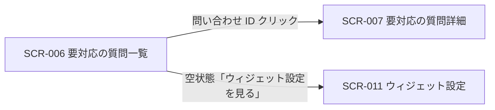

| 画面 ID | 画面名 | トレーサビリティID |
|----|----|----|
| SCR-006 | 要対応の質問一覧 | [TR-030](../../00_traceability/index.md#TR-030) ・ [TR-031](../../00_traceability/index.md#TR-031) ・ [TR-078](../../00_traceability/index.md#TR-078) |

| ステークホルダ | 対象 |
|----------------|------|
| オーナー       | ◯    |
| メンバー       | ◯    |

## 1. 画面概要

AI が回答できなかった未解決質問を一覧で確認し、状況・期間・フリーワードでの絞り込み・CSV エクスポートと詳細画面への導線を提供する画面です。

> [!NOTE]
> **補足** 各ステークホルダとも当該プロジェクトへの割当が前提です。割当のないプロジェクトの未解決質問は参照不可で、URL 直アクセス時は権限不足のメッセージを表示します。

## 2. 画面遷移図

本画面からの画面遷移を、画面 ID・画面名とイベント(操作)で示します。

## 3. 画面レイアウト

本画面の代表状態(通常時の一覧)を示します。空状態(0 件)・権限不足の各状態は §4 の `表示条件` で定義します。

## 4. 画面項目

本画面が各状態で表示する入出力項目(絞り込み・一覧の列・件数表示・ページネーション・空状態・権限不足表示を含む)を定義します。`表示条件` は項目が表示される状態を示します。詳細遷移は問い合わせ ID 列のリンクに集約します(遷移リンクは ID 列に付与する全画面共通方針)。

| # | 項目 | 種類 | 必須 | 最大長 | 初期値 | 表示条件 |
|----|----|----|----|----|----|----|
| 1 | 状況フィルタ | button | — | — | — | 一覧表示時 |
| 2 | 期間フィルタ(開始日 〜 終了日) | input(text) | — | — | — | 一覧表示時 |
| 3 | 検索ボックス | input(text) | — | — | — | 一覧表示時 |
| 4 | CSV エクスポートボタン | button | — | — | — | 一覧表示時(0 件時は非活性) |
| 5 | 全件選択チェックボックス | checkbox | — | — | 未チェック | 1 件以上ある時 |
| 6 | 行選択チェックボックス | checkbox | — | — | 未チェック | 1 件以上ある時 |
| 7 | 問い合わせ ID | link | — | — | — | 1 件以上ある時 |
| 8 | 状況 | div | — | — | — | 1 件以上ある時 |
| 9 | 質問 | div | — | — | — | 1 件以上ある時 |
| 10 | 未解決理由 | div | — | — | — | 1 件以上ある時 |
| 11 | 日時 | div | — | — | — | 1 件以上ある時 |
| 12 | 件数表示 | div | — | — | — | 1 件以上ある時 |
| 13 | ページネーション | button | — | — | — | 2 ページ以上ある時 |
| 14 | 空状態表示 | div | — | — | — | 0 件時(空状態) |
| 15 | 「ウィジェット設定を見る」ボタン | button | — | — | — | 0 件時(空状態) |
| 16 | 権限不足アラート | alert | — | — | — | 未割当プロジェクトへの直アクセス時 |

- **#1 状況フィルタの選択肢(コード値=表示名)**: open=対応中 / closed=対応済み(複数選択可。一覧上部の切替ボタンで選択する)。
- **#8 状況の表示値(コード値=表示名)**: open=対応中 / closed=対応済み。
- **#10 未解決理由の表示値**: 該当 FAQ なし / FAQ 間で内容が矛盾 / 信頼度しきい値未達(例「信頼度 0.42(しきい値 0.60 未達)」)/ 利用者が未解決と回答。

## 5. バリデーション

本画面の絞り込み入力は自由語・状況の選択であり、送信を中止する入力検証はありません。

(本画面に入力検証はありません)

## 6. イベント

本画面のイベント(初期表示・各操作)ごとに、対象の画面項目を定義します。各イベントの処理内容は [7. 画面イベント詳細](#7-画面イベント詳細) で定義します。

<table>
<colgroup>
<col style="width: 18%" />
<col style="width: 22%" />
<col style="width: 60%" />
</colgroup>
<thead>
<tr>
<th>EVT-ID</th>
<th>画面項目</th>
<th>イベント</th>
</tr>
</thead>
<tbody>
<tr>
<td>EVT-035</td>
<td>—</td>
<td>初期表示</td>
</tr>
<tr>
<td>EVT-036</td>
<td>#1</td>
<td>状況フィルタを切り替え</td>
</tr>
<tr>
<td>EVT-037</td>
<td>#2</td>
<td>期間フィルタを入力</td>
</tr>
<tr>
<td>EVT-038</td>
<td>#4</td>
<td>「CSV エクスポート」を押下</td>
</tr>
<tr>
<td>EVT-039</td>
<td>#7</td>
<td>問い合わせ ID リンクを押下</td>
</tr>
<tr>
<td>EVT-040</td>
<td>#3</td>
<td>検索ボックスに入力</td>
</tr>
<tr>
<td>EVT-041</td>
<td>#13</td>
<td>ページを選択</td>
</tr>
<tr>
<td>EVT-042</td>
<td>#15</td>
<td>「ウィジェット設定を見る」を押下</td>
</tr>
</tbody>
</table>

## 7. 画面イベント詳細

各イベントの処理内容を定義します。

<table>
<colgroup>
<col style="width: 14%" />
<col style="width: 86%" />
</colgroup>
<thead>
<tr>
<th>EVT-ID</th>
<th>処理</th>
</tr>
</thead>
<tbody>
<tr>
<td>EVT-035</td>
<td>初期表示時に次を行う:<pre>
1. <a href="../../02_backend/03_apis/API-034.md#API-034">未解決質問一覧</a> API を呼び出し、一覧を取得する
2. 件数で分岐する
   ┣ 1 件以上: 一覧(#7〜#11)と件数表示(#12)・ページネーション(#13)を表示する
   ┗ 0 件: 空状態表示(#14)と「ウィジェット設定を見る」ボタン(#15)を表示する
3. 当該プロジェクトへの参照権限が無い場合は権限不足アラート(#16・EM-01)を表示する
</pre></td>
</tr>
<tr>
<td>EVT-036</td>
<td>状況フィルタ(#1)切替時に、選択中の状況条件(open / closed)を付与して <a href="../../02_backend/03_apis/API-034.md#API-034">未解決質問一覧</a> API を再取得し、一覧を更新する(結果が 0 件の場合は空状態表示(#14)を表示する)</td>
</tr>
<tr>
<td>EVT-037</td>
<td>期間フィルタ(#2)入力時に、入力中の期間条件を付与して未解決質問一覧を再取得し、一覧を更新する(結果が 0 件の場合は空状態表示(#14)を表示する)</td>
</tr>
<tr>
<td>EVT-038</td>
<td>「CSV エクスポート」(#4)押下時に、現在のフィルタ条件(状況・期間・フリーワード)を付与して <a href="../../02_backend/03_apis/API-036.md#API-036">未解決質問 CSV エクスポート</a> API を呼び出し、レスポンスを CSV ファイルとしてダウンロードする(失敗時はエラーメッセージ(EM-02)を表示する)</td>
</tr>
<tr>
<td>EVT-039</td>
<td>問い合わせ ID リンク(#7)押下時に、要対応の質問詳細画面(<a href="SCR-007.md">SCR-007</a>)へ遷移する</td>
</tr>
<tr>
<td>EVT-040</td>
<td>検索ボックス(#3)入力時に、入力されたフリーワードを条件として付与し、未解決質問一覧を再取得して一覧を更新する(結果が 0 件の場合は空状態表示(#14)を表示する)</td>
</tr>
<tr>
<td>EVT-041</td>
<td>ページネーション(#13)選択時に、選択したページのカーソルを付与して <a href="../../02_backend/03_apis/API-034.md#API-034">未解決質問一覧</a> API を再取得し、一覧を更新する</td>
</tr>
<tr>
<td>EVT-042</td>
<td>「ウィジェット設定を見る」(#15)押下時に、ウィジェット設定画面(<a href="SCR-011.md">SCR-011</a>)へ遷移する</td>
</tr>
</tbody>
</table>

## 8. エラーメッセージ

本画面が表示するエラー・警告メッセージを定義します。

| エラーコード | エラーメッセージ |
|----|----|
| EM-01 | このプロジェクトの未解決質問を参照する権限がありません。担当プロジェクトのオーナーまたはメンバーに割当を依頼してください |
| EM-02 | CSV のエクスポートに失敗しました。時間をおいて再度お試しください |
