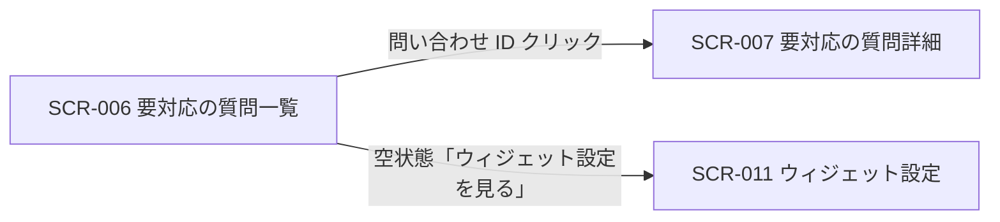
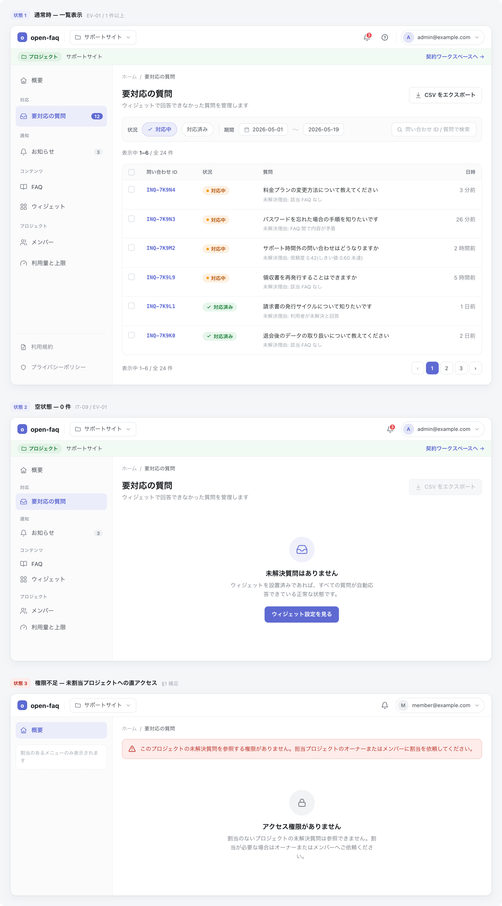

# SCR-006: 要対応の質問一覧

| ID | 業務ユースケースID | API ID |
|----|----|----|
| SCR-006 | [UC-029](../../../01_requirements/04_business_usecases/UC-029.md#UC-029) ・ [UC-030](../../../01_requirements/04_business_usecases/UC-030.md#UC-030) ・ [UC-074](../../../01_requirements/04_business_usecases/UC-074.md#UC-074) | [API-034](../../02_backend/03_apis/API-034.md#API-034) ・ [API-036](../../02_backend/03_apis/API-036.md#API-036) ・ [API-035](../../02_backend/03_apis/API-035.md#API-035) ・ [API-065](../../02_backend/03_apis/API-065.md#API-065) |

| ステークホルダ | 対象 |
|----------------|------|
| オーナー       | ◯    |
| メンバー       | ◯    |

## 1. 画面概要

- AI が回答できなかった質問、および利用者が回答後に未解決とフィードバックした質問を一覧で確認する。
- 対象はオーナーとメンバーで、いずれも当該プロジェクトへの割当が前提となる。
- 主要な表示状態は通常時の一覧・0 件の空状態。

## 2. 画面遷移図

本画面からの画面遷移を、画面 ID・画面名とイベント(操作)で示します。

## 3. 画面レイアウト

本画面の代表状態(通常時の一覧)を示します。

## 4. 画面項目

本画面が表示する入出力項目を定義します。

| # | 項目 | 種類 | 必須 | 最大長 | 初期値 | 表示条件 |
|----|----|----|----|----|----|----|
| 1 | 状況フィルタ | button | — | — | — | 一覧表示時 |
| 2 | 期間フィルタ(開始日 〜 終了日) | input(text) | — | — | — | 一覧表示時 |
| 3 | 検索ボックス | input(text) | — | — | — | 一覧表示時 |
| 4 | CSV エクスポートボタン | button | — | — | — | 一覧表示時(0 件時は非活性) |
| 5 | 全件選択チェックボックス | checkbox | — | — | 未チェック | 1 件以上ある時 |
| 6 | 行選択チェックボックス | checkbox | — | — | 未チェック | 1 件以上ある時 |
| 7 | 問い合わせ ID | link | — | — | — | 1 件以上ある時 |
| 8 | 状況 | label | — | — | — | 1 件以上ある時 |
| 9 | 質問 | label | — | — | — | 1 件以上ある時 |
| 10 | 未解決理由 | label | — | — | — | 1 件以上ある時 |
| 11 | 日時 | label | — | — | — | 1 件以上ある時 |
| 12 | 件数表示 | label | — | — | — | 1 件以上ある時 |
| 13 | ページネーション | button | — | — | — | 2 ページ以上ある時 |
| 14 | 空状態表示 | label | — | — | — | 0 件時(空状態) |
| 15 | 「ウィジェット設定を見る」ボタン | button | — | — | — | 0 件時(空状態) |

データパターン(選択肢・状態値など値のパターンを持つ項目)を定義する。

| 画面項目 | 表示名 | 補足 |
|----|----|----|
| #1 | 対応中 | 複数選択可。一覧上部の切替ボタンで選択する |
| #1 | 対応済み | 複数選択可。一覧上部の切替ボタンで選択する |
| #8 | 対応中 | — |
| #8 | 対応済み | — |
| #10 | 該当 FAQ なし | — |
| #10 | FAQ 間で内容が矛盾 | — |
| #10 | 信頼度しきい値未達 | 例「信頼度 0.42(しきい値 0.60 未達)」 |
| #10 | 利用者が未解決と回答 | 回答後にウィジェット利用者が「役に立たなかった」を選択した場合 |

## 5. バリデーション

入力検証を定義する。

(本画面に入力検証はありません)

## 6. イベント

本画面のイベント(初期表示・各操作)ごとに、対象の画面項目を定義します。各イベントの処理内容は [7. 画面イベント詳細](#7-画面イベント詳細) で定義します。

<table>
<colgroup>
<col style="width: 18%" />
<col style="width: 22%" />
<col style="width: 60%" />
</colgroup>
<thead>
<tr>
<th>EVT-ID</th>
<th>画面項目</th>
<th>イベント</th>
</tr>
</thead>
<tbody>
<tr>
<td>EVT-01</td>
<td>—</td>
<td>初期表示</td>
</tr>
<tr>
<td>EVT-02</td>
<td>#1</td>
<td>状況フィルタを切り替え</td>
</tr>
<tr>
<td>EVT-03</td>
<td>#2</td>
<td>期間フィルタを入力</td>
</tr>
<tr>
<td>EVT-04</td>
<td>#4</td>
<td>「CSV エクスポート」を押下</td>
</tr>
<tr>
<td>EVT-05</td>
<td>#7</td>
<td>問い合わせ ID リンクを押下</td>
</tr>
<tr>
<td>EVT-06</td>
<td>#3</td>
<td>検索ボックスに入力</td>
</tr>
<tr>
<td>EVT-07</td>
<td>#13</td>
<td>ページを選択</td>
</tr>
<tr>
<td>EVT-08</td>
<td>#15</td>
<td>「ウィジェット設定を見る」を押下</td>
</tr>
</tbody>
</table>

## 7. 画面イベント詳細

各イベントの処理内容を定義します。

<table>
<colgroup>
<col style="width: 14%" />
<col style="width: 86%" />
</colgroup>
<thead>
<tr>
<th>EVT-ID</th>
<th>処理</th>
</tr>
</thead>
<tbody>
<tr>
<td>EVT-01</td>
<td>初期表示時に未解決質問の一覧を表示する(<a href="../../02_backend/03_apis/API-034.md#API-034">未解決質問一覧(API-034)</a> API):<pre>
 ┣ 1 件以上: 一覧(#7〜#11)・件数表示(#12)・ページネーション(#13)を表示する
 ┗ 0 件: 空状態表示(#14)と「ウィジェット設定を見る」ボタン(#15)を表示する
</pre></td>
</tr>
<tr>
<td>EVT-02</td>
<td>状況フィルタ(#1)切替時に、選択した状況で絞り込んだ未解決質問の一覧を表示する(0 件の場合は空状態表示(#14)を表示する)</td>
</tr>
<tr>
<td>EVT-03</td>
<td>期間フィルタ(#2)入力時に、入力した期間で絞り込んだ未解決質問の一覧を表示する(0 件の場合は空状態表示(#14)を表示する)</td>
</tr>
<tr>
<td>EVT-04</td>
<td>「CSV エクスポート」(#4)押下時に、表示中の未解決質問を CSV ファイルとしてダウンロードする(<a href="../../02_backend/03_apis/API-036.md#API-036">未解決質問 CSV エクスポート(API-036)</a> API。失敗時はエラーメッセージ(EM-01)を表示する)</td>
</tr>
<tr>
<td>EVT-05</td>
<td>問い合わせ ID リンク(#7)押下時に、要対応の質問詳細画面(<a href="SCR-007.md">SCR-007</a>)へ遷移する</td>
</tr>
<tr>
<td>EVT-06</td>
<td>検索ボックス(#3)入力時に、入力したフリーワードで絞り込んだ未解決質問の一覧を表示する(0 件の場合は空状態表示(#14)を表示する)</td>
</tr>
<tr>
<td>EVT-07</td>
<td>ページネーション(#13)選択時に、選択したページの未解決質問の一覧を表示する(<a href="../../02_backend/03_apis/API-034.md#API-034">未解決質問一覧(API-034)</a> API)</td>
</tr>
<tr>
<td>EVT-08</td>
<td>「ウィジェット設定を見る」(#15)押下時に、ウィジェット設定画面(<a href="SCR-011.md">SCR-011</a>)へ遷移する</td>
</tr>
</tbody>
</table>

## 8. エラーメッセージ

本画面が表示するエラー・警告メッセージを定義します。

| エラーコード | エラーメッセージ |
|----|----|
| EM-01 | CSV のエクスポートに失敗しました。時間をおいて再度お試しください |
