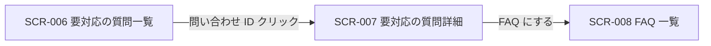
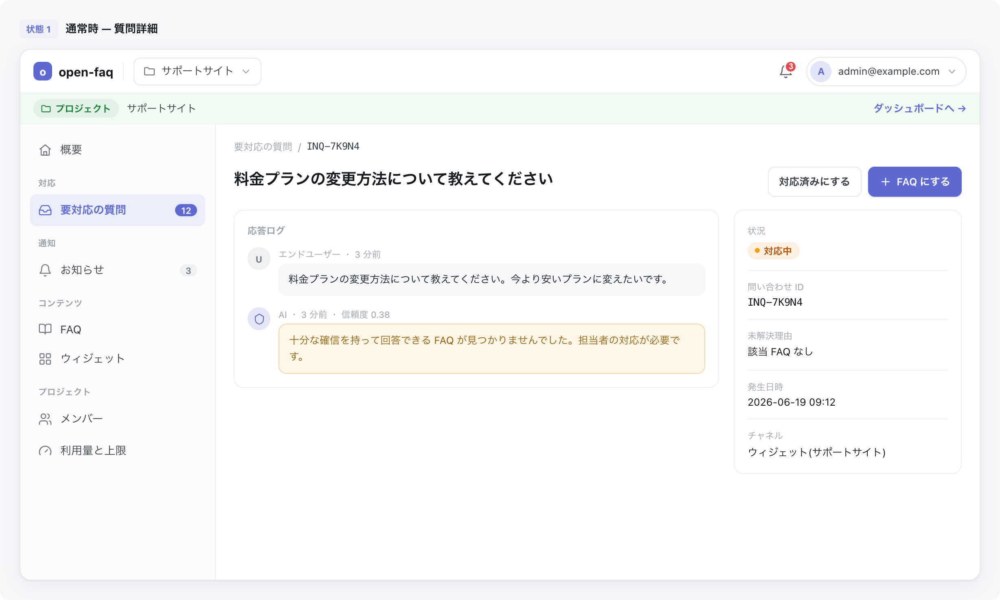
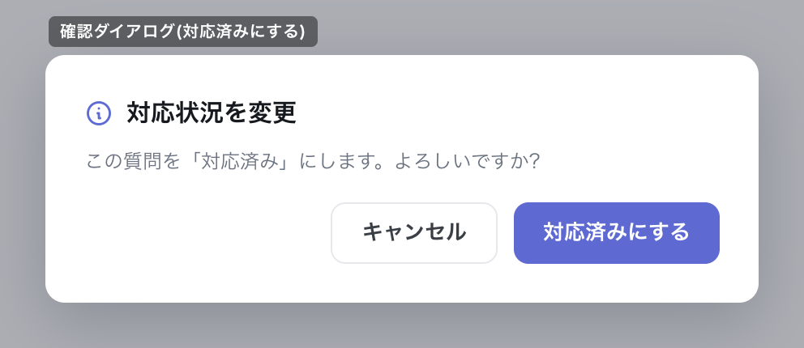

| 画面 ID | 画面名 | トレーサビリティID |
|----|----|----|
| SCR-007 | 要対応の質問詳細 | [TR-025](../../00_traceability/index.md#TR-025) ・ [TR-031](../../00_traceability/index.md#TR-031) ・ [TR-032](../../00_traceability/index.md#TR-032) ・ [TR-078](../../00_traceability/index.md#TR-078) |

| ステークホルダ | 対象 |
|----------------|------|
| オーナー       | ◯    |
| メンバー       | ◯    |

## 1. 画面概要

- 一覧から選択した未解決質問の内容と応答ログを確認する。
- 対象はオーナーとメンバーで、いずれも当該プロジェクトへの割当が前提となる。
- 割当のないプロジェクトへの URL 直アクセス時は権限不足を表示する。

## 2. 画面遷移図

本画面への流入と本画面からの遷移を、画面 ID・画面名とイベント(操作)で示します。

## 3. 画面レイアウト

本画面の代表状態(質問詳細・対応状況の切替確認ダイアログ)を示します。

## 4. 画面項目

本画面が表示する入出力項目を定義します。

| # | 項目 | 種類 | 必須 | 最大長 | 初期値 | 表示条件 |
|----|----|----|----|----|----|----|
| 1 | パンくず(要対応の質問 / 問い合わせ ID) | link | — | — | — | 常時 |
| 2 | ページタイトル(質問内容) | label | — | — | — | 常時 |
| 3 | 対応済みにするボタン | button | — | — | — | 状況=対応中のとき |
| 4 | FAQ にするボタン | button | — | — | — | 当該プロジェクトのメンバー(オーナーを含む) |
| 5 | 応答ログ | label | — | — | — | 常時 |
| 6 | 状況バッジ | label | — | — | — | 常時 |
| 7 | 問い合わせ ID | label | — | — | — | 常時 |
| 8 | 未解決理由 | label | — | — | — | 常時 |
| 9 | 発生日時 | label | — | — | — | 常時 |
| 10 | チャネル | label | — | — | — | 常時 |
| 11 | 確認ダイアログ OK ボタン | button | — | — | — | 対応済みへの変更の確認ダイアログ表示中 |
| 12 | 確認ダイアログ キャンセルボタン | button | — | — | — | 対応済みへの変更の確認ダイアログ表示中 |

データパターン(選択肢・状態値など値のパターンを持つ項目)を定義する。

| 画面項目 | 表示名 | 補足 |
|----|----|----|
| #6 | 対応中 | — |
| #6 | 対応済み | — |

## 5. バリデーション

入力検証を定義する。(本画面に入力検証はありません)

## 6. イベント

本画面のイベント(初期表示・各操作)ごとに、対象の画面項目を定義します。各イベントの処理内容は [7. 画面イベント詳細](#7-画面イベント詳細) で定義します。

<table>
<colgroup>
<col style="width: 18%" />
<col style="width: 22%" />
<col style="width: 60%" />
</colgroup>
<thead>
<tr>
<th>EVT-ID</th>
<th>画面項目</th>
<th>イベント</th>
</tr>
</thead>
<tbody>
<tr>
<td>EVT-01</td>
<td>—</td>
<td>初期表示</td>
</tr>
<tr>
<td>EVT-02</td>
<td>#3</td>
<td>「対応済みにする」を押下</td>
</tr>
<tr>
<td>EVT-03</td>
<td>#11</td>
<td>確認ダイアログの「OK」を押下</td>
</tr>
<tr>
<td>EVT-04</td>
<td>#12</td>
<td>確認ダイアログの「キャンセル」を押下</td>
</tr>
<tr>
<td>EVT-05</td>
<td>#4</td>
<td>「FAQ にする」を押下</td>
</tr>
</tbody>
</table>

## 7. 画面イベント詳細

各イベントの処理内容を定義します。

<table>
<colgroup>
<col style="width: 14%" />
<col style="width: 86%" />
</colgroup>
<thead>
<tr>
<th>EVT-ID</th>
<th>処理</th>
</tr>
</thead>
<tbody>
<tr>
<td>EVT-01</td>
<td>初期表示時に、対象質問の内容・応答ログ・状況・メタ情報を表示する(<a href="../../02_backend/03_apis/API-035.md#API-035">未解決質問詳細・状況切替(API-035)</a> API)。状況=対応済みのとき「対応済みにする」ボタン(#3)は表示しない</td>
</tr>
<tr>
<td>EVT-02</td>
<td>「対応済みにする」押下時に確認ダイアログを表示する(EVT-03 / EVT-04 へ)</td>
</tr>
<tr>
<td>EVT-03</td>
<td>確認ダイアログの「OK」押下時に、対応状況を「対応済み」に更新する(<a href="../../02_backend/03_apis/API-035.md#API-035">未解決質問詳細・状況切替(API-035)</a> API):<pre>
 ┣ 成功: 状況バッジ(#6)を「対応済み」に更新し、対応済みにするボタン(#3)を非表示にする
 ┗ 失敗: エラートースト(EM-01)を表示し、状況を変更前に戻す
</pre></td>
</tr>
<tr>
<td>EVT-04</td>
<td>確認ダイアログの「キャンセル」押下時に状況を変更前に戻し、ダイアログを閉じる</td>
</tr>
<tr>
<td>EVT-05</td>
<td>「FAQ にする」押下時に当該質問を起点に FAQ 編集画面(SCR-008)へ遷移する(オーナー・メンバーのみ表示・操作可)</td>
</tr>
</tbody>
</table>

## 8. エラーメッセージ

本画面が表示するエラー・警告メッセージを定義します。

| エラーコード | エラーメッセージ |
|----|----|
| EM-01 | 対応状況の更新に失敗しました。時間をおいて再度お試しください |
