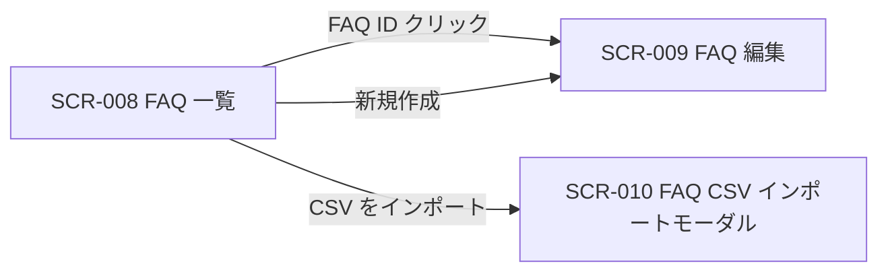

| 画面 ID | 画面名 | トレーサビリティID |
|----|----|----|
| SCR-008 | FAQ 一覧 | [TR-024](../../00_traceability/index.md#TR-024) ・ [TR-025](../../00_traceability/index.md#TR-025) ・ [TR-026](../../00_traceability/index.md#TR-026) ・ [TR-027](../../00_traceability/index.md#TR-027) ・ [TR-028](../../00_traceability/index.md#TR-028) ・ [TR-029](../../00_traceability/index.md#TR-029) ・ [TR-078](../../00_traceability/index.md#TR-078) |

| ステークホルダ | 対象 |
|----------------|------|
| オーナー       | ◯    |
| メンバー       | ◯    |

## 1. 画面概要

プロジェクトの FAQ を一覧で確認し、検索・絞り込み・並び替え・一括操作・CSV エクスポートと、編集・新規作成・CSV インポートへの導線を提供する画面です。

> [!NOTE]
> **補足** 各ステークホルダとも当該プロジェクトへの割当が前提です。割当のないプロジェクトの FAQ は参照不可(URL 直アクセスは権限不足表示)。一覧表に行内の「操作」列は設けず、編集遷移は FAQ ID 列のリンクに集約します(遷移リンクは ID 列に付与する全画面共通方針)。状態切替・削除は編集画面(SCR-009)、複数 FAQ への一括処理は一括操作バーで行います。

## 2. 画面遷移図

本画面からの画面遷移を、画面 ID・画面名とイベント(操作)で示します。

## 3. 画面レイアウト

本画面の代表状態(通常時 — 一覧表示)を示します。行選択時の一括操作バー・FAQ 0 件時の空状態は §4 の `表示条件` で定義します。

## 4. 画面項目

本画面が各状態で表示する入出力項目(検索・絞り込み・並び替え・一覧の列・件数表示・一括操作・空状態を含む)を定義します。`表示条件` は項目が表示される状態を示します。一覧表に「操作」列は設けず、編集遷移は FAQ ID 列のリンクに集約します。

| # | 項目 | 種類 | 必須 | 最大長 | 初期値 | 表示条件 |
|----|----|----|----|----|----|----|
| 1 | キーワード検索 | input(text) | — | 100 | — | — |
| 2 | 状態フィルタ | button | — | — | すべて | — |
| 3 | カテゴリフィルタ | select | — | — | すべて | — |
| 4 | 行選択チェックボックス | checkbox | — | — | 未チェック | — |
| 5 | FAQ ID | link | — | — | — | — |
| 6 | 質問 | label | — | — | — | — |
| 7 | カテゴリ | label | — | — | — | — |
| 8 | 状態バッジ | badge | — | — | — | — |
| 9 | 更新日時 | label | — | — | — | — |
| 10 | 件数表示 | label | — | — | — | — |
| 11 | ページネーション | div | — | — | — | — |
| 12 | 新規作成ボタン | button | — | — | — | — |
| 13 | CSV をインポートボタン | button | — | — | — | — |
| 14 | CSV をエクスポートボタン | button | — | — | — | — |
| 15 | 一括操作バー | div | — | — | — | 1 件以上選択時に下部固定 |
| 16 | 一括公開ボタン | button | — | — | — | 1 件以上選択時(一括操作バー内) |
| 17 | 一括非公開化ボタン | button | — | — | — | 1 件以上選択時(一括操作バー内) |
| 18 | 一括削除ボタン | button | — | — | — | 1 件以上選択時(一括操作バー内) |
| 19 | 選択を解除ボタン | button | — | — | — | 1 件以上選択時(一括操作バー内) |
| 20 | 空状態 | div | — | — | — | FAQ 0 件時のみ表示 |

- **#2 状態フィルタの選択肢(コード値=表示名)**: all=すべて / published=公開 / draft=下書き
- **#3 カテゴリフィルタの選択肢(コード値=表示名)**: all=すべて / 各カテゴリ ID=各カテゴリ名(プロジェクト内カテゴリを動的に列挙)
- **#8 状態バッジの選択肢(コード値=表示名)**: draft=下書き / published=公開中 / hidden=非公開(色のみ依存禁止。ラベルを併記)

## 5. バリデーション

本画面のキーワード検索は最大長(100 文字)を超える入力を抑止します。それ以外の入力検証はありません。

| 画面項目 | タイミング | ルール | エラーコード |
|----|----|----|----|
| #1 | 入力時 | 最大長チェック | EM-01 |

## 6. イベント

本画面のイベント(初期表示・各操作)ごとに、対象の画面項目を定義します。各イベントの処理内容は [7. 画面イベント詳細](#7-画面イベント詳細) で定義します。

<table>
<colgroup>
<col style="width: 18%" />
<col style="width: 22%" />
<col style="width: 60%" />
</colgroup>
<thead>
<tr>
<th>EVT-ID</th>
<th>画面項目</th>
<th>イベント</th>
</tr>
</thead>
<tbody>
<tr>
<td>EVT-048</td>
<td>—</td>
<td>初期表示</td>
</tr>
<tr>
<td>EVT-049</td>
<td>#1</td>
<td>キーワードを入力</td>
</tr>
<tr>
<td>EVT-050</td>
<td>#3</td>
<td>カテゴリを選択</td>
</tr>
<tr>
<td>EVT-051</td>
<td>#9</td>
<td>一覧の列ヘッダーを押下して並び替え</td>
</tr>
<tr>
<td>EVT-052</td>
<td>#4</td>
<td>行を選択</td>
</tr>
<tr>
<td>EVT-053</td>
<td>#12</td>
<td>「+ 新規作成」を押下</td>
</tr>
<tr>
<td>EVT-054</td>
<td>#5</td>
<td>FAQ ID リンクを押下</td>
</tr>
<tr>
<td>EVT-055</td>
<td>#16</td>
<td>「公開する」を押下</td>
</tr>
<tr>
<td>EVT-056</td>
<td>#17</td>
<td>「非公開化する」を押下</td>
</tr>
<tr>
<td>EVT-057</td>
<td>#18</td>
<td>「削除する」を押下</td>
</tr>
<tr>
<td>EVT-058</td>
<td>#19</td>
<td>「選択を解除」を押下</td>
</tr>
<tr>
<td>EVT-059</td>
<td>#13</td>
<td>「CSV をインポート」を押下</td>
</tr>
<tr>
<td>EVT-060</td>
<td>#14</td>
<td>「CSV をエクスポート」を押下</td>
</tr>
<tr>
<td>EVT-061</td>
<td>#20</td>
<td>空状態の「+ 新規作成」を押下</td>
</tr>
</tbody>
</table>

## 7. 画面イベント詳細

各イベントの処理内容を定義します。

<table>
<colgroup>
<col style="width: 14%" />
<col style="width: 86%" />
</colgroup>
<thead>
<tr>
<th>EVT-ID</th>
<th>処理</th>
</tr>
</thead>
<tbody>
<tr>
<td>EVT-048</td>
<td>初期表示時に一覧を取得して表示する<pre>
1. <a href="../../02_backend/03_apis/API-025.md#API-025">FAQ 一覧</a> API で当該プロジェクトの FAQ 一覧を取得する
2. 取得件数で分岐する
   ┣ 1 件以上: 一覧(#4〜#9)・件数表示(#10)・ページネーション(#11)を表示する
   ┗ 0 件: 空状態(#20)を表示する
</pre></td>
</tr>
<tr>
<td>EVT-049</td>
<td>キーワード入力時に <a href="../../02_backend/03_apis/API-031.md#API-031">FAQ 全文検索</a> API を実行し、一覧と件数表示(#10)を更新する</td>
</tr>
<tr>
<td>EVT-050</td>
<td>カテゴリ選択時にカテゴリ条件を付与して <a href="../../02_backend/03_apis/API-025.md#API-025">FAQ 一覧</a> API を再取得し、一覧と件数表示(#10)を更新する</td>
</tr>
<tr>
<td>EVT-051</td>
<td>一覧の列ヘッダー(関連度 / 更新日時 / 作成日時)押下時に、押下のたびに昇順 / 降順をトグルし、対象列を sort として <a href="../../02_backend/03_apis/API-025.md#API-025">FAQ 一覧</a> API を再取得して一覧を更新する</td>
</tr>
<tr>
<td>EVT-052</td>
<td>行のチェックボックス(#4)操作時に選択状態を更新する<pre>
 ┣ チェックを入れる: 対象 FAQ を選択状態にし、1 件以上選択時に一括操作バー(#15)を下部に表示する(最大 50 件まで選択可)
 ┗ チェックを外す: 選択を解除し、0 件になった時は一括操作バー(#15)を非表示にする
</pre></td>
</tr>
<tr>
<td>EVT-053</td>
<td>「+ 新規作成」押下時に編集画面(SCR-009)を新規モードで開く</td>
</tr>
<tr>
<td>EVT-054</td>
<td>FAQ ID リンク(#5)押下時に編集画面(SCR-009)を編集モードで開く</td>
</tr>
<tr>
<td>EVT-055</td>
<td>「公開する」押下時に選択中 FAQ を一括公開する<pre>
1. 選択中 FAQ(最大 50 件)を <a href="../../02_backend/03_apis/API-027.md#API-027">FAQ 一括状態変更</a> API(POST /faqs/bulk-status・status=published)で一括公開する(1 リクエストで全選択分を送信)
2. 結果で分岐する
   ┣ 全件成功(failed が空): 一覧を再取得して表示を更新し、選択を解除する
   ┣ 一部失敗(成功 N 件 / 失敗 M 件): 「N 件を公開しました(M 件は失敗)」をトースト通知で表示する。一覧は成功分のみ反映(UI ロールバックはしない)、失敗分の行は選択状態を保持し再操作に備える
   ┗ 全件失敗 / API エラー: エラートースト(EM-02)を表示し、選択状態を保持して一覧は更新しない
</pre></td>
</tr>
<tr>
<td>EVT-056</td>
<td>「非公開化する」押下時に選択中 FAQ を一括非公開化する<pre>
1. 選択中 FAQ(最大 50 件)を <a href="../../02_backend/03_apis/API-027.md#API-027">FAQ 一括状態変更</a> API(POST /faqs/bulk-status・status=hidden)で一括非公開化する(1 リクエストで全選択分を送信)
2. 結果で分岐する
   ┣ 全件成功(failed が空): 一覧を再取得して表示を更新し、選択を解除する
   ┣ 一部失敗(成功 N 件 / 失敗 M 件): 「N 件を非公開化しました(M 件は失敗)」をトースト通知で表示する。一覧は成功分のみ反映(UI ロールバックはしない)、失敗分の行は選択状態を保持し再操作に備える
   ┗ 全件失敗 / API エラー: エラートースト(EM-02)を表示し、選択状態を保持して一覧は更新しない
</pre></td>
</tr>
<tr>
<td>EVT-057</td>
<td>「削除する」押下時に選択中 FAQ を一括論理削除する<pre>
1. 確認ダイアログを表示し、削除対象件数と「削除すると復元できません」の警告を示す
2. ダイアログの選択で分岐する
   ┣ キャンセル: 何もしない
   ┗ 確認 OK: 選択中 FAQ(最大 50 件)を論理削除する(一括削除 API 未定義のため、各 FAQ ID に対して <a href="../../02_backend/03_apis/API-026.md#API-026">FAQ 作成・更新・削除</a> API の DELETE を順次実行し、成功 / 失敗を行単位で集計する)
      ┣ 全件成功: 一覧を再取得して表示を更新し、選択を解除する
      ┣ 一部失敗(成功 N 件 / 失敗 M 件): 「N 件を削除しました(M 件は失敗)」をトースト通知で表示する。一覧は成功分のみ反映(UI ロールバックはしない)、失敗分の行は選択状態を保持して再操作に備える
      ┗ 全件失敗: エラートースト(EM-03)を表示し、選択状態を保持して一覧は更新しない
</pre></td>
</tr>
<tr>
<td>EVT-058</td>
<td>「選択を解除」押下時に全選択を解除し、一括操作バー(#15)を非表示にする</td>
</tr>
<tr>
<td>EVT-059</td>
<td>「CSV をインポート」押下時に CSV インポートモーダル(SCR-010)を開く</td>
</tr>
<tr>
<td>EVT-060</td>
<td>「CSV をエクスポート」押下時に CSV をダウンロードする<pre>
1. <a href="../../02_backend/03_apis/API-030.md#API-030">FAQ CSV エクスポート</a> API でフィルタ適用結果を CSV(UTF-8)として取得しダウンロードする
2. 失敗: エラートースト(EM-04)を表示する
</pre></td>
</tr>
<tr>
<td>EVT-061</td>
<td>空状態(#20)の「+ 新規作成」押下時に編集画面(SCR-009)を新規モードで開く(EVT-053 と同処理)</td>
</tr>
</tbody>
</table>

## 8. エラーメッセージ

本画面が表示するエラー・警告メッセージを定義します。

| エラーコード | エラーメッセージ |
|----|----|
| EM-01 | キーワードは 100 文字以内で入力してください |
| EM-02 | 状態の変更に失敗しました。時間をおいて再度お試しください |
| EM-03 | 削除に失敗しました。時間をおいて再度お試しください |
| EM-04 | CSV のエクスポートに失敗しました。時間をおいて再度お試しください |
