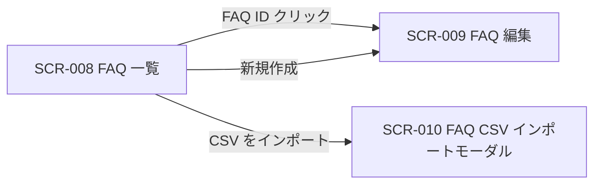
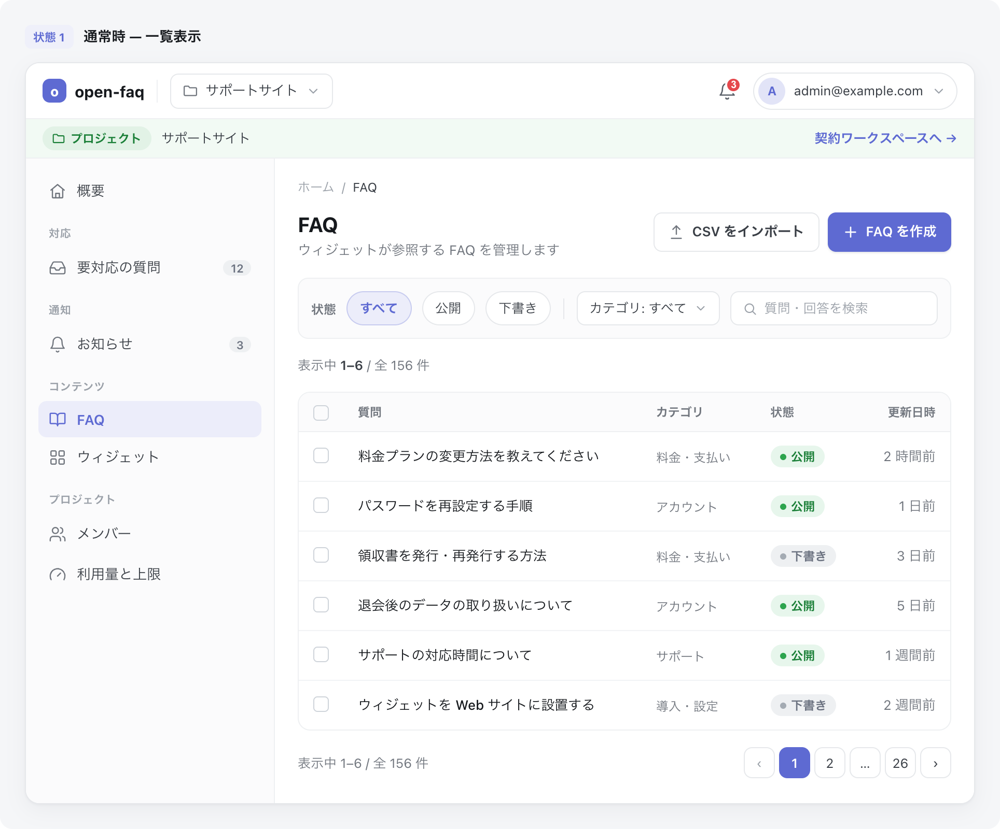

| 画面 ID | 画面名 | トレーサビリティID |
|----|----|----|
| SCR-008 | FAQ 一覧 | [TR-024](../../00_traceability/index.md#TR-024) ・ [TR-025](../../00_traceability/index.md#TR-025) ・ [TR-026](../../00_traceability/index.md#TR-026) ・ [TR-027](../../00_traceability/index.md#TR-027) ・ [TR-028](../../00_traceability/index.md#TR-028) ・ [TR-029](../../00_traceability/index.md#TR-029) ・ [TR-078](../../00_traceability/index.md#TR-078) |

| ステークホルダ | 対象 |
|----------------|------|
| オーナー       | ◯    |
| メンバー       | ◯    |

## 1. 画面概要

- プロジェクトの FAQ を一覧で確認し、検索・絞り込み・並び替え・一括操作・CSV エクスポートを提供する。
- 対象はオーナーとメンバーで、いずれも当該プロジェクトへの割当が前提となる。
- 個別 FAQ の状態切替・削除は編集画面(SCR-009)、複数 FAQ への一括処理は一括操作バーで行う。
- 主要な表示状態は通常時の一覧・行選択時の一括操作バー・FAQ 0 件の空状態・割当のないプロジェクトへの直アクセス時の権限不足表示。

## 2. 画面遷移図

本画面からの画面遷移を、画面 ID・画面名とイベント(操作)で示します。

## 3. 画面レイアウト

本画面の代表状態(通常時 — 一覧表示)を示します。

## 4. 画面項目

本画面が表示する入出力項目を定義します。

| # | 項目 | 種類 | 必須 | 最大長 | 初期値 | 表示条件 |
|----|----|----|----|----|----|----|
| 1 | キーワード検索 | input(text) | — | 100 | — | — |
| 2 | 状態フィルタ | button | — | — | すべて | — |
| 3 | カテゴリフィルタ | select | — | — | すべて | — |
| 4 | 行選択チェックボックス | checkbox | — | — | 未チェック | — |
| 5 | FAQ ID | link | — | — | — | — |
| 6 | 質問 | label | — | — | — | — |
| 7 | カテゴリ | label | — | — | — | — |
| 8 | 状態バッジ | badge | — | — | — | — |
| 9 | 更新日時 | label | — | — | — | — |
| 10 | 件数表示 | label | — | — | — | — |
| 11 | ページネーション | label | — | — | — | — |
| 12 | 新規作成ボタン | button | — | — | — | — |
| 13 | CSV をインポートボタン | button | — | — | — | — |
| 14 | CSV をエクスポートボタン | button | — | — | — | — |
| 15 | 一括操作バー | label | — | — | — | 1 件以上選択時に下部固定 |
| 16 | 一括公開ボタン | button | — | — | — | 1 件以上選択時(一括操作バー内) |
| 17 | 一括非公開化ボタン | button | — | — | — | 1 件以上選択時(一括操作バー内) |
| 18 | 一括削除ボタン | button | — | — | — | 1 件以上選択時(一括操作バー内) |
| 19 | 選択を解除ボタン | button | — | — | — | 1 件以上選択時(一括操作バー内) |
| 20 | 空状態 | label | — | — | — | FAQ 0 件時のみ表示 |

データパターン(選択肢・状態値など値のパターンを持つ項目)を定義する。

| 画面項目 | 表示名 | 補足 |
|----|----|----|
| #2 | すべて | — |
| #2 | 公開 | — |
| #2 | 下書き | — |
| #2 | 非公開 | — |
| #3 | すべて | — |
| #3 | 各カテゴリ名 | プロジェクト内カテゴリを動的に列挙する |
| #8 | 下書き | 色のみに依存せずテキストラベルを併記 |
| #8 | 公開中 | 色のみに依存せずテキストラベルを併記 |
| #8 | 非公開 | 色のみに依存せずテキストラベルを併記 |

## 5. バリデーション

入力検証を定義する。

| 画面項目 | タイミング | ルール | エラーコード |
|----|----|----|----|
| #1 | 入力時 | 最大長チェック | EM-01 |

## 6. イベント

本画面のイベント(初期表示・各操作)ごとに、対象の画面項目を定義します。各イベントの処理内容は [7. 画面イベント詳細](#7-画面イベント詳細) で定義します。

<table>
<colgroup>
<col style="width: 18%" />
<col style="width: 22%" />
<col style="width: 60%" />
</colgroup>
<thead>
<tr>
<th>EVT-ID</th>
<th>画面項目</th>
<th>イベント</th>
</tr>
</thead>
<tbody>
<tr>
<td>EVT-01</td>
<td>—</td>
<td>初期表示</td>
</tr>
<tr>
<td>EVT-02</td>
<td>#1</td>
<td>キーワードを入力</td>
</tr>
<tr>
<td>EVT-03</td>
<td>#3</td>
<td>カテゴリを選択</td>
</tr>
<tr>
<td>EVT-04</td>
<td>#9</td>
<td>一覧の列ヘッダーを押下して並び替え</td>
</tr>
<tr>
<td>EVT-05</td>
<td>#4</td>
<td>行を選択</td>
</tr>
<tr>
<td>EVT-06</td>
<td>#12</td>
<td>「+ 新規作成」を押下</td>
</tr>
<tr>
<td>EVT-07</td>
<td>#5</td>
<td>FAQ ID リンクを押下</td>
</tr>
<tr>
<td>EVT-08</td>
<td>#16</td>
<td>「公開する」を押下</td>
</tr>
<tr>
<td>EVT-09</td>
<td>#17</td>
<td>「非公開化する」を押下</td>
</tr>
<tr>
<td>EVT-10</td>
<td>#18</td>
<td>「削除する」を押下</td>
</tr>
<tr>
<td>EVT-11</td>
<td>#19</td>
<td>「選択を解除」を押下</td>
</tr>
<tr>
<td>EVT-12</td>
<td>#13</td>
<td>「CSV をインポート」を押下</td>
</tr>
<tr>
<td>EVT-13</td>
<td>#14</td>
<td>「CSV をエクスポート」を押下</td>
</tr>
<tr>
<td>EVT-14</td>
<td>#20</td>
<td>空状態の「+ 新規作成」を押下</td>
</tr>
</tbody>
</table>

## 7. 画面イベント詳細

各イベントの処理内容を定義します。

<table>
<colgroup>
<col style="width: 14%" />
<col style="width: 86%" />
</colgroup>
<thead>
<tr>
<th>EVT-ID</th>
<th>処理</th>
</tr>
</thead>
<tbody>
<tr>
<td>EVT-01</td>
<td>初期表示時に当該プロジェクトの FAQ 一覧を表示する(<a href="../../02_backend/03_apis/API-025.md#API-025">FAQ 一覧(API-025)</a> API):<pre>
 ┣ 1 件以上: 一覧(#4〜#9)・件数表示(#10)・ページネーション(#11)を表示する
 ┗ 0 件: 空状態(#20)を表示する
</pre></td>
</tr>
<tr>
<td>EVT-02</td>
<td>キーワード入力時に、入力したキーワードで検索した FAQ 一覧と件数表示(#10)を表示する(<a href="../../02_backend/03_apis/API-031.md#API-031">FAQ 全文検索(API-031)</a> API)</td>
</tr>
<tr>
<td>EVT-03</td>
<td>カテゴリ選択時に、選択したカテゴリで絞り込んだ FAQ 一覧と件数表示(#10)を表示する(<a href="../../02_backend/03_apis/API-025.md#API-025">FAQ 一覧(API-025)</a> API)</td>
</tr>
<tr>
<td>EVT-04</td>
<td>一覧の列ヘッダー(関連度 / 更新日時 / 作成日時)押下時に、押下した列で昇順 / 降順に並び替えた FAQ 一覧を表示する(<a href="../../02_backend/03_apis/API-025.md#API-025">FAQ 一覧(API-025)</a> API)</td>
</tr>
<tr>
<td>EVT-05</td>
<td>行のチェックボックス(#4)操作時に選択状態を更新する(最大 50 件まで選択可)。1 件以上選択時は一括操作バー(#15)を表示し、0 件になったときは非表示にする</td>
</tr>
<tr>
<td>EVT-06</td>
<td>「+ 新規作成」押下時に編集画面(SCR-009)を新規モードで開く</td>
</tr>
<tr>
<td>EVT-07</td>
<td>FAQ ID リンク(#5)押下時に編集画面(SCR-009)を編集モードで開く</td>
</tr>
<tr>
<td>EVT-08</td>
<td>「公開する」押下時に選択中 FAQ(最大 50 件)を一括公開する(<a href="../../02_backend/03_apis/API-027.md#API-027">FAQ 一括状態変更(API-027)</a> API):<pre>
 ┣ 全件成功: FAQ 一覧の表示を更新し、選択を解除する
 ┣ 一部失敗(成功 N 件 / 失敗 M 件): 「N 件を公開しました(M 件は失敗)」をトーストで表示する。成功分のみ反映する
 ┗ 全件失敗: エラートースト(EM-02)を表示し、一覧は更新しない
</pre></td>
</tr>
<tr>
<td>EVT-09</td>
<td>「非公開化する」押下時に選択中 FAQ(最大 50 件)を一括非公開化する(<a href="../../02_backend/03_apis/API-027.md#API-027">FAQ 一括状態変更(API-027)</a> API):<pre>
 ┣ 全件成功: FAQ 一覧の表示を更新し、選択を解除する
 ┣ 一部失敗(成功 N 件 / 失敗 M 件): 「N 件を非公開化しました(M 件は失敗)」をトーストで表示する。成功分のみ反映する
 ┗ 全件失敗: エラートースト(EM-02)を表示し、一覧は更新しない
</pre></td>
</tr>
<tr>
<td>EVT-10</td>
<td>「削除する」押下時に、削除対象件数と「削除すると復元できません」の警告を示す確認ダイアログを表示し、確認後に選択中 FAQ(最大 50 件)を論理削除する(<a href="../../02_backend/03_apis/API-026.md#API-026">FAQ 作成・更新・削除(API-026)</a> API):<pre>
 ┣ キャンセル: 何もしない
 ┣ 全件成功: FAQ 一覧の表示を更新し、選択を解除する
 ┣ 一部失敗(成功 N 件 / 失敗 M 件): 「N 件を削除しました(M 件は失敗)」をトーストで表示する。成功分のみ反映する
 ┗ 全件失敗: エラートースト(EM-03)を表示し、一覧は更新しない
</pre></td>
</tr>
<tr>
<td>EVT-11</td>
<td>「選択を解除」押下時に全選択を解除し、一括操作バー(#15)を非表示にする</td>
</tr>
<tr>
<td>EVT-12</td>
<td>「CSV をインポート」押下時に CSV インポートモーダル(SCR-010)を開く</td>
</tr>
<tr>
<td>EVT-13</td>
<td>「CSV をエクスポート」押下時に、表示中のフィルタ適用結果を CSV ファイルとしてダウンロードする(<a href="../../02_backend/03_apis/API-030.md#API-030">FAQ CSV エクスポート(API-030)</a> API。失敗時はエラートースト(EM-04)を表示する)</td>
</tr>
<tr>
<td>EVT-14</td>
<td>空状態(#20)の「+ 新規作成」押下時に編集画面(SCR-009)を新規モードで開く(EVT-06 と同処理)</td>
</tr>
</tbody>
</table>

## 8. エラーメッセージ

本画面が表示するエラー・警告メッセージを定義します。

| エラーコード | エラーメッセージ |
|----|----|
| EM-01 | キーワードは 100 文字以内で入力してください |
| EM-02 | 状態の変更に失敗しました。時間をおいて再度お試しください |
| EM-03 | 削除に失敗しました。時間をおいて再度お試しください |
| EM-04 | CSV のエクスポートに失敗しました。時間をおいて再度お試しください |
