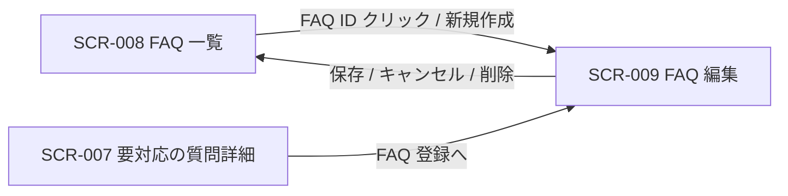

| 画面 ID | 画面名 | トレーサビリティID |
|----|----|----|
| SCR-009 | FAQ 編集 | [TR-025](../../00_traceability/index.md#TR-025) ・ [TR-026](../../00_traceability/index.md#TR-026) |

| ステークホルダ | 対象 |
|----------------|------|
| オーナー       | ◯    |
| メンバー       | ◯    |

## 1. 画面概要

FAQ の質問・回答・カテゴリ・状態を 1 ペインで作成・編集し、自動保存・論理削除を行う画面です。新規作成と既存編集の双方を扱います。

> [!NOTE]
> **補足** 各ステークホルダとも当該プロジェクトへの割当(FAQ 管理権限)が前提です。割当のないプロジェクトの FAQ は編集不可(URL 直アクセスは権限不足表示)。状態(下書き / 公開中 / 非公開)の切替は独立ボタンを設けず「状態」の選択 + 「保存」で一元化します(専用の公開 API・状態遷移ガードなし)。`published` を選択して保存する操作が公開前のメンバー確認を兼ねます。

## 2. 画面遷移図

本画面への流入と本画面からの遷移を、画面 ID・画面名とイベント(操作)で示します。

## 3. 画面レイアウト

本画面の代表状態(編集中・自動保存)を示します。削除確認・キャンセル確認・楽観ロック衝突の各ダイアログは §4 の `表示条件` で定義します。

## 4. 画面項目

本画面が各状態で表示する入出力項目を定義します。`表示条件` は項目が表示される状態を示します。

| # | 項目 | 種類 | 必須 | 最大長 | 初期値 | 表示条件 |
|----|----|----|----|----|----|----|
| 1 | ページタイトル | div | — | — | — | 常時(新規時は「新規」、既存時は「{FAQ番号} 編集」) |
| 2 | 自動保存インジケータ | alert | — | — | — | 常時(保存済み / 保存中 / 保存失敗・再試行) |
| 3 | 質問 | textarea | ◯ | 500 | — | 常時 |
| 4 | 回答 | textarea | ◯ | 5000 | — | 常時 |
| 5 | カテゴリ | select | — | 100 | 未選択 | 常時(既存カテゴリのサジェスト + 自由入力) |
| 6 | 状態 | radio | ◯ | — | 下書き | 常時 |
| 7 | 公開トグル | checkbox | — | — | 未チェック | 常時 |
| 8 | 登録元未解決質問リンク | link | — | — | — | 登録元の未解決質問が存在する場合のみ |
| 9 | キャンセルボタン | button | — | — | — | 常時 |
| 10 | 保存ボタン | button | — | — | — | 常時 |
| 11 | 削除ボタン | button | — | — | — | 既存 FAQ 編集時のみ(新規時非表示) |
| 12 | 楽観ロック衝突ダイアログ | div | — | — | — | 楽観ロック衝突時(版が他者の更新と一致しない場合) |
| 13 | 削除確認 OK ボタン | button | — | — | — | 削除確認ダイアログ表示中 |
| 14 | 削除確認キャンセルボタン | button | — | — | — | 削除確認ダイアログ表示中 |
| 15 | キャンセル確認 OK ボタン | button | — | — | — | キャンセル確認ダイアログ表示中 |
| 16 | キャンセル確認キャンセルボタン | button | — | — | — | キャンセル確認ダイアログ表示中 |

**#6 状態の選択肢(コード値=表示名)**: draft=下書き / published=公開中 / hidden=非公開。

## 5. バリデーション

本画面の入力項目に対する検証ルールを定義します。違反がある場合は保存(自動保存・手動保存)を中止します。

| 画面項目 | タイミング | ルール | エラーコード |
|----|----|----|----|
| #3 | 入力時・保存時 | 未入力チェック | EM-01 |
| #3 | 入力時・保存時 | 文字数上限チェック(500 文字) | EM-02 |
| #4 | 入力時・保存時 | 未入力チェック | EM-03 |
| #4 | 入力時・保存時 | 文字数上限チェック(5,000 文字) | EM-04 |
| #5 | 入力時・保存時 | 文字数上限チェック(100 文字) | EM-05 |

## 6. イベント

本画面のイベント(初期表示・各操作)ごとに、対象の画面項目を定義します。各イベントの処理内容は [7. 画面イベント詳細](#7-画面イベント詳細) で定義します。

<table>
<colgroup>
<col style="width: 18%" />
<col style="width: 22%" />
<col style="width: 60%" />
</colgroup>
<thead>
<tr>
<th>EVT-ID</th>
<th>画面項目</th>
<th>イベント</th>
</tr>
</thead>
<tbody>
<tr>
<td>EVT-062</td>
<td>—</td>
<td>初期表示</td>
</tr>
<tr>
<td>EVT-063</td>
<td>#6</td>
<td>「状態」を選択</td>
</tr>
<tr>
<td>EVT-064</td>
<td>#2</td>
<td>自動保存トリガー(入力停止後 2 秒のデバウンス = 設計値)</td>
</tr>
<tr>
<td>EVT-065</td>
<td>#10</td>
<td>「保存」を押下</td>
</tr>
<tr>
<td>EVT-066</td>
<td>#11</td>
<td>「削除」を押下</td>
</tr>
<tr>
<td>EVT-067</td>
<td>#13</td>
<td>削除確認ダイアログの「OK」を押下</td>
</tr>
<tr>
<td>EVT-068</td>
<td>#9</td>
<td>「キャンセル」を押下</td>
</tr>
<tr>
<td>EVT-069</td>
<td>#8</td>
<td>「登録元未解決質問」リンクを押下</td>
</tr>
<tr>
<td>EVT-070</td>
<td>#14</td>
<td>削除確認ダイアログの「キャンセル」を押下</td>
</tr>
<tr>
<td>EVT-071</td>
<td>#15</td>
<td>キャンセル確認ダイアログの「OK」を押下</td>
</tr>
<tr>
<td>EVT-072</td>
<td>#16</td>
<td>キャンセル確認ダイアログの「キャンセル」を押下</td>
</tr>
</tbody>
</table>

## 7. 画面イベント詳細

各イベントの処理内容を定義します。

<table>
<colgroup>
<col style="width: 14%" />
<col style="width: 86%" />
</colgroup>
<thead>
<tr>
<th>EVT-ID</th>
<th>処理</th>
</tr>
</thead>
<tbody>
<tr>
<td>EVT-062</td>
<td>初期表示時に流入経路と権限で分岐する:<pre>
 ┣ 既存編集: <a href="../../02_backend/03_apis/API-033.md#API-033">FAQ 個別取得</a>(GET /faqs/{id})で現値をロードし各欄(#3〜#6)へ展開する。登録元の未解決質問が存在する場合は #8 を表示する
 ┣ 新規作成(未解決質問起点): 未解決質問の質問文を #3 へ初期反映し、その他の欄は空で表示する
 ┣ 新規作成(手動): 全欄空のフォームを表示する
 ┗ 権限なし(URL 直アクセス): 権限不足メッセージを表示して操作不可とする
</pre></td>
</tr>
<tr>
<td>EVT-063</td>
<td>「状態」(#6)の選択値(下書き / 公開中 / 非公開)を保持し、次回「保存」押下時または自動保存時に反映する(相互に自由遷移・状態遷移ガードなし)</td>
</tr>
<tr>
<td>EVT-064</td>
<td>自動保存トリガー時に次を行う:<pre>
1. #3〜#5 の入力が停止して 2 秒経過(デバウンス = 設計値)で発火する。§5 のバリデーションエラー中は発火しない
2. 発火時は #2 を「保存中…」に更新する
3. <a href="../../02_backend/03_apis/API-026.md#API-026">FAQ 作成・更新・削除</a>(PATCH /faqs/{id}。新規未保存時は POST /faqs)で現在の入力内容を保存する
4. 結果で分岐する
   ┣ 成功: #2 を「{N} 秒前に保存しました」に更新する
   ┣ 失敗: #2 を「保存に失敗しました。再試行しています…」に更新し自動リトライを 1 回(設計値)行う。リトライも失敗した場合は #2 を「保存できませんでした(手動で保存してください)」に更新し以降は手動保存(#11)を促す(自動リトライは繰り返さない)
   ┗ 版衝突(楽観ロック): 自動保存では再試行せず #12 の復旧導線(EVT-065 の版衝突処理と同じダイアログ)を表示する
</pre></td>
</tr>
<tr>
<td>EVT-065</td>
<td>「保存」(#10)押下時に次を行う:<pre>
1. §5 のバリデーションを評価し、違反時はエラー箇所を表示して中止する
2. <a href="../../02_backend/03_apis/API-026.md#API-026">FAQ 作成・更新・削除</a>(新規は POST /faqs、既存は PATCH /faqs/{id})で選択中の状態(#6)とともに保存する
3. 結果で分岐する
   ┣ 新規・成功: FAQ を新規作成し FAQ 一覧(<a href="SCR-008.md">SCR-008</a>)へ遷移する
   ┣ 既存・成功: FAQ を更新し FAQ 一覧(<a href="SCR-008.md">SCR-008</a>)へ遷移する
   ┣ 版衝突(楽観ロック): #12 のダイアログ「他のユーザーがこの FAQ を更新しました」を表示し [最新を読み込む(自分の変更は破棄)] / [キャンセル] の 2 択を提示する(マージはしない = 設計値)。[最新を読み込む]選択時は <a href="../../02_backend/03_apis/API-033.md#API-033">FAQ 個別取得</a> で最新値を再ロードして編集中の入力を破棄し版を更新する。[キャンセル]選択時はダイアログを閉じて編集を継続する(再保存すると再び衝突する旨を案内する)
   ┗ 件数上限超過: エラーを表示し保存しない
</pre></td>
</tr>
<tr>
<td>EVT-066</td>
<td>「削除」(#11)押下時に削除確認ダイアログを表示する(実際の削除は EVT-067 で実行)</td>
</tr>
<tr>
<td>EVT-067</td>
<td>削除確認ダイアログの「OK」(#13)押下時に次を行う:<pre>
 ┣ 成功: <a href="../../02_backend/03_apis/API-026.md#API-026">FAQ 作成・更新・削除</a>(DELETE /faqs/{id})で論理削除し FAQ 一覧(<a href="SCR-008.md">SCR-008</a>)へ遷移する
 ┗ 失敗: エラーメッセージを表示しダイアログを閉じる
</pre></td>
</tr>
<tr>
<td>EVT-068</td>
<td>「キャンセル」(#9)押下時に未保存変更の有無で分岐する:<pre>
 ┣ 未保存変更なし: 編集を破棄して FAQ 一覧(<a href="SCR-008.md">SCR-008</a>)へ遷移する
 ┗ 未保存変更あり: キャンセル確認ダイアログを表示する(破棄実行は EVT-071)
</pre></td>
</tr>
<tr>
<td>EVT-069</td>
<td>「登録元未解決質問」リンク(#8)押下時に登録元の未解決質問詳細画面(<a href="SCR-007.md">SCR-007</a>)へ遷移する</td>
</tr>
<tr>
<td>EVT-070</td>
<td>削除確認ダイアログの「キャンセル」(#14)押下時にダイアログを閉じ、削除を中断して編集画面に戻る</td>
</tr>
<tr>
<td>EVT-071</td>
<td>キャンセル確認ダイアログの「OK」(#15)押下時に編集内容を破棄して FAQ 一覧(<a href="SCR-008.md">SCR-008</a>)へ遷移する</td>
</tr>
<tr>
<td>EVT-072</td>
<td>キャンセル確認ダイアログの「キャンセル」(#16)押下時にダイアログを閉じ、編集を継続する</td>
</tr>
</tbody>
</table>

## 8. エラーメッセージ

本画面が表示するエラー・警告メッセージを定義します。

| エラーコード | エラーメッセージ |
|----|----|
| EM-01 | 質問を入力してください |
| EM-02 | 質問は 500 文字以内で入力してください |
| EM-03 | 回答を入力してください |
| EM-04 | 回答は 5,000 文字以内で入力してください |
| EM-05 | カテゴリは 100 文字以内で入力してください |
