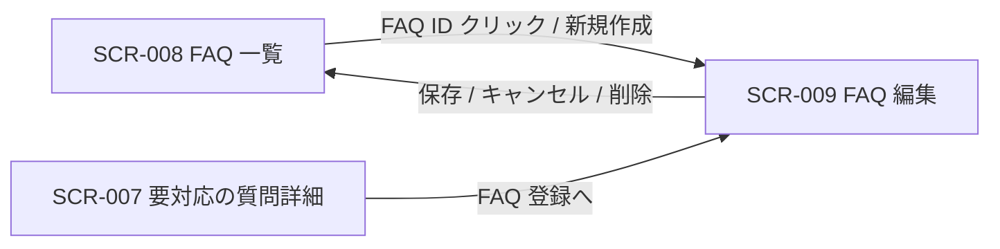
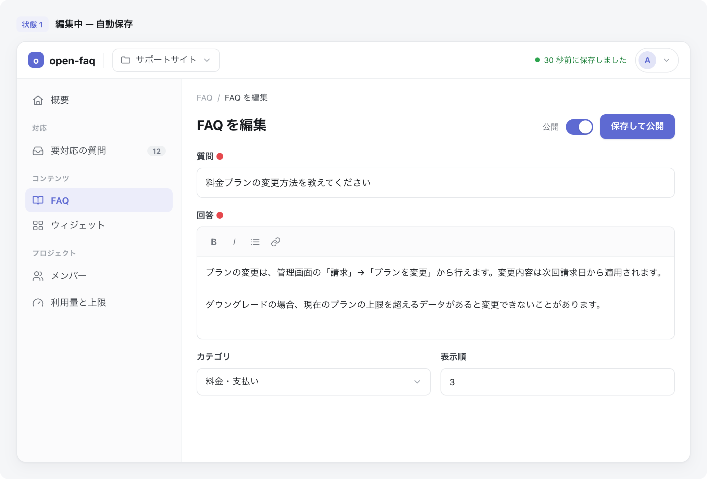
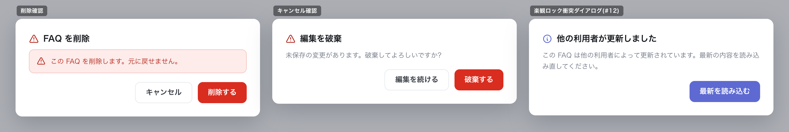

# SCR-009: FAQ編集

| ID | 画面名 |
|----|----|
| SCR-009 | FAQ編集 |

| 関連項目 | 内容 |
|----|----| 
| 業務ユースケース | [UC-024](../../../01_requirements/04_business_usecases/UC-024.md#UC-024) / [UC-025](../../../01_requirements/04_business_usecases/UC-025.md#UC-025) |
| API | [API-026](../../02_backend/03_apis/API-026.md#API-026) / [API-033](../../02_backend/03_apis/API-033.md#API-033) / [API-025](../../02_backend/03_apis/API-025.md#API-025) |

| ステークホルダ | 対象 |
|----------------|------|
| オーナー       | ◯    |
| メンバー       | ◯    |

## 1. 画面概要

- FAQ の質問・回答・カテゴリ・状態を 1 ペインで作成・編集し、自動保存・論理削除を行う画面である。
- 新規作成と既存編集の双方を扱う。
- 対象はオーナー・メンバーで、いずれも当該プロジェクトへの FAQ 管理権限の割当が前提である(割当のないプロジェクトの FAQ は編集不可)。
- 状態(下書き / 公開中 / 非公開)の切替は独立ボタンを設けず「状態」の選択と「保存」で一元化する。
- 主要な表示状態は編集中(自動保存)・削除確認・キャンセル確認・版衝突(楽観ロック)である。

## 2. 画面遷移図

本画面への流入と本画面からの遷移を、画面 ID・画面名とイベント(操作)で示します。

## 3. 画面レイアウト

本画面の代表状態と確認ダイアログ(削除確認 / キャンセル確認 / 楽観ロック衝突)を示します。

## 4. 画面項目

本画面が各状態で表示する入出力項目を定義します。

| # | 項目 | 種類 | 必須 | 最大長 | 初期値 | 表示条件 |
|----|----|----|----|----|----|----|
| 1 | ページタイトル | label | — | — | — | 常時(新規時は「新規」、既存時は「{FAQ番号} 編集」) |
| 2 | 自動保存インジケータ | alert | — | — | — | 常時(保存済み / 保存中 / 保存失敗・再試行) |
| 3 | 質問 | textarea | ◯ | 500 | — | 常時 |
| 4 | 回答 | textarea | ◯ | 5000 | — | 常時 |
| 5 | カテゴリ | select | — | 100 | 未選択 | 常時(既存カテゴリのサジェスト + 自由入力) |
| 6 | 状態 | radio | ◯ | — | 下書き | 常時 |
| 7 | 公開トグル | checkbox | — | — | 未チェック | 常時 |
| 8 | 登録元未解決質問リンク | link | — | — | — | 登録元の未解決質問が存在する場合のみ |
| 9 | キャンセルボタン | button | — | — | — | 常時 |
| 10 | 保存ボタン | button | — | — | — | 常時 |
| 11 | 削除ボタン | button | — | — | — | 既存 FAQ 編集時のみ(新規時非表示) |
| 12 | 楽観ロック衝突ダイアログ | label | — | — | — | 楽観ロック衝突時(版が他者の更新と一致しない場合) |
| 13 | 削除確認 OK ボタン | button | — | — | — | 削除確認ダイアログ表示中 |
| 14 | 削除確認キャンセルボタン | button | — | — | — | 削除確認ダイアログ表示中 |
| 15 | キャンセル確認 OK ボタン | button | — | — | — | キャンセル確認ダイアログ表示中 |
| 16 | キャンセル確認キャンセルボタン | button | — | — | — | キャンセル確認ダイアログ表示中 |
| 17 | 楽観ロック衝突「最新を読み込む」ボタン | button | — | — | — | 楽観ロック衝突ダイアログ表示中 |

データパターン(選択肢・状態値など値のパターンを持つ項目)を定義する。

| 画面項目 | 表示名 | 補足 |
|----|----|----|
| #6 | 下書き | 公開しない初期状態 |
| #6 | 公開中 | 選択して保存する操作が公開前のメンバー確認を兼ねる |
| #6 | 非公開 | 公開を取り下げた状態 |

## 5. バリデーション

本画面の入力項目に対する検証ルールを定義します。

| 画面項目 | タイミング | ルール | エラーコード |
|----|----|----|----|
| #3 | 入力時・保存時 | 未入力チェック | EM-01 |
| #3 | 入力時・保存時 | 文字数上限チェック(500 文字) | EM-02 |
| #4 | 入力時・保存時 | 未入力チェック | EM-03 |
| #4 | 入力時・保存時 | 文字数上限チェック(5,000 文字) | EM-04 |
| #5 | 入力時・保存時 | 文字数上限チェック(100 文字) | EM-05 |

## 6. イベント

本画面のイベント(初期表示・各操作)ごとに、対象の画面項目を定義します。各イベントの処理内容は [7. 画面イベント詳細](#7-画面イベント詳細) で定義します。

<table>
<colgroup>
<col style="width: 18%" />
<col style="width: 22%" />
<col style="width: 60%" />
</colgroup>
<thead>
<tr>
<th>EVT-ID</th>
<th>画面項目</th>
<th>イベント</th>
</tr>
</thead>
<tbody>
<tr>
<td>EVT-01</td>
<td>—</td>
<td>初期表示</td>
</tr>
<tr>
<td>EVT-02</td>
<td>#6</td>
<td>「状態」を選択</td>
</tr>
<tr>
<td>EVT-03</td>
<td>#2</td>
<td>自動保存トリガー(入力停止後)</td>
</tr>
<tr>
<td>EVT-04</td>
<td>#10</td>
<td>「保存」を押下</td>
</tr>
<tr>
<td>EVT-05</td>
<td>#11</td>
<td>「削除」を押下</td>
</tr>
<tr>
<td>EVT-06</td>
<td>#13</td>
<td>削除確認ダイアログの「OK」を押下</td>
</tr>
<tr>
<td>EVT-07</td>
<td>#9</td>
<td>「キャンセル」を押下</td>
</tr>
<tr>
<td>EVT-08</td>
<td>#8</td>
<td>「登録元未解決質問」リンクを押下</td>
</tr>
<tr>
<td>EVT-09</td>
<td>#14</td>
<td>削除確認ダイアログの「キャンセル」を押下</td>
</tr>
<tr>
<td>EVT-10</td>
<td>#15</td>
<td>キャンセル確認ダイアログの「OK」を押下</td>
</tr>
<tr>
<td>EVT-11</td>
<td>#16</td>
<td>キャンセル確認ダイアログの「キャンセル」を押下</td>
</tr>
</tbody>
</table>

## 7. 画面イベント詳細

各イベントの処理内容を定義します。

<table>
<colgroup>
<col style="width: 14%" />
<col style="width: 86%" />
</colgroup>
<thead>
<tr>
<th>EVT-ID</th>
<th>処理</th>
</tr>
</thead>
<tbody>
<tr>
<td>EVT-01</td>
<td>初期表示時に流入経路と権限で分岐する:<pre>
 ┣ 既存編集: <a href="../../02_backend/03_apis/API-033.md#API-033">FAQ 個別取得(API-033)</a> で現在の質問・回答・カテゴリ・状態を表示する。登録元の未解決質問がある場合は #8 を表示する
 ┣ 新規作成(未解決質問起点): 登録元の未解決質問の質問文を反映した新規フォームを表示する
 ┣ 新規作成(手動): 空の新規フォームを表示する
 ┗ 権限なし(URL 直アクセス): 権限不足メッセージを表示し操作不可とする
</pre></td>
</tr>
<tr>
<td>EVT-02</td>
<td>「状態」(#6)で下書き / 公開中 / 非公開のいずれかを選択する(選択した状態は保存時に反映する)</td>
</tr>
<tr>
<td>EVT-03</td>
<td>自動保存トリガー時に、編集中の入力内容を <a href="../../02_backend/03_apis/API-026.md#API-026">FAQ 作成・更新・削除(API-026)</a> で保存する:<pre>
 ┣ 成功: 保存済みである旨を #2 に表示する
 ┣ 失敗: 保存に失敗した旨を #2 に表示し、手動保存(#10)を促す
 ┗ 版衝突(楽観ロック): #12 の復旧ダイアログ(EVT-04 と同じ)を表示する
</pre></td>
</tr>
<tr>
<td>EVT-04</td>
<td>「保存」(#10)押下時に、選択中の状態(#6)とともに <a href="../../02_backend/03_apis/API-026.md#API-026">FAQ 作成・更新・削除(API-026)</a> で保存する(§5 のバリデーション違反時はエラーを表示して中止する):<pre>
 ┣ 成功: FAQ を保存し FAQ 一覧(<a href="SCR-008.md">SCR-008</a>)へ遷移する
 ┣ 版衝突(楽観ロック): #12 の復旧ダイアログを表示し、最新内容を再表示するか編集を継続するかを選ばせる
 ┗ 件数上限超過: エラーを表示し保存しない
</pre></td>
</tr>
<tr>
<td>EVT-05</td>
<td>「削除」(#11)押下時に削除確認ダイアログを表示する(削除実行は EVT-06)</td>
</tr>
<tr>
<td>EVT-06</td>
<td>削除確認ダイアログの「OK」(#13)押下時に <a href="../../02_backend/03_apis/API-026.md#API-026">FAQ 作成・更新・削除(API-026)</a> で当該 FAQ を削除する:<pre>
 ┣ 成功: FAQ 一覧(<a href="SCR-008.md">SCR-008</a>)へ遷移する
 ┗ 失敗: エラーを表示しダイアログを閉じる
</pre></td>
</tr>
<tr>
<td>EVT-07</td>
<td>「キャンセル」(#9)押下時に未保存変更の有無で分岐する:<pre>
 ┣ 未保存変更なし: 編集を破棄して FAQ 一覧(<a href="SCR-008.md">SCR-008</a>)へ遷移する
 ┗ 未保存変更あり: キャンセル確認ダイアログを表示する(破棄実行は EVT-10)
</pre></td>
</tr>
<tr>
<td>EVT-08</td>
<td>「登録元未解決質問」リンク(#8)押下時に登録元の未解決質問詳細画面(<a href="SCR-007.md">SCR-007</a>)へ遷移する</td>
</tr>
<tr>
<td>EVT-09</td>
<td>削除確認ダイアログの「キャンセル」(#14)押下時にダイアログを閉じ、削除を中断して編集画面に戻る</td>
</tr>
<tr>
<td>EVT-10</td>
<td>キャンセル確認ダイアログの「OK」(#15)押下時に編集内容を破棄して FAQ 一覧(<a href="SCR-008.md">SCR-008</a>)へ遷移する</td>
</tr>
<tr>
<td>EVT-11</td>
<td>キャンセル確認ダイアログの「キャンセル」(#16)押下時にダイアログを閉じ、編集を継続する</td>
</tr>
</tbody>
</table>

## 8. エラーメッセージ

本画面が表示するエラー・警告メッセージを定義します。

| エラーコード | エラーメッセージ |
|----|----|
| EM-01 | 質問を入力してください |
| EM-02 | 質問は 500 文字以内で入力してください |
| EM-03 | 回答を入力してください |
| EM-04 | 回答は 5,000 文字以内で入力してください |
| EM-05 | カテゴリは 100 文字以内で入力してください |
