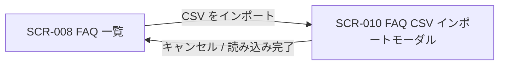
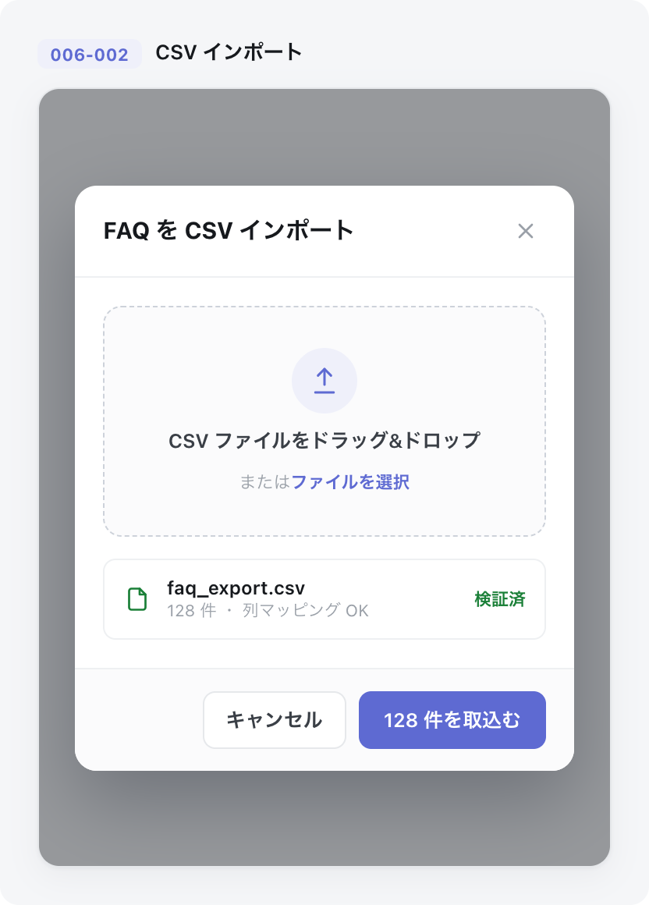

| 画面 ID | 画面名 | トレーサビリティID |
|----|----|----|
| SCR-010 | FAQ CSV インポートモーダル | [TR-028](../../00_traceability/index.md#TR-028) |

| ステークホルダ | 対象 |
|----------------|------|
| オーナー       | ◯    |
| メンバー       | ◯    |

## 1. 画面概要

FAQ を CSV ファイルから一括インポートする全画面割込みモーダルです。FAQ ID 列で新規 / 上書きを判定し、進捗表示と部分失敗を画面上で確認します。

> [!NOTE]
> **補足** 各ステークホルダとも当該プロジェクトへの割当(FAQ 管理権限)が前提です。FAQ 一覧の「CSV をインポート」ボタンから開きます。`status`(状態)列は持たず、新規行は一律 `draft`、上書き行は既存状態を維持します。

## 2. 画面遷移図

本モーダルの開閉(呼出元との関係)を、画面 ID・画面名とイベント(操作)で示します。

## 3. 画面レイアウト

本モーダルの代表状態(ファイル選択済み)を示します。文字コードエラー・取込処理中・部分失敗の各状態は §4 の `表示条件` で定義します。

## 4. 画面項目

本モーダルが各状態で表示する入出力項目を定義します。`表示条件` は項目が表示される状態を示します。

| # | 項目 | 種類 | 必須 | 最大長 | 初期値 | 表示条件 |
|----|----|----|----|----|----|----|
| 1 | テンプレートをダウンロード | link | — | — | — | — |
| 2 | CSV 列構成 / FAQ ID 判定の案内 | div | — | — | — | — |
| 3 | ファイル選択(ドロップゾーン) | input(file) | ◯ | — | — | ファイル未選択時 |
| 4 | 選択ファイル情報 | div | — | — | — | ファイル選択済み時 |
| 5 | 文字コードエラー | alert | — | — | — | UTF-8(BOM 許容)以外を選択時 |
| 6 | 進捗バー | div | — | — | — | 取込処理中 |
| 7 | 結果サマリ | div | — | — | — | 取込完了後 |
| 8 | エラー一覧 | table | — | — | — | 失敗行が 1 件以上ある時 |
| 9 | キャンセルボタン | button | — | — | — | — |
| 10 | 取込ボタン(動的ラベル「{件数} 件を取込む」) | button | — | — | — | — |
| 11 | 閉じる(×)ボタン | button | — | — | — | — |

- **#3 ファイル選択の制約**: `.csv` のみ・1 ファイル最大 1000 件(1 行 = 1 FAQ)・ヘッダ行必須・UTF-8(BOM 許容)。CSV 列構成は「FAQ ID, 質問, 回答, カテゴリ」。
- **#10 取込ボタン**: バリデーション通過時のみ活性。ラベルは選択件数に応じて「{件数} 件を取込む」の動的表示とする。

## 5. バリデーション

本モーダルの入力項目に対する検証ルールを定義します。違反がある場合は取り込みを中止します。

| 画面項目 | タイミング | ルール | エラーコード |
|----|----|----|----|
| #3 | 選択時 | 未選択チェック | EM-01 |
| #3 | 選択時 | 拡張子チェック(.csv) | EM-02 |
| #3 | 選択時 | 文字コードチェック(UTF-8 / BOM 許容) | EM-03 |
| #3 | 選択時 | 件数上限チェック(最大 1000 件) | EM-04 |

## 6. イベント

本モーダルのイベント(初期表示・各操作)ごとに、対象の画面項目を定義します。各イベントの処理内容は [7. 画面イベント詳細](#7-画面イベント詳細) で定義します。

<table>
<colgroup>
<col style="width: 18%" />
<col style="width: 22%" />
<col style="width: 60%" />
</colgroup>
<thead>
<tr>
<th>EVT-ID</th>
<th>画面項目</th>
<th>イベント</th>
</tr>
</thead>
<tbody>
<tr>
<td>EVT-073</td>
<td>—</td>
<td>初期表示</td>
</tr>
<tr>
<td>EVT-074</td>
<td>#1</td>
<td>「テンプレートをダウンロード」を押下</td>
</tr>
<tr>
<td>EVT-075</td>
<td>#3</td>
<td>ファイル選択にファイルを投入</td>
</tr>
<tr>
<td>EVT-076</td>
<td>#10</td>
<td>取込ボタン「{件数} 件を取込む」を押下</td>
</tr>
<tr>
<td>EVT-077</td>
<td>#9</td>
<td>「キャンセル」を押下</td>
</tr>
<tr>
<td>EVT-078</td>
<td>#11</td>
<td>「×」を押下</td>
</tr>
</tbody>
</table>

## 7. 画面イベント詳細

各イベントの処理内容を定義します。

<table>
<colgroup>
<col style="width: 14%" />
<col style="width: 86%" />
</colgroup>
<thead>
<tr>
<th>EVT-ID</th>
<th>処理</th>
</tr>
</thead>
<tbody>
<tr>
<td>EVT-073</td>
<td>SCR-008 の「CSV をインポート」ボタン押下でモーダルを開く。テンプレートダウンロード(#1)・列構成案内(#2)・ファイル選択(#3)を表示し、ファイル未選択・取込ボタン(#10)非活性の初期状態でレンダリングする</td>
</tr>
<tr>
<td>EVT-074</td>
<td>「テンプレートをダウンロード」押下時に <a href="../../02_backend/03_apis/API-029.md#API-029">FAQ インポートテンプレート取得</a> API(GET /faqs/import/template)を呼び出し、ヘッダ行のみのテンプレート CSV をダウンロードする</td>
</tr>
<tr>
<td>EVT-075</td>
<td>ファイル選択(ドラッグ&amp;ドロップまたはクリック)時に次を行う:<pre>
1. §5 のバリデーション(未選択・拡張子・文字コード・件数上限)をクライアント側で即時評価する
2. 結果で分岐する
   ┣ 成功: 選択ファイル情報(#4・ファイル名 / 件数)を表示し、取込ボタン(#10)を活性化する(ラベルは「{件数} 件を取込む」)
   ┗ 失敗(UTF-8 以外): 文字コードエラー(#5・EM-03、検出文字コード名を併記)を表示し取込ボタン(#10)は非活性のままとする
</pre></td>
</tr>
<tr>
<td>EVT-076</td>
<td>取込ボタン「{件数} 件を取込む」押下時に次を行う:<pre>
1. <a href="../../02_backend/03_apis/API-028.md#API-028">FAQ CSV インポート</a> API(POST /faqs/import、202 + jobId)を呼び出し、取り込みを非同期ジョブとして開始する(100 件超は非同期ジョブ化)
2. 処理中: 受領した jobId をキーに <a href="../../02_backend/03_apis/API-068.md#API-068">FAQ取込ジョブ状態取得</a> API(GET /faqs/import/{jobId})を 3 秒間隔(設計値)で呼び出し、進捗バー(#6)の処理済み件数 / 総件数を更新する(完了 / 失敗を検知するまで継続、24h タイムアウト)
3. 結果で分岐する
   ┣ 完了(全件成功): 進捗バーを 100% にし結果サマリ(#7・成功 {件数} / 失敗 0 件)を表示する。成功メッセージを表示してモーダルを閉じ、SCR-008 の FAQ 一覧を再取得する
   ┣ 完了(部分失敗): 進捗バーを 100% にし結果サマリ(#7・成功 {件数} / 失敗 {件数})を表示する。成功分を SCR-008 へ反映(再取得)し、エラー一覧(#8)に失敗行番号と理由を表示する(FAQ ID 判定: 識別子なし=新規、既存一致=上書き、無効識別子=失敗)
   ┗ 失敗(ジョブ異常終了 / タイムアウト): ポーリングを停止し、エラー(#7・EM-05)を表示する。進捗バーは失敗状態にする
</pre></td>
</tr>
<tr>
<td>EVT-077</td>
<td>「キャンセル」押下時に処理状態で分岐する:<pre>
 ┣ 処理中でない: モーダルを閉じて SCR-008 へ戻る
 ┗ 処理中: 中断確認ダイアログを表示し、OK でジョブを中断してモーダルを閉じる
</pre></td>
</tr>
<tr>
<td>EVT-078</td>
<td>「×」押下時に処理状態で分岐する:<pre>
 ┣ 処理中でない: モーダルを閉じて SCR-008 へ戻る
 ┗ 処理中: 中断確認ダイアログを表示し、OK でジョブを中断してモーダルを閉じる
</pre></td>
</tr>
</tbody>
</table>

## 8. エラーメッセージ

本モーダルが表示するエラー・警告メッセージを定義します。

| エラーコード | エラーメッセージ |
|----|----|
| EM-01 | CSV ファイルを選択してください |
| EM-02 | CSV ファイル(.csv)を選択してください |
| EM-03 | このファイルは UTF-8 ではありません(検出: {文字コード名})。UTF-8 で保存し直してください |
| EM-04 | 1 ファイルあたりの上限は 1000 件です。件数を分けて取り込んでください |
| EM-05 | 取り込み処理に失敗しました。時間をおいて再度お試しください |
