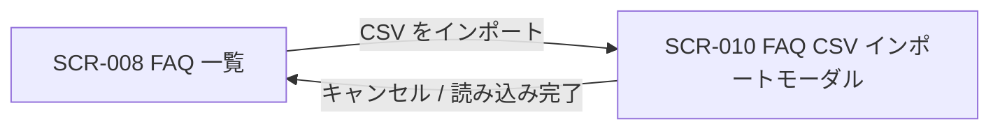
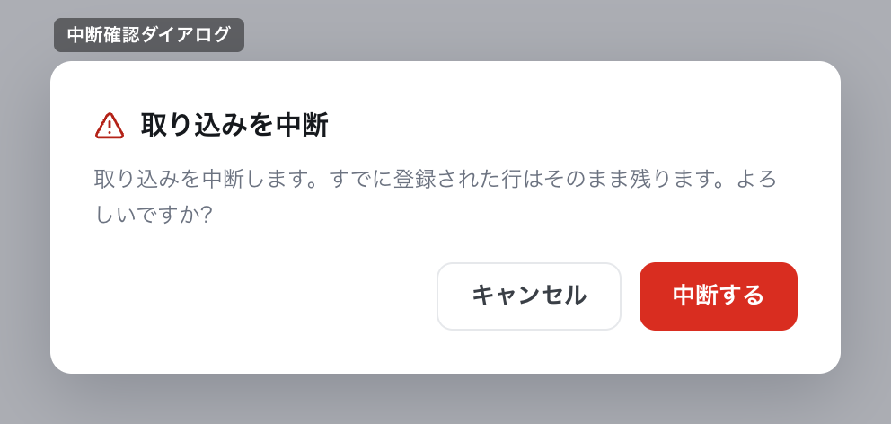

# SCR-010: FAQ CSVインポート(モーダル)

| ID | 画面名 |
|----|----|
| SCR-010 | FAQ CSVインポート(モーダル) |

| 関連項目 | 内容 |
|----|----| 
| 業務ユースケース | [UC-028](../../../01_requirements/04_business_usecases/UC-028.md#UC-028) / [UC-050](../../../01_requirements/04_business_usecases/UC-050.md#UC-050) |
| API | [API-028](../../02_backend/03_apis/API-028.md#API-028) / [API-029](../../02_backend/03_apis/API-029.md#API-029) / [API-068](../../02_backend/03_apis/API-068.md#API-068) |

| ステークホルダ | 対象 |
|----------------|------|
| オーナー       | ◯    |
| メンバー       | ◯    |

## 1. 画面概要

- FAQ を CSV ファイルから一括インポートする全画面割込みモーダルである。
- 対象はオーナー・メンバーで、いずれも当該プロジェクトへの FAQ 管理権限の割当が前提である。
- 既存 FAQ は上書き・該当しない行は新規登録として取り込み、新規行は「下書き」・上書き行は既存の状態を維持する。
- 主要な表示状態はファイル未選択・選択済み・文字コードエラー・取込処理中・取込完了(全件成功 / 部分失敗)である。

## 2. 画面遷移図

本モーダルの開閉(呼出元との関係)を、画面 ID・画面名とイベント(操作)で示します。

## 3. 画面レイアウト

本モーダルの代表状態と取込中断の確認ダイアログを示します。

## 4. 画面項目

本モーダルが各状態で表示する入出力項目を定義します。

| # | 項目 | 種類 | 必須 | 最大長 | 初期値 | 表示条件 |
|----|----|----|----|----|----|----|
| 1 | テンプレートをダウンロード | link | — | — | — | — |
| 2 | CSV 列構成 / FAQ ID 判定の案内 | label | — | — | — | 列構成「FAQ ID / 質問 / 回答 / カテゴリ」とヘッダ行必須を案内 |
| 3 | ファイル選択(ドロップゾーン) | input(file) | ◯ | — | — | ファイル未選択時(.csv のみ・1 ファイル最大 1000 件・1 行 = 1 FAQ・UTF-8(BOM 許容)) |
| 4 | 選択ファイル情報 | label | — | — | — | ファイル選択済み時 |
| 5 | 文字コードエラー | alert | — | — | — | UTF-8(BOM 許容)以外を選択時 |
| 6 | 進捗バー | label | — | — | — | 取込処理中 |
| 7 | 結果サマリ | label | — | — | — | 取込完了後 |
| 8 | エラー一覧 | table | — | — | — | 失敗行が 1 件以上ある時 |
| 9 | キャンセルボタン | button | — | — | — | — |
| 10 | 取込ボタン(動的ラベル「{件数} 件を取込む」) | button | — | — | — | バリデーション通過時のみ活性 |
| 11 | 閉じる(×)ボタン | button | — | — | — | — |
| 12 | 中断確認 OK ボタン | button | — | — | — | 中断確認ダイアログ表示中 |
| 13 | 中断確認 キャンセルボタン | button | — | — | — | 中断確認ダイアログ表示中 |

## 5. バリデーション

本モーダルの入力項目に対する検証ルールを定義します。

| 画面項目 | タイミング | ルール | エラーコード |
|----|----|----|----|
| #3 | 選択時 | 未選択チェック | EM-01 |
| #3 | 選択時 | 拡張子チェック(.csv) | EM-02 |
| #3 | 選択時 | 文字コードチェック(UTF-8 / BOM 許容) | EM-03 |
| #3 | 選択時 | 件数上限チェック(最大 1000 件) | EM-04 |

## 6. イベント

本モーダルのイベント(初期表示・各操作)ごとに、対象の画面項目を定義します。各イベントの処理内容は [7. 画面イベント詳細](#7-画面イベント詳細) で定義します。

<table>
<colgroup>
<col style="width: 18%" />
<col style="width: 22%" />
<col style="width: 60%" />
</colgroup>
<thead>
<tr>
<th>EVT-ID</th>
<th>画面項目</th>
<th>イベント</th>
</tr>
</thead>
<tbody>
<tr>
<td>EVT-01</td>
<td>—</td>
<td>初期表示</td>
</tr>
<tr>
<td>EVT-02</td>
<td>#1</td>
<td>「テンプレートをダウンロード」を押下</td>
</tr>
<tr>
<td>EVT-03</td>
<td>#3</td>
<td>ファイル選択にファイルを投入</td>
</tr>
<tr>
<td>EVT-04</td>
<td>#10</td>
<td>取込ボタン「{件数} 件を取込む」を押下</td>
</tr>
<tr>
<td>EVT-05</td>
<td>#9</td>
<td>「キャンセル」を押下</td>
</tr>
<tr>
<td>EVT-06</td>
<td>#11</td>
<td>「×」を押下</td>
</tr>
</tbody>
</table>

## 7. 画面イベント詳細

各イベントの処理内容を定義します。

<table>
<colgroup>
<col style="width: 14%" />
<col style="width: 86%" />
</colgroup>
<thead>
<tr>
<th>EVT-ID</th>
<th>処理</th>
</tr>
</thead>
<tbody>
<tr>
<td>EVT-01</td>
<td>初期表示時に、テンプレートダウンロード(#1)・列構成案内(#2)・ファイル選択(#3)を表示する(ファイル未選択・取込ボタン(#10)非活性の初期状態)</td>
</tr>
<tr>
<td>EVT-02</td>
<td>「テンプレートをダウンロード」(#1)押下時に <a href="../../02_backend/03_apis/API-029.md#API-029">FAQ インポートテンプレート取得(API-029)</a> でテンプレート CSV を取得し、ダウンロードする</td>
</tr>
<tr>
<td>EVT-03</td>
<td>ファイル選択(#3)時に §5 のバリデーションを評価する:<pre>
 ┣ 成功: 選択ファイル情報(#4・ファイル名 / 件数)を表示し、取込ボタン(#10)を活性化する
 ┗ 失敗(UTF-8 以外): 文字コードエラー(#5・EM-03)を表示し取込ボタン(#10)は非活性のままとする
</pre></td>
</tr>
<tr>
<td>EVT-04</td>
<td>取込ボタン(#10)押下時に <a href="../../02_backend/03_apis/API-028.md#API-028">FAQ CSV インポート(API-028)</a> で CSV の内容を一括登録する(処理中は <a href="../../02_backend/03_apis/API-068.md#API-068">FAQ取込ジョブ状態取得(API-068)</a> で進捗バー(#6)を更新する):<pre>
 ┣ 完了(全件成功): 結果サマリ(#7)を表示し、成功メッセージを表示してモーダルを閉じ、FAQ 一覧(<a href="SCR-008.md#SCR-008">SCR-008</a>)へ反映する
 ┣ 完了(部分失敗): 結果サマリ(#7)を表示し、成功分を FAQ 一覧(<a href="SCR-008.md#SCR-008">SCR-008</a>)へ反映し、失敗行と理由をエラー一覧(#8)に表示する
 ┗ 失敗(ジョブ異常終了 / タイムアウト): エラー(#7・EM-05)を表示し進捗バーを失敗状態にする
</pre></td>
</tr>
<tr>
<td>EVT-05</td>
<td>「キャンセル」(#9)押下時に処理状態で分岐する:<pre>
 ┣ 処理中でない: モーダルを閉じて FAQ 一覧(<a href="SCR-008.md#SCR-008">SCR-008</a>)へ戻る
 ┗ 処理中: 中断確認ダイアログを表示し、OK で取り込みを中断してモーダルを閉じる
</pre></td>
</tr>
<tr>
<td>EVT-06</td>
<td>「×」(#11)押下時に処理状態で分岐する:<pre>
 ┣ 処理中でない: モーダルを閉じて FAQ 一覧(<a href="SCR-008.md#SCR-008">SCR-008</a>)へ戻る
 ┗ 処理中: 中断確認ダイアログを表示し、OK で取り込みを中断してモーダルを閉じる
</pre></td>
</tr>
</tbody>
</table>

## 8. エラーメッセージ

本モーダルが表示するエラー・警告メッセージを定義します。

| エラーコード | エラーメッセージ |
|----|----|
| EM-01 | CSV ファイルを選択してください |
| EM-02 | CSV ファイル(.csv)を選択してください |
| EM-03 | このファイルは UTF-8 ではありません(検出: {文字コード名})。UTF-8 で保存し直してください |
| EM-04 | 1 ファイルあたりの上限は 1000 件です。件数を分けて取り込んでください |
| EM-05 | 取り込み処理に失敗しました。時間をおいて再度お試しください |
