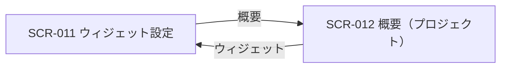

| 画面 ID | 画面名 | トレーサビリティID |
|----|----|----|
| SCR-011 | ウィジェット設定 | [TR-001](../../00_traceability/index.md#TR-001) ・ [TR-039](../../00_traceability/index.md#TR-039) ・ [TR-040](../../00_traceability/index.md#TR-040) ・ [TR-080](../../00_traceability/index.md#TR-080) |

| ステークホルダ | 対象 |
|----------------|------|
| オーナー       | ◯    |
| メンバー       | ◯    |

## 1. 画面概要

プロジェクト単位のウィジェット公開キー・埋め込みコード・見た目(主色・表示位置・見出し・初期メッセージ)を 1 画面で設定し、左に設定パネル・右にライブプレビューを固定配置して結果を確認する画面です。

> [!NOTE]
> **権限** 当該プロジェクトのメンバー(オーナーを含む)は閲覧・埋め込みコードのコピーに加え、公開キー再発行・見た目の編集・設定保存を操作できます。公開キーはプロジェクトごとに 1 セット(契約共通ではない)です。公開キー再発行は L3(対象プロジェクト名タイプ + 再認証)で保護します。

## 2. 画面遷移図

本画面からの画面遷移を、画面 ID・画面名とイベント(操作)で示します。

## 3. 画面レイアウト

本画面の代表状態(通常時 — 設定 + プレビュー)を示します。旧キー使用中バッジは §4 の `表示条件` で定義します。

## 4. 画面項目

本画面が各状態で表示する入出力項目を定義します。`表示条件` は項目が表示される状態を示します。

| # | 項目 | 種類 | 必須 | 最大長 | 初期値 | 表示条件 |
|----|----|----|----|----|----|----|
| 1 | スコープ注記 | div | — | — | — | — |
| 2 | ウィジェット公開キー | input(text) | — | — | 現在の公開キー(`pk_live_` + 32 文字) | — |
| 3 | 公開キーコピーボタン | button | — | — | — | — |
| 4 | 旧キー使用中バッジ | alert | — | — | — | ローテーション猶予 24 時間中に旧キー使用検知時 |
| 5 | 公開キーを再発行ボタン | button | — | — | — | — |
| 6 | 主色(テーマカラー)スウォッチ | radio | — | — | 現在の主色 | — |
| 7 | 主色(HEX)入力 | input(text) | — | 7 | 現在の主色 HEX(例 `#5E6AD2`) | — |
| 8 | 表示位置 | radio | — | — | 現在の表示位置(左下 / 右下) | — |
| 9 | 見出し | input(text) | — | 60 | 現在の見出し(例「何かお困りですか?」) | — |
| 10 | 初期メッセージ | textarea | — | 200 | 現在の初期メッセージ | — |
| 11 | 埋め込みコード | textarea | — | — | 埋め込み用 `<script>` タグ全文 | — |
| 12 | コードをコピーボタン | button | — | — | — | — |
| 13 | 設定を保存ボタン | button | — | — | — | — |
| 14 | ライブプレビュー | widget | — | — | — | — |

- **#6 主色(テーマカラー)スウォッチの選択肢**: プリセット色スウォッチ(主色 `#5E6AD2` / ティール `#0D9488` / レッド `#E5484D` / ダーク `#16191D`)から 1 つを選択。任意 HEX 値は #7 で直接指定する。
- **#8 表示位置の選択肢(コード値=表示名)**: `bottom_left`=左下 / `bottom_right`=右下。

## 5. バリデーション

本画面の入力項目に対する検証ルールを定義します。違反がある場合は保存を中止します。

| 画面項目 | タイミング | ルール | エラーコード |
|----|----|----|----|
| #7 | 入力時・保存時 | HEX カラー形式チェック | EM-01 |
| #9 | 入力時・保存時 | 最大長チェック(60 文字以内) | EM-02 |
| #10 | 入力時・保存時 | 最大長チェック(200 文字以内) | EM-03 |

## 6. イベント

本画面のイベント(初期表示・各操作)ごとに、対象の画面項目を定義します。各イベントの処理内容は [7. 画面イベント詳細](#7-画面イベント詳細) で定義します。

<table>
<colgroup>
<col style="width: 18%" />
<col style="width: 22%" />
<col style="width: 60%" />
</colgroup>
<thead>
<tr>
<th>EVT-ID</th>
<th>画面項目</th>
<th>イベント</th>
</tr>
</thead>
<tbody>
<tr>
<td>EVT-079</td>
<td>—</td>
<td>初期表示</td>
</tr>
<tr>
<td>EVT-080</td>
<td>#3</td>
<td>「コピー」を押下(公開キー)</td>
</tr>
<tr>
<td>EVT-081</td>
<td>#12</td>
<td>「コードをコピー」を押下(埋め込みコード)</td>
</tr>
<tr>
<td>EVT-082</td>
<td>#6</td>
<td>テーマカラーを選択</td>
</tr>
<tr>
<td>EVT-083</td>
<td>#7</td>
<td>主色(HEX)を入力</td>
</tr>
<tr>
<td>EVT-084</td>
<td>#8</td>
<td>表示位置を選択</td>
</tr>
<tr>
<td>EVT-085</td>
<td>#9</td>
<td>見出しを入力</td>
</tr>
<tr>
<td>EVT-086</td>
<td>#10</td>
<td>初期メッセージを入力</td>
</tr>
<tr>
<td>EVT-087</td>
<td>#5</td>
<td>「公開キーを再発行する」を押下</td>
</tr>
<tr>
<td>EVT-088</td>
<td>#13</td>
<td>「設定を保存」を押下</td>
</tr>
<tr>
<td>EVT-089</td>
<td>—</td>
<td>「概要」を押下</td>
</tr>
</tbody>
</table>

## 7. 画面イベント詳細

各イベントの処理内容を定義します。

<table>
<colgroup>
<col style="width: 14%" />
<col style="width: 86%" />
</colgroup>
<thead>
<tr>
<th>EVT-ID</th>
<th>処理</th>
</tr>
</thead>
<tbody>
<tr>
<td>EVT-079</td>
<td>初期表示時に当該プロジェクトの公開キー・ウィジェット設定・埋め込みコードを取得して表示する:<pre>
1. 当該プロジェクトの公開キー(#2)・主色(#6・#7)・表示位置(#8)・見出し(#9)・初期メッセージ(#10)・埋め込みコード(#11)を取得し、各セクションへ表示する
2. 取得した設定をライブプレビュー(#14)へ反映する
3. ローテーション猶予中に旧キー使用を検知している場合は旧キー使用中バッジ(#4)を表示する
</pre></td>
</tr>
<tr>
<td>EVT-080</td>
<td>「コピー」(公開キー)押下時に分岐する:<pre>
 ┣ 成功: 公開キー(#2)をクリップボードへコピーし、緑チェック + トーストを表示する
 ┗ 失敗: コピー失敗のトースト(EM-04)を表示する
</pre></td>
</tr>
<tr>
<td>EVT-081</td>
<td>「コードをコピー」(埋め込みコード)押下時に分岐する:<pre>
 ┣ 成功: 埋め込みコード(#11)全文をクリップボードへコピーし、成功トーストを表示する
 ┗ 失敗: コピー失敗のトースト(EM-04)を表示する
</pre></td>
</tr>
<tr>
<td>EVT-082</td>
<td>プリセット色スウォッチ(#6)をクリックして主色を選択し、HEX 入力(#7)とライブプレビュー(#14)にリアルタイム反映する</td>
</tr>
<tr>
<td>EVT-083</td>
<td>HEX 入力(#7)に直接入力した値を、§5 の HEX カラー形式チェックに通過した場合にライブプレビュー(#14)へリアルタイム反映する</td>
</tr>
<tr>
<td>EVT-084</td>
<td>表示位置(#8)で「左下」または「右下」を押下して選択し、ライブプレビュー(#14)にリアルタイム反映する</td>
</tr>
<tr>
<td>EVT-085</td>
<td>見出し(#9)に入力した文言をライブプレビュー(#14)にリアルタイム反映する</td>
</tr>
<tr>
<td>EVT-086</td>
<td>初期メッセージ(#10)に入力した文言をライブプレビュー(#14)にリアルタイム反映する</td>
</tr>
<tr>
<td>EVT-087</td>
<td>「公開キーを再発行する」(#5)押下時に次を行う:<pre>
1. L3 確認(プロジェクト名タイプ + 再認証)ダイアログを表示する。確認文に「既存の埋め込みコードは旧キー失効後に動作しなくなります」を必須表示する
2. 結果で分岐する
   ┣ 確認完了: <a href="../../02_backend/03_apis/API-019.md#API-019">ウィジェット鍵ローテーション</a> API(POST /projects/{id}/widget-key/rotate)を呼び出し、新キーを発行して旧キーを 24 時間猶予で失効予告する。画面を再読み込みして新キー(#2)を表示する
   ┣ キャンセル: ダイアログを閉じ、何もしない
   ┗ API エラー: エラートースト(EM-05)を表示し、キーは変更しない
</pre></td>
</tr>
<tr>
<td>EVT-088</td>
<td>「設定を保存」(#13)押下時に次を行う:<pre>
1. §5 のバリデーションを評価し、違反時はエラーを表示して中止する
2. <a href="../../02_backend/03_apis/API-018.md#API-018">プロジェクト更新</a> API(PATCH /projects/{id})でウィジェット設定(主色・表示位置・見出し・初期メッセージ等)を更新し、KV キャッシュを無効化する
3. 結果で分岐する
   ┣ 成功: 成功トーストを表示する
   ┗ 失敗: エラートースト(EM-06)を表示し、設定は保存されない
</pre></td>
</tr>
<tr>
<td>EVT-089</td>
<td>「概要」押下時に <a href="SCR-012.md#SCR-012">SCR-012 概要(プロジェクト)</a> へ遷移する</td>
</tr>
</tbody>
</table>

## 8. エラーメッセージ

本画面が表示するエラー・警告メッセージを定義します。

| エラーコード | エラーメッセージ |
|----|----|
| EM-01 | カラーコードの形式が正しくありません(例: #5E6AD2) |
| EM-02 | 見出しは 60 文字以内で入力してください |
| EM-03 | 初期メッセージは 200 文字以内で入力してください |
| EM-04 | クリップボードへのコピーに失敗しました |
| EM-05 | 公開キーの再発行に失敗しました。しばらく経ってからお試しください |
| EM-06 | 設定の保存に失敗しました。しばらく経ってからお試しください |
