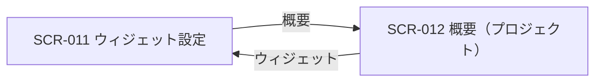
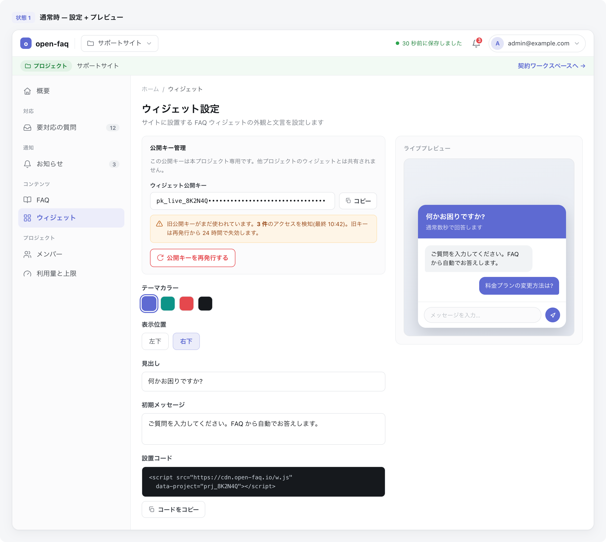
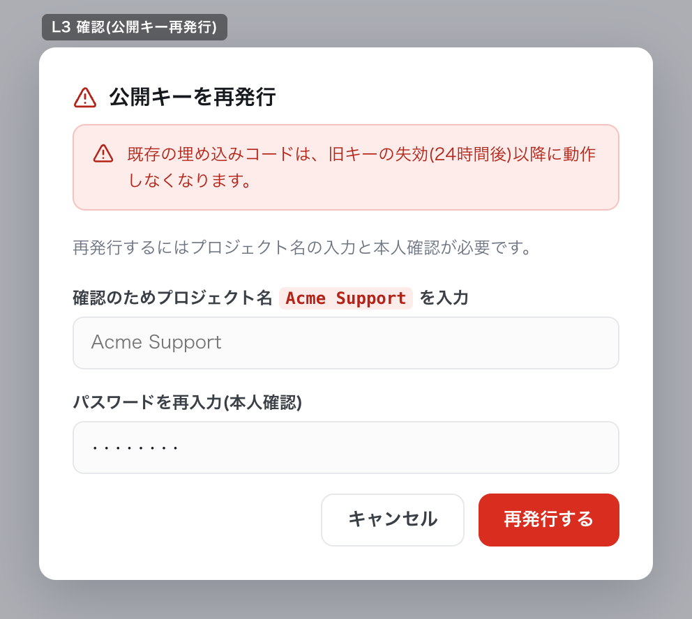

# SCR-011: ウィジェット設定

| ID | 業務ユースケースID | API ID |
|----|----|----|
| SCR-011 | [UC-001](../../../01_requirements/04_business_usecases/UC-001.md#UC-001) ・ [UC-038](../../../01_requirements/04_business_usecases/UC-038.md#UC-038) ・ [UC-039](../../../01_requirements/04_business_usecases/UC-039.md#UC-039) ・ [UC-075](../../../01_requirements/04_business_usecases/UC-075.md#UC-075) | [API-002](../../02_backend/03_apis/API-002.md#API-002) ・ [API-018](../../02_backend/03_apis/API-018.md#API-018) ・ [API-019](../../02_backend/03_apis/API-019.md#API-019) ・ [API-067](../../02_backend/03_apis/API-067.md#API-067) |

| ステークホルダ | 対象 |
|----------------|------|
| オーナー       | ◯    |
| メンバー       | ◯    |

## 1. 画面概要

- プロジェクト単位のウィジェット公開キー・埋め込みコード・見た目(主色・表示位置・見出し・初期メッセージ)・AI しきい値を 1 画面で設定する画面である。
- 対象はオーナー・メンバーで、いずれも閲覧・埋め込みコードのコピー・公開キー再発行・見た目の編集・設定保存を操作できる。
- AI しきい値は対象プロジェクト単位で編集できる。
- 公開キーはプロジェクトごとに 1 セットで、オーナーの全プロジェクト共通ではない。
- 主要な表示状態は通常時(設定 + プレビュー)・旧キー使用中バッジ表示・公開キー再発行の確認ダイアログである。

## 2. 画面遷移図

本画面からの画面遷移を、画面 ID・画面名とイベント(操作)で示します。

## 3. 画面レイアウト

本画面の代表状態と公開キー再発行の確認ダイアログを示します。

## 4. 画面項目

本画面が各状態で表示する入出力項目を定義します。

| # | 項目 | 種類 | 必須 | 最大長 | 初期値 | 表示条件 |
|----|----|----|----|----|----|----|
| 1 | 対象プロジェクト注記 | label | — | — | — | — |
| 2 | ウィジェット公開キー | input(text) | — | — | 現在の公開キー | — |
| 3 | 公開キーコピーボタン | button | — | — | — | — |
| 4 | 旧キー使用中バッジ | alert | — | — | — | ローテーション猶予中に旧キー使用検知時。猶予値は [システム仕様書 §4](../../07_system-spec.md#4-データ保持期間削除猶予) 参照 |
| 5 | 公開キーを再発行ボタン | button | — | — | — | — |
| 6 | 主色(テーマカラー)スウォッチ | radio | — | — | 現在の主色 | — |
| 7 | 主色(HEX)入力 | input(text) | — | 7 | 現在の主色 HEX(例 `#5E6AD2`) | — |
| 8 | 表示位置 | radio | — | — | 現在の表示位置(左下 / 右下) | — |
| 9 | 見出し | input(text) | — | 60 | 現在の見出し(例「何かお困りですか?」) | — |
| 10 | 初期メッセージ | textarea | — | 200 | 現在の初期メッセージ | — |
| 11 | 埋め込みコード | textarea | — | — | 埋め込み用 `<script>` タグ全文 | — |
| 12 | コードをコピーボタン | button | — | — | — | — |
| 13 | 設定を保存ボタン | button | — | — | — | — |
| 14 | ライブプレビュー | widget | — | — | — | — |
| 15 | 再発行確認 プロジェクト名入力 | input(text) | ◯ | 60 | — | 公開キー再発行 L3 確認ダイアログ表示中 |
| 16 | 再発行確認 パスワード(再認証) | input(password) | ◯ | 128 | — | 公開キー再発行 L3 確認ダイアログ表示中 |
| 17 | 再発行確認「再発行する」ボタン | button | — | — | — | 公開キー再発行 L3 確認ダイアログ表示中 |
| 18 | 再発行確認 キャンセルボタン | button | — | — | — | 公開キー再発行 L3 確認ダイアログ表示中 |
| 19 | 再発行確認 失効警告 | alert | — | — | 既存の埋め込みコードは旧キー失効後に動作しなくなります | 公開キー再発行 L3 確認ダイアログ表示中 |
| 20 | AI しきい値 適用元 | label | — | — | プロジェクト設定値 / グローバル既定値 | — |
| 21 | 信頼度しきい値 | input(number) | —（任意） | — | 現在適用される信頼度しきい値 | 未入力時はグローバル既定値（0.50 / 0.60）が適用される |
| 22 | 関連度しきい値 | input(number) | —（任意） | — | 現在適用される関連度しきい値 | 未入力時はグローバル既定値（0.50 / 0.60）が適用される |
| 23 | AI しきい値保存ボタン | button | — | — | — | — |

データパターン(選択肢・状態値など値のパターンを持つ項目)を定義する。

| 画面項目 | 表示名 | 補足 |
|----|----|----|
| #6 | 主色(既定) | プリセット色スウォッチ。任意の色は #7 で直接指定する |
| #6 | ティール | プリセット色スウォッチ |
| #6 | レッド | プリセット色スウォッチ |
| #6 | ダーク | プリセット色スウォッチ |
| #8 | 左下 | ウィジェットの表示位置 |
| #8 | 右下 | ウィジェットの表示位置 |
| #20 | プロジェクト設定値 | 対象プロジェクトの設定値が登録済みの場合に表示 |
| #20 | グローバル既定値 | 対象プロジェクトの設定値が未登録の場合に表示 |
| #21 / #22 | 未入力 | 両方未入力の場合はプロジェクト設定値を削除し、グローバル既定値（0.50 / 0.60）を適用する |
| #21 / #22 | 数値入力 | 両方入力の場合のみプロジェクト設定値として保存する。片方だけの入力は不可 |

## 5. バリデーション

本画面の入力項目に対する検証ルールを定義します。

| 画面項目 | タイミング | ルール | エラーコード |
|----|----|----|----|
| #7 | 入力時・保存時 | HEX カラー形式チェック | EM-01 |
| #9 | 入力時・保存時 | 最大長チェック(60 文字以内) | EM-02 |
| #10 | 入力時・保存時 | 最大長チェック(200 文字以内) | EM-03 |
| #21 | 入力時・保存時 | 入力がある場合のみ 0.0〜1.0 の数値範囲チェック。#21 / #22 の片方だけ入力は不可 | EM-07 |
| #22 | 入力時・保存時 | 入力がある場合のみ 0.0〜1.0 の数値範囲チェック。#21 / #22 の片方だけ入力は不可 | EM-07 |

## 6. イベント

本画面のイベント(初期表示・各操作)ごとに、対象の画面項目を定義します。各イベントの処理内容は [7. 画面イベント詳細](#7-画面イベント詳細) で定義します。

<table>
<colgroup>
<col style="width: 18%" />
<col style="width: 22%" />
<col style="width: 60%" />
</colgroup>
<thead>
<tr>
<th>EVT-ID</th>
<th>画面項目</th>
<th>イベント</th>
</tr>
</thead>
<tbody>
<tr>
<td>EVT-01</td>
<td>—</td>
<td>初期表示</td>
</tr>
<tr>
<td>EVT-02</td>
<td>#3</td>
<td>「コピー」を押下(公開キー)</td>
</tr>
<tr>
<td>EVT-03</td>
<td>#12</td>
<td>「コードをコピー」を押下(埋め込みコード)</td>
</tr>
<tr>
<td>EVT-04</td>
<td>#6</td>
<td>テーマカラーを選択</td>
</tr>
<tr>
<td>EVT-05</td>
<td>#7</td>
<td>主色(HEX)を入力</td>
</tr>
<tr>
<td>EVT-06</td>
<td>#8</td>
<td>表示位置を選択</td>
</tr>
<tr>
<td>EVT-07</td>
<td>#9</td>
<td>見出しを入力</td>
</tr>
<tr>
<td>EVT-08</td>
<td>#10</td>
<td>初期メッセージを入力</td>
</tr>
<tr>
<td>EVT-09</td>
<td>#5</td>
<td>「公開キーを再発行する」を押下</td>
</tr>
<tr>
<td>EVT-10</td>
<td>#13</td>
<td>「設定を保存」を押下</td>
</tr>
<tr>
<td>EVT-11</td>
<td>—</td>
<td>「概要」を押下</td>
</tr>
<tr>
<td>EVT-12</td>
<td>#23</td>
<td>「AI しきい値を保存」を押下</td>
</tr>
</tbody>
</table>

## 7. 画面イベント詳細

各イベントの処理内容を定義します。

<table>
<colgroup>
<col style="width: 14%" />
<col style="width: 86%" />
</colgroup>
<thead>
<tr>
<th>EVT-ID</th>
<th>処理</th>
</tr>
</thead>
<tbody>
<tr>
<td>EVT-01</td>
<td>初期表示時に当該プロジェクトの公開キー(#2)・ウィジェット設定(主色 #6・#7 / 表示位置 #8 / 見出し #9 / 初期メッセージ #10)・埋め込みコード(#11)・AI しきい値(#20〜#22)を取得して各欄とライブプレビュー(#14)に表示する。ローテーション猶予中に旧キー使用を検知している場合は旧キー使用中バッジ(#4)を表示する</td>
</tr>
<tr>
<td>EVT-02</td>
<td>「コピー」(#3)押下時に公開キー(#2)をコピーする:<pre>
 ┣ 成功: コピー完了を通知する
 ┗ 失敗: コピー失敗(EM-04)を表示する
</pre></td>
</tr>
<tr>
<td>EVT-03</td>
<td>「コードをコピー」(#12)押下時に埋め込みコード(#11)をコピーする:<pre>
 ┣ 成功: コピー完了を通知する
 ┗ 失敗: コピー失敗(EM-04)を表示する
</pre></td>
</tr>
<tr>
<td>EVT-04</td>
<td>プリセット色スウォッチ(#6)で主色を選択し、ライブプレビュー(#14)に反映する</td>
</tr>
<tr>
<td>EVT-05</td>
<td>主色(HEX)(#7)に入力した色を、§5 の形式チェックに通過した場合にライブプレビュー(#14)に反映する</td>
</tr>
<tr>
<td>EVT-06</td>
<td>表示位置(#8)を選択し、ライブプレビュー(#14)に反映する</td>
</tr>
<tr>
<td>EVT-07</td>
<td>見出し(#9)に入力した文言をライブプレビュー(#14)に反映する</td>
</tr>
<tr>
<td>EVT-08</td>
<td>初期メッセージ(#10)に入力した文言をライブプレビュー(#14)に反映する</td>
</tr>
<tr>
<td>EVT-09</td>
<td>「公開キーを再発行する」(#5)押下時に、プロジェクト名入力(#15)と再認証(#16)による確認ダイアログ(失効警告 #19 を含む)を表示する:<pre>
 ┣ 確認完了: <a href="../../02_backend/03_apis/API-019.md#API-019">ウィジェット鍵ローテーション(API-019)</a> で新しい公開キーを発行し、新キー(#2)を表示する(旧キーは猶予後に失効する)
 ┣ キャンセル: ダイアログを閉じ、キーは変更しない
 ┗ 失敗: エラー(EM-05)を表示し、キーは変更しない
</pre></td>
</tr>
<tr>
<td>EVT-10</td>
<td>「設定を保存」(#13)押下時に <a href="../../02_backend/03_apis/API-018.md#API-018">プロジェクト更新(API-018)</a> でウィジェット設定(主色・表示位置・見出し・初期メッセージ)を保存し、公開中のウィジェットへ反映する(§5 のバリデーション違反時はエラーを表示して中止する):<pre>
 ┣ 成功: 保存完了を通知する
 ┗ 失敗: エラー(EM-06)を表示し、設定は保存されない
</pre></td>
</tr>
<tr>
<td>EVT-11</td>
<td>「概要」押下時に <a href="SCR-012.md#SCR-012">SCR-012 概要(プロジェクト)</a> へ遷移する</td>
</tr>
<tr>
<td>EVT-12</td>
<td>「AI しきい値を保存」(#23)押下時に <a href="../../02_backend/03_apis/API-067.md#API-067">AIしきい値設定取得・更新(API-067)</a> で信頼度しきい値(#21)・関連度しきい値(#22)を保存し、以後の回答可否判定へ反映する。両方入力時は対象プロジェクトの設定値として保存し、両方未入力時は `null` を送信してプロジェクト設定値を削除しグローバル既定値へ戻す(§5 のバリデーション違反時はエラーを表示して中止する):<pre>
 ┣ 成功(両方入力): 保存完了を通知し、適用元(#20)をプロジェクト設定値として表示する
 ┣ 成功(両方未入力): 保存完了を通知し、適用元(#20)をグローバル既定値として表示する
 ┗ 失敗: エラー(EM-08)を表示し、設定は保存されない
</pre></td>
</tr>
</tbody>
</table>

## 8. エラーメッセージ

本画面が表示するエラー・警告メッセージを定義します。

| エラーコード | エラーメッセージ |
|----|----|
| EM-01 | カラーコードの形式が正しくありません(例: #5E6AD2) |
| EM-02 | 見出しは 60 文字以内で入力してください |
| EM-03 | 初期メッセージは 200 文字以内で入力してください |
| EM-04 | クリップボードへのコピーに失敗しました |
| EM-05 | 公開キーの再発行に失敗しました。しばらく経ってからお試しください |
| EM-06 | 設定の保存に失敗しました。しばらく経ってからお試しください |
| EM-07 | しきい値は 0.0〜1.0 の範囲で入力してください |
| EM-08 | AI しきい値の保存に失敗しました。しばらく経ってからお試しください |
