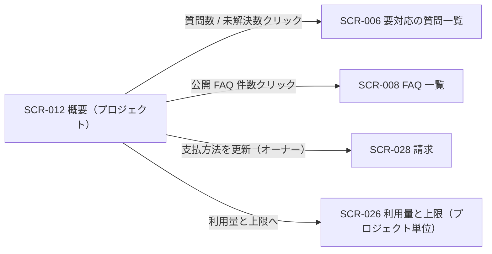

# SCR-012: 概要

| ID | 画面名 |
|----|----|
| SCR-012 | 概要 |

| 関連項目 | 内容 |
|----|----| 
| 業務ユースケース | [UC-001](../../../01_requirements/04_business_usecases/UC-001.md#UC-001) / [UC-033](../../../01_requirements/04_business_usecases/UC-033.md#UC-033) |
| API | [API-002](../../02_backend/03_apis/API-002.md#API-002) / [API-040](../../02_backend/03_apis/API-040.md#API-040) / [API-062](../../02_backend/03_apis/API-062.md#API-062) / [API-063](../../02_backend/03_apis/API-063.md#API-063) |

| ステークホルダ | 対象 |
|----------------|------|
| オーナー       | ◯    |
| メンバー       | ◯    |

## 1. 画面概要

- 選択中プロジェクトの質問数・未解決数・公開 FAQ 件数と、質問数の推移・要対応の質問(最近)を確認するプロジェクト概要画面である(各 KPI カードは項目名と件数のみを表示し、前月比・コメント・ゲージは表示しない)。
- 対象はオーナー・メンバーで、いずれも当該プロジェクトへの割当が前提である。
- 本画面は概要の閲覧のみを扱い、変更・削除操作は置かない(プロジェクト全体の利用状況は SCR-021、請求は SCR-028、プロジェクト編集・削除は SCR-004 / SCR-005 に分離する)。
- 主要な表示状態は通常時・無料利用枠超過・サスペンション中・質問数上限到達である。

## 2. 画面遷移図

本画面からの画面遷移を、画面 ID・画面名とイベント(操作)で示します。

## 3. 画面レイアウト

本画面の代表状態(通常時・利用枠超過バナー付き)を示します。

## 4. 画面項目

本画面が各状態で表示する入出力項目を定義します。

| # | 項目 | 種類 | 必須 | 最大長 | 初期値 | 表示条件 |
|----|----|----|----|----|----|----|
| 1 | 画面タイトル「概要」 | label | — | — | — | — |
| 2 | 期間選択 | select | — | — | 当月 | — |
| 3 | 無料利用枠超過バナー | alert | — | — | — | 無料利用枠を超過した場合 |
| 4 | 最終更新タイムスタンプ | label | — | — | — | — |
| 5 | 質問数カード | link | — | — | — | — |
| 6 | 未解決数カード | link | — | — | — | — |
| 7 | 公開 FAQ 件数カード | link | — | — | — | — |
| 8 | 質問数の推移チャート | label | — | — | — | — |
| 9 | 要対応の質問(最近)リスト | label | — | — | — | — |
| 10 | 要対応の質問「一覧へ」リンク | link | — | — | — | — |
| 11 | サスペンション中アラート | alert | — | — | — | プロジェクト課金状態が停止中(サスペンション)の場合 |
| 12 | 質問数上限到達バナー | alert | — | — | — | 質問数が月次上限に到達した場合 |

データパターン(選択肢・状態値など値のパターンを持つ項目)を定義する。

| 画面項目 | 表示名 | 補足 |
|----|----|----|
| #2 | 当月 | 既定 |
| #2 | 前月 | — |
| #2 | 任意期間 | 最大 13 ヶ月 |

## 5. バリデーション

本画面は集計値の閲覧のみで、利用者が値を入力する項目がありません。

(本画面に入力検証はありません)

## 6. イベント

本画面のイベント(初期表示・各操作)ごとに、対象の画面項目を定義します。各イベントの処理内容は [7. 画面イベント詳細](#7-画面イベント詳細) で定義します。

<table>
<colgroup>
<col style="width: 18%" />
<col style="width: 22%" />
<col style="width: 60%" />
</colgroup>
<thead>
<tr>
<th>EVT-ID</th>
<th>画面項目</th>
<th>イベント</th>
</tr>
</thead>
<tbody>
<tr>
<td>EVT-01</td>
<td>—</td>
<td>初期表示</td>
</tr>
<tr>
<td>EVT-02</td>
<td>#2</td>
<td>期間を選択</td>
</tr>
<tr>
<td>EVT-03</td>
<td>#5</td>
<td>質問数カードを押下</td>
</tr>
<tr>
<td>EVT-04</td>
<td>#6</td>
<td>未解決数カードを押下</td>
</tr>
<tr>
<td>EVT-05</td>
<td>#7</td>
<td>公開 FAQ 件数カードを押下</td>
</tr>
<tr>
<td>EVT-06</td>
<td>#11</td>
<td>「支払方法を更新」を押下(オーナー)</td>
</tr>
<tr>
<td>EVT-07</td>
<td>#3</td>
<td>「支払い方法を登録」を押下(オーナー)</td>
</tr>
<tr>
<td>EVT-08</td>
<td>#12</td>
<td>「利用量と上限へ」を押下</td>
</tr>
<tr>
<td>EVT-09</td>
<td>#10</td>
<td>要対応の質問「一覧へ」を押下</td>
</tr>
</tbody>
</table>

## 7. 画面イベント詳細

各イベントの処理内容を定義します。

<table>
<colgroup>
<col style="width: 14%" />
<col style="width: 86%" />
</colgroup>
<thead>
<tr>
<th>EVT-ID</th>
<th>処理</th>
</tr>
</thead>
<tbody>
<tr>
<td>EVT-01</td>
<td>初期表示時に <a href="../../02_backend/03_apis/API-040.md#API-040">ダッシュボードサマリ(API-040)</a> で質問数・未解決数・公開 FAQ 件数・質問数の推移・要対応の質問を取得し、各カード(#5〜#7)・推移チャート(#8)・要対応リスト(#9)・最終更新タイムスタンプ(#4)に表示する。プロジェクトの状態に応じてバナー・アラートを表示する:<pre>
 ┣ サスペンション中: サスペンション中アラート(#11)を表示する
 ┣ 無料利用枠超過: 超過バナー(#3)を表示する
 ┗ 質問数が月次上限到達: 上限到達バナー(#12)を表示する
</pre></td>
</tr>
<tr>
<td>EVT-02</td>
<td>期間(#2)選択時に選択期間で <a href="../../02_backend/03_apis/API-040.md#API-040">ダッシュボードサマリ(API-040)</a> を再取得し、各カード(#5〜#7)・推移チャート(#8)・要対応リスト(#9)を更新する:<pre>
 ┣ 成功: 各表示を更新する
 ┗ 取得失敗: 各カードをエラー状態で表示しクリック不可とする
</pre></td>
</tr>
<tr>
<td>EVT-03</td>
<td>質問数カード(#5)押下時に分岐する:<pre>
 ┣ 成功(1 件以上): 要対応の質問一覧(<a href="SCR-006.md#SCR-006">SCR-006</a>)へ遷移する
 ┗ 0 件 / 集計中 / 取得失敗: クリック不可
</pre></td>
</tr>
<tr>
<td>EVT-04</td>
<td>未解決数カード(#6)押下時に分岐する:<pre>
 ┣ 成功(1 件以上): 未解決で絞り込んだ要対応の質問一覧(<a href="SCR-006.md#SCR-006">SCR-006</a>)へ遷移する
 ┗ 0 件 / 集計中 / 取得失敗: クリック不可
</pre></td>
</tr>
<tr>
<td>EVT-05</td>
<td>公開 FAQ 件数カード(#7)押下時に分岐する:<pre>
 ┣ 成功(1 件以上): 公開中で絞り込んだ FAQ 一覧(<a href="SCR-008.md#SCR-008">SCR-008</a>)へ遷移する
 ┗ 0 件 / 集計中 / 取得失敗: クリック不可
</pre></td>
</tr>
<tr>
<td>EVT-06</td>
<td>サスペンション中アラート(#11)の「支払方法を更新」押下時(オーナー)に <a href="SCR-028.md">SCR-028 請求</a>へ遷移する</td>
</tr>
<tr>
<td>EVT-07</td>
<td>無料利用枠超過バナー(#3)の「支払い方法を登録」押下時(オーナー)に <a href="SCR-028.md">SCR-028 請求</a>へ遷移する</td>
</tr>
<tr>
<td>EVT-08</td>
<td>質問数上限到達バナー(#12)の「利用量と上限へ」押下時に <a href="SCR-026.md">SCR-026 利用量と上限(プロジェクト単位)</a>へ遷移する</td>
</tr>
<tr>
<td>EVT-09</td>
<td>要対応の質問(最近)リスト(#9)の「一覧へ」(#10)押下時に <a href="SCR-006.md">SCR-006 要対応の質問一覧</a>へ遷移する</td>
</tr>
</tbody>
</table>

## 8. エラーメッセージ

本画面はエラー・警告メッセージを表示しません。
