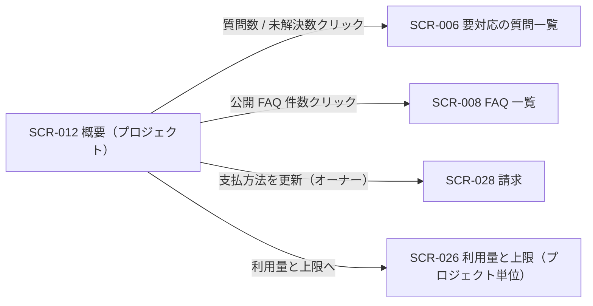
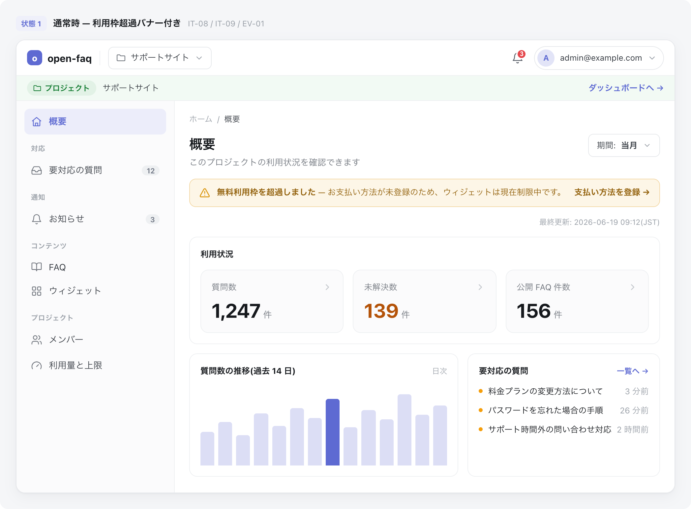

| 画面 ID | 画面名 | トレーサビリティID |
|----|----|----|
| SCR-012 | 概要(プロジェクト) | [TR-033](../../00_traceability/index.md#TR-033) |

| ステークホルダ | 対象 |
|----------------|------|
| オーナー       | ◯    |
| メンバー       | ◯    |

## 1. 画面概要

選択中プロジェクトの質問数・未解決数・公開 FAQ 件数を確認し、各数値から関連ワークスペース画面へ遷移するプロジェクト概要画面です。質問数の推移と要対応の質問(最近)も併せて表示します。

> [!NOTE]
> **補足** 各ステークホルダとも当該プロジェクトへの割当が前提です。本画面はプロジェクト概要の閲覧のみを扱い、変更・削除操作は置きません。自分が作成したプロジェクト全体の利用状況は SCR-021、請求は SCR-028、プロジェクト編集・削除は SCR-004 / SCR-005 に分離します。0 件 / 集計中 / 取得失敗時のクリック非活性ルールは 画面設計 §1.5 ダッシュボード / KPI 共通表示ルールに従います。

## 2. 画面遷移図

本画面からの画面遷移を、画面 ID・画面名とイベント(操作)で示します。

## 3. 画面レイアウト

本画面の代表状態(通常時・利用枠超過バナー付き)を示します。サスペンション中・質問数上限到達などの各状態は §4 の `表示条件` で定義します。

## 4. 画面項目

本画面が各状態で表示する入出力項目(ヘッダ・期間選択・状態アラート・KPI カード・推移・要対応リスト)を定義します。各カードは項目名と件数のみを表示し、前月比・コメント・ゲージは表示しません。

| # | 項目 | 種類 | 必須 | 最大長 | 初期値 | 表示条件 |
|----|----|----|----|----|----|----|
| 1 | 画面タイトル「概要」 | div | — | — | — | — |
| 2 | 期間選択 | select | — | — | 当月 | — |
| 3 | 無料利用枠超過バナー | alert | — | — | — | 無料利用枠を超過した場合 |
| 4 | 最終更新タイムスタンプ | div | — | — | — | — |
| 5 | 質問数カード | link | — | — | — | — |
| 6 | 未解決数カード | link | — | — | — | — |
| 7 | 公開 FAQ 件数カード | link | — | — | — | — |
| 8 | 質問数の推移チャート | div | — | — | — | — |
| 9 | 要対応の質問(最近)リスト | div | — | — | — | — |
| 10 | 要対応の質問「一覧へ」リンク | link | — | — | — | — |
| 11 | サスペンション中アラート | alert | — | — | — | プロジェクト課金状態が停止中(サスペンション)の場合 |
| 12 | 質問数上限到達バナー | alert | — | — | — | 質問数が月次上限に到達した場合 |

**#2 期間選択の選択肢(コード値=表示名)**: `current_month`=当月 / `last_month`=前月 / `custom`=任意期間(最大 13 ヶ月)

## 5. バリデーション

本画面は集計値の閲覧のみで、利用者が値を入力する項目がありません。

(本画面に入力検証はありません)

## 6. イベント

本画面のイベント(初期表示・各操作)ごとに、対象の画面項目を定義します。各イベントの処理内容は [7. 画面イベント詳細](#7-画面イベント詳細) で定義します。KPI カード(#5 質問数 / #6 未解決数 / #7 公開 FAQ 件数)押下時(EVT-092〜EVT-094)は、現在開いているプロジェクト・期間選択(#2)を引き継いで該当一覧へ遷移します(引き継ぐ検索パラメータは [7. 画面イベント詳細](#7-画面イベント詳細) で定義)。

<table>
<colgroup>
<col style="width: 18%" />
<col style="width: 22%" />
<col style="width: 60%" />
</colgroup>
<thead>
<tr>
<th>EVT-ID</th>
<th>画面項目</th>
<th>イベント</th>
</tr>
</thead>
<tbody>
<tr>
<td>EVT-090</td>
<td>—</td>
<td>初期表示</td>
</tr>
<tr>
<td>EVT-091</td>
<td>#2</td>
<td>期間を選択</td>
</tr>
<tr>
<td>EVT-092</td>
<td>#5</td>
<td>質問数カードを押下</td>
</tr>
<tr>
<td>EVT-093</td>
<td>#6</td>
<td>未解決数カードを押下</td>
</tr>
<tr>
<td>EVT-094</td>
<td>#7</td>
<td>公開 FAQ 件数カードを押下</td>
</tr>
<tr>
<td>EVT-095</td>
<td>#11</td>
<td>「支払方法を更新」を押下(オーナー)</td>
</tr>
<tr>
<td>EVT-096</td>
<td>#3</td>
<td>「支払い方法を登録」を押下(オーナー)</td>
</tr>
<tr>
<td>EVT-097</td>
<td>#12</td>
<td>「利用量と上限へ」を押下</td>
</tr>
<tr>
<td>EVT-098</td>
<td>#10</td>
<td>要対応の質問「一覧へ」を押下</td>
</tr>
</tbody>
</table>

## 7. 画面イベント詳細

各イベントの処理内容を定義します。

<table>
<colgroup>
<col style="width: 14%" />
<col style="width: 86%" />
</colgroup>
<thead>
<tr>
<th>EVT-ID</th>
<th>処理</th>
</tr>
</thead>
<tbody>
<tr>
<td>EVT-090</td>
<td>初期表示時に次を行う:<pre>
1. <a href="../../02_backend/03_apis/API-040.md#API-040">ダッシュボードサマリ</a> API(GET /dashboard/summary、デフォルト期間: 当月)で質問数・未解決数・公開 FAQ 件数・質問数の推移・要対応の質問を取得する
2. 質問数カード(#5)・未解決数カード(#6)・公開 FAQ 件数カード(#7)・質問数の推移チャート(#8)・要対応の質問(最近)リスト(#9)へ表示する
3. 最終更新タイムスタンプ(#4)を表示し、5 分以上前なら「集計遅延」黄表記とする
4. 状態に応じてバナー・アラートを表示する
   ┣ プロジェクト課金状態がサスペンション中: サスペンション中アラート(#11)を表示する
   ┣ 無料利用枠超過: 超過バナー(#3)を表示する(支払方法未登録時はウィジェット制限中の旨を併記)
   ┗ 質問数が月次上限到達: 上限到達バナー(#12)を表示する
</pre></td>
</tr>
<tr>
<td>EVT-091</td>
<td>期間(#2)選択時に選択期間で <a href="../../02_backend/03_apis/API-040.md#API-040">ダッシュボードサマリ</a> API を再取得し、KPI カード(#5〜#7)・推移チャート(#8)・要対応リスト(#9)を更新する:<pre>
 ┣ 成功: 各表示を更新する
 ┗ 取得失敗: 各カードをエラー状態で表示しクリック不可(非活性)とする
</pre></td>
</tr>
<tr>
<td>EVT-092</td>
<td>質問数カード(#5)押下時に分岐する:<pre>
 ┣ 成功(1 件以上): <a href="SCR-006.md#SCR-006">SCR-006 要対応の質問一覧</a>へ遷移する。引き継ぐ検索パラメータ:
 ┃  ┣ projectId = 現在開いているプロジェクト
 ┃  ┗ period = 期間選択(#2)の選択値(当月: current_month / 前月: last_month / 任意期間: custom。要対応の質問一覧側の期間フィルタ(開始 〜 終了)へ換算して付与する)
 ┃     ※ 状況(status)は付与しない(質問数全体のため絞り込みなし)
 ┗ 0 件 / 集計中 / 取得失敗: クリック不可(非活性)
</pre></td>
</tr>
<tr>
<td>EVT-093</td>
<td>未解決数カード(#6)押下時に分岐する:<pre>
 ┣ 成功(1 件以上): <a href="SCR-006.md#SCR-006">SCR-006 要対応の質問一覧</a>へ遷移する。引き継ぐ検索パラメータ:
 ┃  ┣ projectId = 現在開いているプロジェクト
 ┃  ┣ status = open(未解決=要対応で絞り込む)
 ┃  ┗ period = 期間選択(#2)の選択値(当月: current_month / 前月: last_month / 任意期間: custom。要対応の質問一覧側の期間フィルタ(開始 〜 終了)へ換算して付与する)
 ┗ 0 件 / 集計中 / 取得失敗: クリック不可(非活性)
</pre></td>
</tr>
<tr>
<td>EVT-094</td>
<td>公開 FAQ 件数カード(#7)押下時に分岐する:<pre>
 ┣ 成功(1 件以上): <a href="SCR-008.md#SCR-008">SCR-008 FAQ 一覧</a>へ遷移する。引き継ぐ検索パラメータ:
 ┃  ┣ projectId = 現在開いているプロジェクト
 ┃  ┗ status = published(公開中の FAQ で絞り込む。期間選択(#2)は FAQ 件数の集計対象外のため引き継がない)
 ┗ 0 件 / 集計中 / 取得失敗: クリック不可(非活性)
</pre></td>
</tr>
<tr>
<td>EVT-095</td>
<td>サスペンション中アラート(#11)の「支払方法を更新」押下時(オーナー)に <a href="SCR-028.md">SCR-028 請求</a>へ遷移する</td>
</tr>
<tr>
<td>EVT-096</td>
<td>無料利用枠超過バナー(#3)の「支払い方法を登録」押下時(オーナー)に <a href="SCR-028.md">SCR-028 請求</a>へ遷移する</td>
</tr>
<tr>
<td>EVT-097</td>
<td>質問数上限到達バナー(#12)の「利用量と上限へ」押下時に <a href="SCR-026.md">SCR-026 利用量と上限(プロジェクト単位)</a>へ遷移する</td>
</tr>
<tr>
<td>EVT-098</td>
<td>要対応の質問(最近)リスト(#9)の「一覧へ」(#10)押下時に <a href="SCR-006.md">SCR-006 要対応の質問一覧</a>へ遷移する</td>
</tr>
</tbody>
</table>

## 8. エラーメッセージ

本画面はエラー・警告メッセージを表示しません。
