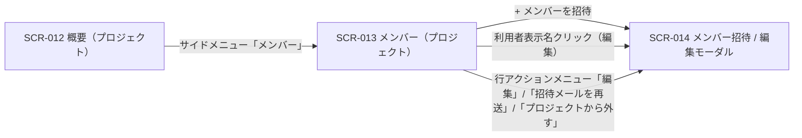

# SCR-013: メンバー

| ID | 業務ユースケースID | API ID |
|----|----|----|
| SCR-013 | [UC-018](../../../01_requirements/04_business_usecases/UC-018.md#UC-018) | [API-020](../../02_backend/03_apis/API-020.md#API-020) |

| ステークホルダ | 対象 |
|----------------|------|
| オーナー       | ◯    |
| メンバー       | ◯    |

## 1. 画面概要

- 当該プロジェクトに割当のあるメンバーを一覧表示し、招待・割当解除の管理を行う画面である。
- 表示範囲は常に当該プロジェクト 1 件で、プロジェクト横断のメンバー管理は持たない。
- オーナー(作成者)は当該プロジェクトを全権操作でき、自身が作成したプロジェクトのメンバーとしても扱う。
- 当該プロジェクトのメンバー(オーナーを含む)は一覧閲覧・招待・割当解除を操作できる。
- 主要な表示状態は通常(一覧表示)・空状態である。

## 2. 画面遷移図

本画面からの画面遷移を、画面 ID・画面名とイベント(操作)で示します。

## 3. 画面レイアウト

本画面の代表状態(通常時 — メンバー一覧)を示します。

## 4. 画面項目

本画面が表示する入出力項目を定義します。

| # | 項目 | 種類 | 必須 | 最大長 | 初期値 | 表示条件 |
|----|----|----|----|----|----|----|
| 1 | + メンバーを招待 | button | — | — | — | — |
| 2 | 検索 | input(search) | — | 100 | — | メンバーが 1 件以上のとき |
| 3 | 招待状態フィルタ | select | — | — | すべて | メンバーが 1 件以上のとき |
| 4 | 件数表示 | label | — | — | — | メンバーが 1 件以上のとき |
| 5 | 利用者表示名 | link | — | — | — | メンバーが 1 件以上のとき(オーナー行・自分の行はテキスト表示のみ) |
| 6 | メールアドレス | label | — | — | — | メンバーが 1 件以上のとき |
| 7 | このプロジェクトでの区分 | label | — | — | — | メンバーが 1 件以上のとき |
| 8 | ステータス | label | — | — | — | メンバーが 1 件以上のとき |
| 9 | 参加日 | label | — | — | — | メンバーが 1 件以上のとき |
| 10 | 行アクションメニュー | button | — | — | — | メンバーが 1 件以上のとき(各行) |
| 11 | 招待中行強調 | label | — | — | — | 対象者が招待中(本人未有効化)の行のみ |
| 12 | 空状態 | label | — | — | — | 割当メンバーが 0 件のとき |

データパターン(選択肢・状態値など値のパターンを持つ項目)を定義する。

| 画面項目 | 表示名 | 補足 |
|----|----|----|
| #3 | すべて | 招待状態フィルタの初期値 |
| #3 | 有効 | — |
| #3 | 招待中 | — |
| #7 | オーナー | 青バッジ |
| #7 | メンバー | 灰バッジ |
| #8 | 有効 | 緑バッジ。利用中 |
| #8 | 招待中 | 橙バッジ。本人未有効化 |
| #9 | 参加日 | 有効化済みは参加日を表示 |
| #9 | — | 招待中は「—」を表示 |

## 5. バリデーション

本画面には送信フォームが無いため入力検証はありません。

## 6. イベント

本画面のイベント(初期表示・各操作)ごとに、対象の画面項目を定義します。各イベントの処理内容は [7. 画面イベント詳細](#7-画面イベント詳細) で定義します。

<table>
<colgroup>
<col style="width: 18%" />
<col style="width: 22%" />
<col style="width: 60%" />
</colgroup>
<thead>
<tr>
<th>EVT-ID</th>
<th>画面項目</th>
<th>イベント</th>
</tr>
</thead>
<tbody>
<tr>
<td>EVT-01</td>
<td>—</td>
<td>初期表示</td>
</tr>
<tr>
<td>EVT-02</td>
<td>#2</td>
<td>検索を入力</td>
</tr>
<tr>
<td>EVT-03</td>
<td>#3</td>
<td>招待状態フィルタを選択</td>
</tr>
<tr>
<td>EVT-04</td>
<td>#1</td>
<td>「+ メンバーを招待」を押下</td>
</tr>
<tr>
<td>EVT-05</td>
<td>#12</td>
<td>(空状態)「+ メンバーを招待」を押下</td>
</tr>
<tr>
<td>EVT-06</td>
<td>#5</td>
<td>利用者表示名リンクを押下</td>
</tr>
<tr>
<td>EVT-07</td>
<td>#10</td>
<td>行アクションメニュー（⋯）を開く</td>
</tr>
<tr>
<td>EVT-08</td>
<td>#10</td>
<td>行アクションメニューの「編集」を押下</td>
</tr>
<tr>
<td>EVT-09</td>
<td>#10</td>
<td>行アクションメニューの「招待メールを再送」を押下</td>
</tr>
<tr>
<td>EVT-10</td>
<td>#10</td>
<td>行アクションメニューの「プロジェクトから外す」を押下</td>
</tr>
</tbody>
</table>

## 7. 画面イベント詳細

各イベントの処理内容を定義します。

<table>
<colgroup>
<col style="width: 14%" />
<col style="width: 86%" />
</colgroup>
<thead>
<tr>
<th>EVT-ID</th>
<th>処理</th>
</tr>
</thead>
<tbody>
<tr>
<td>EVT-01</td>
<td>初期表示時に当該プロジェクトの<a href="../../02_backend/03_apis/API-020.md#API-020">メンバー一覧(API-020)</a>を表示する<pre>
 ┣ 1 件以上: 一覧(#5〜#10)を表示し、招待中(本人未有効化)の行は招待中行強調(#11)を付す
 ┗ 0 件: 空状態(#12)を表示する
</pre></td>
</tr>
<tr>
<td>EVT-02</td>
<td>検索(#2)入力時に、入力に一致する<a href="../../02_backend/03_apis/API-020.md#API-020">メンバー一覧(API-020)</a>を表示する</td>
</tr>
<tr>
<td>EVT-03</td>
<td>招待状態フィルタ(#3)選択時に、選択した招待状態の<a href="../../02_backend/03_apis/API-020.md#API-020">メンバー一覧(API-020)</a>を表示する</td>
</tr>
<tr>
<td>EVT-04</td>
<td>「+ メンバーを招待」押下時にメンバー招待 / 編集モーダル(SCR-014)を招待モードで開く</td>
</tr>
<tr>
<td>EVT-05</td>
<td>空状態(#12)内の「+ メンバーを招待」押下時にメンバー招待 / 編集モーダル(SCR-014)を招待モードで開く</td>
</tr>
<tr>
<td>EVT-06</td>
<td>利用者表示名リンク(#5)押下時にメンバー招待 / 編集モーダル(SCR-014)を編集モードで開く(オーナー行・ログイン中の自分の行はリンク化しないため本イベントは発生しない)</td>
</tr>
<tr>
<td>EVT-07</td>
<td>行アクションメニュー(⋯, #10)押下時に当該行のメニューを開く。メニュー項目は対象者の状態で出し分ける<pre>
 ┣ 招待メールを再送: 対象者が招待中(本人未有効化)の行のみ表示する
 ┗ プロジェクトから外す: オーナー行・ログイン中の自分の行では非表示にする
</pre></td>
</tr>
<tr>
<td>EVT-08</td>
<td>行アクションメニューの「編集」押下時にメンバー招待 / 編集モーダル(SCR-014)を編集モードで開く</td>
</tr>
<tr>
<td>EVT-09</td>
<td>行アクションメニューの「招待メールを再送」押下時にメンバー招待 / 編集モーダル(SCR-014)を編集モードで開く</td>
</tr>
<tr>
<td>EVT-10</td>
<td>行アクションメニューの「プロジェクトから外す」押下時にメンバー招待 / 編集モーダル(SCR-014)を編集モードで開く</td>
</tr>
</tbody>
</table>

## 8. エラーメッセージ

本画面はエラー・警告メッセージを表示しません。
