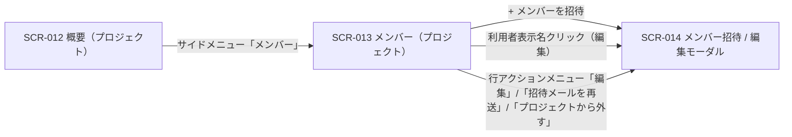

| 画面 ID | 画面名 | トレーサビリティID |
|----|----|----|
| SCR-013 | メンバー(プロジェクト) | [TR-018](../../00_traceability/index.md#TR-018) ・ [TR-047](../../00_traceability/index.md#TR-047) |

| ステークホルダ | 対象 |
|----------------|------|
| オーナー       | ◯    |
| メンバー       | ◯    |

## 1. 画面概要

当該プロジェクトに割当のあるメンバーを一覧表示し、招待・割当解除モーダル(SCR-014)への導線を提供する画面です。表示範囲は常に当該プロジェクト 1 件で、契約横断のメンバー管理は持ちません。

> [!NOTE]
> **補足** オーナーは全プロジェクトを全権操作でき、加えて自身が作成した各プロジェクトのメンバーとしても扱われます。当該プロジェクトのメンバー(オーナーを含む)はメンバー一覧・招待・割当解除を操作できます。当該プロジェクトに割当の無いユーザーの URL 直アクセスは 403 → ダッシュボードへリダイレクトします。

## 2. 画面遷移図

本画面からの画面遷移を、画面 ID・画面名とイベント(操作)で示します。

## 3. 画面レイアウト

本画面の代表状態(通常時 — メンバー一覧)を示します。空状態・権限不足ガードの各状態は §4 の `表示条件` で定義します。

## 4. 画面項目

本画面が各状態で表示する入出力項目(操作ボタン・件数表示・一覧の列・空状態を含む)を定義します。一覧表に「操作」列は設けず、編集遷移は利用者表示名のリンクに集約します(遷移リンクは名称列に付与する全画面共通方針)。プロジェクト内の役割差は持たないため、割当のあるユーザーは一覧上いずれも「メンバー」として扱います(オーナー行のみ別バッジで区別)。

| # | 項目 | 種類 | 必須 | 最大長 | 初期値 | 表示条件 |
|----|----|----|----|----|----|----|
| 1 | + メンバーを招待 | button | — | — | — | — |
| 2 | 件数表示 | div | — | — | — | メンバーが 1 件以上のとき |
| 3 | 利用者表示名 | link | — | — | — | メンバーが 1 件以上のとき(オーナー行・自分の行はテキスト表示のみ) |
| 4 | メールアドレス | div | — | — | — | メンバーが 1 件以上のとき |
| 5 | このプロジェクトでの区分 | div | — | — | — | メンバーが 1 件以上のとき |
| 6 | ステータス | div | — | — | — | メンバーが 1 件以上のとき |
| 7 | 参加日 | div | — | — | — | メンバーが 1 件以上のとき |
| 8 | 行アクションメニュー | button | — | — | — | メンバーが 1 件以上のとき(各行) |
| 9 | 招待中行強調 | div | — | — | — | 対象者が招待中(本人未有効化)の行のみ |
| 10 | 空状態 | div | — | — | — | 割当メンバーが 0 件のとき |
| 11 | 権限不足ガード | alert | — | — | — | 当該プロジェクトに割当の無いユーザーが URL に直接アクセスした場合(403) |
| 12 | ダッシュボードへ戻る | link | — | — | — | #11 表示中のみ |

- **#5 このプロジェクトでの区分の表示値**: オーナー(青バッジ)/ メンバー(灰バッジ)。
- **#6 ステータスの表示値**: 利用中=「有効」(緑バッジ)/ 招待中=「招待中」(橙バッジ。本人未有効化)。
- **#7 参加日の表示値**: 有効化済みは参加日(`YYYY-MM-DD`)、招待中は「—」を表示する。

## 5. バリデーション

本画面には入力フォームがないため、入力検証はありません(本画面に入力検証はありません)。検索・絞り込みは持たず、一覧はメンバー一覧取得 API の応答をそのまま表示します。

## 6. イベント

本画面のイベント(初期表示・各操作)ごとに、対象の画面項目を定義します。各イベントの処理内容は [7. 画面イベント詳細](#7-画面イベント詳細) で定義します。

<table>
<colgroup>
<col style="width: 18%" />
<col style="width: 22%" />
<col style="width: 60%" />
</colgroup>
<thead>
<tr>
<th>EVT-ID</th>
<th>画面項目</th>
<th>イベント</th>
</tr>
</thead>
<tbody>
<tr>
<td>EVT-099</td>
<td>—</td>
<td>初期表示</td>
</tr>
<tr>
<td>EVT-100</td>
<td>#1</td>
<td>「+ メンバーを招待」を押下</td>
</tr>
<tr>
<td>EVT-101</td>
<td>#10</td>
<td>(空状態)「+ メンバーを招待」を押下</td>
</tr>
<tr>
<td>EVT-102</td>
<td>#3</td>
<td>利用者表示名リンクを押下</td>
</tr>
<tr>
<td>EVT-103</td>
<td>—</td>
<td>権限なしで URL 直アクセス</td>
</tr>
<tr>
<td>EVT-104</td>
<td>#12</td>
<td>「ダッシュボードへ戻る」を押下</td>
</tr>
<tr>
<td>EVT-105</td>
<td>#8</td>
<td>行アクションメニュー（⋯）を開く</td>
</tr>
<tr>
<td>EVT-106</td>
<td>#8</td>
<td>行アクションメニューの「編集」を押下</td>
</tr>
<tr>
<td>EVT-107</td>
<td>#8</td>
<td>行アクションメニューの「招待メールを再送」を押下</td>
</tr>
<tr>
<td>EVT-108</td>
<td>#8</td>
<td>行アクションメニューの「プロジェクトから外す」を押下</td>
</tr>
</tbody>
</table>

## 7. 画面イベント詳細

各イベントの処理内容を定義します。

<table>
<colgroup>
<col style="width: 14%" />
<col style="width: 86%" />
</colgroup>
<thead>
<tr>
<th>EVT-ID</th>
<th>処理</th>
</tr>
</thead>
<tbody>
<tr>
<td>EVT-099</td>
<td>初期表示時に <a href="../../02_backend/03_apis/API-020.md#API-020">メンバー一覧</a> API で当該プロジェクトのメンバー一覧を取得し、件数で分岐する<pre>
 ┣ 1 件以上: 件数表示(#2)と一覧(#3〜#8)を描画し、招待中(本人未有効化)の行は招待中行強調(#9)を適用する
 ┗ 0 件: 空状態(#10)を表示する
</pre></td>
</tr>
<tr>
<td>EVT-100</td>
<td>「+ メンバーを招待」押下時にメンバー招待 / 編集モーダル(SCR-014)を招待モードで開く</td>
</tr>
<tr>
<td>EVT-101</td>
<td>空状態(#10)内の「+ メンバーを招待」押下時にメンバー招待 / 編集モーダル(SCR-014)を招待モードで開く</td>
</tr>
<tr>
<td>EVT-102</td>
<td>利用者表示名リンク(#3)押下時にメンバー招待 / 編集モーダル(SCR-014)を編集モードで開く(オーナー行・ログイン中の自分の行はリンク化しないため本イベントは発生しない)</td>
</tr>
<tr>
<td>EVT-103</td>
<td>当該プロジェクトに割当の無いユーザーが URL に直接アクセスした場合、権限不足ガード(#11)にエラー(EM-01)を表示する(HTTP 403 相当)</td>
</tr>
<tr>
<td>EVT-104</td>
<td>「ダッシュボードへ戻る」(#12)押下時にダッシュボードへ遷移する</td>
</tr>
<tr>
<td>EVT-105</td>
<td>行アクションメニュー(⋯, #8)押下時に当該行のメニュー(編集 / 招待メールを再送 / プロジェクトから外す)を開く。メニュー項目は対象者の状態で出し分ける<pre>
 ┣ 招待メールを再送: 対象者が招待中(本人未有効化)の行のみ表示する
 ┗ プロジェクトから外す: オーナー行・ログイン中の自分の行では非表示にする
</pre></td>
</tr>
<tr>
<td>EVT-106</td>
<td>行アクションメニューの「編集」押下時にメンバー招待 / 編集モーダル(SCR-014)を編集モードで開く(SCR-014 が対象メンバーのメールアドレス更新を <a href="../../02_backend/03_apis/API-022.md#API-022">メンバー情報更新</a> API で行う)</td>
</tr>
<tr>
<td>EVT-107</td>
<td>行アクションメニューの「招待メールを再送」押下時にメンバー招待 / 編集モーダル(SCR-014)を編集モードで開く(SCR-014 が <a href="../../02_backend/03_apis/API-024.md#API-024">招待メール再送</a> API で当該メンバーへ招待メールを再送する)</td>
</tr>
<tr>
<td>EVT-108</td>
<td>行アクションメニューの「プロジェクトから外す」押下時にメンバー招待 / 編集モーダル(SCR-014)を編集モードで開く(SCR-014 が割当解除確認を経て <a href="../../02_backend/03_apis/API-023.md#API-023">プロジェクト割当解除</a> API を発行する)</td>
</tr>
</tbody>
</table>

## 8. エラーメッセージ

本画面が表示するエラー・警告メッセージを定義します。

| エラーコード | エラーメッセージ |
|----|----|
| EM-01 | このページを表示する権限がありません |
