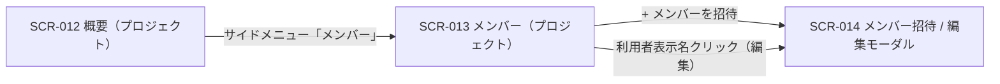
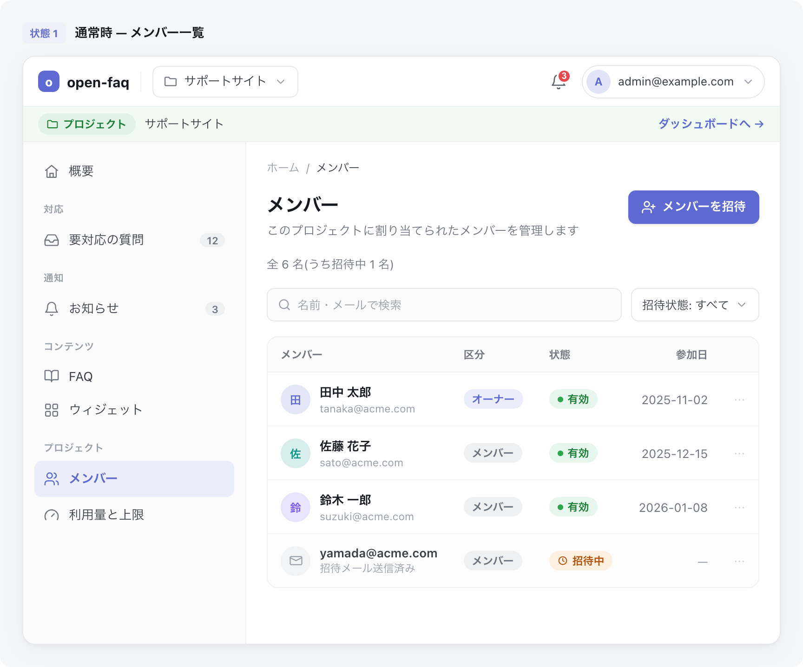

# SCR-013 メンバー(プロジェクト)

> **このページは、当該プロジェクトに割り当てたメンバーを一覧表示し、招待・割当解除モーダルへの導線を提供する画面 SCR-013 を定義します。** 画面概要 / 画面遷移図 / 画面レイアウト / 画面項目定義 / 入出力一覧 / 画面イベント一覧 の 6 セクションで記述します。

## 1. 画面概要

当該プロジェクトに割当のあるメンバーを一覧表示し、招待・割当解除モーダル(SCR-014)への導線を提供する画面です。表示範囲は常に当該プロジェクト 1 件で、契約横断のメンバー管理は持ちません。

| 画面 ID | 画面名 | 機能概要 |
|----|----|----|
| `SCR-013` | メンバー(プロジェクト) | 当該プロジェクトのメンバー一覧表示・絞り込みと、招待 / 編集モーダルへの導線を提供する |

| 関連 | 内容 |
|----|----|
| FR / BR | FR-024, FR-026〜FR-028, FR-030, FR-034〜FR-036, FR-183 / BR-011, BR-012 |
| 関連画面 | [`SCR-014` メンバー招待 / 編集モーダル](SCR-014.md) / [`SCR-012` 概要(プロジェクト)](SCR-012.md) |
| 対応業務UC | [UC-018](../../../01_requirements/04_business_usecases/UC-018.md#UC-018) ・ [UC-048](../../../01_requirements/04_business_usecases/UC-048.md#UC-048) |

| ステークホルダ | 対象 |
|----------------|------|
| オーナー       | ◯    |
| メンバー       | ◯    |

> [!NOTE]
> **補足** オーナー(`M_CONTRACT` 行存在)は `isOwner` 判定により全プロジェクトを全権操作でき、加えて作成した各プロジェクトに `M_PRJ_USERS` のメンバー行を自動保持します。当該プロジェクトのメンバー(オーナーを含む)はメンバー一覧・招待・割当解除を操作できます。当該プロジェクトに割当の無いユーザーの URL 直アクセスは 403 → ダッシュボードへリダイレクトします。

## 2. 画面遷移図

本画面からの画面遷移を、画面 ID・画面名とイベント(操作)で示します。

## 3. 画面レイアウト

## 4. 画面項目定義

本画面の入出力項目(絞り込み・一覧の列・件数表示・空状態を含む)を定義します。項目の正本は本表です。一覧表に「操作」列は設けず、編集遷移は利用者表示名のリンクに集約します(遷移リンクは名称列に付与する全画面共通方針)。プロジェクト内の役割差は持たないため、割当のあるユーザーは一覧上いずれも「メンバー」として扱います(オーナー行のみ別バッジで区別)。

| 項目 ID | 項目 | 説明 | 種類 | 表示条件 | 表示 |
|----|----|----|----|----|----|
| `IT-01` | 検索 | 表示名・メールアドレスの部分一致でメンバーを絞り込む | テキストボックス | — | — |
| `IT-02` | 招待状態フィルタ | 招待状態でメンバーを絞り込む | ドロップダウン | — | 「すべて」/「招待中のみ」/「アクティベーション済み」 |
| `IT-03` | 件数表示 | 一覧の表示範囲と総件数を表示する | ラベル | — | 「1-50 / 全 N 件」形式 |
| `IT-04` | 利用者表示名 | メンバーの表示名を示し、編集モーダルへの遷移リンクとなる | リンク | オーナー行・自分の行はテキスト表示のみ(リンク化しない) | メンバーの表示名。招待中は名前隣に「招待中」バッジ |
| `IT-05` | メールアドレス | メンバーのメールアドレスを表示する | ラベル | — | メンバーのメールアドレス |
| `IT-06` | このプロジェクトでの区分 | 当該プロジェクトでの区分(オーナー / メンバー)をバッジで表示する | バッジ | — | 「オーナー」(青)/「メンバー」(灰) |
| `IT-07` | ステータス | アカウントの有効化状態をバッジで表示する(残日数は併記しない) | バッジ | — | 「利用中」/「招待中」 |
| `IT-08` | 招待中行強調 | 招待中(本人未有効化)の行を背景色で強調し視認性を確保する | 行ハイライト | 対象者が招待中(本人未有効化)の行のみ黄色背景 | — |
| `IT-09` | \+ メンバーを招待 | 招待モーダル(SCR-014)を招待モードで開く | ボタン | — | 「+ メンバーを招待」 |
| `IT-10` | 空状態 | 割当メンバーが 0 件のときに案内文と招待導線を表示する | 空状態表示 | 割当メンバーが 0 件のとき | 「このプロジェクトにはまだメンバーが割当されていません。」+「+ メンバーを招待」 |
| `IT-11` | 権限不足ガード | 権限を持たないユーザーの直アクセス時に権限不足を表示する | 空状態表示 | 当該プロジェクトに割当の無いユーザーが URL に直接アクセスした場合 | 「このページを表示する権限がありません。」(403)+「ダッシュボードへ戻る」 |
| `IT-12` | 「ダッシュボードへ戻る」リンク | IT-11(権限不足ガード)内に表示するダッシュボードへの遷移リンク | リンク | IT-11 表示中のみ | 「ダッシュボードへ戻る」 |

## 5. 入出力一覧

本画面が読み書きするテーブルと、呼び出す API の一覧です。テーブルの正本は [データベース設計](../../02_backend/04_database/index.md)、API の正本は [API設計](../../02_backend/03_apis/index.md#API-020) です。

<table>
<thead>
<tr>
<th rowspan="2">入出力名</th>
<th rowspan="2">説明</th>
<th rowspan="2">種別</th>
<th rowspan="2">I/O</th>
<th colspan="4">アクセス種別(CRUD)</th>
<th rowspan="2">備考</th>
</tr>
<tr>
<th>C</th>
<th>R</th>
<th>U</th>
<th>D</th>
</tr>
</thead>
<tbody>
<tr>
<td>プロジェクト割当</td>
<td>当該プロジェクトの割当一覧を取得する</td>
<td>テーブル</td>
<td>入力</td>
<td>—</td>
<td>◯</td>
<td>—</td>
<td>—</td>
<td><code>M_PRJ_USERS</code>(<a href="../../02_backend/04_database/index.md#TBL-003">テーブル設計 3.3</a>)</td>
</tr>
<tr>
<td>プロジェクトユーザー</td>
<td>表示名・メール・有効化状態を取得する</td>
<td>テーブル</td>
<td>入力</td>
<td>—</td>
<td>◯</td>
<td>—</td>
<td>—</td>
<td><code>M_PRJ_USERS</code>(<a href="../../02_backend/04_database/index.md#TBL-003">テーブル設計 3.1</a>)</td>
</tr>
<tr>
<td>メンバー一覧取得</td>
<td>当該プロジェクトのメンバー一覧を取得する</td>
<td>API</td>
<td>入力</td>
<td>—</td>
<td>◯</td>
<td>—</td>
<td>—</td>
<td><code>GET /projects/{id}/members</code>(<a href="../../02_backend/03_apis/API-020.md#API-020">メンバー一覧取得</a>)</td>
</tr>
</tbody>
</table>

## 6. 画面イベント一覧

本画面のイベント(初期表示・各操作)ごとに、対象の項目 ID と処理内容を定義します。

<table>
<colgroup>
<col style="width: 10%" />
<col style="width: 12%" />
<col style="width: 12%" />
<col style="width: 30%" />
<col style="width: 46%" />
</colgroup>
<thead>
<tr>
<th>EVT-ID</th>
<th>イベント ID</th>
<th>項目 ID</th>
<th>イベント</th>
<th>処理</th>
</tr>
</thead>
<tbody>
<tr>
<td>EVT-115</td>
<td><code>EV-01</code></td>
<td>—</td>
<td>初期表示</td>
<td><ul>
<li><a href="../../02_backend/03_apis/API-020.md#API-020">メンバー一覧取得</a> API で当該プロジェクトのメンバー一覧を取得し表示する</li>
<li>成功時: 一覧と件数表示(<a href="#IT-03">IT-03</a>)を描画する</li>
<li>0 件時: 空状態(<a href="#IT-10">IT-10</a>)を表示する</li>
</ul></td>
</tr>
<tr>
<td>EVT-116</td>
<td><code>EV-02</code></td>
<td><a href="#IT-01">IT-01</a></td>
<td>検索を入力</td>
<td><ul>
<li>入力キーワードを条件に付与して <a href="../../02_backend/03_apis/API-020.md#API-020">メンバー一覧取得</a> API を呼び出し、一覧と件数表示(<a href="#IT-03">IT-03</a>)を更新する</li>
<li>0 件時: 空状態(<a href="#IT-10">IT-10</a>)を表示する</li>
</ul></td>
</tr>
<tr>
<td>EVT-117</td>
<td><code>EV-03</code></td>
<td><a href="#IT-02">IT-02</a></td>
<td>招待状態フィルタを選択</td>
<td><ul>
<li>選択した招待状態を条件に付与して <a href="../../02_backend/03_apis/API-020.md#API-020">メンバー一覧取得</a> API を呼び出し、一覧と件数表示(<a href="#IT-03">IT-03</a>)を更新する</li>
<li>0 件時: 空状態(<a href="#IT-10">IT-10</a>)を表示する</li>
</ul></td>
</tr>
<tr>
<td>EVT-118</td>
<td><code>EV-04</code></td>
<td><a href="#IT-09">IT-09</a></td>
<td>「+ メンバーを招待」を押下</td>
<td>メンバー招待 / 編集モーダル(SCR-014)を招待モードで開く</td>
</tr>
<tr>
<td>EVT-119</td>
<td><code>EV-05</code></td>
<td><a href="#IT-10">IT-10</a></td>
<td>(空状態)「+ メンバーを招待」を押下</td>
<td>メンバー招待 / 編集モーダル(SCR-014)を招待モードで開く</td>
</tr>
<tr>
<td>EVT-120</td>
<td><code>EV-06</code></td>
<td><a href="#IT-04">IT-04</a></td>
<td>利用者表示名リンクを押下</td>
<td><ul>
<li>メンバー招待 / 編集モーダル(SCR-014)を編集モードで開く</li>
<li>オーナー行・ログイン中の自分の行はリンク化しないため本イベントは発生しない</li>
</ul></td>
</tr>
<tr>
<td>EVT-121</td>
<td><code>EV-07</code></td>
<td>—</td>
<td>権限なしで URL 直アクセス</td>
<td>当該プロジェクトに割当のないユーザーが URL に直接アクセスした場合、権限不足ガード(<a href="#IT-11">IT-11</a>)を表示する(HTTP 403 相当)</td>
</tr>
<tr>
<td>EVT-122</td>
<td><code>EV-08</code></td>
<td><a href="#IT-12">IT-12</a></td>
<td>「ダッシュボードへ戻る」を押下</td>
<td>ダッシュボードへ遷移する</td>
</tr>
</tbody>
</table>
