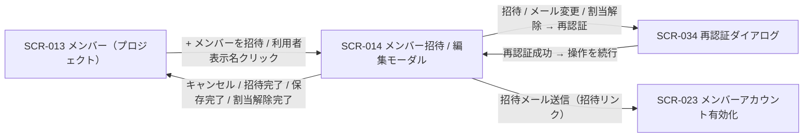
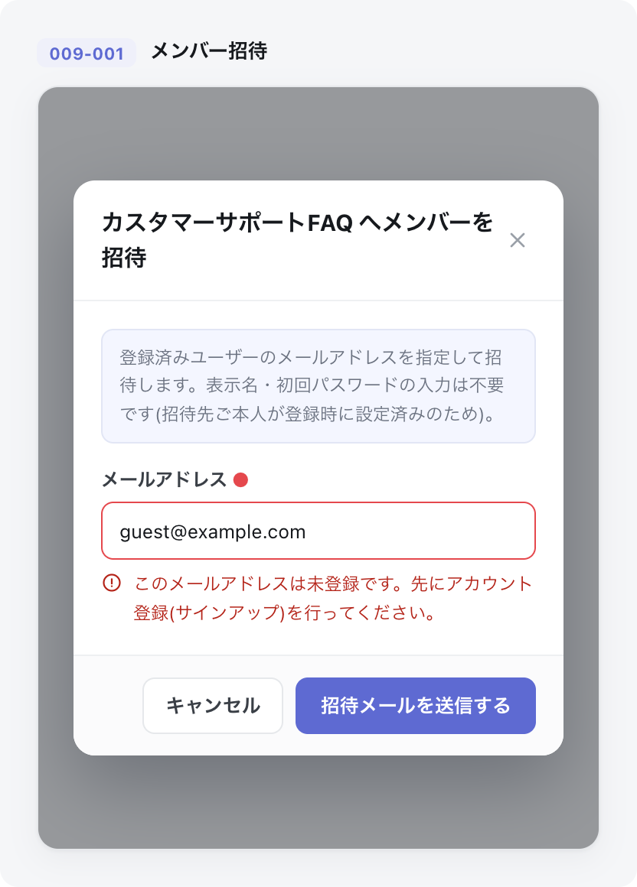
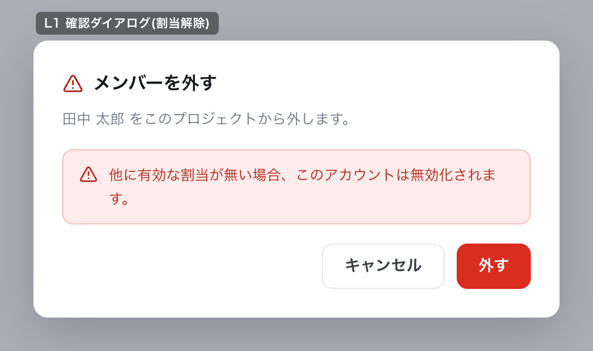

# SCR-014: メンバー招待・編集(モーダル)

| ID | 業務ユースケースID | API ID |
|----|----|----|
| SCR-014 | [UC-019](../../../01_requirements/04_business_usecases/UC-019.md#UC-019) ・ [UC-020](../../../01_requirements/04_business_usecases/UC-020.md#UC-020) ・ [UC-021](../../../01_requirements/04_business_usecases/UC-021.md#UC-021) ・ [UC-068](../../../01_requirements/04_business_usecases/UC-068.md#UC-068) | [API-021](../../02_backend/03_apis/API-021.md#API-021) ・ [API-024](../../02_backend/03_apis/API-024.md#API-024) ・ [API-020](../../02_backend/03_apis/API-020.md#API-020) ・ [API-022](../../02_backend/03_apis/API-022.md#API-022) ・ [API-023](../../02_backend/03_apis/API-023.md#API-023) ・ [API-069](../../02_backend/03_apis/API-069.md#API-069) |

| ステークホルダ | 対象 |
|----------------|------|
| オーナー       | ◯    |
| メンバー       | ◯    |

## 1. 画面概要

- メンバー招待(新規)と編集・招待再送・割当解除・ログイン失敗ロック解除(既存)を全画面割込みモーダルで行う画面である。
- 操作対象は現在開いているプロジェクト 1 件の割当のみで、操作できるのは当該プロジェクトのメンバー(オーナーを含む)である。
- 招待は登録済みユーザーをメールアドレスで指定して行い、本モーダルではアカウントの新規作成(表示名・初回パスワードの設定)は行わない。
- 最後の有効割当を解除した場合のみ、対象アカウントを自動で論理削除する。

## 2. 画面遷移図

本モーダルの呼出元・遷移先を、画面 ID・画面名とイベント(操作)で示します。

## 3. 画面レイアウト

本モーダルの代表状態(招待モード)と割当解除確認ダイアログを下図に示します。

## 4. 画面項目

本モーダルが表示する入出力項目を定義します。

| # | 項目 | 種類 | 必須 | 最大長 | 初期値 | 表示条件 |
|----|----|----|----|----|----|----|
| 1 | モード見出し | label | — | — | — | 常時(招待「{プロジェクト名} へメンバーを招待」/ 編集「{プロジェクト名} のメンバー編集 — {表示名}」) |
| 2 | モーダル閉じる(×) | button | — | — | — | — |
| 3 | 自己編集警告帯 | alert | — | — | — | 編集モードかつ自分自身編集時 |
| 4 | メールアドレス | input(email) | ◯ | 254 | — | — |
| 5 | 表示名(表示名) | label | — | — | — | 編集モード(招待モードでは非表示) |
| 6 | 招待モード表示名注記 | label | — | — | — | 招待モード |
| 7 | 招待状態バッジ | label | — | — | — | 編集モードかつ対象者が招待中(本人未有効化) |
| 8 | 招待メールを再送する | button | — | — | — | 編集モードかつ対象者が招待中(本人未有効化) |
| 9 | プロジェクトから外す | button | — | — | — | 編集モード(自分・オーナーには非表示) |
| 10 | 招待メールを送信する | button | — | — | — | 招待モード |
| 11 | 変更を保存する | button | — | — | — | 編集モード |
| 12 | キャンセル | button | — | — | — | — |
| 13 | 割当解除確認「外す」 | button | — | — | — | L1 確認ダイアログ表示中 |
| 14 | 割当解除確認 キャンセルボタン | button | — | — | — | L1 確認ダイアログ表示中 |
| 15 | 割当解除確認 無効化警告 | alert | — | — | 他に有効な割当が無い場合、このアカウントは無効化されます | L1 確認ダイアログ表示中 |
| 16 | ログイン失敗ロック中バッジ | label | — | — | — | 編集モードかつ対象者がログイン失敗ロック中 |
| 17 | ロックを解除する | button | — | — | — | 編集モードかつ対象者がログイン失敗ロック中 |

## 5. バリデーション

入力検証を定義する。

| 画面項目 | タイミング | ルール | エラーコード |
|----|----|----|----|
| #4 | 入力時・送信時 | 未入力チェック | EM-01 |
| #4 | 入力時・送信時 | メールアドレス形式チェック | EM-02 |

## 6. イベント

本画面のイベントごとに対象の画面項目を示します。

<table>
<colgroup>
<col style="width: 18%" />
<col style="width: 22%" />
<col style="width: 60%" />
</colgroup>
<thead>
<tr>
<th>EVT-ID</th>
<th>画面項目</th>
<th>イベント</th>
</tr>
</thead>
<tbody>
<tr>
<td>EVT-01</td>
<td>—</td>
<td>初期表示 — 招待モード</td>
</tr>
<tr>
<td>EVT-02</td>
<td>—</td>
<td>初期表示 — 編集モード</td>
</tr>
<tr>
<td>EVT-03</td>
<td>#10</td>
<td>「招待メールを送信する」を押下</td>
</tr>
<tr>
<td>EVT-04</td>
<td>#8</td>
<td>「招待メールを再送する」を押下</td>
</tr>
<tr>
<td>EVT-05</td>
<td>#11</td>
<td>「変更を保存する」を押下</td>
</tr>
<tr>
<td>EVT-06</td>
<td>#9</td>
<td>「プロジェクトから外す」を押下</td>
</tr>
<tr>
<td>EVT-07</td>
<td>#13</td>
<td>割当解除の確認ダイアログで「外す」を押下</td>
</tr>
<tr>
<td>EVT-08</td>
<td>#2</td>
<td>「×」を押下してモーダルを閉じる</td>
</tr>
<tr>
<td>EVT-09</td>
<td>#12</td>
<td>「キャンセル」を押下</td>
</tr>
<tr>
<td>EVT-10</td>
<td>#17</td>
<td>「ロックを解除する」を押下</td>
</tr>
</tbody>
</table>

## 7. 画面イベント詳細

各イベントの処理内容を定義します。

<table>
<colgroup>
<col style="width: 14%" />
<col style="width: 86%" />
</colgroup>
<thead>
<tr>
<th>EVT-ID</th>
<th>処理</th>
</tr>
</thead>
<tbody>
<tr>
<td>EVT-01</td>
<td>「+ メンバーを招待」押下でモーダルを招待モードで開き、モード見出し(#1)・招待モード表示名注記(#6)・空欄のメールアドレス欄(#4)・「招待メールを送信する」ボタン(#10)を表示する(招待先は登録済みユーザーのため表示名フィールドは非表示)</td>
</tr>
<tr>
<td>EVT-02</td>
<td>メンバー表示名クリックでモーダルを編集モードで開き、<a href="../../02_backend/03_apis/API-020.md#API-020">メンバー一覧(API-020)</a> API で取得した対象メンバーの表示名(#5)・メールアドレス(#4)・招待状態を表示する。対象者の状態で表示を分岐する<pre>
 ┣ 自分自身を編集: 自己編集警告帯(#3)を表示し、「プロジェクトから外す」ボタン(#9)を非表示にする
 ┣ 対象者が招待中(本人未有効化): 招待状態バッジ(#7)と「招待メールを再送する」ボタン(#8)を表示する
 ┣ 対象者がログイン失敗ロック中: ログイン失敗ロック中バッジ(#16)と「ロックを解除する」ボタン(#17)を表示する
 ┗ 上記以外: 「変更を保存する」ボタン(#11)・「プロジェクトから外す」ボタン(#9)を表示する
</pre></td>
</tr>
<tr>
<td>EVT-03</td>
<td>「招待メールを送信する」押下時に、<a href="SCR-034.md#SCR-034">SCR-034 再認証ダイアログ</a>で再認証し、その再認証のうえで指定メールの登録済みユーザーを当該プロジェクトに<a href="../../02_backend/03_apis/API-021.md#API-021">招待(API-021)</a>し招待メールを送信する(アカウントの新規作成は行わない)<pre>
 ┣ 成功: モーダルを閉じ SCR-013 の一覧を更新する
 ┣ 失敗(未登録): 指定メールが未登録のため招待できない旨のエラー(EM-06)を表示し、先にアカウント登録(独立サインアップ)を促す
 ┣ 失敗(重複): 既に当該プロジェクトに参加・招待中である旨のエラー(EM-03)を表示する
 ┗ 失敗(その他): エラー(EM-05)を表示し、入力内容を保持する
</pre></td>
</tr>
<tr>
<td>EVT-04</td>
<td>「招待メールを再送する」押下時に当該メンバーへ招待メールを<a href="../../02_backend/03_apis/API-024.md#API-024">再送(API-024)</a>する<pre>
 ┣ 成功: 完了メッセージを表示する
 ┗ 失敗: エラー(EM-05)を表示する
</pre></td>
</tr>
<tr>
<td>EVT-05</td>
<td>「変更を保存する」押下時に、<a href="SCR-034.md#SCR-034">SCR-034 再認証ダイアログ</a>で再認証し、その再認証のうえで対象メンバーのメールアドレスを<a href="../../02_backend/03_apis/API-022.md#API-022">更新(API-022)</a>し、当該メンバーへ通知する<pre>
 ┣ 成功: モーダルを閉じ SCR-013 の一覧を更新する
 ┗ 失敗: エラー(EM-05)を表示し、入力内容を保持する
</pre></td>
</tr>
<tr>
<td>EVT-06</td>
<td>「プロジェクトから外す」押下時に割当解除の確認ダイアログ(#13〜#15)を表示する。対象者が他に有効な割当を持たない場合は、アカウントも無効化される旨の警告(#15)を併せて表示する</td>
</tr>
<tr>
<td>EVT-07</td>
<td>割当解除の確認ダイアログで「外す」押下時に、<a href="SCR-034.md#SCR-034">SCR-034 再認証ダイアログ</a>で再認証し、その再認証のうえで当該プロジェクトの<a href="../../02_backend/03_apis/API-023.md#API-023">割当を解除(API-023)</a>し、当該メンバーへ通知する。最後の有効割当の場合はアカウントも無効化する<pre>
 ┣ 成功: モーダルを閉じ SCR-013 の一覧を更新する
 ┗ 失敗: エラー(EM-05)を表示し、モーダルを開いたままにする
</pre></td>
</tr>
<tr>
<td>EVT-08</td>
<td>「×」押下時に変更を破棄してモーダルを閉じ SCR-013 へ戻る(未保存の入力があれば破棄確認を行う)</td>
</tr>
<tr>
<td>EVT-09</td>
<td>「キャンセル」押下時に変更を破棄してモーダルを閉じ SCR-013 へ戻る(未保存の入力があれば破棄確認を行う)</td>
</tr>
<tr>
<td>EVT-10</td>
<td>「ロックを解除する」押下時に、対象利用者のログイン失敗ロックを<a href="../../02_backend/03_apis/API-069.md#API-069">解除(API-069)</a>する<pre>
 ┣ 成功: ログイン失敗ロック中バッジ(#16)・「ロックを解除する」ボタン(#17)を非表示にし完了メッセージを表示する
 ┗ 失敗: エラー(EM-05)を表示する
</pre></td>
</tr>
</tbody>
</table>

## 8. エラーメッセージ

本モーダルが表示するエラー・警告メッセージを定義します。

| エラーコード | エラーメッセージ |
|----|----|
| EM-01 | メールアドレスを入力してください |
| EM-02 | メールアドレスの形式が正しくありません |
| EM-03 | このメールアドレスは既にこのプロジェクトに参加または招待されています |
| EM-04 | 自分のアカウントはこのプロジェクトから外せません |
| EM-05 | 処理に失敗しました。しばらく経ってからお試しください |
| EM-06 | このメールアドレスは未登録です。先にアカウント登録(サインアップ)を行ってください |
