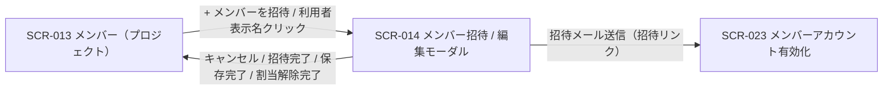

| 画面 ID | 画面名 | トレーサビリティID |
|----|----|----|
| SCR-014 | メンバー招待 / 編集モーダル(プロジェクト単位) | [TR-019](../../00_traceability/index.md#TR-019) ・ [TR-020](../../00_traceability/index.md#TR-020) ・ [TR-021](../../00_traceability/index.md#TR-021) |

| ステークホルダ | 対象 |
|----------------|------|
| オーナー       | ◯    |
| メンバー       | ◯    |

## 1. 画面概要

SCR-013 から開く、メンバー招待(新規)と編集・招待再送・割当解除(既存)を全画面割込みモーダルで行う画面です。現在開いているプロジェクトの 1 件の割当のみを操作対象とします。

> [!NOTE]
> **補足** 操作できるのは当該プロジェクトのメンバー(オーナーを含む)です。招待モードでは氏名フィールドを表示しません(他人の氏名を事前入力できない。氏名は招待された本人が [SCR-023](SCR-023.md) で入力)。最後の有効割当を解除した場合のみアカウントを自動論理削除(`users.valid=0`)します。プロジェクトに割り当てたメンバーは全員同一権限で、操作範囲は 認証・認可設計 を正本とします。

## 2. 画面遷移図

本モーダルの呼出元・遷移先を、画面 ID・画面名とイベント(操作)で示します。

## 3. 画面レイアウト

本モーダルの代表状態(招待モード)を示します。編集モード・招待中・自己編集の各状態は §4 の `表示条件` で定義し、割当解除確認ダイアログは下図に示します(各項目の表示条件は §4)。

## 4. 画面項目

本モーダルが各状態で表示する入出力項目・操作ボタンを定義します。`表示条件` は項目が表示されるモード・状態を示します。

| # | 項目 | 種類 | 必須 | 最大長 | 初期値 | 表示条件 |
|----|----|----|----|----|----|----|
| 1 | モード見出し | div | — | — | — | 常時(招待「{プロジェクト名} へメンバーを招待」/ 編集「{プロジェクト名} のメンバー編集 — {表示名}」) |
| 2 | モーダル閉じる(×) | button | — | — | — | — |
| 3 | 自己編集警告帯 | alert | — | — | — | 編集モードかつ自分自身編集時 |
| 4 | メールアドレス | input(email) | ◯ | 254 | — | — |
| 5 | 表示名(氏名) | label | — | — | — | 編集モード(招待モードでは非表示) |
| 6 | 招待モード氏名注記 | label | — | — | — | 招待モード |
| 7 | 招待状態バッジ | div | — | — | — | 編集モードかつ対象者が招待中(本人未有効化) |
| 8 | 招待メールを再送する | button | — | — | — | 編集モードかつ対象者が招待中(本人未有効化) |
| 9 | プロジェクトから外す | button | — | — | — | 編集モード(自分・オーナーには非表示) |
| 10 | 招待メールを送信する | button | — | — | — | 招待モード |
| 11 | 変更を保存する | button | — | — | — | 編集モード |
| 12 | キャンセル | button | — | — | — | — |
| 13 | 割当解除確認「外す」 | button | — | — | — | L1 確認ダイアログ表示中 |
| 14 | 割当解除確認 キャンセルボタン | button | — | — | — | L1 確認ダイアログ表示中 |
| 15 | 割当解除確認 無効化警告 | alert | — | — | 他に有効な割当が無い場合、このアカウントは無効化されます | L1 確認ダイアログ表示中 |

## 5. バリデーション

本モーダルの入力項目に対する検証ルールを定義します。違反がある場合は送信・保存を中止します。

| 画面項目 | タイミング | ルール | エラーコード |
|----|----|----|----|
| #4 | 入力時・送信時 | 未入力チェック | EM-01 |
| #4 | 入力時・送信時 | メールアドレス形式チェック | EM-02 |

## 6. イベント

本モーダルのイベント(初期表示・各操作)ごとに、対象の画面項目を定義します。各イベントの処理内容は [7. 画面イベント詳細](#7-画面イベント詳細) で定義します。招待モードと編集モードは呼出元操作・表示内容・API 呼出が排他的であるため、初期表示を 2 行に分割して定義します。

<table>
<colgroup>
<col style="width: 18%" />
<col style="width: 22%" />
<col style="width: 60%" />
</colgroup>
<thead>
<tr>
<th>EVT-ID</th>
<th>画面項目</th>
<th>イベント</th>
</tr>
</thead>
<tbody>
<tr>
<td>EVT-111</td>
<td>—</td>
<td>初期表示 — 招待モード</td>
</tr>
<tr>
<td>EVT-112</td>
<td>—</td>
<td>初期表示 — 編集モード</td>
</tr>
<tr>
<td>EVT-113</td>
<td>#10</td>
<td>「招待メールを送信する」を押下</td>
</tr>
<tr>
<td>EVT-114</td>
<td>#8</td>
<td>「招待メールを再送する」を押下</td>
</tr>
<tr>
<td>EVT-115</td>
<td>#11</td>
<td>「変更を保存する」を押下</td>
</tr>
<tr>
<td>EVT-116</td>
<td>#9</td>
<td>「プロジェクトから外す」を押下</td>
</tr>
<tr>
<td>EVT-117</td>
<td>#13</td>
<td>割当解除の確認ダイアログで「外す」を押下</td>
</tr>
<tr>
<td>EVT-118</td>
<td>#2</td>
<td>「×」を押下してモーダルを閉じる</td>
</tr>
<tr>
<td>EVT-119</td>
<td>#12</td>
<td>「キャンセル」を押下</td>
</tr>
</tbody>
</table>

## 7. 画面イベント詳細

各イベントの処理内容を定義します。

<table>
<colgroup>
<col style="width: 14%" />
<col style="width: 86%" />
</colgroup>
<thead>
<tr>
<th>EVT-ID</th>
<th>処理</th>
</tr>
</thead>
<tbody>
<tr>
<td>EVT-111</td>
<td>「+ メンバーを招待」押下でモーダルを招待モードで開く:<pre>
1. モード見出し(#1)をプロジェクト名付きで表示し、招待モード氏名注記(#6)を表示する(氏名フィールドは非表示)
2. メールアドレス欄(#4)を空欄で表示し、「招待メールを送信する」ボタン(#10)を表示する
</pre></td>
</tr>
<tr>
<td>EVT-112</td>
<td>メンバー表示名クリックでモーダルを編集モードで開く:<pre>
1. <a href="../../02_backend/03_apis/API-020.md#API-020">メンバー一覧</a> API から対象メンバーの表示名・メールアドレス・招待状態を取得し、表示名(#5)・メールアドレス(#4)に初期値をセットする
2. 状態で分岐する
   ┣ 自分自身を編集: 自己編集警告帯(#3)を表示し、「プロジェクトから外す」ボタン(#9)を非表示にする
   ┣ 対象者が招待中(本人未有効化): 招待状態バッジ(#7)と「招待メールを再送する」ボタン(#8)を表示する
   ┗ 上記以外: 「変更を保存する」ボタン(#11)・「プロジェクトから外す」ボタン(#9)を表示する
</pre></td>
</tr>
<tr>
<td>EVT-113</td>
<td>「招待メールを送信する」押下時に次を行う:<pre>
1. §5 のバリデーションを評価し、違反時は #4 直下にエラーを表示して中止する
2. <a href="../../02_backend/03_apis/API-021.md#API-021">メンバー招待</a> API(POST /projects/{id}/members)で予約割当行とユーザーを作成し、有効化トークン(有効期限 7 日)を発行して招待メールを送信する
3. 結果で分岐する
   ┣ 成功: モーダルを閉じ SCR-013 の一覧を更新する
   ┣ 失敗(重複): 同一メールアドレスが既存の有効・招待中アカウントと重複する旨のエラー(EM-03)を表示する
   ┗ 失敗(その他): エラートースト(EM-05)を表示し、入力内容を保持する
</pre></td>
</tr>
<tr>
<td>EVT-114</td>
<td>「招待メールを再送する」押下時に <a href="../../02_backend/03_apis/API-024.md#API-024">招待メール再送</a> API(POST /members/{id}/resend-invitation)を発行する:<pre>
 ┣ 成功: 旧リンクを失効させ新トークン(有効期限 7 日)を発行し招待メールを再送、完了トーストを表示する
 ┗ 失敗: エラートースト(EM-05)を表示する
</pre></td>
</tr>
<tr>
<td>EVT-115</td>
<td>「変更を保存する」押下時に次を行う:<pre>
1. §5 のバリデーションを評価し、違反時は #4 直下にエラーを表示して中止する
2. <a href="../../02_backend/03_apis/API-022.md#API-022">メンバー情報更新</a> API(PATCH /projects/{id}/members/{userId})で対象メンバーのメールアドレスを更新し、変更を監査記録のうえ当該メンバーへ通知する
3. 結果で分岐する
   ┣ 成功: モーダルを閉じ SCR-013 の一覧を更新する
   ┗ 失敗: エラートースト(EM-05)を表示し、入力内容を保持する
</pre></td>
</tr>
<tr>
<td>EVT-116</td>
<td>「プロジェクトから外す」押下時に L1 確認ダイアログを表示する:<pre>
 ┣ 対象が他プロジェクトに有効な割当を持つ: 通常の割当解除確認を表示する
 ┗ 対象が他プロジェクトに有効な割当を持たない: 確認ダイアログに「このメンバーのアカウントも利用停止になります」を追記する
</pre></td>
</tr>
<tr>
<td>EVT-117</td>
<td>割当解除の確認ダイアログで「外す」押下時に <a href="../../02_backend/03_apis/API-023.md#API-023">プロジェクト割当解除</a> API(DELETE /projects/{id}/members/{userId})を発行する:<pre>
1. 当該 PJ の割当を解除(valid=0)し、変更を監査記録のうえ当該メンバーへ通知する
2. 最後の有効割当の場合: アカウントを論理削除(users.valid=0)し、全ログインセッションと未使用招待を無効化する
3. 結果で分岐する
   ┣ 成功: モーダルを閉じ SCR-013 の一覧を更新する
   ┗ 失敗: エラートースト(EM-05)を表示し、モーダルを開いたままにする
</pre></td>
</tr>
<tr>
<td>EVT-118</td>
<td>「×」押下時に変更を破棄してモーダルを閉じ SCR-013 へ戻る(未保存の入力があれば破棄確認を行う)</td>
</tr>
<tr>
<td>EVT-119</td>
<td>「キャンセル」押下時に変更を破棄してモーダルを閉じ SCR-013 へ戻る(未保存の入力があれば破棄確認を行う)</td>
</tr>
</tbody>
</table>

## 8. エラーメッセージ

本モーダルが表示するエラー・警告メッセージを定義します。

| エラーコード | エラーメッセージ |
|----|----|
| EM-01 | メールアドレスを入力してください |
| EM-02 | メールアドレスの形式が正しくありません |
| EM-03 | このメールアドレスは既に登録または招待されています |
| EM-04 | 自分のアカウントはこのプロジェクトから外せません |
| EM-05 | 処理に失敗しました。しばらく経ってからお試しください |
