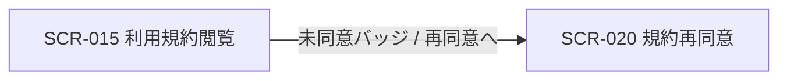
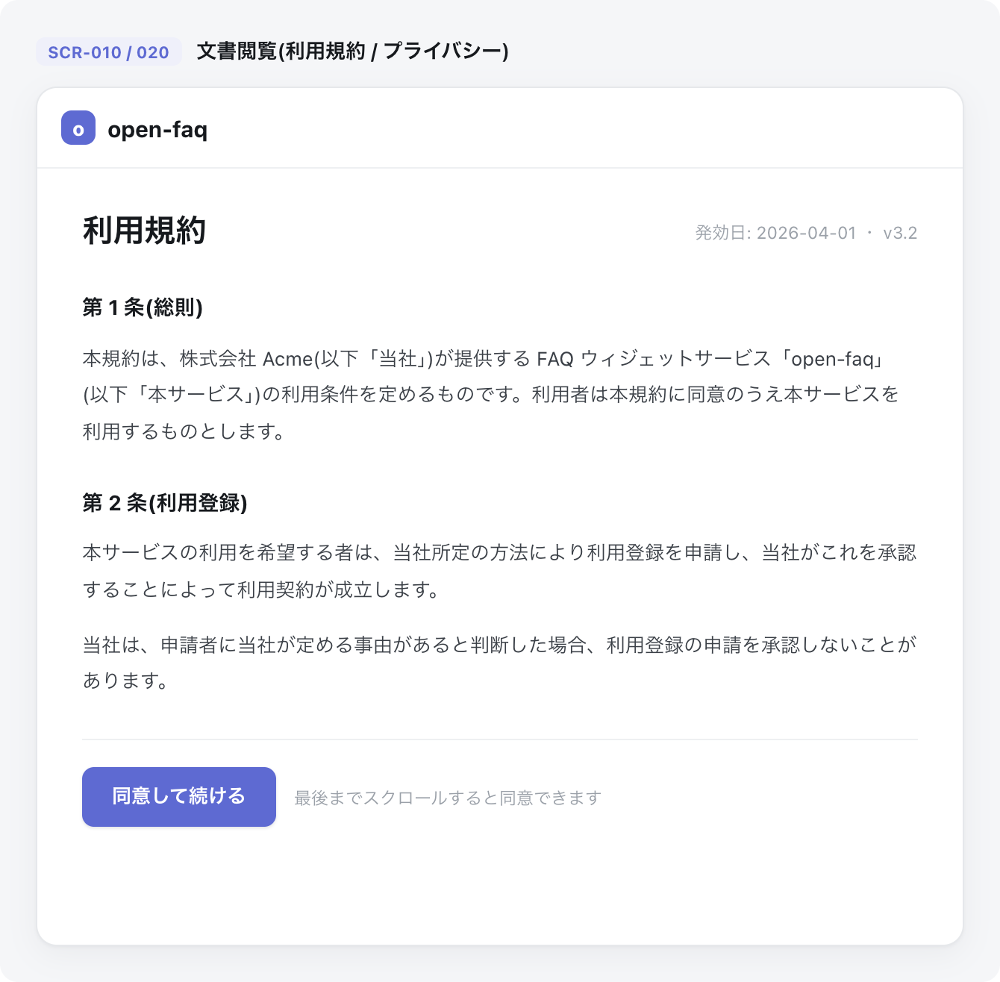

| 画面 ID | 画面名 | トレーサビリティID |
|----|----|----|
| SCR-015 | 利用規約閲覧 | [TR-011](../../00_traceability/index.md#TR-011) ・ [TR-013](../../00_traceability/index.md#TR-013) |

| ステークホルダ     | 対象 |
|--------------------|------|
| 全利用者(認証前可) | ◯    |

## 1. 画面概要

- 利用規約の最新版のみを 1 枚のページとして表示する閲覧専用画面である。
- 認証不要 URL を提供し、認証前でも権限なしで閲覧できる。
- 目次・章ナビ・過去バージョン履歴・差分表示は設けない。
- プライバシーポリシーは SCR-025 に分離し、ウィジェット内には表示しない。
- 主要な表示状態はログイン済み・同意済み / ログイン済み・未同意 / 未ログイン(バッジ非表示)。

## 2. 画面遷移図

本画面からの画面遷移を、画面 ID・画面名とイベント(操作)で示します。

## 3. 画面レイアウト

本画面の代表状態(最新版全文表示)を示します。

## 4. 画面項目

本画面が表示する入出力項目を定義します。

| # | 項目 | 種類 | 必須 | 最大長 | 初期値 | 表示条件 |
|----|----|----|----|----|----|----|
| 1 | 発効日・バージョン | label | — | — | — | — |
| 2 | 同意状態バッジ | label | — | — | — | ログイン済み時 |
| 3 | 再同意へリンク | link | — | — | — | ログイン済み・未同意時 |
| 4 | 最新版の全文 | label | — | — | — | — |
| 5 | スクロール案内 | label | — | — | — | — |
| 6 | 同意して続けるボタン | button | — | — | — | — |

データパターン(選択肢・状態値など値のパターンを持つ項目)を定義する。

| 画面項目 | 表示名 | 補足 |
|----|----|----|
| #2 | 利用規約に同意済み({同意日}) | 緑バッジ。ログイン済み・同意済み時 |
| #2 | 利用規約 未同意 | 赤バッジ。ログイン済み・未同意時。再同意へリンク(#3)を併せて表示 |

## 5. バリデーション

本画面は閲覧専用であり、入力項目がありません(本画面に入力検証はありません)。

## 6. イベント

本画面のイベント(初期表示・各操作)ごとに、対象の画面項目を定義します。各イベントの処理内容は [7. 画面イベント詳細](#7-画面イベント詳細) で定義します。

<table>
<colgroup>
<col style="width: 18%" />
<col style="width: 22%" />
<col style="width: 60%" />
</colgroup>
<thead>
<tr>
<th>EVT-ID</th>
<th>画面項目</th>
<th>イベント</th>
</tr>
</thead>
<tbody>
<tr>
<td>EVT-01</td>
<td>—</td>
<td>初期表示</td>
</tr>
<tr>
<td>EVT-02</td>
<td>#3</td>
<td>「再同意へ」リンクを押下</td>
</tr>
<tr>
<td>EVT-03</td>
<td>#6</td>
<td>「同意して続ける」を押下</td>
</tr>
</tbody>
</table>

## 7. 画面イベント詳細

各イベントの処理内容を定義します。

<table>
<colgroup>
<col style="width: 14%" />
<col style="width: 86%" />
</colgroup>
<thead>
<tr>
<th>EVT-ID</th>
<th>処理</th>
</tr>
</thead>
<tbody>
<tr>
<td>EVT-01</td>
<td>初期表示時に<a href="../../02_backend/03_apis/API-052.md#API-052">利用規約の最新版(API-052)</a>(発効日・バージョン(#1)・全文(#4)・スクロール案内(#5))を表示する。同意状態バッジ(#2)はログイン状態で分岐する<pre>
 ┣ ログイン済み・同意済み: 同意済みバッジ(#2)を表示する
 ┣ ログイン済み・未同意: 未同意バッジ(#2)と再同意へリンク(#3)を表示する
 ┗ 未ログイン: 同意状態バッジ(#2)を非表示とする
</pre></td>
</tr>
<tr>
<td>EVT-02</td>
<td>「再同意へ」押下時に規約再同意(SCR-020)へ遷移する(未同意バッジ表示時のみ活性)</td>
</tr>
<tr>
<td>EVT-03</td>
<td>「同意して続ける」押下時に最新版への<a href="../../02_backend/03_apis/API-054.md#API-054">同意を記録(API-054)</a>する<pre>
 ┣ 成功: 同意状態バッジ(#2)を同意済みに更新し、遷移元画面(またはトップ)へ戻る
 ┗ 失敗: エラー(EM-01)を表示し、ログイン画面へ誘導する
</pre></td>
</tr>
</tbody>
</table>

## 8. エラーメッセージ

本画面が表示するエラー・警告メッセージを定義します。

| エラーコード | エラーメッセージ |
|----|----|
| EM-01 | 同意の記録に失敗しました。ログインのうえ、もう一度お試しください |
