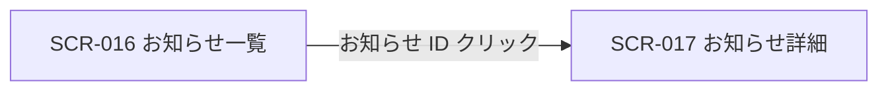

# SCR-016: お知らせ一覧

| ID | 業務ユースケースID | API ID |
|----|----|----|
| SCR-016 | [UC-043](../../../01_requirements/04_business_usecases/UC-043.md#UC-043) ・ [UC-045](../../../01_requirements/04_business_usecases/UC-045.md#UC-045) | [API-048](../../02_backend/03_apis/API-048.md#API-048) ・ [API-051](../../02_backend/03_apis/API-051.md#API-051) ・ [API-049](../../02_backend/03_apis/API-049.md#API-049) ・ [API-050](../../02_backend/03_apis/API-050.md#API-050) |

| ステークホルダ | 対象 |
|----------------|------|
| オーナー       | ◯    |
| メンバー       | ◯    |

## 1. 画面概要

- 配信されたお知らせを一覧で確認し、絞り込み・既読化と詳細画面への導線を提供する画面である。
- お知らせの配信対象はユーザー(アカウント)単位で、ログイン中のユーザー本人宛のお知らせを閲覧できる。
- オーナー(作成者)・メンバー(招待参加者)のいずれの立場のユーザーも、自分宛のお知らせを閲覧できる。
- 主要な表示状態は通常(一覧表示)・フィルタ適用・行選択・空状態である。

## 2. 画面遷移図

本画面からの画面遷移を、画面 ID・画面名とイベント(操作)で示します。

## 3. 画面レイアウト

本画面の代表状態を示します。

## 4. 画面項目

本画面が表示する入出力項目を定義します。

| # | 項目 | 種類 | 必須 | 最大長 | 初期値 | 表示条件 |
|----|----|----|----|----|----|----|
| 1 | クイックフィルタチップ | button | — | — | — | 「未読のみ」(初期選択) |
| 2 | 適用済フィルタチップ | label | — | — | — | フィルタ適用中 |
| 3 | 期間フィルタ(開始) | input(date) | — | — | — | 詳細フィルタ表示時 |
| 4 | 期間フィルタ(終了) | input(date) | — | — | — | 詳細フィルタ表示時 |
| 5 | タイトル検索 | input(text) | — | 100 | — | 詳細フィルタ表示時 |
| 6 | 件数表示 | label | — | — | — | — |
| 7 | 種別バッジ | label | — | — | — | — |
| 8 | 重要度バッジ | label | — | — | — | — |
| 9 | 未読ドット | label | — | — | — | 未読行のみ |
| 10 | お知らせ ID リンク | link | — | — | — | — |
| 11 | タイトル | label | — | — | — | — |
| 12 | 配信日時 | label | — | — | — | — |
| 13 | 選択チェックボックス | checkbox | — | — | 未チェック | — |
| 14 | 一括操作バー | label | — | — | — | 1 件以上選択時 |
| 15 | 一括既読化ボタン | button | — | — | — | 1 件以上選択時 |
| 16 | 選択を解除ボタン | button | — | — | — | 1 件以上選択時 |
| 17 | 表示中の未読を既読化ボタン | button | — | — | — | — |
| 18 | すべての未読を既読化 | link | — | — | — | — |
| 19 | 次のページボタン | button | — | — | — | 次ページが存在する場合 |
| 20 | 空状態 | label | — | — | — | 対象お知らせが 0 件のとき |

データパターン(選択肢・状態値など値のパターンを持つ項目)を定義する。

| 画面項目 | 表示名 | 補足 |
|----|----|----|
| #1 | 未読のみ | 初期選択。各件数を併記 |
| #1 | 重要のみ | 各件数を併記 |
| #1 | 請求 | 各件数を併記 |
| #1 | お知らせ | 各件数を併記 |
| #1 | システム | 各件数を併記 |
| #1 | すべて | 各件数を併記 |
| #7 | お知らせ | — |
| #7 | 請求 | — |
| #7 | システム | — |
| #8 | 重要 | 最重要度 |
| #8 | 重要 | 高重要度 |
| #8 | 通常 | 標準重要度 |
| #8 | 淡色 | 低重要度 |

## 5. バリデーション

本画面の入力項目に対する検証ルールを定義します。

| 画面項目 | タイミング | ルール | エラーコード |
|----|----|----|----|
| #3・#4 | 適用時 | 期間範囲チェック(開始 ≦ 終了) | EM-01 |

## 6. イベント

本画面のイベント(初期表示・各操作)ごとに、対象の画面項目を定義します。各イベントの処理内容は [7. 画面イベント詳細](#7-画面イベント詳細) で定義します。

<table>
<colgroup>
<col style="width: 18%" />
<col style="width: 22%" />
<col style="width: 60%" />
</colgroup>
<thead>
<tr>
<th>EVT-ID</th>
<th>画面項目</th>
<th>イベント</th>
</tr>
</thead>
<tbody>
<tr>
<td>EVT-01</td>
<td>—</td>
<td>初期表示</td>
</tr>
<tr>
<td>EVT-02</td>
<td>#1</td>
<td>クイックフィルタチップを選択</td>
</tr>
<tr>
<td>EVT-03</td>
<td>#2</td>
<td>「すべてクリア」を押下</td>
</tr>
<tr>
<td>EVT-04</td>
<td>#3・#4・#5</td>
<td>詳細フィルタを適用</td>
</tr>
<tr>
<td>EVT-05</td>
<td>#13</td>
<td>行を選択</td>
</tr>
<tr>
<td>EVT-06</td>
<td>#10</td>
<td>お知らせ ID リンクを押下</td>
</tr>
<tr>
<td>EVT-07</td>
<td>#15</td>
<td>「既読化する」を押下</td>
</tr>
<tr>
<td>EVT-08</td>
<td>#17</td>
<td>「表示中の未読を既読化」を押下</td>
</tr>
<tr>
<td>EVT-09</td>
<td>#18</td>
<td>「すべての未読を既読化」を押下</td>
</tr>
<tr>
<td>EVT-10</td>
<td>#19</td>
<td>「次のページ」を押下</td>
</tr>
<tr>
<td>EVT-11</td>
<td>#16</td>
<td>「選択を解除」を押下</td>
</tr>
</tbody>
</table>

## 7. 画面イベント詳細

各イベントの処理内容を定義します。

<table>
<colgroup>
<col style="width: 14%" />
<col style="width: 86%" />
</colgroup>
<thead>
<tr>
<th>EVT-ID</th>
<th>処理</th>
</tr>
</thead>
<tbody>
<tr>
<td>EVT-01</td>
<td>初期表示時にクイックフィルタ「未読のみ」で<a href="../../02_backend/03_apis/API-048.md#API-048">お知らせ一覧(API-048)</a>を表示し、<a href="../../02_backend/03_apis/API-051.md#API-051">未読件数(API-051)</a>を件数表示(#6)に表示する<pre>
 ┣ 1 件以上: 一覧を表示する。未読行は未読ドット(#9)・背景強調・タイトル太字で強調する
 ┗ 0 件: 空状態(#20)を表示する
</pre></td>
</tr>
<tr>
<td>EVT-02</td>
<td>クイックフィルタチップ(#1)を選択時に、選択した条件で<a href="../../02_backend/03_apis/API-048.md#API-048">お知らせ一覧(API-048)</a>を表示する。0 件時は空状態(#20)を表示する</td>
</tr>
<tr>
<td>EVT-03</td>
<td>「すべてクリア」押下時に、フィルタを解除した<a href="../../02_backend/03_apis/API-048.md#API-048">お知らせ一覧(API-048)</a>を表示し、適用済フィルタチップ(#2)を非表示にする</td>
</tr>
<tr>
<td>EVT-04</td>
<td>詳細フィルタ適用時に、期間(#3・#4)・タイトル検索(#5)の条件で<a href="../../02_backend/03_apis/API-048.md#API-048">お知らせ一覧(API-048)</a>を表示する(検証違反時はエラー(EM-01)を表示して中止)。0 件時は空状態(#20)を表示する</td>
</tr>
<tr>
<td>EVT-05</td>
<td>選択チェックボックス(#13)をオンにした行を一括操作の対象に選択する。1 件以上選択時は一括操作バー(#14)を表示し、すべての選択を解除した場合は非表示にする</td>
</tr>
<tr>
<td>EVT-06</td>
<td>お知らせ ID リンク(#10)押下時に該当行を<a href="../../02_backend/03_apis/API-049.md#API-049">既読化(API-049)</a>し、詳細画面(SCR-017)へ遷移する<pre>
 ┣ 成功: 既読化のうえ詳細画面(SCR-017)へ遷移する
 ┗ 失敗: 既読化エラー(EM-02)を表示し、遷移は続行する
</pre></td>
</tr>
<tr>
<td>EVT-07</td>
<td>「既読化する」押下時に選択行を<a href="../../02_backend/03_apis/API-050.md#API-050">一括既読化(API-050)</a>する<pre>
 ┣ 成功: 一覧と未読件数(#6)を更新し、選択状態を解除して一括操作バー(#14)を非表示にする
 ┗ 失敗: エラー(EM-03)を表示する
</pre></td>
</tr>
<tr>
<td>EVT-08</td>
<td>「表示中の未読を既読化」押下時に、適用中の種別フィルタに一致する未読を<a href="../../02_backend/03_apis/API-050.md#API-050">一括既読化(API-050)</a>する(種別で絞り込み中はその種別の未読のみを既読化する)<pre>
 ┣ 成功: 一覧と未読件数(#6)を更新する
 ┗ 失敗: エラー(EM-03)を表示する
</pre></td>
</tr>
<tr>
<td>EVT-09</td>
<td>「すべての未読を既読化」押下時に確認ダイアログを表示する。種別で絞り込み中はその種別の未読のみを対象とする<pre>
 ┣ OK: 対象の全未読を<a href="../../02_backend/03_apis/API-050.md#API-050">一括既読化(API-050)</a>する
 ┃  ┣ 成功: 一覧と未読件数(#6)を更新する
 ┃  ┗ 失敗: エラー(EM-03)を表示する
 ┗ キャンセル: ダイアログを閉じ、処理を中断する
</pre></td>
</tr>
<tr>
<td>EVT-10</td>
<td>「次のページ」押下時に<a href="../../02_backend/03_apis/API-048.md#API-048">お知らせ一覧(API-048)</a>の次ページを一覧に追記表示する。最終ページ到達時はページングボタン(#19)を非表示にする</td>
</tr>
<tr>
<td>EVT-11</td>
<td>「選択を解除」押下時に選択状態をすべて解除し、一括操作バー(#14)を非表示にする</td>
</tr>
</tbody>
</table>

## 8. エラーメッセージ

本画面が表示するエラー・警告メッセージを定義します。

| エラーコード | エラーメッセージ |
|----|----|
| EM-01 | 終了日は開始日以降の日付を指定してください |
| EM-02 | 既読化に失敗しましたが、お知らせの内容は表示できます |
| EM-03 | 既読化に失敗しました。時間をおいて再度お試しください |
