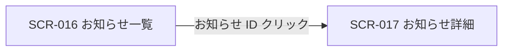

| 画面 ID | 画面名 | トレーサビリティID |
|----|----|----|
| SCR-016 | お知らせ一覧 | [TR-044](../../00_traceability/index.md#TR-044) ・ [TR-046](../../00_traceability/index.md#TR-046) |

| ステークホルダ | 対象 |
|----------------|------|
| オーナー       | ◯    |
| メンバー       | ◯    |

## 1. 画面概要

配信されたお知らせを一覧で確認し、絞り込み・既読化と詳細画面への導線を提供する画面です。

> [!NOTE]
> **補足** アカウント利用者全体に閲覧資格があり、本画面ではオーナーと当該スコープのメンバーがお知らせを閲覧できます。オーナー(`M_CONTRACT` 行存在)は `isOwner` で全権のため割当を持たずに受信できます(根拠は認証・認可設計)。

## 2. 画面遷移図

本画面からの画面遷移を、画面 ID・画面名とイベント(操作)で示します。

## 3. 画面レイアウト

本画面の代表状態を示します。各フィルタ適用状態・選択状態・空状態は §4 の `表示条件` で定義します。

## 4. 画面項目

本画面が各状態で表示する入出力項目を定義します。`表示条件` は項目が表示される状態を示します。詳細遷移はお知らせ ID 列のリンクに集約します。

| # | 項目 | 種類 | 必須 | 最大長 | 初期値 | 表示条件 |
|----|----|----|----|----|----|----|
| 1 | クイックフィルタチップ | button | — | — | — | 「未読のみ」(初期選択) |
| 2 | 適用済フィルタチップ | div | — | — | — | フィルタ適用中 |
| 3 | 期間フィルタ(開始) | input(date) | — | — | — | 詳細フィルタ表示時 |
| 4 | 期間フィルタ(終了) | input(date) | — | — | — | 詳細フィルタ表示時 |
| 5 | タイトル検索 | input(text) | — | 100 | — | 詳細フィルタ表示時 |
| 6 | 件数表示 | div | — | — | — | — |
| 7 | 種別バッジ | div | — | — | — | — |
| 8 | 重要度バッジ | div | — | — | — | — |
| 9 | 未読ドット | div | — | — | — | 未読行のみ |
| 10 | お知らせ ID リンク | link | — | — | — | — |
| 11 | タイトル | div | — | — | — | — |
| 12 | 配信日時 | div | — | — | — | — |
| 13 | 選択チェックボックス | checkbox | — | — | 未チェック | — |
| 14 | 一括操作バー | div | — | — | — | 1 件以上選択時 |
| 15 | 一括既読化ボタン | button | — | — | — | 1 件以上選択時 |
| 16 | 選択を解除ボタン | button | — | — | — | 1 件以上選択時 |
| 17 | 表示中の未読を既読化ボタン | button | — | — | — | — |
| 18 | すべての未読を既読化 | link | — | — | — | — |
| 19 | 次のページボタン | button | — | — | — | 次ページが存在する場合 |
| 20 | 空状態 | div | — | — | — | 対象お知らせが 0 件のとき |

> **#1 クイックフィルタチップの選択肢(値=表示名)**: unread=未読のみ(初期選択) / important=重要のみ / billing=請求 / announce=お知らせ / system=システム / all=すべて(各件数を併記)。
>
> **#7 種別バッジの選択肢(値=表示名)**: announce=お知らせ / billing=請求 / system=システム。
>
> **#8 重要度バッジの選択肢(値=表示名)**: critical=重要(critical) / high=重要(high) / normal=通常(normal) / low=淡色(low)。

## 5. バリデーション

本画面の入力項目に対する検証ルールを定義します。

| 画面項目 | タイミング | ルール | エラーコード |
|----|----|----|----|
| #3・#4 | 適用時 | 期間範囲チェック(開始 ≦ 終了) | EM-01 |

## 6. イベント

本画面のイベント(初期表示・各操作)ごとに、対象の画面項目を定義します。各イベントの処理内容は [7. 画面イベント詳細](#7-画面イベント詳細) で定義します。

<table>
<colgroup>
<col style="width: 18%" />
<col style="width: 22%" />
<col style="width: 60%" />
</colgroup>
<thead>
<tr>
<th>EVT-ID</th>
<th>画面項目</th>
<th>イベント</th>
</tr>
</thead>
<tbody>
<tr>
<td>EVT-117</td>
<td>—</td>
<td>初期表示</td>
</tr>
<tr>
<td>EVT-118</td>
<td>#1</td>
<td>クイックフィルタチップを選択</td>
</tr>
<tr>
<td>EVT-119</td>
<td>#2</td>
<td>「すべてクリア」を押下</td>
</tr>
<tr>
<td>EVT-120</td>
<td>#3・#4・#5</td>
<td>詳細フィルタを適用</td>
</tr>
<tr>
<td>EVT-121</td>
<td>#13</td>
<td>行を選択</td>
</tr>
<tr>
<td>EVT-122</td>
<td>#10</td>
<td>お知らせ ID リンクを押下</td>
</tr>
<tr>
<td>EVT-123</td>
<td>#15</td>
<td>「既読化する」を押下</td>
</tr>
<tr>
<td>EVT-124</td>
<td>#17</td>
<td>「表示中の未読を既読化」を押下</td>
</tr>
<tr>
<td>EVT-125</td>
<td>#18</td>
<td>「すべての未読を既読化」を押下</td>
</tr>
<tr>
<td>EVT-126</td>
<td>#19</td>
<td>「次のページ」を押下</td>
</tr>
<tr>
<td>EVT-127</td>
<td>#16</td>
<td>「選択を解除」を押下</td>
</tr>
</tbody>
</table>

## 7. 画面イベント詳細

各イベントの処理内容を定義します。

<table>
<colgroup>
<col style="width: 14%" />
<col style="width: 86%" />
</colgroup>
<thead>
<tr>
<th>EVT-ID</th>
<th>処理</th>
</tr>
</thead>
<tbody>
<tr>
<td>EVT-117</td>
<td>初期表示時に次を行う:<pre>
1. <a href="../../02_backend/03_apis/API-048.md#API-048">お知らせ一覧</a> API でクイックフィルタ「未読のみ」を既定条件として一覧を取得し表示する
2. <a href="../../02_backend/03_apis/API-051.md#API-051">お知らせ未読件数</a> API で未読件数を取得し件数表示(#6)を更新する
3. 取得結果で分岐する
   ┣ 1 件以上: 一覧を表示する。未読行は未読ドット(#9)・背景強調・タイトル太字で強調する
   ┗ 0 件: 空状態(#20)を表示する
</pre></td>
</tr>
<tr>
<td>EVT-118</td>
<td>クイックフィルタチップ(#1)を選択時に、選択した条件を付与して <a href="../../02_backend/03_apis/API-048.md#API-048">お知らせ一覧</a> API を再取得し一覧を更新する。0 件時は空状態(#20)を表示する</td>
</tr>
<tr>
<td>EVT-119</td>
<td>「すべてクリア」押下時に、適用中のフィルタ条件をすべて解除して <a href="../../02_backend/03_apis/API-048.md#API-048">お知らせ一覧</a> API を再取得し一覧を更新する。適用済フィルタチップ(#2)を非表示にする</td>
</tr>
<tr>
<td>EVT-120</td>
<td>詳細フィルタ適用時に次を行う:<pre>
1. 期間(#3・#4)・タイトル検索(#5)の入力を取得し §5 のバリデーションを評価する。違反時はエラー(EM-01)を表示して中止する
2. 条件を付与して <a href="../../02_backend/03_apis/API-048.md#API-048">お知らせ一覧</a> API を再取得し一覧を更新する
3. 0 件時は空状態(#20)を表示する
</pre></td>
</tr>
<tr>
<td>EVT-121</td>
<td>選択チェックボックス(#13)をオンにした行を一括操作の対象として選択状態にする(最大 100 件)。1 件以上選択時は一括操作バー(#14)を表示し、すべての選択を解除した場合は非表示にする</td>
</tr>
<tr>
<td>EVT-122</td>
<td>お知らせ ID リンク(#10)押下時に次を行う:<pre>
1. <a href="../../02_backend/03_apis/API-049.md#API-049">お知らせ個別既読</a> API で該当行を既読化する
2. 結果で分岐する
   ┣ 成功: 詳細画面(SCR-017)へ遷移する
   ┗ 失敗: 既読化エラー(EM-02)をトーストで表示し、遷移は続行する
</pre></td>
</tr>
<tr>
<td>EVT-123</td>
<td>「既読化する」押下時に選択行を <a href="../../02_backend/03_apis/API-050.md#API-050">お知らせ一括既読</a> API で既読化する:<pre>
 ┣ 成功: 一覧を再取得し未読件数(#6)を更新する。選択状態を解除し一括操作バー(#14)を非表示にする
 ┗ 失敗: エラー(EM-03)をトーストで表示する
</pre></td>
</tr>
<tr>
<td>EVT-124</td>
<td>「表示中の未読を既読化」押下時に、現在のフィルタ条件を維持したまま <a href="../../02_backend/03_apis/API-050.md#API-050">お知らせ一括既読</a> API で表示中の未読を既読化する:<pre>
 ┣ 成功: 一覧を再取得し未読件数(#6)を更新する
 ┗ 失敗: エラー(EM-03)をトーストで表示する
</pre></td>
</tr>
<tr>
<td>EVT-125</td>
<td>「すべての未読を既読化」押下時に確認ダイアログを表示する:<pre>
 ┣ OK: フィルタを無視して <a href="../../02_backend/03_apis/API-050.md#API-050">お知らせ一括既読</a> API で全未読を既読化する
 ┃  ┣ 成功: 一覧を再取得し未読件数(#6)を更新する
 ┃  ┗ 失敗: エラー(EM-03)をトーストで表示する
 ┗ キャンセル: ダイアログを閉じ、処理を中断する
</pre></td>
</tr>
<tr>
<td>EVT-126</td>
<td>「次のページ」押下時にカーソル方式で <a href="../../02_backend/03_apis/API-048.md#API-048">お知らせ一覧</a> API の次ページを取得し、一覧に追記表示する。最終ページ到達時はページングボタン(#19)を非表示にする</td>
</tr>
<tr>
<td>EVT-127</td>
<td>「選択を解除」押下時に選択状態をすべて解除し、一括操作バー(#14)を非表示にする</td>
</tr>
</tbody>
</table>

## 8. エラーメッセージ

本画面が表示するエラー・警告メッセージを定義します。

| エラーコード | エラーメッセージ |
|----|----|
| EM-01 | 終了日は開始日以降の日付を指定してください |
| EM-02 | 既読化に失敗しましたが、お知らせの内容は表示できます |
| EM-03 | 既読化に失敗しました。時間をおいて再度お試しください |
