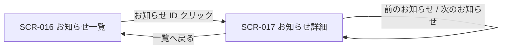

| 画面 ID | 画面名 | トレーサビリティID |
|----|----|----|
| SCR-017 | お知らせ詳細 | [TR-045](../../00_traceability/index.md#TR-045) |

| ステークホルダ | 対象 |
|----------------|------|
| オーナー       | ◯    |
| メンバー       | ◯    |

## 1. 画面概要

一覧(SCR-016)から選択した個別のお知らせ本文を表示し、表示時に自動既読とする画面です。種別・重要度・配信日時のメタ情報と前後ナビゲーションを提供します。

> [!NOTE]
> **補足** オーナーと当該スコープのメンバーがお知らせを閲覧できます。オーナーは全権のため割当を持たずに受信できます(根拠は 認証・認可設計)。本文はサニタイズ(二重サニタイズ・許可タグ / 属性ホワイトリスト)して表示します。

## 2. 画面遷移図

本画面への流入と本画面からの遷移を、画面 ID・画面名とイベント(操作)で示します。

## 3. 画面レイアウト

本画面の代表状態を示します。既読日時・前後ナビの活性状態は §4 の `表示条件` で定義します。

## 4. 画面項目

本画面が表示する出力項目・操作項目を定義します。本画面は閲覧専用で入力フォームを持ちません。

| # | 項目 | 種類 | 必須 | 最大長 | 初期値 | 表示条件 |
|----|----|----|----|----|----|----|
| 1 | 一覧へ戻る | link | — | — | — | 常時 |
| 2 | 種別バッジ | div | — | — | — | 常時 |
| 3 | 重要度バッジ | div | — | — | — | 常時 |
| 4 | タイトル | div | — | — | — | 常時 |
| 5 | 配信日時 | div | — | — | — | 常時 |
| 6 | 既読日時 | div | — | — | — | 既読時のみ |
| 7 | 本文 | div | — | — | — | 常時 |
| 8 | 本文内リンク / ボタン | button | — | — | — | 本文に行動導線が含まれる場合のみ |
| 9 | 前のお知らせ | link | — | — | — | 常時(先頭では非活性) |
| 10 | 次のお知らせ | link | — | — | — | 常時(末尾では非活性) |

- **#2 種別バッジの選択肢(コード値=表示名)**: `announcement`=お知らせ / `billing`=請求 / `system`=システム
- **#3 重要度バッジの選択肢(コード値=表示名)**: `critical`=重要(critical) / `high`=重要(high) / `normal`=通常(normal) / `low`=淡色(low)

## 5. バリデーション

本画面は閲覧専用で入力フォームを持ちません(本画面に入力検証はありません)。

## 6. イベント

本画面のイベント(初期表示・各操作)ごとに、対象の画面項目を定義します。各イベントの処理内容は [7. 画面イベント詳細](#7-画面イベント詳細) で定義します。

<table>
<colgroup>
<col style="width: 18%" />
<col style="width: 22%" />
<col style="width: 60%" />
</colgroup>
<thead>
<tr>
<th>EVT-ID</th>
<th>画面項目</th>
<th>イベント</th>
</tr>
</thead>
<tbody>
<tr>
<td>EVT-128</td>
<td>—</td>
<td>初期表示</td>
</tr>
<tr>
<td>EVT-129</td>
<td>#1</td>
<td>「一覧へ戻る」を押下</td>
</tr>
<tr>
<td>EVT-130</td>
<td>#9</td>
<td>「前のお知らせ」を押下</td>
</tr>
<tr>
<td>EVT-131</td>
<td>#10</td>
<td>「次のお知らせ」を押下</td>
</tr>
</tbody>
</table>

## 7. 画面イベント詳細

各イベントの処理内容を定義します。

<table>
<colgroup>
<col style="width: 14%" />
<col style="width: 86%" />
</colgroup>
<thead>
<tr>
<th>EVT-ID</th>
<th>処理</th>
</tr>
</thead>
<tbody>
<tr>
<td>EVT-128</td>
<td>初期表示時に対象お知らせの本文・メタ情報を取得し、未読なら自動既読化する:<pre>
1. <a href="../../02_backend/03_apis/API-048.md#API-048">お知らせ一覧</a> API(GET /me/announcements)で対象お知らせの本文・メタ情報(種別・重要度・配信日時・既読日時)を取得し、種別バッジ(#2)・重要度バッジ(#3)・タイトル(#4)・配信日時(#5)・本文(#7)を表示する
2. 既読状態で分岐する
   ┣ 未読: <a href="../../02_backend/03_apis/API-049.md#API-049">お知らせ個別既読</a> API(POST /me/announcements/{id}/read)を呼び出して自動既読化し、既読日時(#6)を更新表示する
   ┗ 既読済: 既読日時(#6)をそのまま表示する
3. 一覧の並び順での前後関係に応じて前のお知らせ(#9)・次のお知らせ(#10)の活性 / 非活性を制御する(先頭で #9 を非活性、末尾で #10 を非活性)</pre></td>
</tr>
<tr>
<td>EVT-129</td>
<td>「一覧へ戻る」押下時に SCR-016 お知らせ一覧へ遷移する</td>
</tr>
<tr>
<td>EVT-130</td>
<td>「前のお知らせ」押下時に、一覧の並び順に基づき前のお知らせの SCR-017 へ遷移する(先頭では非活性)</td>
</tr>
<tr>
<td>EVT-131</td>
<td>「次のお知らせ」押下時に、一覧の並び順に基づき次のお知らせの SCR-017 へ遷移する(末尾では非活性)</td>
</tr>
</tbody>
</table>

## 8. エラーメッセージ

本画面はエラー・警告メッセージを表示しません。
