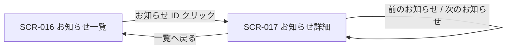
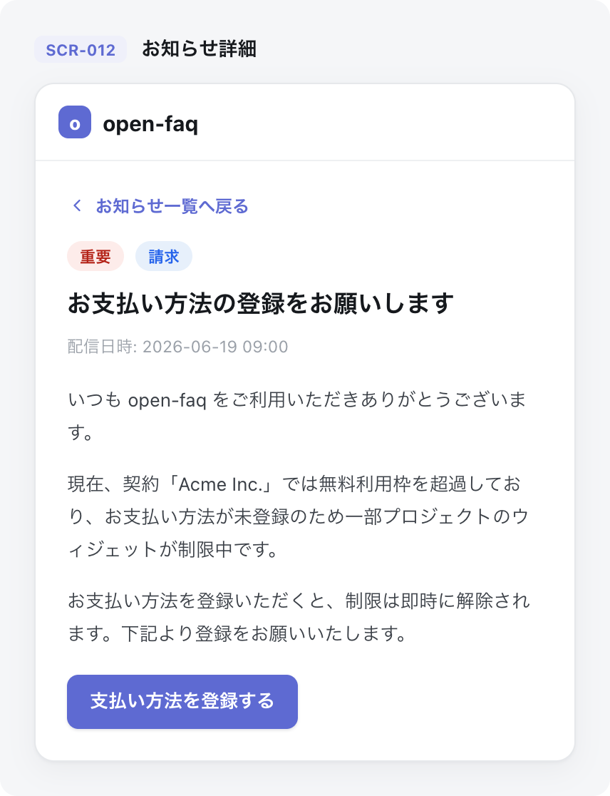

# SCR-017: お知らせ詳細

| ID | 画面名 |
|----|----|
| SCR-017 | お知らせ詳細 |

| 関連項目 | 内容 |
|----|----| 
| 業務ユースケース | [UC-045](../../../01_requirements/04_business_usecases/UC-045.md#UC-045) / [UC-046](../../../01_requirements/04_business_usecases/UC-046.md#UC-046) |
| API | [API-048](../../02_backend/03_apis/API-048.md#API-048) / [API-049](../../02_backend/03_apis/API-049.md#API-049) / [API-050](../../02_backend/03_apis/API-050.md#API-050) |

| ステークホルダ | 対象 |
|----------------|------|
| オーナー       | ◯    |
| メンバー       | ◯    |

## 1. 画面概要

- 個別のお知らせ本文を表示する。
- オーナーと当該スコープのメンバーが閲覧でき、オーナーは割当を持たずに受信する。
- 表示時に未読なら自動既読とする。
- 本文はサニタイズして表示する。

## 2. 画面遷移図

本画面への流入と本画面からの遷移を、画面 ID・画面名とイベント(操作)で示します。

## 3. 画面レイアウト

本画面の代表状態を示します。

## 4. 画面項目

本画面が表示する出力項目・操作項目を定義します。

| # | 項目 | 種類 | 必須 | 最大長 | 初期値 | 表示条件 |
|----|----|----|----|----|----|----|
| 1 | 一覧へ戻る | link | — | — | — | 常時 |
| 2 | 種別バッジ | label | — | — | — | 常時 |
| 3 | 重要度バッジ | label | — | — | — | 常時 |
| 4 | タイトル | label | — | — | — | 常時 |
| 5 | 配信日時 | label | — | — | — | 常時 |
| 6 | 既読日時 | label | — | — | — | 既読時のみ |
| 7 | 本文 | label | — | — | — | 常時 |
| 8 | 本文内リンク / ボタン | button | — | — | — | 本文に行動導線が含まれる場合のみ |
| 9 | 前のお知らせ | link | — | — | — | 常時(先頭では非活性) |
| 10 | 次のお知らせ | link | — | — | — | 常時(末尾では非活性) |

データパターン(選択肢・状態値など値のパターンを持つ項目)を定義する。

| 画面項目 | 表示名 | 補足 |
|----|----|----|
| #2 | お知らせ | — |
| #2 | 請求 | — |
| #2 | システム | — |
| #3 | 重要 | 最重要度 |
| #3 | 重要 | 高重要度 |
| #3 | 通常 | 標準重要度 |
| #3 | 淡色 | 低重要度 |

## 5. バリデーション

本画面は閲覧専用で入力フォームを持ちません(本画面に入力検証はありません)。

## 6. イベント

本画面のイベントごとに対象の画面項目を示します。

<table>
<colgroup>
<col style="width: 18%" />
<col style="width: 22%" />
<col style="width: 60%" />
</colgroup>
<thead>
<tr>
<th>EVT-ID</th>
<th>画面項目</th>
<th>イベント</th>
</tr>
</thead>
<tbody>
<tr>
<td>EVT-01</td>
<td>—</td>
<td>初期表示</td>
</tr>
<tr>
<td>EVT-02</td>
<td>#1</td>
<td>「一覧へ戻る」を押下</td>
</tr>
<tr>
<td>EVT-03</td>
<td>#9</td>
<td>「前のお知らせ」を押下</td>
</tr>
<tr>
<td>EVT-04</td>
<td>#10</td>
<td>「次のお知らせ」を押下</td>
</tr>
</tbody>
</table>

## 7. 画面イベント詳細

各イベントの処理内容を定義します。

<table>
<colgroup>
<col style="width: 14%" />
<col style="width: 86%" />
</colgroup>
<thead>
<tr>
<th>EVT-ID</th>
<th>処理</th>
</tr>
</thead>
<tbody>
<tr>
<td>EVT-01</td>
<td>対象お知らせの本文・メタ情報(種別バッジ #2・重要度バッジ #3・タイトル #4・配信日時 #5・本文 #7)を<a href="../../02_backend/03_apis/API-048.md#API-048">お知らせ(API-048)</a>から取得して表示する:<pre>
┣ 未読: <a href="../../02_backend/03_apis/API-049.md#API-049">お知らせ個別既読(API-049)</a>で自動既読化し、既読日時(#6)を表示する
┗ 既読済: 既読日時(#6)を表示する
</pre></td>
</tr>
<tr>
<td>EVT-02</td>
<td>SCR-016 お知らせ一覧へ遷移する</td>
</tr>
<tr>
<td>EVT-03</td>
<td>前のお知らせの SCR-017 へ遷移する(先頭では非活性)</td>
</tr>
<tr>
<td>EVT-04</td>
<td>次のお知らせの SCR-017 へ遷移する(末尾では非活性)</td>
</tr>
</tbody>
</table>

## 8. エラーメッセージ

本画面はエラー・警告メッセージを表示しません。
