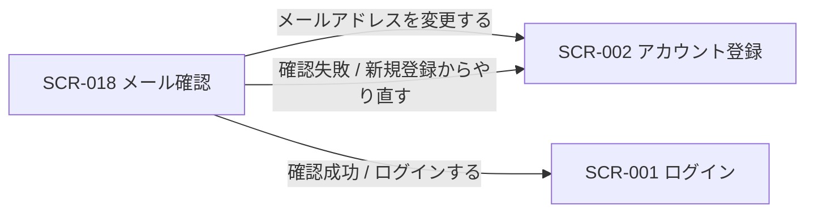
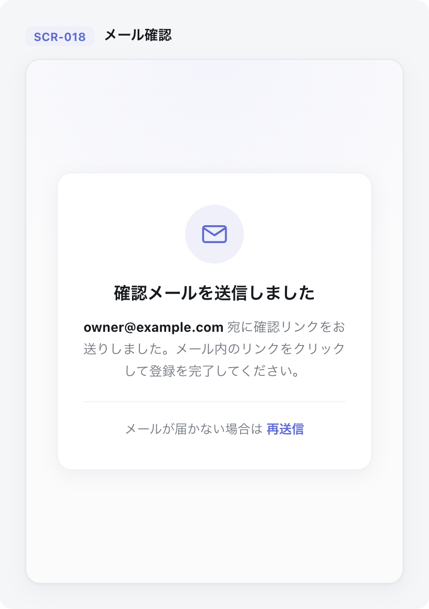

| 画面 ID | 画面名 | トレーサビリティID |
|----|----|----|
| SCR-018 | メール確認 | [TR-002](../../00_traceability/index.md#TR-002) ・ [TR-003](../../00_traceability/index.md#TR-003) ・ [TR-009](../../00_traceability/index.md#TR-009) |

| ステークホルダ                  | 対象 |
|---------------------------------|------|
| 対象ユーザー(認証前 / トークン) | ◯    |

## 1. 画面概要

- 新規登録後にメール内の確認リンクから本人確認を完了する。
- 認証前の画面で、メール確認トークンによる本人確認のため権限は不要とする。
- 送信済み・確認成功・確認失敗の 3 状態を持つ。

## 2. 画面遷移図

本画面からの画面遷移を、画面 ID・画面名とイベント(操作)で示します。

## 3. 画面レイアウト

本画面の代表状態(送信済み)を示します。

## 4. 画面項目

本画面が各状態で表示する入出力項目を定義します。

| # | 項目 | 種類 | 必須 | 最大長 | 初期値 | 表示条件 |
|----|----|----|----|----|----|----|
| 1 | 状態タイムライン | label | — | — | — | 送信済み状態 |
| 2 | 送信先メールアドレス | label | — | — | — | 送信済み状態 |
| 3 | メール送信済み案内 | alert | — | — | — | 送信済み状態 |
| 4 | メールを再送する | button | — | — | — | 送信済み状態 |
| 5 | メールアドレスを変更する | link | — | — | — | 送信済み状態 |
| 6 | 確認成功案内 | alert | — | — | — | 確認成功状態 |
| 7 | ログインするボタン | button | — | — | — | 確認成功状態 |
| 8 | 確認失敗案内 | alert | — | — | — | 確認失敗状態(リンク期限切れ・使用済み) |
| 9 | 新規登録からやり直すボタン | button | — | — | — | 確認失敗状態(リンク期限切れ・使用済み) |

## 5. バリデーション

本画面に入力検証はありません。

## 6. イベント

本画面のイベントごとに対象の画面項目を示します。

<table>
<colgroup>
<col style="width: 18%" />
<col style="width: 22%" />
<col style="width: 60%" />
</colgroup>
<thead>
<tr>
<th>EVT-ID</th>
<th>画面項目</th>
<th>イベント</th>
</tr>
</thead>
<tbody>
<tr>
<td>EVT-01</td>
<td>—</td>
<td>初期表示</td>
</tr>
<tr>
<td>EVT-02</td>
<td>#4</td>
<td>「メールを再送する」を押下</td>
</tr>
<tr>
<td>EVT-03</td>
<td>#5</td>
<td>「メールアドレスを変更する」を押下</td>
</tr>
<tr>
<td>EVT-04</td>
<td>#9</td>
<td>「新規登録からやり直す」を押下</td>
</tr>
<tr>
<td>EVT-05</td>
<td>#7</td>
<td>「ログインする」を押下</td>
</tr>
</tbody>
</table>

## 7. 画面イベント詳細

各イベントの処理内容を定義します。

<table>
<colgroup>
<col style="width: 14%" />
<col style="width: 86%" />
</colgroup>
<thead>
<tr>
<th>EVT-ID</th>
<th>処理</th>
</tr>
</thead>
<tbody>
<tr>
<td>EVT-01</td>
<td>確認リンク経由かどうかで表示状態が分かれる:<pre>
┣ 送信済み(リンク未経由): 状態タイムライン(#1)・送信先メールアドレス(#2)・メール送信済み案内(#3)と、メールを再送する(#4)・メールアドレスを変更する(#5)を表示する
┗ 確認リンク経由: <a href="../../02_backend/03_apis/API-006.md#API-006">メール確認(API-006)</a>で本人確認した結果を表示する
   ┣ 成功: 確認成功案内(#6)とログインするボタン(#7)を表示する
   ┗ 失敗(期限切れ・使用済み): 確認失敗案内(#8・EM-01)と新規登録からやり直すボタン(#9)を表示する
</pre></td>
</tr>
<tr>
<td>EVT-02</td>
<td><a href="../../02_backend/03_apis/API-001.md#API-001">新規登録(確認メール再送)(API-001)</a>で確認メールを再送する:<pre>
┣ 成功: 再送した旨を表示し、レート制限(5 分以内 1 回)中はメールを再送する(#4)を非活性にする
┗ 失敗: エラー(EM-02)を表示する
</pre></td>
</tr>
<tr>
<td>EVT-03</td>
<td>SCR-002 アカウント登録へ遷移する</td>
</tr>
<tr>
<td>EVT-04</td>
<td>SCR-002 アカウント登録へ遷移する</td>
</tr>
<tr>
<td>EVT-05</td>
<td>SCR-001 ログインへ遷移する</td>
</tr>
</tbody>
</table>

## 8. エラーメッセージ

本画面が表示するエラー・警告メッセージを定義します。

| エラーコード | エラーメッセージ |
|----|----|
| EM-01 | 確認リンクが期限切れ、または使用済みです。新規登録からやり直してください(有効期限 24 時間) |
| EM-02 | 確認メールの再送に失敗しました。しばらく経ってからお試しください |
