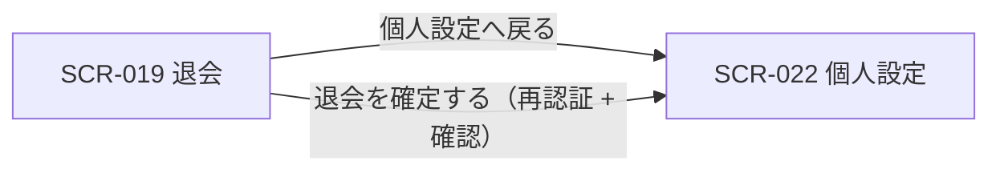
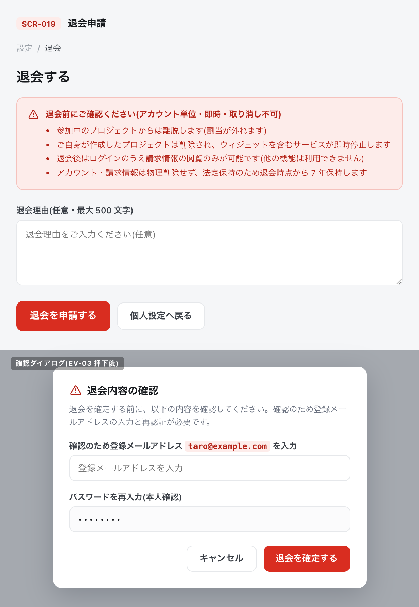

| 画面 ID | 画面名 | トレーサビリティID |
|----|----|----|
| SCR-019 | 退会 | [TR-023](../../00_traceability/index.md#TR-023) |

| ステークホルダ | 対象 |
|----------------|------|
| オーナー       | ◯    |
| メンバー       | ◯    |

## 1. 画面概要

- ユーザーがアカウントを即時退会する画面で、退会はアカウント単位で行い実行と同時に確定する(取り消し不可)。
- オーナー・メンバーのいずれの立場のユーザーも実行できる。
- 退会の影響を 1 パネルに集約して提示し、確認ダイアログ上で登録メールアドレスの入力と再認証を経て実行する 2 段階構成とする。

## 2. 画面遷移図

本画面からの画面遷移を、画面 ID・画面名とイベント(操作)で示します。

## 3. 画面レイアウト

本画面の代表状態(本体および確認ダイアログ)を示します。

## 4. 画面項目

本画面が表示する入出力項目を定義します。

| # | 項目 | 種類 | 必須 | 最大長 | 初期値 | 表示条件 |
|----|----|----|----|----|----|----|
| 1 | 注意事項(退会前確認・アカウント単位/即時/不可逆/作成PJ削除・参加PJ離脱・請求のみ閲覧可) | alert | — | — | — | 常時 |
| 2 | 退会理由(任意) | textarea | — | 500 | — | 常時 |
| 3 | 退会するボタン | button | — | — | — | 常時 |
| 4 | 個人設定へ戻る | button | — | — | — | 常時 |
| 5 | 登録メールアドレス確認入力 | input(text) | ◯ | 255 | — | 確認ダイアログ表示時 |
| 6 | パスワード(再認証用) | input(password) | ◯ | 128 | — | 確認ダイアログ表示時 |
| 7 | キャンセル | button | — | — | — | 確認ダイアログ表示時 |
| 8 | 退会を確定するボタン | button | — | — | — | 確認ダイアログ表示時 |

## 5. バリデーション

入力検証を定義します。

| 画面項目 | タイミング | ルール | エラーコード |
|----|----|----|----|
| #2 | 入力時 | 最大文字数チェック(500 文字以内) | EM-01 |
| #5 | 入力時・確定時 | 登録メールアドレス一致チェック | EM-02 |
| #6 | 確定時 | 未入力チェック | EM-03 |
| #6 | 確定時 | 再認証チェック | EM-04 |

## 6. イベント

本画面のイベントごとに対象の画面項目を示します。

<table>
<colgroup>
<col style="width: 18%" />
<col style="width: 22%" />
<col style="width: 60%" />
</colgroup>
<thead>
<tr>
<th>EVT-ID</th>
<th>画面項目</th>
<th>イベント</th>
</tr>
</thead>
<tbody>
<tr>
<td>EVT-01</td>
<td>—</td>
<td>初期表示</td>
</tr>
<tr>
<td>EVT-02</td>
<td>#3</td>
<td>「退会する」を押下</td>
</tr>
<tr>
<td>EVT-03</td>
<td>#8</td>
<td>確認ダイアログの「退会を確定する」を押下</td>
</tr>
<tr>
<td>EVT-04</td>
<td>#4</td>
<td>「個人設定へ戻る」を押下</td>
</tr>
<tr>
<td>EVT-05</td>
<td>#5</td>
<td>登録メールアドレスを入力(確定ボタンの活性制御)</td>
</tr>
<tr>
<td>EVT-06</td>
<td>#7</td>
<td>確認ダイアログの「キャンセル」を押下</td>
</tr>
</tbody>
</table>

## 7. 画面イベント詳細

各イベントの処理内容を定義します。

<table>
<colgroup>
<col style="width: 14%" />
<col style="width: 86%" />
</colgroup>
<thead>
<tr>
<th>EVT-ID</th>
<th>処理</th>
</tr>
</thead>
<tbody>
<tr>
<td>EVT-01</td>
<td>退会時の影響を集約した注意事項(#1)・退会理由(#2)・操作ボタン(#3・#4)を表示する</td>
</tr>
<tr>
<td>EVT-02</td>
<td>退会内容の確認ダイアログを表示し、登録メールアドレス確認入力(#5)・パスワード(#6)・キャンセル(#7)・退会を確定する(#8)を表示する</td>
</tr>
<tr>
<td>EVT-03</td>
<td><a href="../../02_backend/03_apis/API-005.md#API-005">再認証(API-005)</a>で本人確認のうえ<a href="../../02_backend/03_apis/API-056.md#API-056">退会(API-056)</a>を実行する:<pre>
┣ 成功: アカウントを即時退会(退会済み)とし、SCR-022 個人設定へ遷移する
┣ 既に退会済み: エラー(EM-06)を表示し、確認ダイアログを閉じる
┣ 退会失敗: エラー(EM-05)を表示し、確認ダイアログへ戻る
┗ 再認証失敗: エラー(EM-04)を表示し、確認ダイアログへ戻る
</pre></td>
</tr>
<tr>
<td>EVT-04</td>
<td>SCR-022 個人設定へ遷移する</td>
</tr>
<tr>
<td>EVT-05</td>
<td>登録メールアドレスと一致したとき退会を確定するボタン(#8)を活性化し、不一致のときは非活性にしてエラー(EM-02)を表示する</td>
</tr>
<tr>
<td>EVT-06</td>
<td>退会を中止し、確認ダイアログを閉じて本画面本体へ戻る</td>
</tr>
</tbody>
</table>

## 8. エラーメッセージ

本画面が表示するエラー・警告メッセージを定義します。

| エラーコード | エラーメッセージ |
|----|----|
| EM-01 | 退会理由は 500 文字以内で入力してください |
| EM-02 | 登録メールアドレスが一致しません |
| EM-03 | パスワードを入力してください |
| EM-04 | パスワードが正しくありません。再度入力してください |
| EM-05 | 退会の処理に失敗しました。時間をおいて再度お試しください |
| EM-06 | このアカウントは既に退会済みです |
