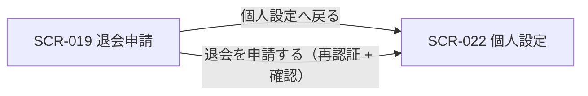

| 画面 ID | 画面名 | トレーサビリティID |
|----|----|----|
| SCR-019 | 退会申請 | [TR-023](../../00_traceability/index.md#TR-023) |

| ステークホルダ | 対象 |
|----------------|------|
| オーナー       | ◯    |
| メンバー       | —    |

## 1. 画面概要

オーナーが契約の退会を申請する画面です。退会の影響(サービス停止・データ削除・請求・メンバー失効)を 1 パネルに集約して提示し、確認ダイアログ上で組織名の入力と再認証を経て退会を申請します。

> [!NOTE]
> **補足** 退会はオーナー専有機能です。メンバーには本画面を提供せず、URL 直アクセスは権限不足表示となります。退会申請には確認ダイアログと再認証が必須です。退会フローのタイムライン表示・データエクスポート導線は設けません(データエクスポート機能は MVP 対象外、将来対応 参照)。

## 2. 画面遷移図

本画面からの画面遷移を、画面 ID・画面名とイベント(操作)で示します。

## 3. 画面レイアウト

本画面の代表状態(本体および確認ダイアログ)を示します。確認ダイアログは「退会を申請する」押下後に表示します。

## 4. 画面項目

本画面が各状態で表示する入出力項目を定義します。`表示条件` は項目が表示される状態を示します。

| # | 項目 | 種類 | 必須 | 最大長 | 初期値 | 表示条件 |
|----|----|----|----|----|----|----|
| 1 | 注意事項(退会前確認) | alert | — | — | — | 常時 |
| 2 | 退会理由(任意) | textarea | — | 500 | — | 常時 |
| 3 | 退会を申請するボタン | button | — | — | — | 常時 |
| 4 | 個人設定へ戻る | button | — | — | — | 常時 |
| 5 | 組織名確認入力 | input(text) | ◯ | 255 | — | 確認ダイアログ表示時 |
| 6 | パスワード(再認証用) | input(password) | ◯ | 128 | — | 確認ダイアログ表示時 |
| 7 | キャンセル | button | — | — | — | 確認ダイアログ表示時 |
| 8 | 退会を確定するボタン | button | — | — | — | 確認ダイアログ表示時 |

## 5. バリデーション

本画面の入力項目に対する検証ルールを定義します。違反がある場合は退会の申請を中止します。

| 画面項目 | タイミング | ルール | エラーコード |
|----|----|----|----|
| #2 | 入力時 | 最大文字数チェック(500 文字以内) | EM-01 |
| #5 | 入力時・確定時 | 組織名一致チェック | EM-02 |
| #6 | 確定時 | 未入力チェック | EM-03 |
| #6 | 確定時 | 再認証チェック | EM-04 |

## 6. イベント

本画面のイベント(初期表示・各操作)ごとに、対象の画面項目を定義します。各イベントの処理内容は [7. 画面イベント詳細](#7-画面イベント詳細) で定義します。

<table>
<colgroup>
<col style="width: 18%" />
<col style="width: 22%" />
<col style="width: 60%" />
</colgroup>
<thead>
<tr>
<th>EVT-ID</th>
<th>画面項目</th>
<th>イベント</th>
</tr>
</thead>
<tbody>
<tr>
<td>EVT-137</td>
<td>—</td>
<td>初期表示</td>
</tr>
<tr>
<td>EVT-138</td>
<td>#3</td>
<td>「退会を申請する」を押下</td>
</tr>
<tr>
<td>EVT-139</td>
<td>#8</td>
<td>確認ダイアログの「退会を確定する」を押下</td>
</tr>
<tr>
<td>EVT-140</td>
<td>#4</td>
<td>「個人設定へ戻る」を押下</td>
</tr>
<tr>
<td>EVT-141</td>
<td>#5</td>
<td>組織名を入力(確定ボタンの活性制御)</td>
</tr>
<tr>
<td>EVT-142</td>
<td>#7</td>
<td>確認ダイアログの「キャンセル」を押下</td>
</tr>
</tbody>
</table>

## 7. 画面イベント詳細

各イベントの処理内容を定義します。

<table>
<colgroup>
<col style="width: 14%" />
<col style="width: 86%" />
</colgroup>
<thead>
<tr>
<th>EVT-ID</th>
<th>処理</th>
</tr>
</thead>
<tbody>
<tr>
<td>EVT-137</td>
<td>画面表示時に利用者の管理範囲で分岐する<pre>
 ┣ オーナー: 退会時の影響(サービス停止・データ削除・請求・メンバー失効)を集約した注意事項(#1)・退会理由(#2)・操作ボタン(#3・#4)を表示する
 ┗ オーナー以外: 権限不足画面を表示し、本画面を表示しない
</pre></td>
</tr>
<tr>
<td>EVT-138</td>
<td>「退会を申請する」押下時に退会内容の確認ダイアログを表示する(影響の最終確認)。ダイアログに組織名確認入力(#5)・パスワード(#6)・キャンセル(#7)・退会を確定する(#8)を表示し、#5 が組織名と一致するまで #8 を非活性にする</td>
</tr>
<tr>
<td>EVT-139</td>
<td>「退会を確定する」押下時に次を行う:<pre>
1. §5 のバリデーション(組織名一致・パスワード未入力)を評価し、違反時はエラーを表示して中止する
2. <a href="../../02_backend/03_apis/API-005.md#API-005">再認証</a> API(POST /auth/re-auth)を呼び出し、本人確認を行う
3. 結果で分岐する
   ┣ 再認証成功
   ┃  ┣ <a href="../../02_backend/03_apis/API-056.md#API-056">退会申請</a> API(POST /withdrawal-requests)成功: 退会申請を登録し契約状態を deleted_pending へ更新して、SCR-022 個人設定へ遷移する
   ┃  ┗ 退会申請 API 失敗: エラー(EM-05)を表示し、確認ダイアログへ戻る
   ┗ 再認証失敗: エラー(EM-04)を表示し、確認ダイアログへ戻る
</pre></td>
</tr>
<tr>
<td>EVT-140</td>
<td>「個人設定へ戻る」押下時に SCR-022 個人設定へ遷移する</td>
</tr>
<tr>
<td>EVT-141</td>
<td>組織名入力(#5)時に入力値をリアルタイムで組織名と照合し、確定ボタン(#8)の活性を制御する<pre>
 ┣ 一致: 退会を確定するボタン(#8)を活性化する
 ┗ 不一致: 退会を確定するボタン(#8)を非活性にし、不一致時はエラー(EM-02)を表示する
</pre></td>
</tr>
<tr>
<td>EVT-142</td>
<td>確認ダイアログの「キャンセル」押下時に退会申請を中止し、確認ダイアログを閉じて本画面本体へ戻る</td>
</tr>
</tbody>
</table>

## 8. エラーメッセージ

本画面が表示するエラー・警告メッセージを定義します。

| エラーコード | エラーメッセージ |
|----|----|
| EM-01 | 退会理由は 500 文字以内で入力してください |
| EM-02 | 組織名が一致しません |
| EM-03 | パスワードを入力してください |
| EM-04 | パスワードが正しくありません。再度入力してください |
| EM-05 | 退会申請の処理に失敗しました。時間をおいて再度お試しください |
