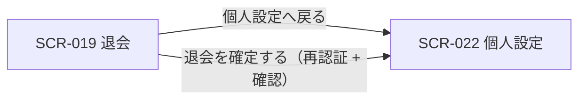

| 画面 ID | 画面名 | トレーサビリティID |
|----|----|----|
| SCR-019 | 退会 | [TR-023](../../00_traceability/index.md#TR-023) |

| ステークホルダ | 対象 |
|----------------|------|
| オーナー       | ◯    |
| メンバー       | ◯    |

## 1. 画面概要

ユーザーがアカウントを即時退会する画面です。退会はアカウント単位で行い、実行と同時に確定し、取り消しはできません。退会するとアカウントに紐づく関与プロジェクトが一括で処理され(参加中のプロジェクトからは離脱、自分が作成したプロジェクトは削除)、退会の影響(参加プロジェクトからの離脱・作成プロジェクトの削除とサービス即時停止・退会後は請求情報の閲覧のみ可能)を 1 パネルに集約して提示し、確認ダイアログ上で登録メールアドレスの入力と再認証を経て退会を実行します。

> [!IMPORTANT]
> **退会は即時実行・取り消し不可です。** 退会を実行するとアカウントは直ちに退会済みとなり、自分が作成したプロジェクト(FAQ・問い合わせ・利用量・設定等の運用データを含む)は削除されてサービスが停止し、参加中のプロジェクトからは離脱します。アカウント・請求データは物理削除せず、法定保持のため退会時点から一定期間(7 年)保持します。退会後のユーザーはログインのうえ請求情報の閲覧のみが可能で、それ以外の機能は利用できません。猶予期間や退会の保留・取り消しはありません。

> [!NOTE]
> **補足** 退会はアカウント単位の機能で、オーナー・メンバーのいずれの立場のユーザーも実行できます。退会の実行には確認ダイアログと再認証が必須です。退会フローのタイムライン表示・データエクスポート導線は設けません(データエクスポート機能は MVP 対象外、将来対応 参照)。

## 2. 画面遷移図

本画面からの画面遷移を、画面 ID・画面名とイベント(操作)で示します。

## 3. 画面レイアウト

本画面の代表状態(本体および確認ダイアログ)を示します。確認ダイアログは「退会する」押下後に表示します。

## 4. 画面項目

本画面が各状態で表示する入出力項目を定義します。`表示条件` は項目が表示される状態を示します。

| # | 項目 | 種類 | 必須 | 最大長 | 初期値 | 表示条件 |
|----|----|----|----|----|----|----|
| 1 | 注意事項(退会前確認・アカウント単位/即時/不可逆/作成PJ削除・参加PJ離脱・請求のみ閲覧可) | alert | — | — | — | 常時 |
| 2 | 退会理由(任意) | textarea | — | 500 | — | 常時 |
| 3 | 退会するボタン | button | — | — | — | 常時 |
| 4 | 個人設定へ戻る | button | — | — | — | 常時 |
| 5 | 登録メールアドレス確認入力 | input(text) | ◯ | 255 | — | 確認ダイアログ表示時 |
| 6 | パスワード(再認証用) | input(password) | ◯ | 128 | — | 確認ダイアログ表示時 |
| 7 | キャンセル | button | — | — | — | 確認ダイアログ表示時 |
| 8 | 退会を確定するボタン | button | — | — | — | 確認ダイアログ表示時 |

## 5. バリデーション

本画面の入力項目に対する検証ルールを定義します。違反がある場合は退会の実行を中止します。

| 画面項目 | タイミング | ルール | エラーコード |
|----|----|----|----|
| #2 | 入力時 | 最大文字数チェック(500 文字以内) | EM-01 |
| #5 | 入力時・確定時 | 登録メールアドレス一致チェック | EM-02 |
| #6 | 確定時 | 未入力チェック | EM-03 |
| #6 | 確定時 | 再認証チェック | EM-04 |

## 6. イベント

本画面のイベント(初期表示・各操作)ごとに、対象の画面項目を定義します。各イベントの処理内容は [7. 画面イベント詳細](#7-画面イベント詳細) で定義します。

<table>
<colgroup>
<col style="width: 18%" />
<col style="width: 22%" />
<col style="width: 60%" />
</colgroup>
<thead>
<tr>
<th>EVT-ID</th>
<th>画面項目</th>
<th>イベント</th>
</tr>
</thead>
<tbody>
<tr>
<td>EVT-143</td>
<td>—</td>
<td>初期表示</td>
</tr>
<tr>
<td>EVT-144</td>
<td>#3</td>
<td>「退会する」を押下</td>
</tr>
<tr>
<td>EVT-145</td>
<td>#8</td>
<td>確認ダイアログの「退会を確定する」を押下</td>
</tr>
<tr>
<td>EVT-146</td>
<td>#4</td>
<td>「個人設定へ戻る」を押下</td>
</tr>
<tr>
<td>EVT-147</td>
<td>#5</td>
<td>登録メールアドレスを入力(確定ボタンの活性制御)</td>
</tr>
<tr>
<td>EVT-148</td>
<td>#7</td>
<td>確認ダイアログの「キャンセル」を押下</td>
</tr>
</tbody>
</table>

## 7. 画面イベント詳細

各イベントの処理内容を定義します。

<table>
<colgroup>
<col style="width: 14%" />
<col style="width: 86%" />
</colgroup>
<thead>
<tr>
<th>EVT-ID</th>
<th>処理</th>
</tr>
</thead>
<tbody>
<tr>
<td>EVT-143</td>
<td>画面表示時に、退会時の影響(参加プロジェクトからの離脱・作成プロジェクトの削除とサービス即時停止・退会後は請求情報の閲覧のみ可能・物理削除せず請求情報を 7 年保持・取り消し不可)を集約した注意事項(#1)・退会理由(#2)・操作ボタン(#3・#4)を表示する。退会はアカウント単位の機能で、ログイン中のユーザーは立場(オーナー/メンバー)を問わず本画面を利用できる</td>
</tr>
<tr>
<td>EVT-144</td>
<td>「退会する」押下時に退会内容の確認ダイアログを表示する(影響の最終確認)。ダイアログには退会がアカウント単位・即時・取り消し不可で、参加プロジェクトからは離脱し作成プロジェクトは削除され、退会後は請求情報の閲覧のみ可能である旨を明示し、登録メールアドレス確認入力(#5)・パスワード(#6)・キャンセル(#7)・退会を確定する(#8)を表示する。#5 が登録メールアドレスと一致するまで #8 を非活性にする</td>
</tr>
<tr>
<td>EVT-145</td>
<td>「退会を確定する」押下時に次を行う:<pre>
1. §5 のバリデーション(登録メールアドレス一致・パスワード未入力)を評価し、違反時はエラーを表示して中止する
2. <a href="../../02_backend/03_apis/API-005.md#API-005">再認証</a> API を呼び出し、本人確認を行う
3. 結果で分岐する
   ┣ 再認証成功
   ┃  ┣ <a href="../../02_backend/03_apis/API-056.md#API-056">退会</a> API 成功: アカウントを即時退会(退会済み)とし、参加プロジェクトからの離脱・作成プロジェクトの削除・請求情報の 7 年保持(物理削除なし)が行われたうえで、SCR-022 個人設定へ遷移する(以後は請求情報の閲覧のみ可能)
   ┃  ┣ 退会 API が既に退会済み(409)を返却: 既に退会済みである旨のエラー(EM-06)を表示し、確認ダイアログを閉じる
   ┃  ┗ 退会 API その他失敗: エラー(EM-05)を表示し、確認ダイアログへ戻る
   ┗ 再認証失敗: エラー(EM-04)を表示し、確認ダイアログへ戻る
</pre></td>
</tr>
<tr>
<td>EVT-146</td>
<td>「個人設定へ戻る」押下時に SCR-022 個人設定へ遷移する</td>
</tr>
<tr>
<td>EVT-147</td>
<td>登録メールアドレス入力(#5)時に入力値をリアルタイムで登録メールアドレスと照合し、確定ボタン(#8)の活性を制御する<pre>
 ┣ 一致: 退会を確定するボタン(#8)を活性化する
 ┗ 不一致: 退会を確定するボタン(#8)を非活性にし、不一致時はエラー(EM-02)を表示する
</pre></td>
</tr>
<tr>
<td>EVT-148</td>
<td>確認ダイアログの「キャンセル」押下時に退会を中止し、確認ダイアログを閉じて本画面本体へ戻る</td>
</tr>
</tbody>
</table>

## 8. エラーメッセージ

本画面が表示するエラー・警告メッセージを定義します。

| エラーコード | エラーメッセージ |
|----|----|
| EM-01 | 退会理由は 500 文字以内で入力してください |
| EM-02 | 登録メールアドレスが一致しません |
| EM-03 | パスワードを入力してください |
| EM-04 | パスワードが正しくありません。再度入力してください |
| EM-05 | 退会の処理に失敗しました。時間をおいて再度お試しください |
| EM-06 | このアカウントは既に退会済みです |
