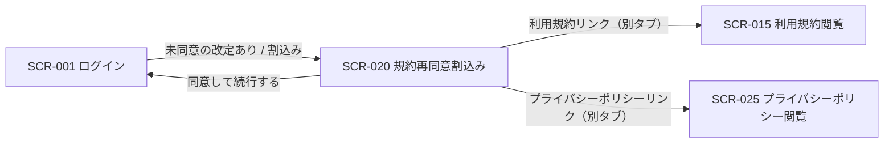
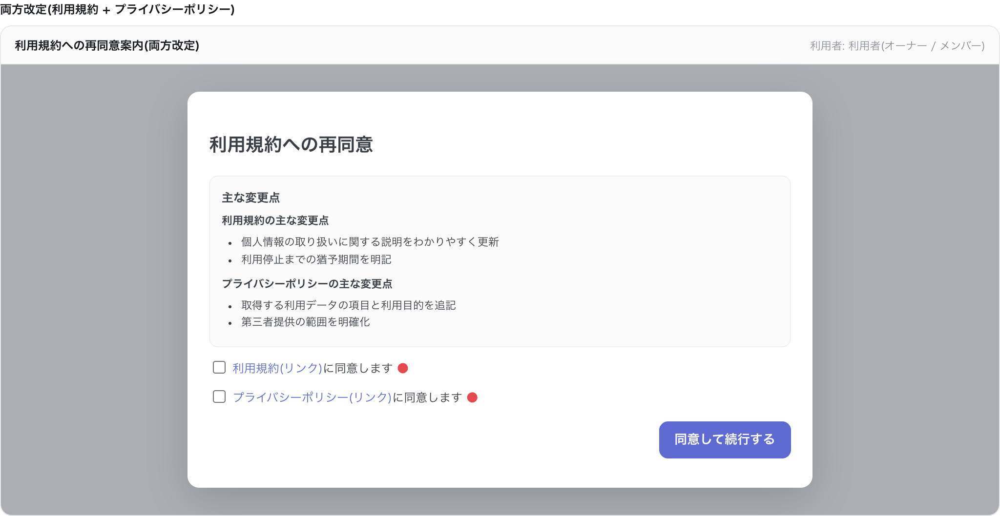

# SCR-020: 規約再同意割込み

| ID | 画面名 |
|----|----|
| SCR-020 | 規約再同意割込み |

| 関連項目 | 内容 |
|----|----| 
| 業務ユースケース | [UC-001](../../../01_requirements/04_business_usecases/UC-001.md#UC-001) / [UC-013](../../../01_requirements/04_business_usecases/UC-013.md#UC-013) |
| API | [API-002](../../02_backend/03_apis/API-002.md#API-002) / [API-052](../../02_backend/03_apis/API-052.md#API-052) / [API-053](../../02_backend/03_apis/API-053.md#API-053) / [API-054](../../02_backend/03_apis/API-054.md#API-054) / [API-055](../../02_backend/03_apis/API-055.md#API-055) |

| ステークホルダ | 対象 |
|----------------|------|
| オーナー       | ◯    |
| メンバー       | ◯    |

## 1. 画面概要

- 利用規約・プライバシーポリシーの改定時に最新版への再同意を求める画面とする。
- ログイン済みの全ロール利用者(オーナー・メンバー)を対象とし、ロールによる表示・操作差はない。
- 全画面モーダル(SP / PC ともフルスクリーン)で改定文書の主な変更点を提示する。

## 2. 画面遷移図

本画面からの画面遷移を、画面 ID・画面名とイベント(操作)で示します。

## 3. 画面レイアウト

本画面の代表状態(両方改定・利用規約のみ改定・プライバシーポリシーのみ改定)を示します。

## 4. 画面項目

本画面が各状態で表示する入出力項目を定義します。

| # | 項目 | 種類 | 必須 | 最大長 | 初期値 | 表示条件 |
|----|----|----|----|----|----|----|
| 1 | 主な変更点 | label | — | — | — | 常時(改定対象の文書の変更点のみ表示) |
| 2 | 利用規約リンク | link | — | — | — | 利用規約が改定対象 |
| 3 | 利用規約同意チェック | checkbox | ◯ | — | 未チェック | 利用規約が改定対象 |
| 4 | プライバシーポリシーリンク | link | — | — | — | プライバシーポリシーが改定対象 |
| 5 | プライバシーポリシー同意チェック | checkbox | ◯ | — | 未チェック | プライバシーポリシーが改定対象 |
| 6 | 同意して続行するボタン | button | — | — | — | 常時(改定対象の全チェック充足時のみ活性) |

## 5. バリデーション

本画面に入力検証はありません。

## 6. イベント

本画面のイベントごとに対象の画面項目を示します。

<table>
<colgroup>
<col style="width: 18%" />
<col style="width: 22%" />
<col style="width: 60%" />
</colgroup>
<thead>
<tr>
<th>EVT-ID</th>
<th>画面項目</th>
<th>イベント</th>
</tr>
</thead>
<tbody>
<tr>
<td>EVT-01</td>
<td>—</td>
<td>初期表示</td>
</tr>
<tr>
<td>EVT-02</td>
<td>#2</td>
<td>「利用規約」リンクを押下</td>
</tr>
<tr>
<td>EVT-03</td>
<td>#4</td>
<td>「プライバシーポリシー」リンクを押下</td>
</tr>
<tr>
<td>EVT-04</td>
<td>#3</td>
<td>利用規約同意をチェック / 解除</td>
</tr>
<tr>
<td>EVT-05</td>
<td>#5</td>
<td>プライバシーポリシー同意をチェック / 解除</td>
</tr>
<tr>
<td>EVT-06</td>
<td>#6</td>
<td>「同意して続行する」を押下</td>
</tr>
</tbody>
</table>

## 7. 画面イベント詳細

各イベントの処理内容を定義します。

<table>
<colgroup>
<col style="width: 14%" />
<col style="width: 86%" />
</colgroup>
<thead>
<tr>
<th>EVT-ID</th>
<th>処理</th>
</tr>
</thead>
<tbody>
<tr>
<td>EVT-01</td>
<td>改定対象の文書の主な変更点(#1)を全画面モーダルで表示する。改定対象外の文書は表示しない:<pre>
┣ 利用規約が改定対象: 利用規約リンク(#2)・利用規約同意チェック(#3)を表示する(<a href="../../02_backend/03_apis/API-052.md#API-052">利用規約 最新版取得(API-052)</a>)
┗ プライバシーポリシーが改定対象: プライバシーポリシーリンク(#4)・プライバシーポリシー同意チェック(#5)を表示する(<a href="../../02_backend/03_apis/API-053.md#API-053">プライバシーポリシー 最新版取得(API-053)</a>)
</pre>同意して続行するボタン(#6)は非活性で表示する</td>
</tr>
<tr>
<td>EVT-02</td>
<td><a href="SCR-015.md">SCR-015 利用規約閲覧</a> を別タブで開く</td>
</tr>
<tr>
<td>EVT-03</td>
<td><a href="SCR-025.md">SCR-025 プライバシーポリシー閲覧</a> を別タブで開く</td>
</tr>
<tr>
<td>EVT-04</td>
<td>表示中の同意チェックがすべてオンのとき同意して続行するボタン(#6)を活性化し、未充足のときは非活性にする</td>
</tr>
<tr>
<td>EVT-05</td>
<td>表示中の同意チェックがすべてオンのとき同意して続行するボタン(#6)を活性化し、未充足のときは非活性にする</td>
</tr>
<tr>
<td>EVT-06</td>
<td>改定対象の文書(利用規約: <a href="../../02_backend/03_apis/API-054.md#API-054">利用規約 同意(API-054)</a> / プライバシーポリシー: <a href="../../02_backend/03_apis/API-055.md#API-055">プライバシーポリシー 同意(API-055)</a>)への同意を記録する:<pre>
┣ 成功: 割込み前の操作へ戻る
┗ 失敗: エラー(EM-01)を表示し、モーダルを維持する
</pre></td>
</tr>
</tbody>
</table>

## 8. エラーメッセージ

本画面が表示するエラー・警告メッセージを定義します。

| エラーコード | エラーメッセージ |
|----|----|
| EM-01 | 同意の登録に失敗しました。時間をおいて再度お試しください |
