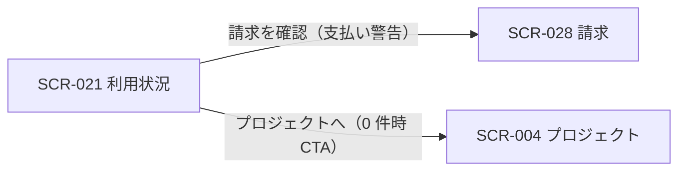

| 画面 ID | 画面名 | トレーサビリティID |
|----|----|----|
| SCR-021 | 利用状況 | [TR-036](../../00_traceability/index.md#TR-036) |

| ステークホルダ | 対象 |
|----------------|------|
| オーナー       | ◯    |
| メンバー       | —    |

## 1. 画面概要

- 自分が作成したプロジェクト全体(オーナー単位)の集計値とプロジェクト別の利用量を 1 画面に集約する読み取り専用画面である。
- オーナー専有で、表示対象は自分が作成(所有)したプロジェクトに限り、他者が作成したプロジェクトに参加(メンバー)している分は含めない。
- 請求金額・支払方法・請求履歴は SCR-028 へ分離し、本画面は当月固定の読み取り専用スナップショットとする。
- 主要な表示状態は通常(全体・プロジェクト別の利用状況)・支払い警告・空状態(作成プロジェクト 0 件)。

## 2. 画面遷移図

本画面からの画面遷移を示す。

## 3. 画面レイアウト

本画面の代表状態(通常時)を示す。

## 4. 画面項目

本画面が表示する表示項目を定義する。

| # | 項目 | 種類 | 必須 | 最大長 | 初期値 | 表示条件 |
|----|----|----|----|----|----|----|
| 1 | 対象期間ラベル(当月・固定) | label | — | — | — | — |
| 2 | 全体サマリーカード(自分が作成したプロジェクト全体・3 枚: 当月の質問数 / 解決率 / アクティブプロジェクト) | label | — | — | — | — |
| 3 | プロジェクト別の質問数消化率パネル(自分が作成したプロジェクトごと) | label | — | — | — | — |
| 4 | 支払い警告バナー | alert | — | — | — | 支払方法未登録または支払い失敗時 |
| 5 | 請求を確認ボタン | button | — | — | — | 支払方法未登録または支払い失敗時 |
| 6 | 空状態(作成したプロジェクトがまだありません) | label | — | — | — | 作成したプロジェクトが 0 件のとき |
| 7 | プロジェクトへ CTA | button | — | — | — | 作成したプロジェクトが 0 件のとき |

## 5. バリデーション

本画面は入力項目を持たないため入力検証はない。

## 6. イベント

本画面のイベントごとに対象の画面項目を示す。

<table>
<colgroup>
<col style="width: 18%" />
<col style="width: 22%" />
<col style="width: 60%" />
</colgroup>
<thead>
<tr>
<th>EVT-ID</th>
<th>画面項目</th>
<th>イベント</th>
</tr>
</thead>
<tbody>
<tr>
<td>EVT-01</td>
<td>—</td>
<td>初期表示</td>
</tr>
<tr>
<td>EVT-02</td>
<td>#5</td>
<td>「請求を確認」を押下</td>
</tr>
<tr>
<td>EVT-03</td>
<td>#7</td>
<td>「プロジェクトへ」を押下</td>
</tr>
</tbody>
</table>

## 7. 画面イベント詳細

各イベントの処理内容を定義します。

<table>
<colgroup>
<col style="width: 14%" />
<col style="width: 86%" />
</colgroup>
<thead>
<tr>
<th>EVT-ID</th>
<th>処理</th>
</tr>
</thead>
<tbody>
<tr>
<td>EVT-01</td>
<td>初期表示時に <a href="../../02_backend/03_apis/API-042.md#API-042">利用量サマリ(オーナー)(API-042)</a>・<a href="../../02_backend/03_apis/API-041.md#API-041">利用量サマリ(プロジェクト)(API-041)</a> で利用状況を取得し、結果で分岐する:<pre>
┣ 支払方法未登録または支払い失敗: 支払い警告バナー(#4・EM-01)と請求を確認ボタン(#5)を表示する
┣ 作成したプロジェクトが 0 件: 空状態(#6)とプロジェクトへ CTA(#7)を表示する
┗ それ以外: 対象期間ラベル(#1)・全体サマリーカード(#2)・プロジェクト別の質問数消化率パネル(#3)を表示する
</pre></td>
</tr>
<tr>
<td>EVT-02</td>
<td>「請求を確認」押下時に SCR-028 請求へ遷移する</td>
</tr>
<tr>
<td>EVT-03</td>
<td>「プロジェクトへ」押下時に SCR-004 プロジェクトへ遷移する</td>
</tr>
</tbody>
</table>

## 8. エラーメッセージ

本画面が表示する警告メッセージを定義します。

| エラーコード | エラーメッセージ |
|----|----|
| EM-01 | 支払い情報が未登録、または直近のお支払いに失敗しています。請求を確認してください |
</content>
</invoke>
