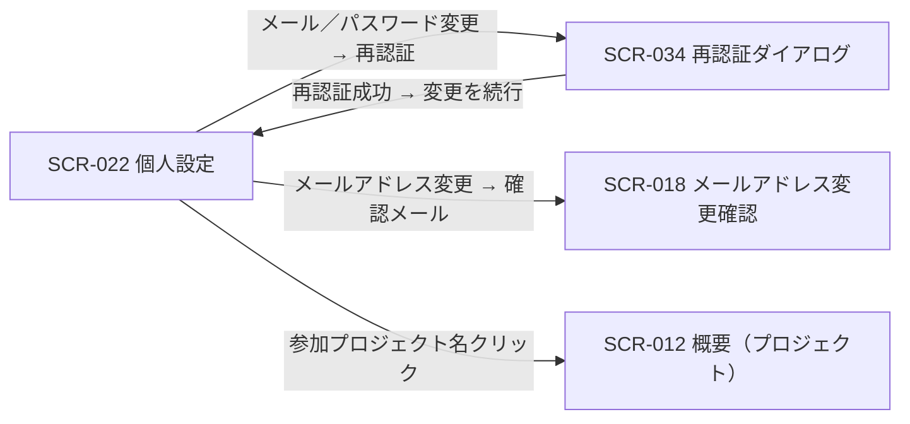

# SCR-022: 個人設定

| ID | 画面名 |
|----|----|
| SCR-022 | 個人設定 |

| 関連項目 | 内容 |
|----|----| 
| 業務ユースケース | [UC-008](../../../01_requirements/04_business_usecases/UC-008.md#UC-008) / [UC-009](../../../01_requirements/04_business_usecases/UC-009.md#UC-009) / [UC-010](../../../01_requirements/04_business_usecases/UC-010.md#UC-010) |
| API | [API-064](../../02_backend/03_apis/API-064.md#API-064) / [API-012](../../02_backend/03_apis/API-012.md#API-012) / [API-015](../../02_backend/03_apis/API-015.md#API-015) / [API-013](../../02_backend/03_apis/API-013.md#API-013) |

| ステークホルダ | 対象 |
|----------------|------|
| オーナー       | ◯    |
| メンバー       | ◯    |

## 1. 画面概要

- 自分のプロフィール(表示名)・セキュリティ(メールアドレス・パスワード)・参加プロジェクトをタブで編集する画面である(ヘッダ右上のアカウントメニュー「個人設定」から開く)。
- 認証済みであればオーナー / メンバーいずれの立場でも利用でき、編集できるのは自分の情報のみである。
- 本画面で扱うメールアドレスはアカウント自身のメールアドレスで、アカウント宛の重要通知はこのメールアドレスへ届く。
- メールアドレス変更・パスワード変更の重要操作では[再認証ダイアログ(SCR-034)](SCR-034.md#SCR-034)を経由して再認証する。
- 支払い方法の登録・変更と退会は[設定(SCR-029)](SCR-029.md#SCR-029)へ分離する。
- 主要な表示状態はプロフィールタブ・セキュリティタブ・参加プロジェクトタブとパスワード変更フォーム。

## 2. 画面遷移図

本画面からの画面遷移を示す。

## 3. 画面レイアウト

本画面の代表状態(プロフィールタブ・確認ダイアログ)を示す。

## 4. 画面項目

本画面が表示する入出力項目を定義する。

| # | 項目 | 種類 | 必須 | 最大長 | 初期値 | 表示条件 |
|----|----|----|----|----|----|----|
| 1 | タブ(プロフィール / セキュリティ / 参加プロジェクト) | label | — | — | プロフィール | 常時 |
| 2 | プロフィール画像 | label | — | — | 現在の画像 | プロフィールタブ |
| 3 | 表示名 | input(text) | ◯ | 100 | 現在の表示名 | プロフィールタブ |
| 4 | メールアドレス | input(email) | ◯ | 254 | 現在のメールアドレス | プロフィールタブ |
| 5 | 保存する | button | — | — | — | プロフィールタブ |
| 6 | 変更を破棄 | button | — | — | — | プロフィールタブ |
| 7 | パスワードを変更する | button | — | — | — | セキュリティタブ |
| 8 | 新しいパスワード | input(password) | ◯ | 128 | — | パスワード変更フォーム表示時 |
| 9 | 新しいパスワード(確認) | input(password) | ◯ | 128 | — | パスワード変更フォーム表示時 |
| 10 | パスワードを更新する | button | — | — | — | パスワード変更フォーム表示時 |
| 11 | 参加プロジェクト一覧 | label | — | — | — | 参加プロジェクトタブ |
| 12 | 参加プロジェクト名リンク | link | — | — | — | 参加プロジェクトタブ |
| 13 | メッセージ表示エリア | alert | — | — | — | 保存完了時・エラー時 |
| 14 | パスワード変更 キャンセルボタン | button | — | — | — | パスワード変更フォーム表示時 |

## 5. バリデーション

入力検証を定義する。

| 画面項目 | タイミング | ルール | エラーコード |
|----|----|----|----|
| #3 | 入力時・送信時 | 未入力チェック | EM-01 |
| #3 | 入力時・送信時 | 表示名文字数チェック(1〜100 文字) | EM-02 |
| #4 | 入力時・送信時 | 未入力チェック | EM-03 |
| #4 | 入力時・送信時 | メールアドレス形式チェック | EM-04 |
| #8 | 入力時・送信時 | 未入力チェック | EM-05 |
| #8 | 入力時・送信時 | パスワード強度チェック | EM-06 |
| #9 | 入力時・送信時 | 未入力チェック | EM-07 |
| #9 | 入力時・送信時 | パスワード一致チェック | EM-08 |

## 6. イベント

本画面のイベントごとに対象の画面項目を示す。

<table>
<colgroup>
<col style="width: 18%" />
<col style="width: 22%" />
<col style="width: 60%" />
</colgroup>
<thead>
<tr>
<th>EVT-ID</th>
<th>画面項目</th>
<th>イベント</th>
</tr>
</thead>
<tbody>
<tr>
<td>EVT-01</td>
<td>—</td>
<td>初期表示</td>
</tr>
<tr>
<td>EVT-02</td>
<td>#1</td>
<td>タブを押下(プロフィール / セキュリティ / 参加プロジェクト)</td>
</tr>
<tr>
<td>EVT-03</td>
<td>#5</td>
<td>「保存する」を押下(プロフィール)</td>
</tr>
<tr>
<td>EVT-04</td>
<td>#7</td>
<td>「パスワードを変更する」を押下</td>
</tr>
<tr>
<td>EVT-05</td>
<td>#6</td>
<td>「変更を破棄」を押下</td>
</tr>
<tr>
<td>EVT-06</td>
<td>#12</td>
<td>参加プロジェクト名リンクを押下</td>
</tr>
</tbody>
</table>

## 7. 画面イベント詳細

各イベントの処理内容を定義します。

<table>
<colgroup>
<col style="width: 14%" />
<col style="width: 86%" />
</colgroup>
<thead>
<tr>
<th>EVT-ID</th>
<th>処理</th>
</tr>
</thead>
<tbody>
<tr>
<td>EVT-01</td>
<td>初期表示時に自分のプロフィール情報(表示名 #3・メールアドレス #4)と参加プロジェクト一覧(#11)を表示し、プロフィールタブ(#1)を選択状態で表示する</td>
</tr>
<tr>
<td>EVT-02</td>
<td>タブ(#1)押下時に、選択したタブ(プロフィール / セキュリティ / 参加プロジェクト)の内容を表示する</td>
</tr>
<tr>
<td>EVT-03</td>
<td>「保存する」(#5)押下時にプロフィールを保存する。表示名(#3)とメールアドレス(#4)で処理を分岐する:<pre>
┣ 表示名のみ変更: 表示名を保存する(<a href="../../02_backend/03_apis/API-012.md#API-012">自己プロフィール更新(API-012)</a>)。成功時は保存完了メッセージ(#13・EM-09)を表示する
┣ メールアドレス変更を含む: <a href="SCR-034.md#SCR-034">SCR-034 再認証ダイアログ</a>で再認証し、その再認証のうえで新メールアドレスを未確認の変更中アドレスとして保持し新アドレスへ確認メールを送信する(<a href="../../02_backend/03_apis/API-015.md#API-015">セキュリティ設定更新(API-015)</a>)。成功時は<a href="SCR-018.md#SCR-018">SCR-018 メールアドレス変更確認</a>へ引き渡す(現行ログインメールは確認完了まで変わらない)
┗ 失敗: 該当欄付近またはメッセージ表示エリア(#13)にエラー(EM-10)を表示し保存しない
</pre></td>
</tr>
<tr>
<td>EVT-04</td>
<td>「パスワードを変更する」(#7)押下時に<a href="SCR-034.md#SCR-034">SCR-034 再認証ダイアログ</a>で再認証し、その再認証のうえでパスワードを変更する(<a href="../../02_backend/03_apis/API-013.md#API-013">自己パスワード変更(API-013)</a>):<pre>
┣ 成功: 更新完了メッセージ(#13・EM-11)を表示する
┗ 失敗: 該当欄直下またはパスワード変更フォームにエラー(EM-06 / EM-08 / EM-10)を表示し変更しない
</pre></td>
</tr>
<tr>
<td>EVT-05</td>
<td>「変更を破棄」(#6)押下時に、プロフィールタブの編集内容を破棄して初期表示時の値へ戻す</td>
</tr>
<tr>
<td>EVT-06</td>
<td>参加プロジェクト名リンク(#12)押下時に、該当プロジェクトの <a href="SCR-012.md#SCR-012">SCR-012 概要(プロジェクト)</a>へ遷移する</td>
</tr>
</tbody>
</table>

## 8. エラーメッセージ

本画面が表示するエラー・案内メッセージを定義します。

| エラーコード | エラーメッセージ |
|----|----|
| EM-01 | 表示名を入力してください |
| EM-02 | 表示名は 1〜100 文字で入力してください |
| EM-03 | メールアドレスを入力してください |
| EM-04 | メールアドレスの形式が正しくありません |
| EM-05 | 新しいパスワードを入力してください |
| EM-06 | パスワードは 12 文字以上で、英大文字・小文字・数字・記号のうち 3 種類以上を含めてください |
| EM-07 | 確認用パスワードを入力してください |
| EM-08 | パスワードが一致しません |
| EM-09 | プロフィールを保存しました |
| EM-10 | 変更に失敗しました。時間をおいて再度お試しください |
| EM-11 | パスワードを変更しました |
