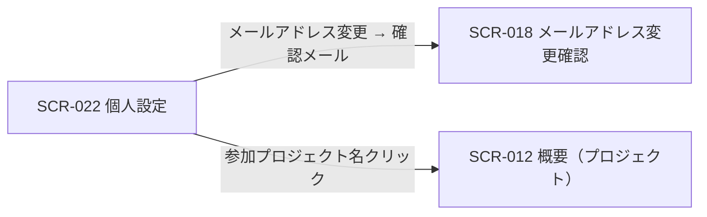
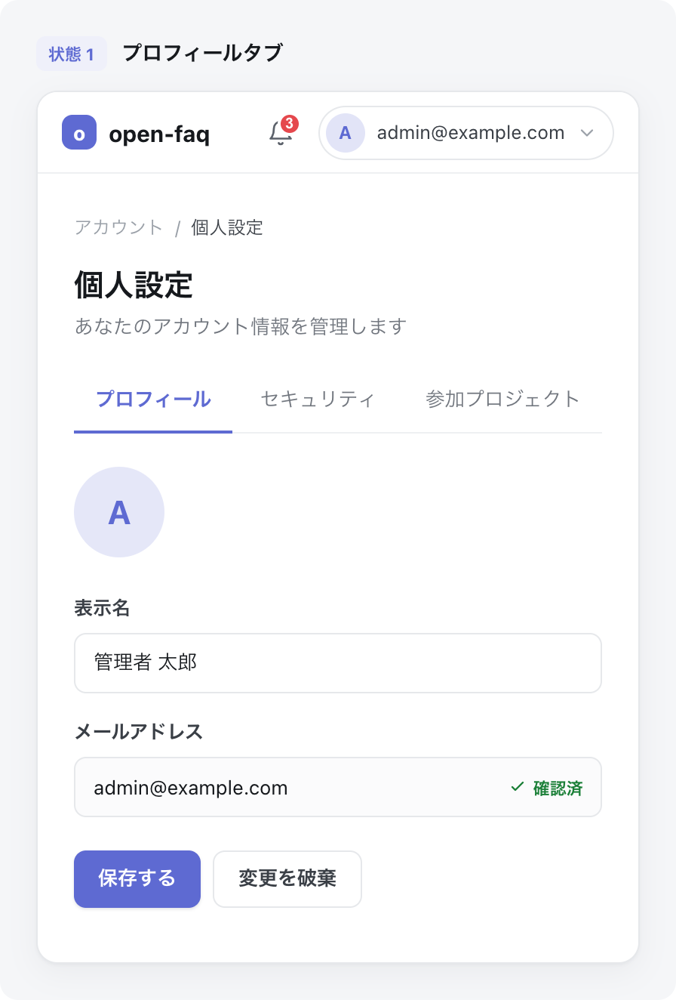
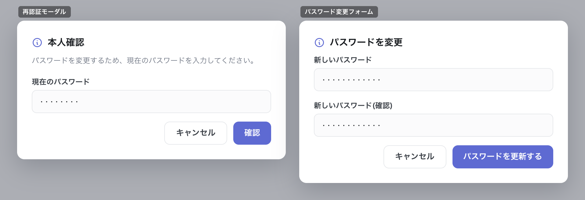

| 画面 ID | 画面名 | トレーサビリティID |
|----|----|----|
| SCR-022 | 個人設定 | [TR-008](../../00_traceability/index.md#TR-008) ・ [TR-009](../../00_traceability/index.md#TR-009) ・ [TR-010](../../00_traceability/index.md#TR-010) |

| ステークホルダ | 対象 |
|----------------|------|
| オーナー       | ◯    |
| メンバー       | ◯    |

## 1. 画面概要

ヘッダ右上のアカウントメニュー「個人設定」から開く画面で、自分のプロフィール・セキュリティ・参加プロジェクトをタブで編集します。契約連絡先と退会は別画面(設定)へ分離します。

> [!NOTE]
> **補足** 認証済みであれば全ロールが利用でき、自分の情報のみ編集可能です。誤操作防止としてパスワード変更は再認証(現パスワード再入力)を要し、メールアドレス変更は再認証 + 新メールアドレスの確認メールを要します。個人ごとの通知受信オプトアウトは本画面では扱わず、プロジェクト関連通知は常時 ON 固定です。アクティブセッション一覧の表示と自己セッション終了は MVP 対象外です(複数デバイス同時ログインは可能)。言語選択は MVP 対象外のため本画面では扱いません(表示言語は日本語固定)。プロフィール画像は現在の画像を表示するのみで、変更 UI は MVP 対象外です。

## 2. 画面遷移図

本画面からの画面遷移を、画面 ID・画面名とイベント(操作)で示します。

## 3. 画面レイアウト

本画面の代表状態(プロフィールタブ)を示します。セキュリティタブ・参加プロジェクトタブの各状態は §4 の `表示条件` で定義し、再認証モーダル・パスワード変更フォームを下図に示します(各項目の表示条件は §4)。

## 4. 画面項目

本画面が各状態(タブ・モーダル)で表示する入出力項目を定義します。`表示条件` は項目が表示されるタブ・状態を示します。

| # | 項目 | 種類 | 必須 | 最大長 | 初期値 | 表示条件 |
|----|----|----|----|----|----|----|
| 1 | タブ(プロフィール / セキュリティ / 参加プロジェクト) | div | — | — | プロフィール | 常時 |
| 2 | プロフィール画像 | div | — | — | 現在の画像 | プロフィールタブ |
| 3 | 表示名 | input(text) | ◯ | 100 | 現在の表示名 | プロフィールタブ |
| 4 | メールアドレス | input(email) | ◯ | 254 | 現在のメールアドレス | プロフィールタブ |
| 5 | 保存する | button | — | — | — | プロフィールタブ |
| 6 | 変更を破棄 | button | — | — | — | プロフィールタブ |
| 7 | パスワードを変更する | button | — | — | — | セキュリティタブ |
| 8 | 現パスワード | input(password) | ◯ | 128 | — | 再認証モーダル表示時 |
| 9 | 新しいパスワード | input(password) | ◯ | 128 | — | パスワード変更フォーム表示時 |
| 10 | 新しいパスワード(確認) | input(password) | ◯ | 128 | — | パスワード変更フォーム表示時 |
| 11 | パスワードを更新する | button | — | — | — | パスワード変更フォーム表示時 |
| 12 | 参加プロジェクト一覧 | div | — | — | — | 参加プロジェクトタブ |
| 13 | 参加プロジェクト名リンク | link | — | — | — | 参加プロジェクトタブ |
| 14 | メッセージ表示エリア | alert | — | — | — | 保存完了時・エラー時 |
| 15 | 再認証 確認ボタン | button | — | — | — | 再認証モーダル表示時 |
| 16 | 再認証 キャンセルボタン | button | — | — | — | 再認証モーダル表示時 |
| 17 | パスワード変更 キャンセルボタン | button | — | — | — | パスワード変更フォーム表示時 |

## 5. バリデーション

本画面の入力項目に対する検証ルールを定義します。違反がある場合は送信を中止します。

| 画面項目 | タイミング | ルール | エラーコード |
|----|----|----|----|
| #3 | 入力時・送信時 | 未入力チェック | EM-01 |
| #3 | 入力時・送信時 | 表示名文字数チェック(1〜100 文字) | EM-02 |
| #4 | 入力時・送信時 | 未入力チェック | EM-03 |
| #4 | 入力時・送信時 | メールアドレス形式チェック | EM-04 |
| #8 | 送信時 | 未入力チェック | EM-05 |
| #9 | 入力時・送信時 | 未入力チェック | EM-06 |
| #9 | 入力時・送信時 | パスワード強度チェック | EM-07 |
| #10 | 入力時・送信時 | 未入力チェック | EM-08 |
| #10 | 入力時・送信時 | パスワード一致チェック | EM-09 |

## 6. イベント

本画面のイベント(初期表示・各操作)ごとに、対象の画面項目を定義します。各イベントの処理内容は [7. 画面イベント詳細](#7-画面イベント詳細) で定義します。

<table>
<colgroup>
<col style="width: 18%" />
<col style="width: 22%" />
<col style="width: 60%" />
</colgroup>
<thead>
<tr>
<th>EVT-ID</th>
<th>画面項目</th>
<th>イベント</th>
</tr>
</thead>
<tbody>
<tr>
<td>EVT-158</td>
<td>—</td>
<td>初期表示</td>
</tr>
<tr>
<td>EVT-159</td>
<td>#1</td>
<td>タブを押下(プロフィール / セキュリティ / 参加プロジェクト)</td>
</tr>
<tr>
<td>EVT-160</td>
<td>#5</td>
<td>「保存する」を押下(プロフィール)</td>
</tr>
<tr>
<td>EVT-161</td>
<td>#7</td>
<td>「パスワードを変更する」を押下</td>
</tr>
<tr>
<td>EVT-162</td>
<td>#6</td>
<td>「変更を破棄」を押下</td>
</tr>
<tr>
<td>EVT-163</td>
<td>#13</td>
<td>参加プロジェクト名リンクを押下</td>
</tr>
</tbody>
</table>

## 7. 画面イベント詳細

各イベントの処理内容を定義します。

<table>
<colgroup>
<col style="width: 14%" />
<col style="width: 86%" />
</colgroup>
<thead>
<tr>
<th>EVT-ID</th>
<th>処理</th>
</tr>
</thead>
<tbody>
<tr>
<td>EVT-158</td>
<td>初期表示時に認証済みユーザー自身のプロフィール情報(表示名 #3・メールアドレス #4)および参加プロジェクト一覧(#12)を取得し、プロフィールタブ(#1)を初期選択状態で表示する</td>
</tr>
<tr>
<td>EVT-159</td>
<td>タブ(#1)押下時に、選択したタブ(プロフィール / セキュリティ / 参加プロジェクト)のコンテンツ領域を表示し、他タブのコンテンツを非表示にする。タブ切替によるデータ取得は行わない(初期表示で取得済み)</td>
</tr>
<tr>
<td>EVT-160</td>
<td>「保存する」(#5)押下時に次を行う:<pre>
1. §5 のバリデーション(#3・#4)を評価し、違反時は該当欄直下にエラーを表示して中止する
2. <a href="../../02_backend/03_apis/API-012.md#API-012">自己プロフィール更新(API-012)</a> を呼び出す
3. 結果で分岐する
   ┣ 成功(メールアドレス未変更): 保存完了メッセージ(#14・EM-10)を表示する
   ┣ 成功(メールアドレス変更): <a href="../../02_backend/03_apis/API-005.md#API-005">再認証(API-005)</a> モーダル(#8)で現パスワード再入力を求め、通過後に新メールアドレスへ確認メールを送信し、<a href="SCR-018.md#SCR-018">SCR-018 メールアドレス変更確認</a>フローへ引き渡す
   ┣ 失敗(バリデーションエラー): 該当欄付近にエラーを表示し保存しない
   ┗ 失敗(再認証失敗): 再認証モーダル(#8)にエラー(EM-11)を表示し保存しない
</pre></td>
</tr>
<tr>
<td>EVT-161</td>
<td>「パスワードを変更する」(#7)押下時に次を行う:<pre>
1. <a href="../../02_backend/03_apis/API-005.md#API-005">再認証(API-005)</a> モーダルを表示し、現パスワード(#8)の入力を求める
2. 再認証結果で分岐する
   ┣ 成功: 新しいパスワード(#9)・確認(#10)・更新ボタン(#11)の入力フォームを表示する
   ┃        送信時に §5 のバリデーション(強度・一致)を評価し、<a href="../../02_backend/03_apis/API-013.md#API-013">自己パスワード変更(API-013)</a> を呼び出して新パスワードへ更新する(12 文字以上・英大小文字 / 数字 / 記号 3 種類以上)
   ┃        ┣ 成功: 更新完了メッセージ(#14・EM-12)を表示する
   ┃        ┗ 失敗(強度不足 / 不一致): #9・#10 直下にエラー(EM-07 / EM-09)を表示し変更しない
   ┗ 失敗(再認証失敗): モーダルにエラー(EM-11)を表示し変更しない
</pre></td>
</tr>
<tr>
<td>EVT-162</td>
<td>「変更を破棄」(#6)押下時に、プロフィールタブの入力欄(#3・#4)の値を初期表示時の値へ戻し、編集中の変更を破棄する</td>
</tr>
<tr>
<td>EVT-163</td>
<td>参加プロジェクト名リンク(#13)押下時に、該当プロジェクトの <a href="SCR-012.md#SCR-012">SCR-012 概要(プロジェクト)</a>へ遷移する</td>
</tr>
</tbody>
</table>

## 8. エラーメッセージ

本画面が表示するエラー・案内メッセージを定義します。

| エラーコード | エラーメッセージ |
|----|----|
| EM-01 | 表示名を入力してください |
| EM-02 | 表示名は 1〜100 文字で入力してください |
| EM-03 | メールアドレスを入力してください |
| EM-04 | メールアドレスの形式が正しくありません |
| EM-05 | 現在のパスワードを入力してください |
| EM-06 | 新しいパスワードを入力してください |
| EM-07 | パスワードは 12 文字以上で、英大文字・小文字・数字・記号のうち 3 種類以上を含めてください |
| EM-08 | 確認用パスワードを入力してください |
| EM-09 | パスワードが一致しません |
| EM-10 | プロフィールを保存しました |
| EM-11 | 現在のパスワードが正しくありません |
| EM-12 | パスワードを変更しました |
