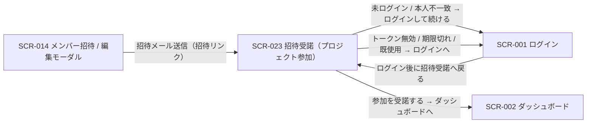
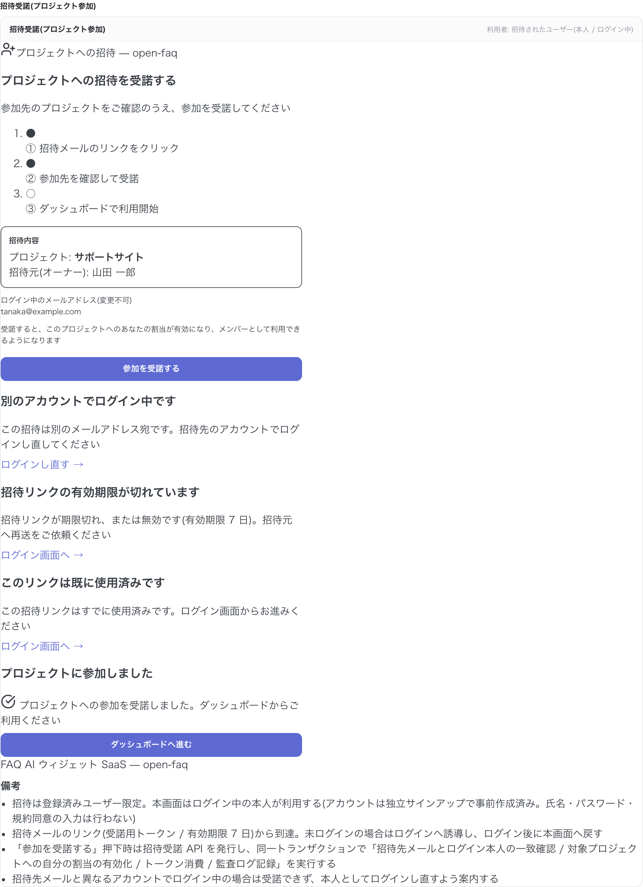

| 画面 ID | 画面名 | トレーサビリティID |
|----|----|----|
| SCR-023 | 招待受諾(プロジェクト参加) | [TR-006](../../00_traceability/index.md#TR-006) |

| ステークホルダ           | 対象 |
|--------------------------|------|
| 招待されたユーザー(本人) | ◯    |

## 1. 画面概要

招待メール内リンクのトークンで到達する、招待受諾の確認画面です。招待は登録済みユーザー限定のため、本画面はログイン中のユーザー本人が利用します。トークンを検証して参加先プロジェクトの情報(プロジェクト名 / 招待元オーナー)を確認し、参加を受諾すると当該プロジェクトへの自分の割当が有効になります。本画面では氏名・パスワード・規約同意の入力は行いません(アカウントは独立サインアップで事前作成済み)。受諾時に割当の有効化とトークン消費を同一トランザクションで実行します。

> [!NOTE]
> **補足** 招待は登録済みユーザー限定です(未登録メールへの招待は送信できず、アカウント作成は独立サインアップで別途行います)。本画面の到達条件は受諾用トークン(有効期限 7 日)を伴う招待リンクの保持で、招待先メールと一致する本人がログインしている必要があります。未ログインで開いた場合はログインへ誘導し、ログイン後に本画面へ戻します。招待先メールと異なるアカウントでログイン中の場合は受諾できず、本人としてログインし直すよう案内します。受諾できるのは招待された本人のみで、招待者(オーナー / メンバー)は代理受諾できません。

## 2. 画面遷移図

本画面の到達元・遷移先を、画面 ID・画面名とイベント(操作)で示します。

## 3. 画面レイアウト

本画面の代表状態(トークン検証成功・招待内容の確認)を示します。トークン無効 / 期限切れ・既使用・本人不一致・受諾完了の各状態は §4 の `表示条件` で定義します。

## 4. 画面項目

本画面が各状態で表示する入出力項目を定義します。`表示条件` は項目が表示される状態を示します。

| # | 項目 | 種類 | 必須 | 最大長 | 初期値 | 表示条件 |
|----|----|----|----|----|----|----|
| 1 | 招待内容パネル(プロジェクト名 / 招待元オーナー) | div | — | — | — | トークン検証成功・本人一致 |
| 2 | 受諾後の説明(参加すると割当が有効になる旨) | div | — | — | — | トークン検証成功・本人一致 |
| 3 | ログイン中のメールアドレス(変更不可) | div | — | — | — | トークン検証成功・本人一致 |
| 4 | 参加を受諾するボタン | button | — | — | — | トークン検証成功・本人一致 |
| 5 | トークン無効 / 期限切れエラー案内 | alert | — | — | — | トークン無効 / 期限切れ時 |
| 6 | 既使用エラー案内 | alert | — | — | — | トークン使用済み時 |
| 7 | 本人不一致エラー案内(別アカウントでログイン中) | alert | — | — | — | 招待先メールとログインユーザーが不一致時 |
| 8 | 受諾完了案内 | alert | — | — | — | 受諾成功時 |
| 9 | ダッシュボードへ進むボタン | button | — | — | — | 受諾成功時 |
| 10 | ログイン画面へリンク | link | — | — | — | トークン無効 / 期限切れ時・トークン使用済み時 |
| 11 | ログインし直すリンク | link | — | — | — | 本人不一致時 |

## 5. バリデーション

本画面は入力フィールドを持たないため、画面側の入力バリデーションはありません。トークンの有効性(期限・使用済み・存在)および受諾者がログイン中の本人かどうかの判定は、受諾実行時にサーバー側で検証し、結果に応じて §4 の各エラー案内を表示します。

## 6. イベント

本画面のイベント(初期表示・各操作)ごとに、対象の画面項目を定義します。各イベントの処理内容は [7. 画面イベント詳細](#7-画面イベント詳細) で定義します。

<table>
<colgroup>
<col style="width: 18%" />
<col style="width: 22%" />
<col style="width: 60%" />
</colgroup>
<thead>
<tr>
<th>EVT-ID</th>
<th>画面項目</th>
<th>イベント</th>
</tr>
</thead>
<tbody>
<tr>
<td>EVT-164</td>
<td>—</td>
<td>初期表示(トークン検証・参加先プレビュー)</td>
</tr>
<tr>
<td>EVT-165</td>
<td>#10</td>
<td>未ログイン時「ログインして続ける」を押下</td>
</tr>
<tr>
<td>EVT-166</td>
<td>#11</td>
<td>本人不一致時「ログインし直す」を押下</td>
</tr>
<tr>
<td>EVT-167</td>
<td>#4</td>
<td>「参加を受諾する」を押下</td>
</tr>
<tr>
<td>EVT-168</td>
<td>#9</td>
<td>「ダッシュボードへ進む」を押下(完了画面)</td>
</tr>
<tr>
<td>EVT-169</td>
<td>#10</td>
<td>「ログイン画面へ」を押下(トークン無効 / 期限切れエラー画面)</td>
</tr>
<tr>
<td>EVT-170</td>
<td>#10</td>
<td>「ログイン画面へ」を押下(既使用エラー画面)</td>
</tr>
</tbody>
</table>

## 7. 画面イベント詳細

各イベントの処理内容を定義します。

<table>
<colgroup>
<col style="width: 14%" />
<col style="width: 86%" />
</colgroup>
<thead>
<tr>
<th>EVT-ID</th>
<th>処理</th>
</tr>
</thead>
<tbody>
<tr>
<td>EVT-164</td>
<td>画面表示時に URL トークンを取得して <a href="../../02_backend/03_apis/API-007.md#API-007">招待トークン検証・プレビュー</a> API を実行し、結果で分岐する<pre>
 ┣ 未ログイン: ログインへ誘導(#10 ログイン画面へリンク)し、ログイン後に本画面へ戻す
 ┣ 成功・本人一致: 招待内容パネル(#1)・受諾後の説明(#2)・ログイン中のメールアドレス(#3)・参加を受諾するボタン(#4)を表示する
 ┣ 本人不一致(招待先メールとログインユーザーが不一致): 本人不一致エラー案内(#7)とログインし直すリンク(#11)を表示する
 ┣ トークン無効 / 期限切れ(HTTP 410): トークン無効 / 期限切れエラー案内(#5)とログイン画面へリンク(#10)を表示する
 ┗ トークン使用済み: 既使用エラー案内(#6)とログイン画面へリンク(#10)を表示する
</pre></td>
</tr>
<tr>
<td>EVT-165</td>
<td>未ログイン状態で「ログインして続ける」押下時に <a href="SCR-001.md">SCR-001 ログイン</a>へ遷移する(ログイン後に本画面へ戻す)</td>
</tr>
<tr>
<td>EVT-166</td>
<td>本人不一致(別アカウントでログイン中)状態で「ログインし直す」押下時に <a href="SCR-001.md">SCR-001 ログイン</a>へ遷移する(招待先メール本人でログインし直す)</td>
</tr>
<tr>
<td>EVT-167</td>
<td>「参加を受諾する」押下時に次を行う:<pre>
1. <a href="../../02_backend/03_apis/API-008.md#API-008">招待受諾(割当有効化)</a> API(POST /projects/invitations/{token}/accept)を発行する(同一トランザクション: 招待先メールとログイン本人の一致確認 / 対象プロジェクトへの自分の割当の有効化 / トークン消費 / 監査ログ記録)
2. 結果で分岐する
   ┣ 成功: 受諾完了案内(#8)とダッシュボードへ進むボタン(#9)を表示する
   ┣ HTTP 403(本人不一致): 本人不一致エラー案内(#7)とログインし直すリンク(#11)を表示する
   ┗ HTTP 410(トークン期限切れ / 無効・使用済み): トークン無効 / 期限切れエラー案内(#5)を表示する
</pre></td>
</tr>
<tr>
<td>EVT-168</td>
<td>完了画面の「ダッシュボードへ進む」押下時に <a href="SCR-002.md">SCR-002 ダッシュボード</a>へ遷移する</td>
</tr>
<tr>
<td>EVT-169</td>
<td>トークン無効 / 期限切れエラー画面の「ログイン画面へ」押下時に <a href="SCR-001.md">SCR-001 ログイン</a>へ遷移する</td>
</tr>
<tr>
<td>EVT-170</td>
<td>既使用エラー画面の「ログイン画面へ」押下時に <a href="SCR-001.md">SCR-001 ログイン</a>へ遷移する</td>
</tr>
</tbody>
</table>

## 8. エラーメッセージ

本画面が表示するエラー・警告メッセージを定義します。

| エラーコード | エラーメッセージ |
|----|----|
| EM-01 | 招待リンクの有効期限が切れているか、リンクが無効です。招待者に再送を依頼してください |
| EM-02 | この招待リンクはすでに使用済みです |
| EM-03 | この招待は別のメールアドレス宛です。招待先のアカウントでログインし直してください |
