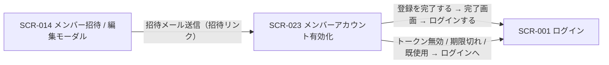

| 画面 ID | 画面名 | トレーサビリティID |
|----|----|----|
| SCR-023 | メンバーアカウント有効化 | [TR-006](../../00_traceability/index.md#TR-006) |

| ステークホルダ           | 対象 |
|--------------------------|------|
| 招待メンバー(トークン) | ◯    |

## 1. 画面概要

招待メール内リンクのトークン認証で到達する未認証画面です。招待された本人が氏名(表示名)・初回パスワード・利用規約 / プライバシーポリシー同意を入力し、アカウントを有効化します。完了時に氏名設定・アカウント有効化・規約同意記録・プロジェクト割当の有効化・トークン消費を同一トランザクションで実行します。

> [!NOTE]
> **補足** 本画面は未認証画面です。唯一の到達条件は有効化用トークン(有効期限 7 日)の保持で、オーナー / メンバーのログインロールでは到達しません(サイドメニュー除外)。氏名(表示名)は招待された本人のみが入力でき、招待者(オーナー / メンバー)は事前入力できません。本画面はメンバー招待メールの着地点です。

## 2. 画面遷移図

本画面の到達元・遷移先を、画面 ID・画面名とイベント(操作)で示します。

## 3. 画面レイアウト

本画面の代表状態(トークン検証成功・入力フォーム)を示します。入力エラー・トークン無効 / 期限切れ・既使用・完了の各状態は §4 の `表示条件` で定義します。

## 4. 画面項目

本画面が各状態で表示する入出力項目を定義します。`表示条件` は項目が表示される状態を示します。

| # | 項目 | 種類 | 必須 | 最大長 | 初期値 | 表示条件 |
|----|----|----|----|----|----|----|
| 1 | ステップタイムライン | div | — | — | — | トークン検証成功 |
| 2 | 招待内容パネル(プロジェクト名 / 招待元) | div | — | — | — | トークン検証成功 |
| 3 | メールアドレス(変更不可) | div | — | — | — | トークン検証成功 |
| 4 | 氏名(表示名) | input(text) | ◯ | 100 | — | トークン検証成功 |
| 5 | 初回パスワード | input(password) | ◯ | 128 | — | トークン検証成功 |
| 6 | パスワード(確認) | input(password) | ◯ | 128 | — | トークン検証成功 |
| 7 | 利用規約同意 | checkbox | ◯ | — | 未チェック | トークン検証成功 |
| 8 | 利用規約「全文を見る」 | link | — | — | — | トークン検証成功 |
| 9 | プライバシーポリシー同意 | checkbox | ◯ | — | 未チェック | トークン検証成功 |
| 10 | プライバシーポリシー「全文を見る」 | link | — | — | — | トークン検証成功 |
| 11 | Turnstile(CAPTCHA) | widget | — | — | — | トークン検証成功 |
| 12 | 登録を完了するボタン | button | — | — | — | トークン検証成功 |
| 13 | トークン無効 / 期限切れエラー案内 | alert | — | — | — | トークン無効 / 期限切れ時 |
| 14 | 既使用エラー案内 | alert | — | — | — | トークン使用済み時 |
| 15 | 完了案内 | alert | — | — | — | 有効化成功時 |
| 16 | ログインするボタン | button | — | — | — | 有効化成功時 |
| 17 | ログイン画面へリンク | link | — | — | — | トークン無効 / 期限切れ時・トークン使用済み時 |

## 5. バリデーション

本画面の入力項目に対する検証ルールを定義します。違反がある場合は送信を中止します。

| 画面項目 | タイミング | ルール | エラーコード |
|----|----|----|----|
| #4 | 入力時・送信時 | 未入力チェック | EM-01 |
| #4 | 入力時・送信時 | 文字数チェック(1〜100 文字) | EM-02 |
| #5 | 入力時・送信時 | 未入力チェック | EM-03 |
| #5 | 入力時・送信時 | パスワード強度チェック | EM-04 |
| #6 | 入力時・送信時 | 未入力チェック | EM-05 |
| #6 | 入力時・送信時 | パスワード一致チェック | EM-06 |
| #7 | 送信時 | 同意チェック | EM-07 |
| #9 | 送信時 | 同意チェック | EM-08 |
| #11 | 送信時 | チャレンジトークンチェック | EM-09 |

## 6. イベント

本画面のイベント(初期表示・各操作)ごとに、対象の画面項目を定義します。各イベントの処理内容は [7. 画面イベント詳細](#7-画面イベント詳細) で定義します。

<table>
<colgroup>
<col style="width: 18%" />
<col style="width: 22%" />
<col style="width: 60%" />
</colgroup>
<thead>
<tr>
<th>EVT-ID</th>
<th>画面項目</th>
<th>イベント</th>
</tr>
</thead>
<tbody>
<tr>
<td>EVT-158</td>
<td>—</td>
<td>初期表示</td>
</tr>
<tr>
<td>EVT-159</td>
<td>#8</td>
<td>利用規約の「全文を見る」を押下</td>
</tr>
<tr>
<td>EVT-160</td>
<td>#10</td>
<td>プライバシーポリシーの「全文を見る」を押下</td>
</tr>
<tr>
<td>EVT-161</td>
<td>#11</td>
<td>Turnstile を実行</td>
</tr>
<tr>
<td>EVT-162</td>
<td>#12</td>
<td>「登録を完了する」を押下</td>
</tr>
<tr>
<td>EVT-163</td>
<td>#16</td>
<td>「ログインする」を押下(完了画面)</td>
</tr>
<tr>
<td>EVT-164</td>
<td>#17</td>
<td>「ログイン画面へ」を押下(トークン無効 / 期限切れエラー画面)</td>
</tr>
<tr>
<td>EVT-165</td>
<td>#17</td>
<td>「ログイン画面へ」を押下(既使用エラー画面)</td>
</tr>
</tbody>
</table>

## 7. 画面イベント詳細

各イベントの処理内容を定義します。

<table>
<colgroup>
<col style="width: 14%" />
<col style="width: 86%" />
</colgroup>
<thead>
<tr>
<th>EVT-ID</th>
<th>処理</th>
</tr>
</thead>
<tbody>
<tr>
<td>EVT-158</td>
<td>画面表示時に URL トークンを取得して <a href="../../02_backend/03_apis/API-007.md#API-007">招待トークン検証・プレビュー</a> API を実行し、結果で分岐する<pre>
 ┣ 成功: ステップタイムライン(#1・②を強調)・招待内容パネル(#2)・メールアドレス(#3)・入力フォーム(#4〜#12)を表示する
 ┣ トークン無効 / 期限切れ(HTTP 410): トークン無効 / 期限切れエラー案内(#13)とログイン画面へリンク(#17)を表示する
 ┗ トークン使用済み: 既使用エラー案内(#14)とログイン画面へリンク(#17)を表示する
</pre></td>
</tr>
<tr>
<td>EVT-159</td>
<td>利用規約の「全文を見る」押下時に <a href="SCR-015.md">SCR-015 利用規約閲覧</a>へ遷移する(別タブ)</td>
</tr>
<tr>
<td>EVT-160</td>
<td>プライバシーポリシーの「全文を見る」押下時に <a href="SCR-025.md">SCR-025 プライバシーポリシー閲覧</a>へ遷移する(別タブ)</td>
</tr>
<tr>
<td>EVT-161</td>
<td>Turnstile 実行時に CAPTCHA トークンを取得する。検証失敗時はエラー(EM-09)を表示し「登録を完了する」ボタン(#12)を無効化する</td>
</tr>
<tr>
<td>EVT-162</td>
<td>「登録を完了する」押下時に次を行う:<pre>
1. §5 のバリデーションを評価し、違反時は該当フィールド直下にエラーを表示して中止する
2. <a href="../../02_backend/03_apis/API-008.md#API-008">メンバーアカウント有効化</a> API(POST /auth/invitations/{token}/activate)を発行する(同一トランザクション: 予約利用者への氏名・パスワードハッシュ設定・アカウント有効化 / プロジェクト割当の有効化 / 規約同意 2 件登録 / トークン消費)
3. 結果で分岐する
   ┣ 成功: 完了案内(#15)とログインするボタン(#16)を表示する
   ┣ HTTP 400(フィールドエラー): フィールド単位のエラーメッセージを表示し、入力フォームを操作可能なまま維持する
   ┗ HTTP 410(トークン期限切れ / 無効): トークン無効 / 期限切れエラー案内(#13)を表示する
</pre></td>
</tr>
<tr>
<td>EVT-163</td>
<td>完了画面の「ログインする」押下時に <a href="SCR-001.md">SCR-001 ログイン</a>へ遷移する</td>
</tr>
<tr>
<td>EVT-164</td>
<td>トークン無効 / 期限切れエラー画面の「ログイン画面へ」押下時に <a href="SCR-001.md">SCR-001 ログイン</a>へ遷移する</td>
</tr>
<tr>
<td>EVT-165</td>
<td>既使用エラー画面の「ログイン画面へ」押下時に <a href="SCR-001.md">SCR-001 ログイン</a>へ遷移する</td>
</tr>
</tbody>
</table>

## 8. エラーメッセージ

本画面が表示するエラー・警告メッセージを定義します。

| エラーコード | エラーメッセージ |
|----|----|
| EM-01 | 氏名を入力してください |
| EM-02 | 氏名は 1〜100 文字で入力してください |
| EM-03 | 初回パスワードを入力してください |
| EM-04 | パスワードは 12 文字以上で、英大文字・小文字・数字・記号のうち 3 種類以上を含めてください |
| EM-05 | 確認用パスワードを入力してください |
| EM-06 | パスワードが一致しません |
| EM-07 | 利用規約への同意が必要です |
| EM-08 | プライバシーポリシーへの同意が必要です |
| EM-09 | 認証チャレンジを完了してください |
</content>
</invoke>
